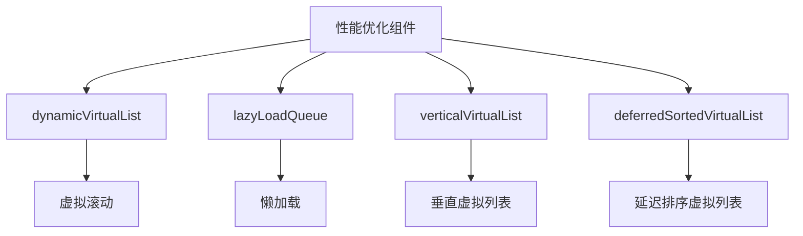
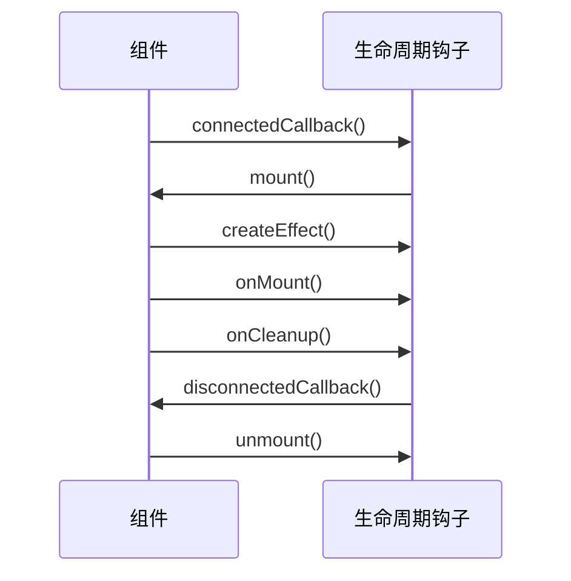
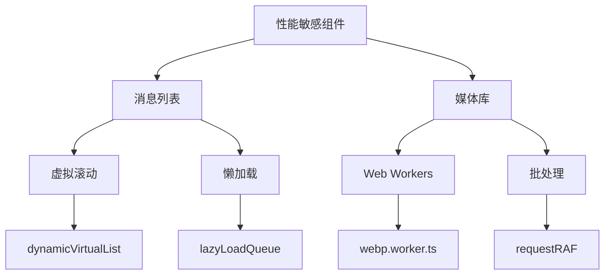
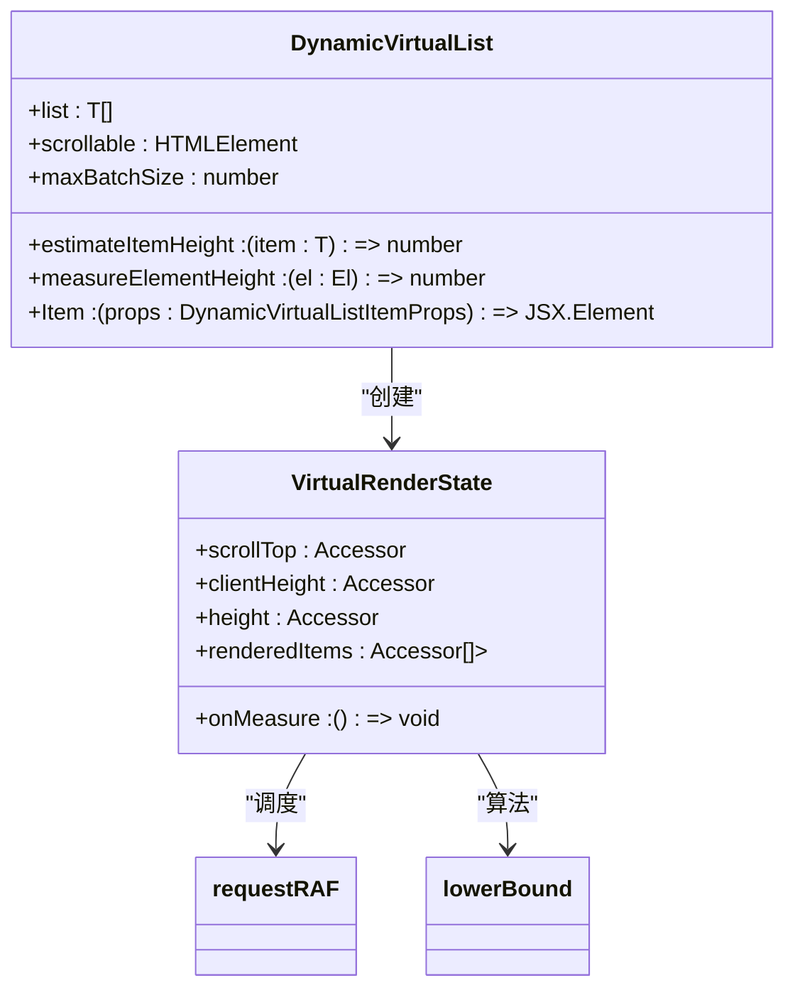
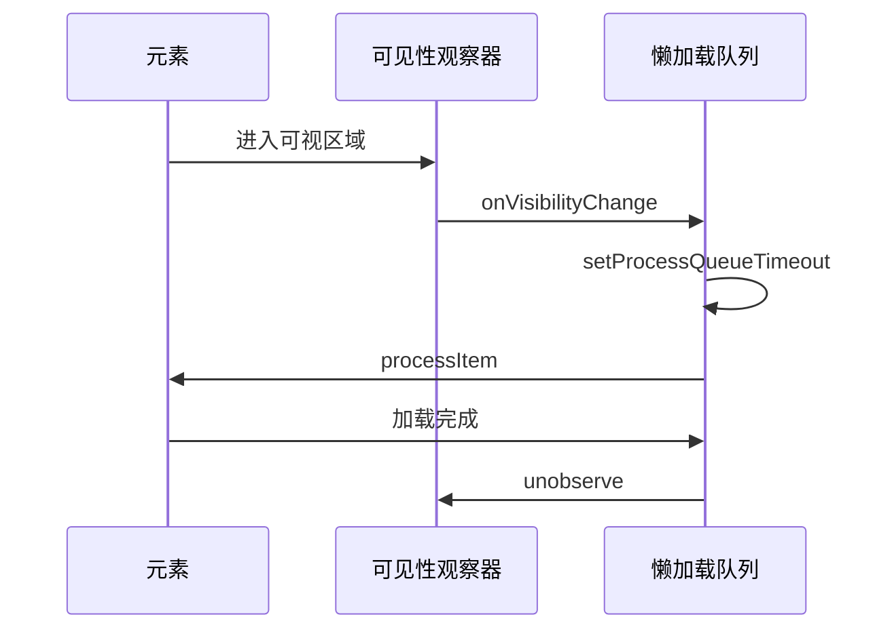
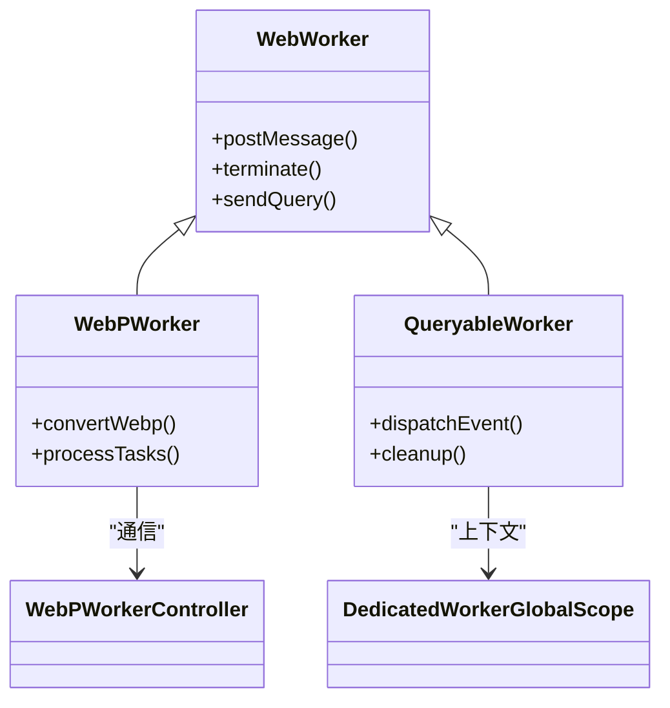

# 组件生命周期与性能优化

<cite>
**本文档引用的文件**  
- [dynamicVirtualList/index.tsx](file://src/components/dynamicVirtualList/index.tsx)
- [lazyLoadQueue.ts](file://src/components/lazyLoadQueue.ts)
- [lazyLoadQueueBase.ts](file://src/components/lazyLoadQueueBase.ts)
- [lazyLoadQueueIntersector.ts](file://src/components/lazyLoadQueueIntersector.ts)
- [verticalVirtualList.tsx](file://src/components/verticalVirtualList.tsx)
- [deferredSortedVirtualList.tsx](file://src/components/deferredSortedVirtualList.tsx)
- [useIsCleaned.ts](file://src/hooks/useIsCleaned.ts)
- [requestRAF.ts](file://src/helpers/solid/requestRAF.ts)
- [throttle.ts](file://src/helpers/schedulers/throttle.ts)
- [defineSolidElement.tsx](file://src/lib/solidjs/defineSolidElement.tsx)
</cite>

## 目录
1. [项目结构](#项目结构)
2. [组件生命周期钩子分析](#组件生命周期钩子分析)
3. [性能敏感组件优化策略](#性能敏感组件优化策略)
4. [虚拟滚动实现细节](#虚拟滚动实现细节)
5. [懒加载队列机制](#懒加载队列机制)
6. [细粒度响应式更新](#细粒度响应式更新)
7. [Web Workers在UI线程优化中的应用](#web-workers在ui线程优化中的应用)
8. [性能监控工具与优化效果评估](#性能监控工具与优化效果评估)

## 项目结构

tweb项目的组件生命周期与性能优化主要集中在`src/components`目录下的虚拟列表、懒加载队列和相关工具类。核心性能优化组件包括`dynamicVirtualList`、`lazyLoadQueue`、`verticalVirtualList`和`deferredSortedVirtualList`等。这些组件通过Solid.js的响应式系统实现高效的UI更新和渲染优化。



**图表来源**  
- [dynamicVirtualList/index.tsx](file://src/components/dynamicVirtualList/index.tsx)
- [lazyLoadQueue.ts](file://src/components/lazyLoadQueue.ts)
- [verticalVirtualList.tsx](file://src/components/verticalVirtualList.tsx)
- [deferredSortedVirtualList.tsx](file://src/components/deferredSortedVirtualList.tsx)

**本节来源**  
- [src/components](file://src/components)

## 组件生命周期钩子分析

tweb项目基于Solid.js框架，其组件生命周期主要通过`onMount`、`onCleanup`、`createEffect`等响应式钩子实现。在`defineSolidElement.tsx`中，自定义元素的生命周期通过`connectedCallback`和`disconnectedCallback`进行管理，分别对应组件的挂载和卸载阶段。



**图表来源**  
- [defineSolidElement.tsx](file://src/lib/solidjs/defineSolidElement.tsx)

**本节来源**  
- [defineSolidElement.tsx](file://src/lib/solidjs/defineSolidElement.tsx)

## 性能敏感组件优化策略

对于消息列表、媒体库等性能敏感组件，tweb采用了多种优化策略。`dynamicVirtualList`组件通过动态高度估算和批量渲染优化长列表性能。`verticalVirtualList`实现了基于可视区域的渲染优化，仅渲染当前可见的项目。



**图表来源**  
- [dynamicVirtualList/index.tsx](file://src/components/dynamicVirtualList/index.tsx)
- [lazyLoadQueue.ts](file://src/components/lazyLoadQueue.ts)
- [webp.worker.ts](file://src/lib/webp/webp.worker.ts)
- [requestRAF.ts](file://src/helpers/solid/requestRAF.ts)

**本节来源**  
- [dynamicVirtualList/index.tsx](file://src/components/dynamicVirtualList/index.tsx)
- [lazyLoadQueue.ts](file://src/components/lazyLoadQueue.ts)

## 虚拟滚动实现细节

`dynamicVirtualList`组件实现了高级虚拟滚动功能，通过`createVirtualRenderState`函数管理渲染状态。该组件使用`requestRAF`进行动画帧调度，确保渲染在浏览器重绘周期内完成。`lowerBound`算法用于快速定位可视区域的起始索引。



**图表来源**  
- [dynamicVirtualList/index.tsx](file://src/components/dynamicVirtualList/index.tsx)
- [requestRAF.ts](file://src/helpers/solid/requestRAF.ts)
- [lowerBound.ts](file://src/components/dynamicVirtualList/lowerBound.ts)

**本节来源**  
- [dynamicVirtualList/index.tsx](file://src/components/dynamicVirtualList/index.tsx)

## 懒加载队列机制

`lazyLoadQueue`组件实现了智能的懒加载机制，通过`VisibilityIntersector`监控元素可见性。当元素进入可视区域时，`onVisibilityChange`回调触发加载。`useHeavyAnimationCheck`钩子用于在高负载动画期间暂停加载，避免性能瓶颈。



**图表来源**  
- [lazyLoadQueue.ts](file://src/components/lazyLoadQueue.ts)
- [lazyLoadQueueIntersector.ts](file://src/components/lazyLoadQueueIntersector.ts)
- [visibilityIntersector.ts](file://src/components/visibilityIntersector.ts)

**本节来源**  
- [lazyLoadQueue.ts](file://src/components/lazyLoadQueue.ts)

## 细粒度响应式更新

tweb项目通过Solid.js的细粒度响应式系统避免不必要的重渲染。`createMemo`和`createComputed`用于缓存计算结果，`batch`函数将多个状态更新合并为一次渲染。`useIsCleaned`钩子确保在组件卸载后不再执行副作用。

```mermaid
flowchart TD
A[状态更新] --> B[batch()]
B --> C[createComputed]
C --> D[createMemo]
D --> E[细粒度更新]
E --> F[避免重渲染]
G[组件卸载] --> H[onCleanup]
H --> I[useIsCleaned]
I --> J[停止副作用]
```

**图表来源**  
- [dynamicVirtualList/index.tsx](file://src/components/dynamicVirtualList/index.tsx)
- [useIsCleaned.ts](file://src/hooks/useIsCleaned.ts)
- [requestRAF.ts](file://src/helpers/solid/requestRAF.ts)

**本节来源**  
- [dynamicVirtualList/index.tsx](file://src/components/dynamicVirtualList/index.tsx)
- [useIsCleaned.ts](file://src/hooks/useIsCleaned.ts)

## Web Workers在UI线程优化中的应用

tweb项目利用Web Workers将计算密集型任务移出主线程。`webp.worker.ts`处理WebP图像转换，`QueryableWorker`类提供查询接口。`IS_SHARED_WORKER_SUPPORTED`检查确保浏览器支持共享Worker。



**图表来源**  
- [webp.worker.ts](file://src/lib/webp/webp.worker.ts)
- [queryableWorker.ts](file://src/lib/rlottie/queryableWorker.ts)
- [sharedWorkerSupport.ts](file://src/environment/sharedWorkerSupport.ts)

**本节来源**  
- [webp.worker.ts](file://src/lib/webp/webp.worker.ts)

## 性能监控工具与优化效果评估

tweb项目通过`throttle`函数实现性能监控的节流控制，避免过于频繁的性能采样影响用户体验。`logger`系统记录关键性能指标，`performance.now()`用于精确测量执行时间。

```mermaid
flowchart TD
A[性能监控] --> B[throttle()]
B --> C[节流函数]
C --> D[性能采样]
D --> E[logger]
E --> F[性能指标]
F --> G[优化评估]
H[执行时间] --> I[performance.now()]
I --> J[精确测量]
```

**图表来源**  
- [throttle.ts](file://src/helpers/schedulers/throttle.ts)
- [logger.ts](file://src/lib/logger.ts)
- [performance.now()](file://src/lib/tchart/utils.ts)

**本节来源**  
- [throttle.ts](file://src/helpers/schedulers/throttle.ts)