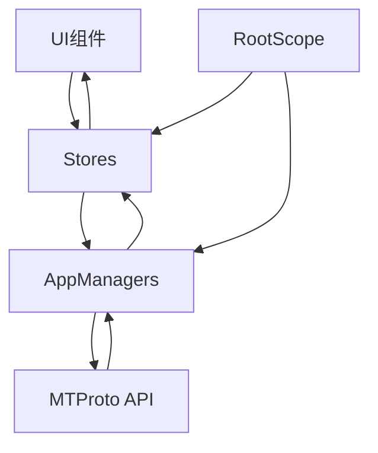
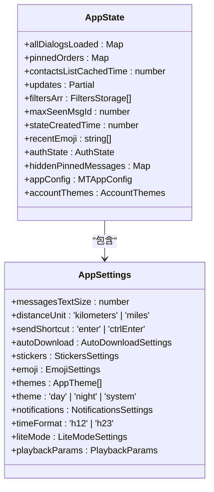
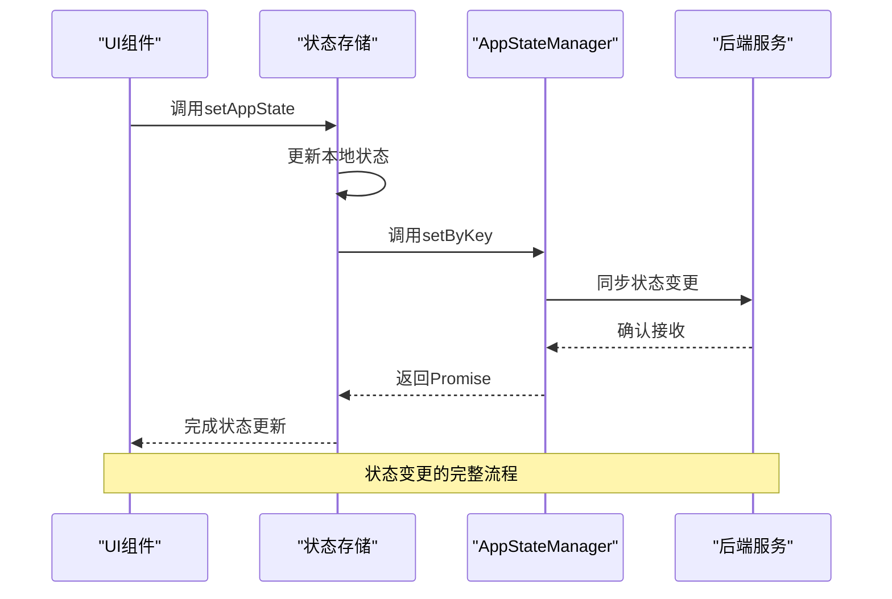
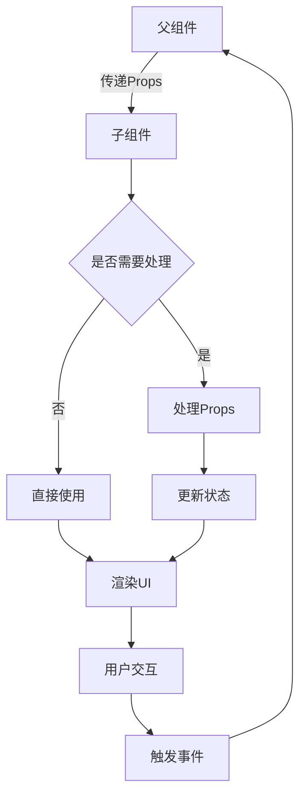
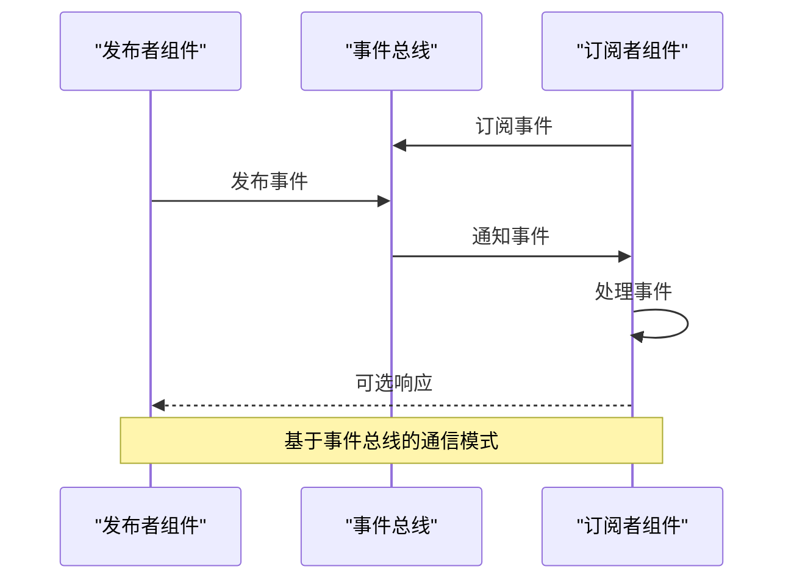
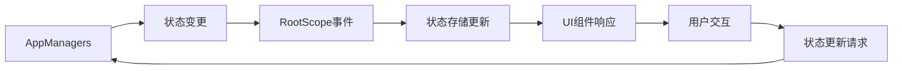
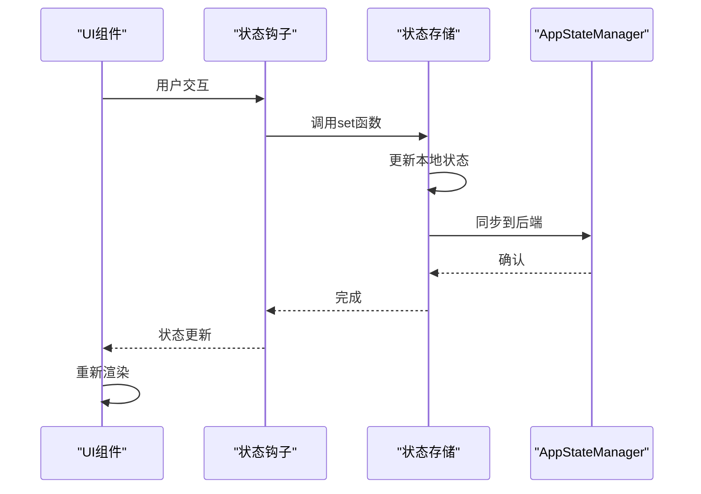
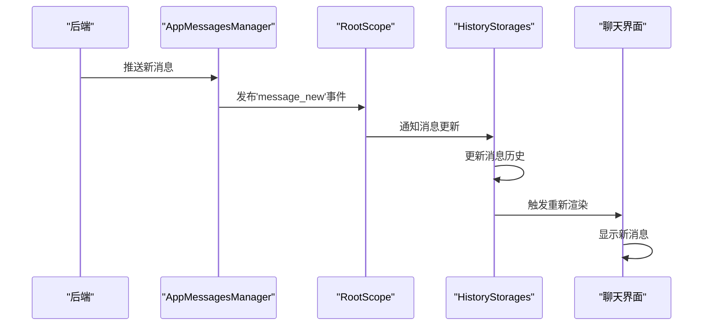
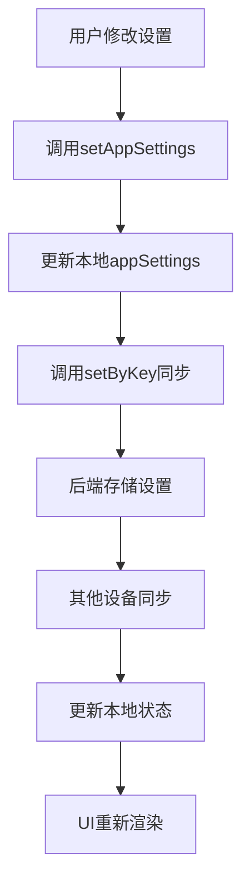

# 组件通信与状态管理

<cite>
**本文档引用的文件**
- [appState.ts](file://src/stores/appState.ts)
- [appSettings.ts](file://src/stores/appSettings.ts)
- [contentSettings.ts](file://src/stores/contentSettings.ts)
- [historyStorages.ts](file://src/stores/historyStorages.ts)
- [rootScope.ts](file://src/lib/rootScope.ts)
- [state.ts](file://src/config/state.ts)
- [createComponentContext.ts](file://src/helpers/solid/createComponentContext.ts)
- [defineSolidElement.tsx](file://src/lib/solidjs/defineSolidElement.tsx)
</cite>

## 目录
1. [引言](#引言)
2. [状态管理架构](#状态管理架构)
3. [全局状态管理](#全局状态管理)
4. [组件通信机制](#组件通信机制)
5. [数据流分析](#数据流分析)
6. [典型场景实现](#典型场景实现)
7. [最佳实践与常见陷阱](#最佳实践与常见陷阱)

## 引言
本文档深入探讨tweb项目中基于Solid.js响应式系统的组件通信与状态管理机制。通过分析stores目录下的状态存储结构与appManagers中业务逻辑层的协作关系，详细阐述了从管理器到UI组件的数据传递路径以及用户交互引发的状态更新流程。文档重点解析了全局状态管理方案，包括appState和appSettings的组织结构，并提供了聊天消息更新、用户设置同步等典型场景的实现示例。

## 状态管理架构

tweb项目采用分层状态管理架构，结合Solid.js的响应式系统实现高效的状态管理。核心状态管理由stores目录下的多个状态存储模块组成，这些模块与appManagers中的业务逻辑层紧密协作，形成完整的状态管理闭环。



**图表来源**
- [appState.ts](file://src/stores/appState.ts)
- [appSettings.ts](file://src/stores/appSettings.ts)
- [rootScope.ts](file://src/lib/rootScope.ts)

**本节来源**
- [appState.ts](file://src/stores/appState.ts#L1-L38)
- [appSettings.ts](file://src/stores/appSettings.ts#L1-L44)

## 全局状态管理

### 状态存储结构
tweb项目采用模块化的状态存储结构，将全局状态分为多个独立的存储模块。核心状态存储包括appState、appSettings和contentSettings等，每个模块负责管理特定领域的状态数据。

appState模块管理应用的核心状态，包括认证状态、对话列表、更新序列等。该模块通过createStore创建响应式存储，并提供useAppState、setAppState等钩子函数供组件使用。



**图表来源**
- [state.ts](file://src/config/state.ts#L122-L415)
- [appState.ts](file://src/stores/appState.ts#L6-L7)

**本节来源**
- [state.ts](file://src/config/state.ts#L122-L415)
- [appState.ts](file://src/stores/appState.ts#L6-L38)

### 状态同步机制
全局状态的同步通过rootScope中的managers.appStateManager实现。当状态发生变化时，setAppState函数不仅更新本地存储，还会通过appStateManager.setByKey将变更同步到后端。



**图表来源**
- [appState.ts](file://src/stores/appState.ts#L8-L13)
- [rootScope.ts](file://src/lib/rootScope.ts#L250-L314)

**本节来源**
- [appState.ts](file://src/stores/appState.ts#L8-L13)
- [rootScope.ts](file://src/lib/rootScope.ts#L250-L314)

## 组件通信机制

### Props传递
组件间通信主要通过props传递实现。tweb项目中的UI组件采用函数式组件模式，通过参数接收props并响应式更新。对于复杂的数据结构，组件通常只接收必要的数据字段，避免不必要的重新渲染。



**图表来源**
- [defineSolidElement.tsx](file://src/lib/solidjs/defineSolidElement.tsx#L68-L106)
- [createComponentContext.ts](file://src/helpers/solid/createComponentContext.ts#L1-L39)

**本节来源**
- [defineSolidElement.tsx](file://src/lib/solidjs/defineSolidElement.tsx#L68-L106)

### Context共享
对于跨层级组件的通信，tweb项目采用Context机制。通过createComponentContext创建上下文，允许组件在不直接传递props的情况下访问共享状态。

```mermaid
classDiagram
class ComponentContext {
+register : (kind : Kind, element : JSX.Element) => JSX.Element
+store : {[key in Kind]? : JSX.Element}
}
class ParentComponent {
+createValue : () => ComponentContextValue
}
class ChildComponent {
+useContext : (context : Context) => Value
}
ParentComponent --> ComponentContext : "创建"
ChildComponent --> ComponentContext : "使用"
ComponentContext --> ChildComponent : "提供数据"
```

**图表来源**
- [createComponentContext.ts](file://src/helpers/solid/createComponentContext.ts#L1-L39)

**本节来源**
- [createComponentContext.ts](file://src/helpers/solid/createComponentContext.ts#L1-L39)

### 事件发射模式
事件发射模式用于处理组件间的异步通信。tweb项目通过RootScope类实现事件总线模式，允许组件订阅和发布事件。



**图表来源**
- [rootScope.ts](file://src/lib/rootScope.ts#L250-L314)

**本节来源**
- [rootScope.ts](file://src/lib/rootScope.ts#L250-L314)

## 数据流分析

### 数据从管理器到UI组件的传递
数据流从appManagers中的业务逻辑层开始，经过状态存储模块，最终到达UI组件。这种单向数据流确保了状态变更的可预测性和可追踪性。



**图表来源**
- [appState.ts](file://src/stores/appState.ts#L8-L13)
- [rootScope.ts](file://src/lib/rootScope.ts#L250-L314)

**本节来源**
- [appState.ts](file://src/stores/appState.ts#L8-L13)
- [rootScope.ts](file://src/lib/rootScope.ts#L250-L314)

### 用户交互引发的状态更新
用户交互触发的状态更新流程遵循严格的模式：UI组件捕获用户输入，调用状态更新函数，状态存储更新本地状态并同步到后端，最后触发UI重新渲染。



**图表来源**
- [appState.ts](file://src/stores/appState.ts#L8-L13)
- [appSettings.ts](file://src/stores/appSettings.ts#L10-L21)

**本节来源**
- [appState.ts](file://src/stores/appState.ts#L8-L13)
- [appSettings.ts](file://src/stores/appSettings.ts#L10-L21)

## 典型场景实现

### 聊天消息更新
聊天消息的更新涉及多个状态管理模块的协作。当新消息到达时，appMessagesManager处理消息数据，通过RootScope发布'message_new'事件，historyStorages更新消息历史存储，UI组件响应状态变化并渲染新消息。



**图表来源**
- [historyStorages.ts](file://src/stores/historyStorages.ts#L1-L28)
- [rootScope.ts](file://src/lib/rootScope.ts#L35-L244)

**本节来源**
- [historyStorages.ts](file://src/stores/historyStorages.ts#L1-L28)
- [rootScope.ts](file://src/lib/rootScope.ts#L35-L244)

### 用户设置同步
用户设置的同步通过appSettings模块实现。当用户修改设置时，setAppSettings函数更新本地状态并调用appStateManager.setByKey同步到后端，确保多设备间设置的一致性。



**图表来源**
- [appSettings.ts](file://src/stores/appSettings.ts#L10-L21)
- [appState.ts](file://src/stores/appState.ts#L8-L13)

**本节来源**
- [appSettings.ts](file://src/stores/appSettings.ts#L10-L21)

## 最佳实践与常见陷阱

### 最佳实践
1. **单一数据源**：确保每个状态只在一个地方定义和管理，避免状态冗余和不一致。
2. **最小化状态**：只存储必要的状态数据，避免过度状态化。
3. **异步操作处理**：使用Promise和async/await正确处理异步状态更新。
4. **性能优化**：利用Solid.js的细粒度响应式系统，避免不必要的重新渲染。

### 常见陷阱
1. **状态同步延迟**：本地状态更新与后端同步可能存在延迟，需要妥善处理中间状态。
2. **循环依赖**：避免在状态更新回调中直接修改相关状态，防止无限循环。
3. **内存泄漏**：及时清理事件监听器和订阅，防止内存泄漏。
4. **并发冲突**：处理多设备同时修改同一状态的并发冲突问题。

**本节来源**
- [appState.ts](file://src/stores/appState.ts#L8-L13)
- [appSettings.ts](file://src/stores/appSettings.ts#L10-L21)
- [rootScope.ts](file://src/lib/rootScope.ts#L250-L314)