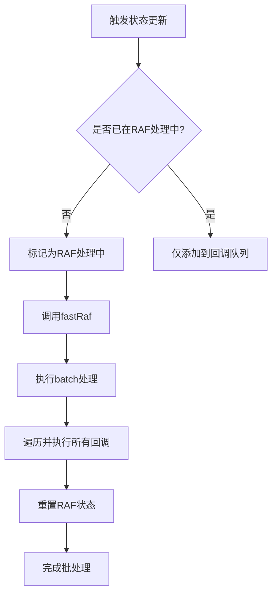
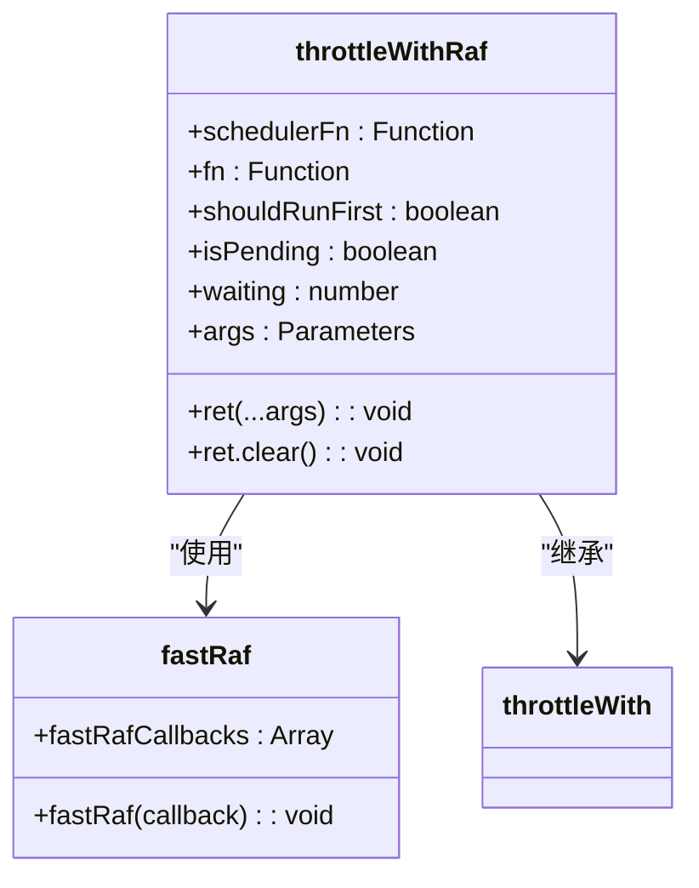
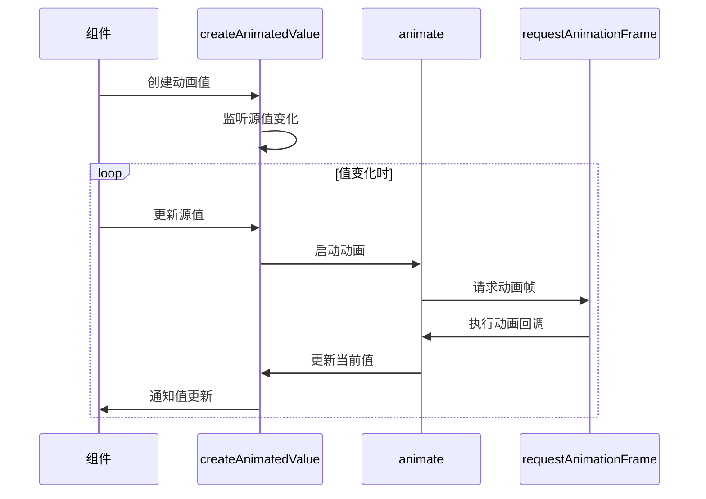
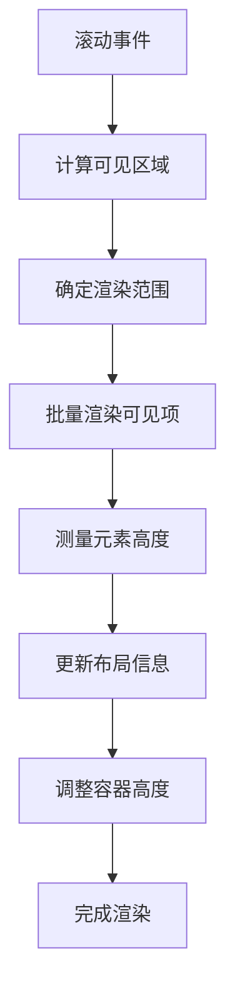
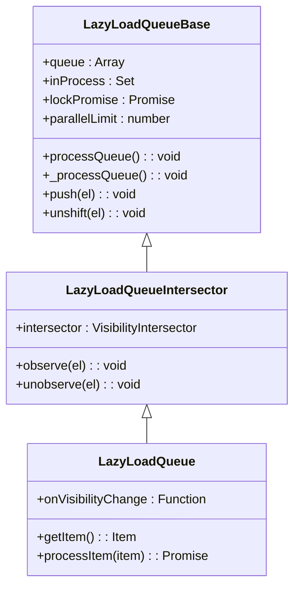

# 响应式性能优化

<cite>
**本文档引用的文件**  
- [createAnimatedValue.ts](file://src\helpers\solid\createAnimatedValue.ts)
- [throttleWithRaf.ts](file://src\helpers\schedulers\throttleWithRaf.ts)
- [schedulers.ts](file://src\helpers\schedulers.ts)
- [dynamicVirtualList\index.tsx](file://src\components\dynamicVirtualList\index.tsx)
- [lazyLoadQueue.ts](file://src\components\lazyLoadQueue.ts)
- [lazyLoadQueueBase.ts](file://src\components\lazyLoadQueueBase.ts)
- [lazyLoadQueueIntersector.ts](file://src\components\lazyLoadQueueIntersector.ts)
- [chat.ts](file://src\components\chat\chat.ts)
- [bubbles.ts](file://src\components\chat\bubbles.ts)
- [rlottiePlayer.ts](file://src\lib\rlottie\rlottiePlayer.ts)
</cite>

## 目录
1. [引言](#引言)
2. [响应式更新批处理机制](#响应式更新批处理机制)
3. [节流优化与requestAnimationFrame](#节流优化与requestanimationframe)
4. [动画相关的响应式优化](#动画相关的响应式优化)
5. [虚拟列表与懒加载队列](#虚拟列表与懒加载队列)
6. [避免过度渲染的技巧](#避免过度渲染的技巧)
7. [性能监控与瓶颈识别](#性能监控与瓶颈识别)
8. [高频率更新场景最佳实践](#高频率更新场景最佳实践)
9. [结论](#结论)

## 引言

tweb项目采用Solid.js作为其响应式框架，通过精心设计的性能优化策略来确保在复杂交互场景下的流畅用户体验。本文档系统阐述了项目中实现的响应式性能优化技术，包括使用requestAnimationFrame进行批量更新、throttleWithRaf实现节流优化、动画相关的响应式优化技术，以及虚拟列表和懒加载队列等大型列表性能提升方案。文档还分析了响应式更新的批处理机制和避免过度渲染的技巧，并提供了性能监控工具和方法，帮助开发者识别响应式性能瓶颈。最后，文档记录了在高频率更新场景下的最佳实践，如聊天消息流处理。

**Section sources**
- [chat.ts](file://src\components\chat\chat.ts#L1-L200)
- [bubbles.ts](file://src\components\chat\bubbles.ts#L1-L200)

## 响应式更新批处理机制

tweb项目通过requestRAF函数实现了基于requestAnimationFrame的响应式更新批处理机制。该机制的核心是将多个状态更新操作收集到一个队列中，并在下一个动画帧中统一处理，从而避免了频繁的DOM重绘和重排。

**Diagram sources**
- [requestRAF.ts](file://src\helpers\solid\requestRAF.ts#L1-L24)

requestRAF函数维护一个rafCallbacks数组，当有新的更新请求时，会将回调函数添加到该数组中。如果当前没有正在进行的RAF处理，函数会调用fastRaf来安排下一个动画帧的执行。在动画帧回调中，函数使用Solid.js的batch功能来确保所有状态更新在同一个批处理中执行，从而最小化DOM更新次数。

**Section sources**
- [requestRAF.ts](file://src\helpers\solid\requestRAF.ts#L1-L24)
- [schedulers.ts](file://src\helpers\schedulers.ts#L27-L40)

## 节流优化与requestAnimationFrame

tweb项目实现了throttleWithRaf函数，这是一种结合了节流（throttle）和requestAnimationFrame的优化技术。该技术特别适用于处理高频事件（如滚动、窗口大小调整等），可以有效减少事件处理函数的执行频率，同时确保更新在浏览器的重绘周期内完成。

**Diagram sources**
- [throttleWithRaf.ts](file://src\helpers\schedulers\throttleWithRaf.ts#L1-L10)
- [throttleWith.ts](file://src\helpers\schedulers\throttleWith.ts#L1-L51)
- [schedulers.ts](file://src\helpers\schedulers.ts#L27-L40)

throttleWithRaf函数通过throttleWith高阶函数实现，它接受一个调度函数（fastRaf）和一个目标函数作为参数。当被节流的函数被调用时，如果当前没有等待的调度任务，它会立即安排一个requestAnimationFrame任务。在动画帧回调中，函数会执行被节流的目标函数。这种方法确保了即使事件频繁触发，处理函数也只会在每个动画帧中最多执行一次，从而大大降低了CPU使用率。

**Section sources**
- [throttleWithRaf.ts](file://src\helpers\schedulers\throttleWithRaf.ts#L1-L10)
- [throttleWith.ts](file://src\helpers\schedulers\throttleWith.ts#L1-L51)

## 动画相关的响应式优化

tweb项目通过createAnimatedValue函数实现了复杂的动画响应式优化。该函数创建了一个可动画化的响应式值，允许在值变化时自动执行平滑的过渡动画，而无需手动管理动画状态和定时器。

**Diagram sources**
- [createAnimatedValue.ts](file://src\helpers\solid\createAnimatedValue.ts#L1-L50)

createAnimatedValue函数利用Solid.js的响应式系统，当源值发生变化时，它会启动一个由animate函数管理的动画。animate函数使用requestAnimationFrame来确保动画的流畅性，并根据指定的缓动函数（easing）计算当前动画进度。这种方法将动画逻辑与状态管理完全解耦，使得开发者可以像操作普通响应式值一样操作动画值，极大地简化了复杂动画的实现。

**Section sources**
- [createAnimatedValue.ts](file://src\helpers\solid\createAnimatedValue.ts#L1-L50)

## 虚拟列表与懒加载队列

tweb项目实现了高效的虚拟列表（DynamicVirtualList）和懒加载队列（LazyLoadQueue）机制，以优化大型列表的性能表现。这些技术通过只渲染可见区域的元素和按需加载资源，显著减少了内存占用和渲染开销。

### 虚拟列表实现

**Diagram sources**
- [dynamicVirtualList\index.tsx](file://src\components\dynamicVirtualList\index.tsx#L1-L388)

DynamicVirtualList组件通过精确计算滚动位置和可见区域，只渲染当前视口内的列表项。它使用createVirtualRenderState函数来管理虚拟渲染状态，包括滚动位置、容器尺寸、列表总高度和可见项列表。组件还实现了智能的批处理机制，通过maxBatchSize参数控制每次渲染的项目数量，避免单次渲染过多元素导致的卡顿。

### 懒加载队列实现

**Diagram sources**
- [lazyLoadQueueBase.ts](file://src\components\lazyLoadQueueBase.ts#L1-L145)
- [lazyLoadQueueIntersector.ts](file://src\components\lazyLoadQueueIntersector.ts#L1-L100)
- [lazyLoadQueue.ts](file://src\components\lazyLoadQueue.ts#L1-L76)

懒加载队列采用分层架构设计，基础类LazyLoadQueueBase负责管理加载队列和并发控制，LazyLoadQueueIntersector添加了Intersection Observer支持以实现可见性检测，而LazyLoadQueue则提供了完整的懒加载功能。队列实现了智能的优先级管理，优先处理已可见的元素，并在系统资源紧张时自动暂停加载。

**Section sources**
- [dynamicVirtualList\index.tsx](file://src\components\dynamicVirtualList\index.tsx#L1-L388)
- [lazyLoadQueue.ts](file://src\components\lazyLoadQueue.ts#L1-L76)
- [lazyLoadQueueBase.ts](file://src\components\lazyLoadQueueBase.ts#L1-L145)

## 避免过度渲染的技巧

tweb项目采用了多种策略来避免响应式系统的过度渲染问题，确保只有真正需要更新的组件才会重新渲染。

### 计算属性优化

通过使用Solid.js的createMemo和createComputed等计算属性，项目将复杂的计算逻辑封装起来，只有当依赖的响应式值发生变化时才会重新计算。这避免了在每次渲染时都执行昂贵的计算操作。

### 信号分割

对于包含多个属性的复杂对象，项目采用信号分割策略，将每个属性作为独立的信号管理。这样，当只有一个属性发生变化时，只有依赖该属性的组件才会重新渲染，而不是整个对象的所有使用者都重新渲染。

### 批处理更新

如前所述，通过requestRAF和batch机制，项目将多个状态更新合并为一次批处理操作。这不仅减少了DOM更新次数，还避免了中间状态的渲染，确保了UI的一致性。

**Section sources**
- [dynamicVirtualList\index.tsx](file://src\components\dynamicVirtualList\index.tsx#L102-L117)
- [requestRAF.ts](file://src\helpers\solid\requestRAF.ts#L20-L22)

## 性能监控与瓶颈识别

tweb项目内置了多种性能监控工具和方法，帮助开发者识别和解决响应式性能瓶颈。

### 动画性能监控

项目通过useHeavyAnimationCheck钩子监控复杂的动画性能。当系统检测到动画可能影响性能时，会自动暂停非关键的动画效果，确保核心功能的流畅性。

### 更新频率分析

通过分析fastRaf和throttleWithRaf的使用情况，开发者可以识别出高频更新的源头。结合浏览器的Performance工具，可以精确测量每个响应式更新的开销，找出性能瓶颈。

### 内存使用监控

虚拟列表和懒加载队列的设计本身就考虑了内存使用效率。通过监控队列长度和缓存大小，开发者可以确保应用在低内存设备上也能正常运行。

**Section sources**
- [useHeavyAnimationCheck.ts](file://src\hooks\useHeavyAnimationCheck.ts)
- [rlottiePlayer.ts](file://src\lib\rlottie\rlottiePlayer.ts#L285-L553)

## 高频率更新场景最佳实践

在聊天消息流等高频率更新场景下，tweb项目采用了一系列最佳实践来确保性能和用户体验。

### 消息批处理

当大量消息同时到达时，系统不会立即逐个处理，而是将它们收集起来，在下一个动画帧中批量处理。这避免了短时间内频繁的DOM操作导致的界面卡顿。

### 智能滚动锁定

在用户浏览历史消息时，系统会智能地锁定滚动位置，即使有新消息到达也不会自动滚动到底部。只有当用户已经位于底部时，新消息才会触发自动滚动，这符合用户的预期行为。

### 增量更新

对于消息内容的更新（如编辑消息、添加反应等），系统采用增量更新策略，只修改发生变化的部分，而不是重新渲染整个消息项。

### 预加载与缓存

系统会预测用户可能查看的内容，提前加载相关资源并进行缓存。例如，在用户快速滚动时，会预加载相邻区域的消息和媒体文件，确保流畅的浏览体验。

**Section sources**
- [chat.ts](file://src\components\chat\chat.ts#L1-L200)
- [bubbles.ts](file://src\components\chat\bubbles.ts#L1-L200)

## 结论

tweb项目的响应式性能优化体系是一个多层次、全方位的解决方案，涵盖了从底层更新机制到上层UI组件的各个方面。通过requestAnimationFrame批处理、节流优化、虚拟列表、懒加载队列等技术的综合运用，项目在保持响应式编程优势的同时，有效解决了性能瓶颈问题。这些优化策略不仅提升了应用的整体性能，也为开发者提供了清晰的性能优化指导原则。未来，可以进一步探索Web Worker等技术，将更复杂的计算任务移出主线程，实现更高级别的性能优化。