# 响应式数据流

<cite>
**本文档引用的文件**   
- [useCurrentChat.ts](file://src/hooks/useCurrentChat.ts)
- [usePeerTranslation.ts](file://src/hooks/usePeerTranslation.ts)
- [appState.ts](file://src/stores/appState.ts)
- [peers.ts](file://src/stores/peers.ts)
- [fullPeers.ts](file://src/stores/fullPeers.ts)
- [peerLanguage.ts](file://src/stores/peerLanguage.ts)
- [appImManager.ts](file://src/lib/appManagers/appImManager.ts)
- [translation.tsx](file://src/components/chat/translation.tsx)
- [peerProfile.tsx](file://src/components/peerProfile.tsx)
- [createMemoOrReturn.ts](file://src/helpers/solid/createMemoOrReturn.ts)
- [useDynamicCachedValue.ts](file://src/helpers/solid/useDynamicCachedValue.ts)
- [subscribeOn.ts](file://src/helpers/solid/subscribeOn.ts)
</cite>

## 目录
1. [简介](#简介)
2. [响应式数据流架构](#响应式数据流架构)
3. [核心响应式状态管理](#核心响应式状态管理)
4. [自定义Hook实现](#自定义hook实现)
5. [全局状态与响应式系统集成](#全局状态与响应式系统集成)
6. [核心场景应用模式](#核心场景应用模式)
7. [跨组件通信最佳实践](#跨组件通信最佳实践)
8. [订阅与取消订阅模式](#订阅与取消订阅模式)
9. [响应式数据与业务逻辑管理器交互](#响应式数据与业务逻辑管理器交互)

## 简介
tweb项目采用SolidJS的响应式系统构建了一个高效的数据流架构。该系统通过自定义Hook、全局状态存储和事件驱动机制，实现了组件间响应式数据的无缝传递与共享。文档详细阐述了响应式数据在聊天界面、用户资料等核心场景中的应用模式，以及跨组件通信的最佳实践。

## 响应式数据流架构
tweb项目的响应式数据流架构基于SolidJS的信号(Signal)和存储(Store)系统，结合事件监听机制构建。系统核心由全局状态存储、自定义Hook和业务逻辑管理器组成，通过事件总线实现数据变更的广播与同步。

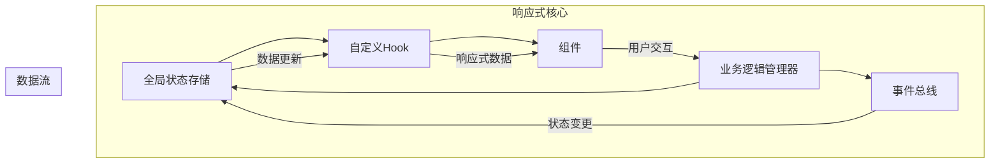

**Diagram sources**
- [appState.ts](file://src/stores/appState.ts)
- [peers.ts](file://src/stores/peers.ts)
- [rootScope.ts](file://src/lib/rootScope.ts)

## 核心响应式状态管理
项目通过`solid-js/store`实现响应式状态管理，利用`createStore`创建可观察的状态对象。状态变更通过`setStoreFunction`进行，确保变更的响应式传播。

```mermaid
classDiagram
class AppState {
+appConfig : MTAppConfig
+confirmedWebViews : BotId[]
+settings : StateSettings
+useAppState() : [State, SetStoreFunction]
+setAppState(...args) : Promise<void>
}
class PeersStore {
+state : {[peerId : PeerId] : NotEmptyPeer}
+usePeer(peerId) : Accessor<NotEmptyPeer>
+useChat(chatId) : Accessor<Chat>
+useUser(userId) : Accessor<User>
+reconcilePeer(peerId, peer)
+reconcilePeers(peers)
}
AppState --> PeersStore : "依赖"
PeersStore --> AppState : "引用"
```

**Diagram sources**
- [appState.ts](file://src/stores/appState.ts#L1-L39)
- [peers.ts](file://src/stores/peers.ts#L1-L28)

## 自定义Hook实现
### useCurrentChat Hook
`useCurrentChat` Hook封装了当前聊天会话的响应式状态，通过监听`peer_changed`事件实现状态同步。Hook返回当前聊天对象的peerId，并在组件卸载时自动清理事件监听。

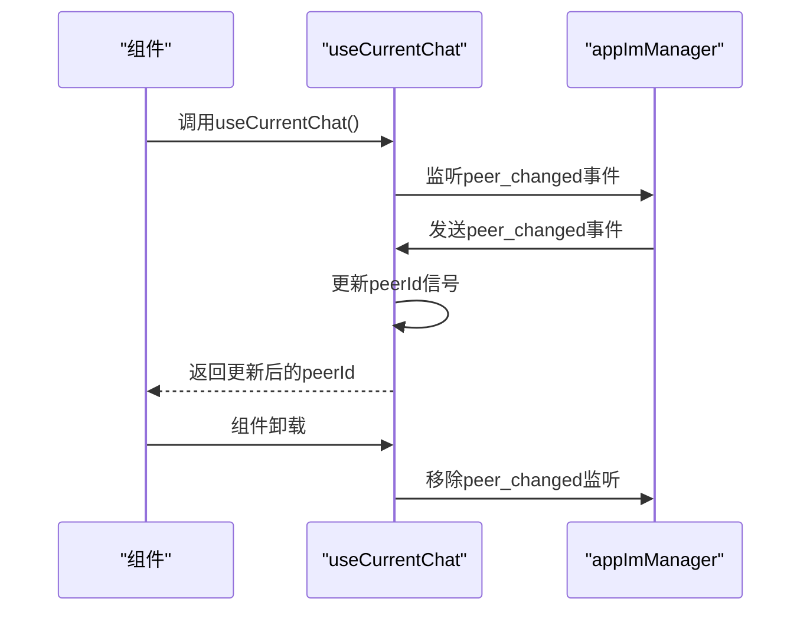

**Diagram sources**
- [useCurrentChat.ts](file://src/hooks/useCurrentChat.ts#L1-L22)

### usePeerTranslation Hook
`usePeerTranslation` Hook实现了聊天对象翻译状态的响应式管理。通过组合多个存储和状态，封装了翻译功能的启用状态、语言检测和用户偏好。

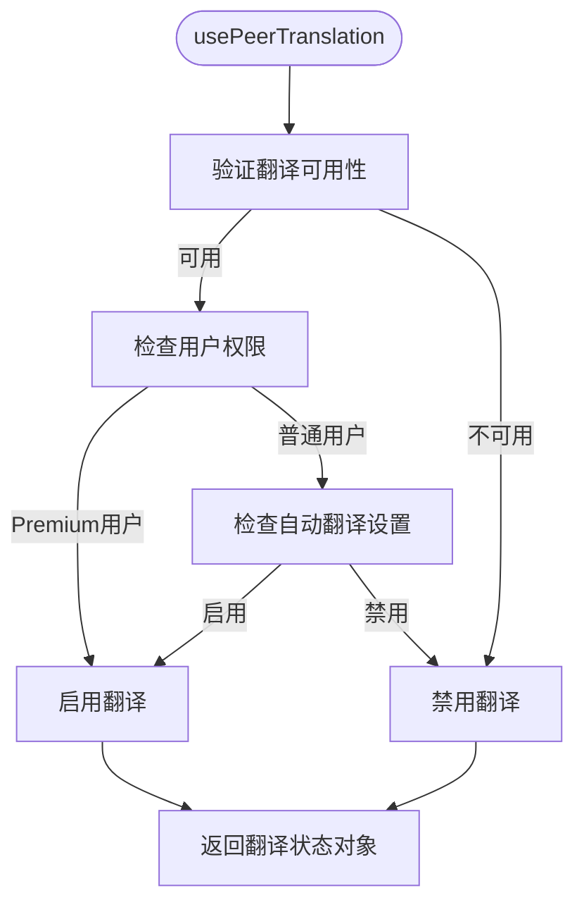

**Diagram sources**
- [usePeerTranslation.ts](file://src/hooks/usePeerTranslation.ts#L1-L85)

## 全局状态与响应式系统集成
全局状态通过`appState`和`peers`存储与响应式系统集成。`appState`存储应用配置和全局设置，`peers`存储所有联系人和聊天对象。

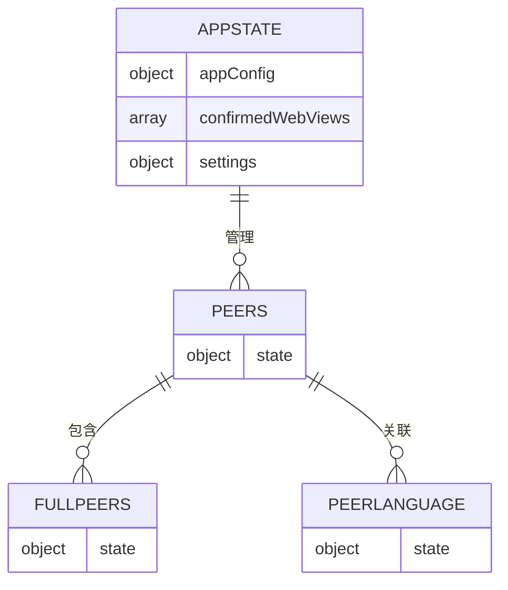

**Diagram sources**
- [appState.ts](file://src/stores/appState.ts#L1-L39)
- [peers.ts](file://src/stores/peers.ts#L1-L28)
- [fullPeers.ts](file://src/stores/fullPeers.ts#L1-L59)
- [peerLanguage.ts](file://src/stores/peerLanguage.ts#L1-L143)

## 核心场景应用模式
### 聊天界面翻译
在聊天界面中，`ChatTranslation`组件使用`usePeerTranslation` Hook获取翻译状态，并根据用户交互动态更新界面。

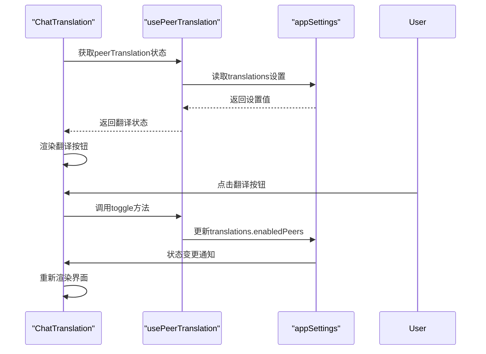

**Diagram sources**
- [translation.tsx](file://src/components/chat/translation.tsx#L1-L212)

### 用户资料展示
用户资料组件通过`PeerProfileContext`上下文传递响应式数据，实现组件间的高效通信。

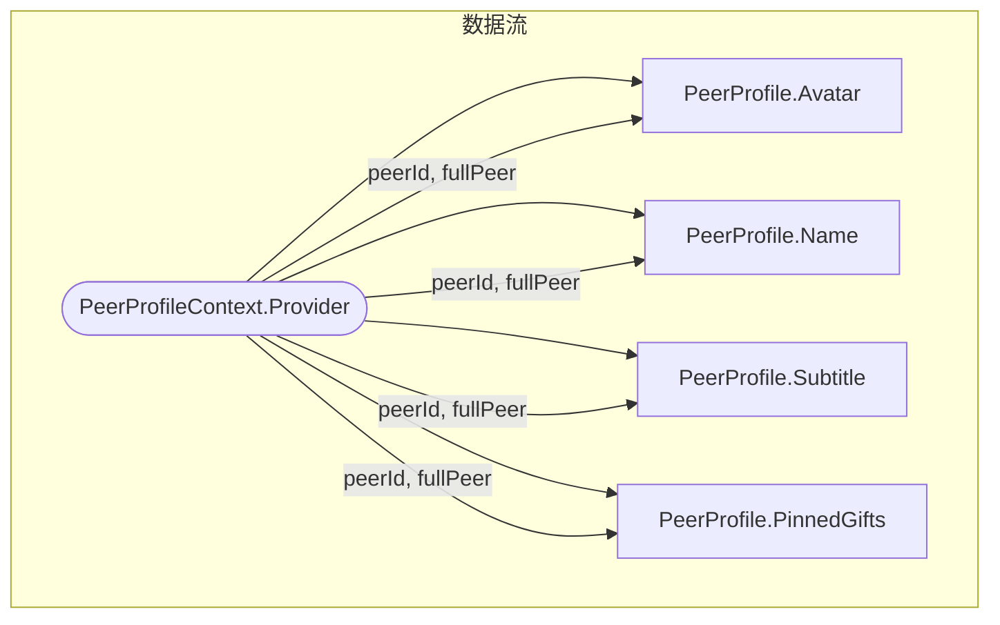

**Diagram sources**
- [peerProfile.tsx](file://src/components/peerProfile.tsx#L1-L800)

## 跨组件通信最佳实践
### 使用上下文(Context)
通过`createContext`创建上下文，实现跨层级组件的数据传递。`PeerProfileContext`是典型应用。

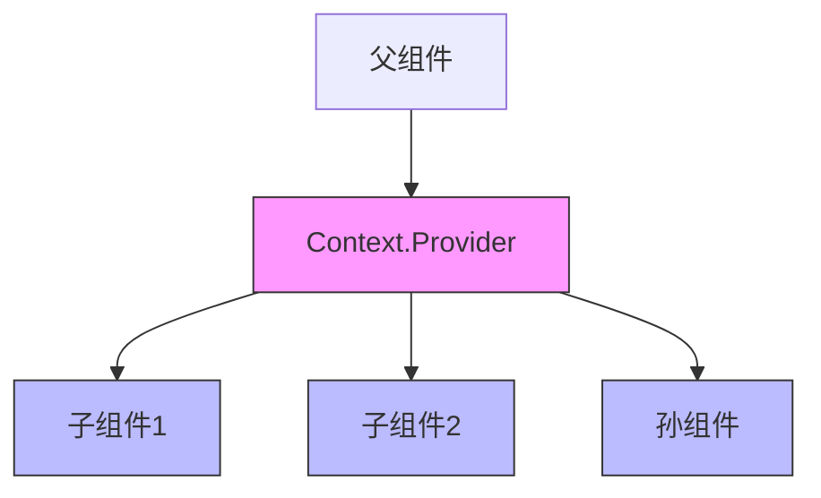

**Diagram sources**
- [peerProfile.tsx](file://src/components/peerProfile.tsx#L45-L64)

### 状态提升(State Lifting)
将共享状态提升到最近的共同父组件，通过props向下传递。

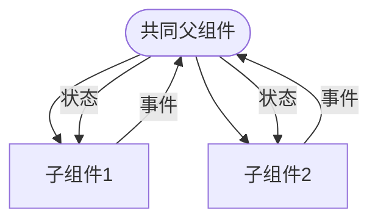

**Section sources**
- [peerProfile.tsx](file://src/components/peerProfile.tsx#L95-L199)

## 订阅与取消订阅模式
### 正确的订阅模式
使用`onCleanup`确保在组件卸载时自动清理资源，避免内存泄漏。

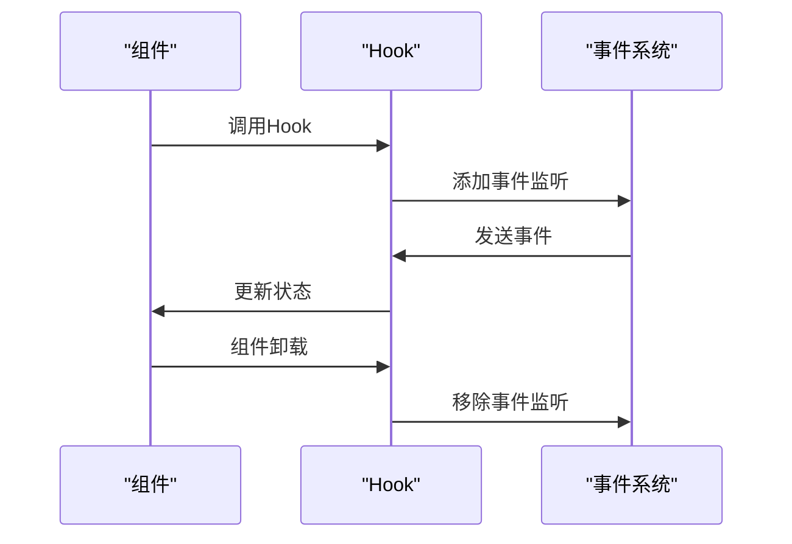

**Section sources**
- [useCurrentChat.ts](file://src/hooks/useCurrentChat.ts#L1-L22)
- [usePeerTranslation.ts](file://src/hooks/usePeerTranslation.ts#L1-L85)

### 使用中间件管理生命周期
`createMiddleware`和`subscribeOn`工具简化了事件订阅和清理的管理。

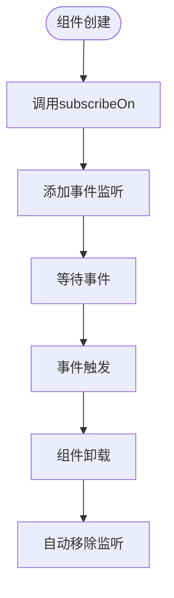

**Section sources**
- [subscribeOn.ts](file://src/helpers/solid/subscribeOn.ts#L1-L15)
- [peerProfile.tsx](file://src/components/peerProfile.tsx#L166-L172)

## 响应式数据与业务逻辑管理器交互
响应式数据与`appManagers`业务逻辑管理器通过事件总线进行交互，实现数据的双向同步。

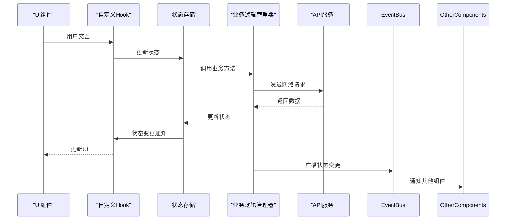

**Section sources**
- [appImManager.ts](file://src/lib/appManagers/appImManager.ts#L1-L800)
- [appState.ts](file://src/stores/appState.ts#L1-L39)
- [usePeerTranslation.ts](file://src/hooks/usePeerTranslation.ts#L1-L85)