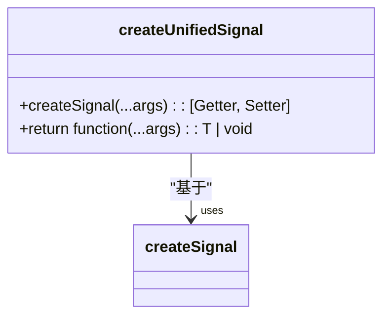
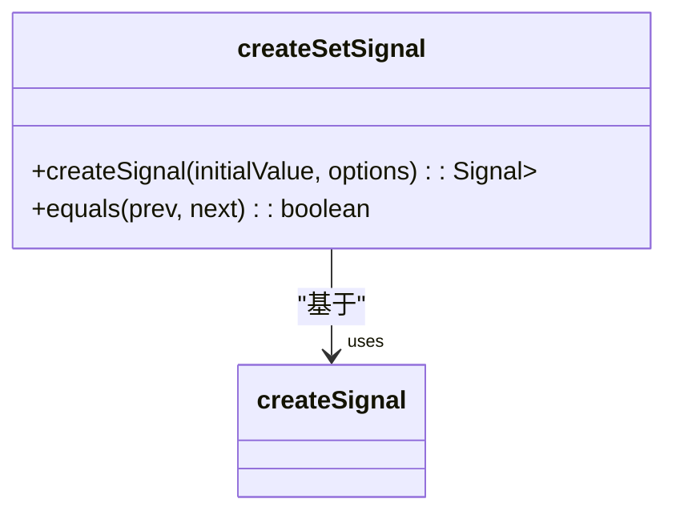
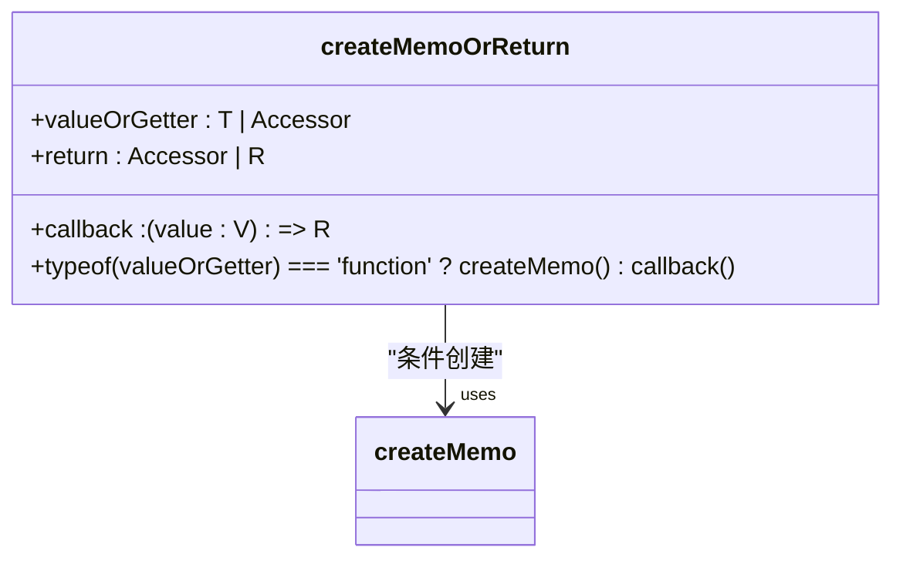
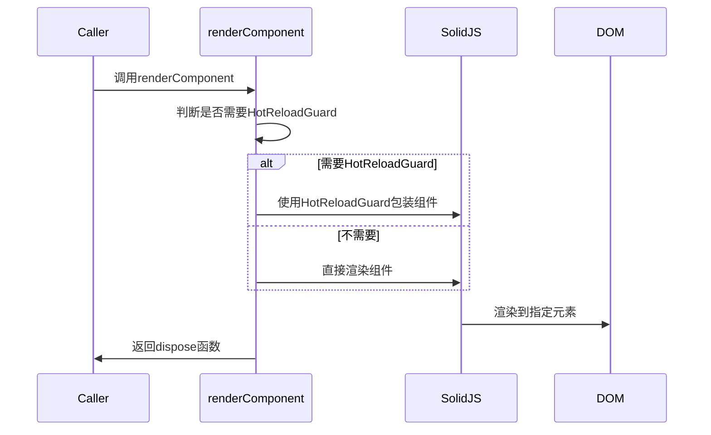
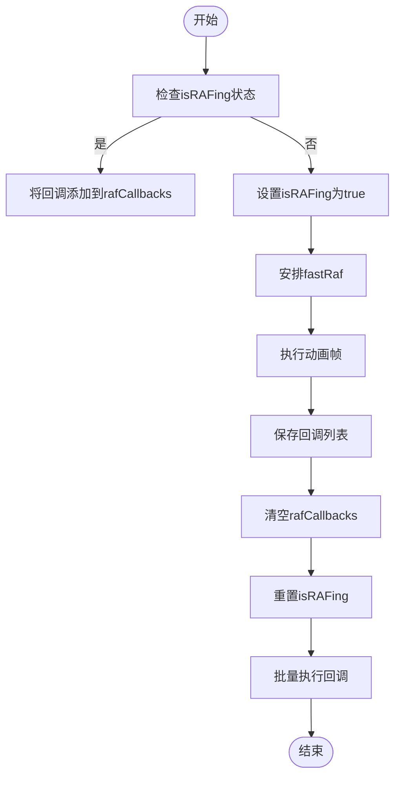
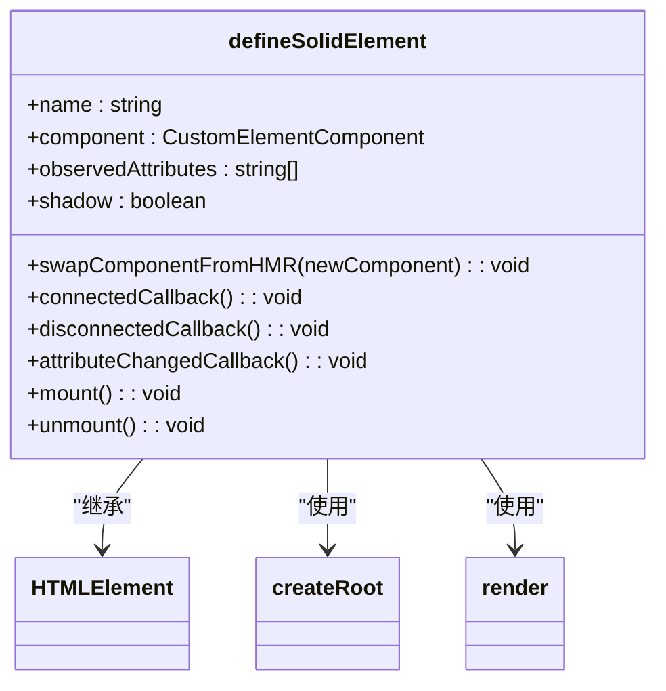
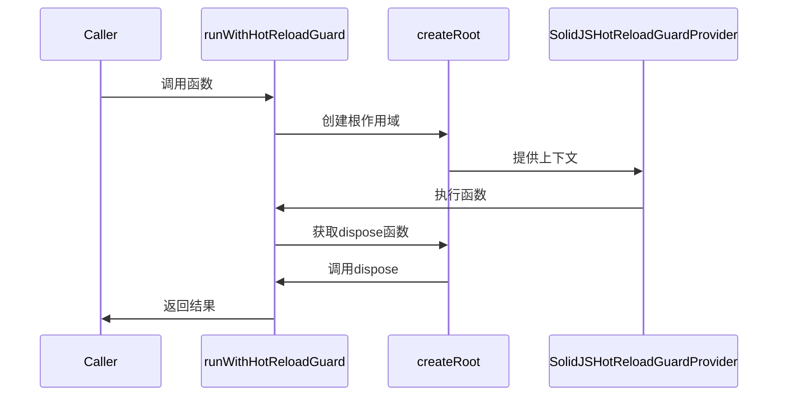
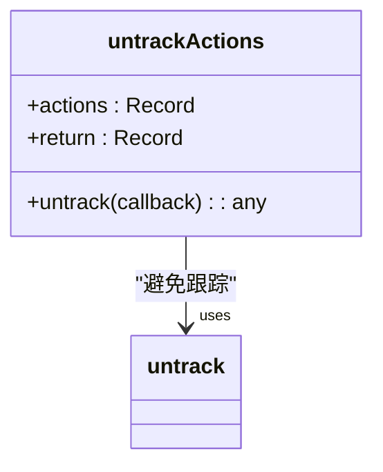

# 响应式核心机制

<cite>
**本文档引用文件**  
- [createUnifiedSignal.ts](file://src/helpers/solid/createUnifiedSignal.ts)
- [createMemoOrReturn.ts](file://src/helpers/solid/createMemoOrReturn.ts)
- [createSetSignal.ts](file://src/helpers/solid/createSetSignal.ts)
- [defineSolidElement.tsx](file://src/lib/solidjs/defineSolidElement.tsx)
- [hotReloadGuardProvider.tsx](file://src/lib/solidjs/hotReloadGuardProvider.tsx)
- [renderComponent.tsx](file://src/helpers/solid/renderComponent.tsx)
- [runWithHotReloadGuard.tsx](file://src/lib/solidjs/runWithHotReloadGuard.tsx)
- [track.ts](file://src/helpers/solid/track.ts)
- [untrackActions.ts](file://src/helpers/solid/untrackActions.ts)
- [requestRAF.ts](file://src/helpers/solid/requestRAF.ts)
- [solid.test.ts](file://src/tests/solid.test.ts)
</cite>

## 目录
1. [简介](#简介)
2. [响应式编程基础](#响应式编程基础)
3. [信号（Signal）机制](#信号signal机制)
4. [记忆值（Memo）机制](#记忆值memo机制)
5. [副作用（Effect）机制](#副作用effect机制)
6. [依赖追踪系统](#依赖追踪系统)
7. [响应式更新传播机制](#响应式更新传播机制)
8. [Solid.js 集成实现](#solidjs-集成实现)
9. [最佳实践](#最佳实践)
10. [常见问题与解决方案](#常见问题与解决方案)

## 简介
tweb项目采用Solid.js作为其响应式编程的核心框架，构建了一个高效、可维护的前端架构。本文档深入解析基于Solid.js的响应式核心机制，涵盖信号（Signal）、记忆值（Memo）和副作用（Effect）的实现原理，以及响应式依赖追踪和更新传播机制。同时，文档详细说明了Solid.js与项目框架的集成方式，包括自定义元素定义和热重载保护机制，并提供使用核心API的最佳实践和常见问题解决方案。

## 响应式编程基础
响应式编程是一种编程范式，它通过建立数据流和依赖关系，自动传播数据变化。在tweb项目中，Solid.js提供了响应式编程的基础能力，通过信号（Signal）、记忆值（Memo）和副作用（Effect）等核心概念，实现了高效的状态管理和UI更新。

**Section sources**
- [createUnifiedSignal.ts](file://src/helpers/solid/createUnifiedSignal.ts)
- [createMemoOrReturn.ts](file://src/helpers/solid/createMemoOrReturn.ts)

## 信号（Signal）机制
信号是响应式系统的基本单元，用于存储可变状态。tweb项目通过`createSignal`创建信号，并在此基础上封装了多种实用的信号创建函数。

### 统一信号（Unified Signal）
`createUnifiedSignal`函数封装了getter和setter，提供了一个统一的接口来访问和修改信号值。这种设计简化了信号的使用，避免了在JSX中直接使用getter。



**Diagram sources**
- [createUnifiedSignal.ts](file://src/helpers/solid/createUnifiedSignal.ts)

### 集合信号（Set Signal）
`createSetSignal`函数专门用于创建存储Set类型数据的信号，并自定义了相等性比较逻辑，只有当集合的大小和内容都相同时才认为相等，避免了不必要的重新渲染。



**Diagram sources**
- [createSetSignal.ts](file://src/helpers/solid/createSetSignal.ts)

**Section sources**
- [createUnifiedSignal.ts](file://src/helpers/solid/createUnifiedSignal.ts)
- [createSetSignal.ts](file://src/helpers/solid/createSetSignal.ts)

## 记忆值（Memo）机制
记忆值是一种派生状态，它基于其他响应式值计算得出，并且只有在其依赖项发生变化时才会重新计算。

### 条件记忆值
`createMemoOrReturn`函数提供了一种灵活的机制，当输入值是访问器（Accessor）时，创建一个记忆值；否则直接返回计算结果。这种设计使得API可以同时支持静态值和响应式值。



**Diagram sources**
- [createMemoOrReturn.ts](file://src/helpers/solid/createMemoOrReturn.ts)

**Section sources**
- [createMemoOrReturn.ts](file://src/helpers/solid/createMemoOrReturn.ts)

## 副作用（Effect）机制
副作用用于在响应式值变化时执行某些操作，如DOM更新、数据持久化等。tweb项目通过`createEffect`来管理副作用。

### 跟踪注解
`track`函数本身不执行任何操作，仅作为代码注解，表明某个回调函数中的值是被跟踪的。这有助于开发者理解代码的响应式行为。

```mermaid
classDiagram
class track {
+cb : () => any
+cb() : void
}
note right of track
仅作为代码注解，
表明回调中的值
是被跟踪的
end note
```

**Diagram sources**
- [track.ts](file://src/helpers/solid/track.ts)

**Section sources**
- [track.ts](file://src/helpers/solid/track.ts)

## 依赖追踪系统
tweb项目的响应式系统在组件渲染过程中自动建立依赖关系。当组件访问信号值时，系统会自动记录该组件对信号的依赖，从而在信号变化时能够精确地更新相关组件。

### 组件渲染
`renderComponent`函数负责将Solid.js组件渲染到指定的DOM元素中，并支持热重载保护机制。



**Diagram sources**
- [renderComponent.tsx](file://src/helpers/solid/renderComponent.tsx)

**Section sources**
- [renderComponent.tsx](file://src/helpers/solid/renderComponent.tsx)

## 响应式更新传播机制
当响应式值发生变化时，系统会按照特定的顺序传播更新，确保UI的一致性和性能。

### 请求动画帧
`requestRAF`函数用于将回调函数安排在下一个动画帧执行，通过`batch`确保所有回调在同一个批次中执行，提高性能。



**Diagram sources**
- [requestRAF.ts](file://src/helpers/solid/requestRAF.ts)

**Section sources**
- [requestRAF.ts](file://src/helpers/solid/requestRAF.ts)

## Solid.js 集成实现
tweb项目通过`defineSolidElement`和`runWithHotReloadGuard`等机制，将Solid.js深度集成到项目框架中。

### 自定义元素定义
`defineSolidElement`函数定义了一个支持热模块替换（HMR）的自定义元素，允许在不刷新页面的情况下更新组件。



**Diagram sources**
- [defineSolidElement.tsx](file://src/lib/solidjs/defineSolidElement.tsx)

### 热重载保护
`runWithHotReloadGuard`函数通过在`SolidJSHotReloadGuardProvider`上下文中执行函数，提供热重载保护，防止不必要的页面刷新。



**Diagram sources**
- [runWithHotReloadGuard.tsx](file://src/lib/solidjs/runWithHotReloadGuard.tsx)
- [hotReloadGuardProvider.tsx](file://src/lib/solidjs/hotReloadGuardProvider.tsx)

**Section sources**
- [defineSolidElement.tsx](file://src/lib/solidjs/defineSolidElement.tsx)
- [runWithHotReloadGuard.tsx](file://src/lib/solidjs/runWithHotReloadGuard.tsx)
- [hotReloadGuardProvider.tsx](file://src/lib/solidjs/hotReloadGuardProvider.tsx)

## 最佳实践
### 使用createSignal
- 使用`createUnifiedSignal`封装信号，提供统一的访问接口
- 避免在JSX中直接使用getter，以提高性能

### 使用createMemo
- 对于复杂的计算，使用`createMemo`缓存结果
- 使用`createMemoOrReturn`支持静态值和响应式值的混合使用

### 使用createEffect
- 将副作用逻辑封装在`createEffect`中
- 使用`untrackActions`避免在动作中触发不必要的跟踪



**Diagram sources**
- [untrackActions.ts](file://src/helpers/solid/untrackActions.ts)

**Section sources**
- [untrackActions.ts](file://src/helpers/solid/untrackActions.ts)

## 常见问题与解决方案
### 响应式循环引用
当两个信号相互依赖时，可能形成循环引用，导致无限更新循环。解决方案包括：
- 重新设计数据流，打破循环依赖
- 使用`untrack`临时解除跟踪
- 延迟更新，使用`setTimeout`或`requestAnimationFrame`

### 热重载失效
当导入的模块不支持热重载时，可能导致页面刷新。解决方案是使用`HotReloadGuard`保护这些模块。

**Section sources**
- [hotReloadGuardProvider.tsx](file://src/lib/solidjs/hotReloadGuardProvider.tsx)
- [solid.test.ts](file://src/tests/solid.test.ts)