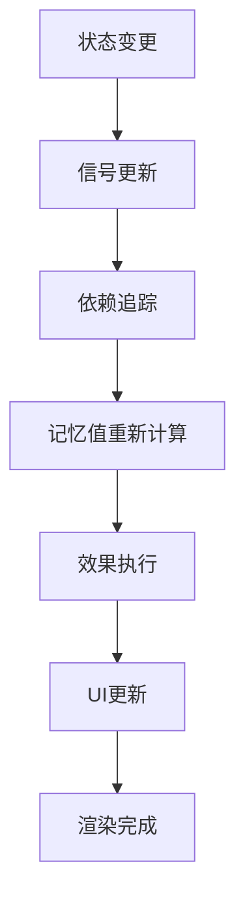
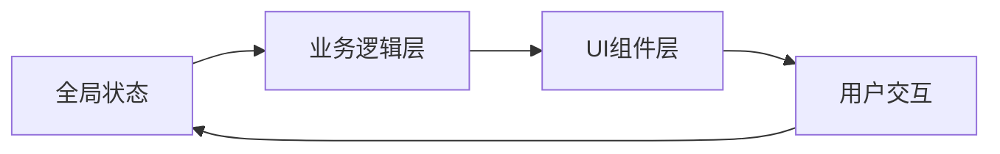
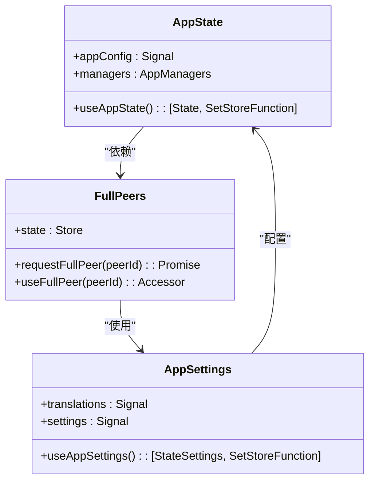
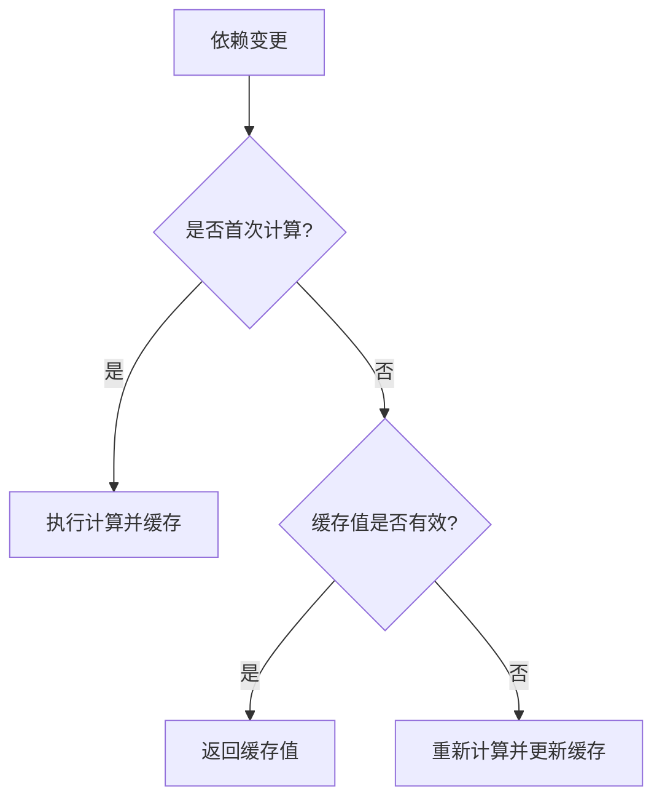
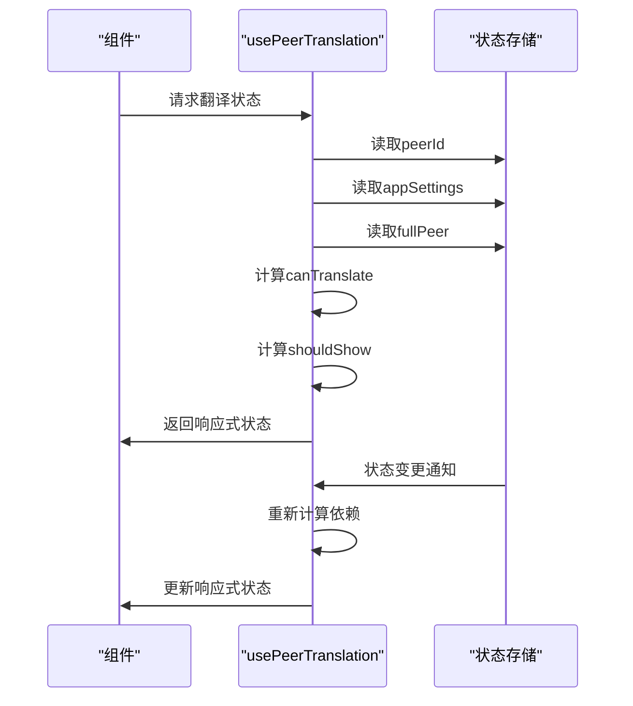

# 响应式系统

<cite>
**本文档中引用的文件**  
- [useCurrentChat.ts](file://src/hooks/useCurrentChat.ts)
- [usePeerTranslation.ts](file://src/hooks/usePeerTranslation.ts)
- [useDynamicCachedValue.ts](file://src/helpers/solid/useDynamicCachedValue.ts)
- [appState.ts](file://src/stores/appState.ts)
- [appSettings.ts](file://src/stores/appSettings.ts)
- [fullPeers.ts](file://src/stores/fullPeers.ts)
- [peers.ts](file://src/stores/peers.ts)
- [peerLanguage.ts](file://src/stores/peerLanguage.ts)
- [createMemoOrReturn.ts](file://src/helpers/solid/createMemoOrReturn.ts)
- [appImManager.ts](file://src/lib/appManagers/appImManager.ts)
</cite>

## 目录
1. [引言](#引言)
2. [响应式编程模型](#响应式编程模型)
3. [核心响应式概念](#核心响应式概念)
4. [响应式数据流](#响应式数据流)
5. [状态管理集成](#状态管理集成)
6. [性能优化策略](#性能优化策略)
7. [最佳实践与陷阱规避](#最佳实践与陷阱规避)
8. [关键Hook实现分析](#关键hook实现分析)
9. [结论](#结论)

## 引言
tweb项目采用Solid.js作为其响应式系统的核心框架，实现了高效、可预测的UI更新机制。本系统通过信号（Signal）、记忆值（Memo）和效果（Effect）等核心概念，构建了一个细粒度的依赖追踪系统。该系统不仅确保了状态变更时的精确更新，还通过智能缓存和批量处理优化了性能表现。响应式系统贯穿于整个应用的状态管理、组件通信和用户交互流程中，为复杂的消息界面提供了流畅的用户体验。

## 响应式编程模型
tweb的响应式系统基于Solid.js的编译时响应式架构，采用细粒度的依赖追踪机制。该模型通过编译器将响应式原语（如信号、记忆值和效果）转换为高效的JavaScript代码，避免了传统虚拟DOM的diffing开销。系统在运行时维护一个精确的依赖图，当状态变化时，仅更新受影响的最小UI组件集合。这种模式结合了函数式响应式编程的声明性优势和命令式编程的性能优势，实现了高性能的UI更新。

**图示来源**  
- [appState.ts](file://src/stores/appState.ts#L1-L39)
- [appSettings.ts](file://src/stores/appSettings.ts#L1-L45)

## 核心响应式概念

### 信号（Signal）
信号是响应式系统的基本单元，用于封装可变状态。在tweb中，信号通过`createSignal`函数创建，返回一个getter和setter对。当通过setter修改信号值时，所有依赖该信号的计算值和副作用会自动重新执行。信号的实现采用了发布-订阅模式，确保了状态变更的精确传播。

**节段来源**  
- [useCurrentChat.ts](file://src/hooks/useCurrentChat.ts#L1-L22)

### 记忆值（Memo）
记忆值是基于其他响应式值计算得出的派生状态，具有惰性求值和缓存特性。在tweb中，`createMemo`用于创建记忆值，仅当依赖项发生变化时才会重新计算。这避免了不必要的重复计算，特别适用于复杂的业务逻辑处理，如消息翻译状态的判断和用户界面配置的组合。

**节段来源**  
- [usePeerTranslation.ts](file://src/hooks/usePeerTranslation.ts#L1-L85)
- [peerLanguage.ts](file://src/stores/peerLanguage.ts#L1-L143)

### 效果（Effect）
效果用于处理响应式副作用，如DOM操作、事件监听和异步请求。在tweb中，`createEffect`创建的效果会在其依赖的响应式值发生变化时自动执行。系统通过`onMount`和`onCleanup`等生命周期辅助函数，确保了副作用的正确建立和清理，防止了内存泄漏。

**节段来源**  
- [usePeerTranslation.ts](file://src/hooks/usePeerTranslation.ts#L73-L77)
- [useCurrentChat.ts](file://src/hooks/useCurrentChat.ts#L12-L18)

## 响应式数据流
tweb的响应式数据流通过组件间的依赖关系形成一个有向无环图。数据从全局状态存储（如appState和appSettings）流向具体组件，经过记忆值的转换，最终通过信号驱动UI更新。这种单向数据流确保了状态变更的可预测性。当用户交互触发状态变化时，系统会沿着依赖链向上游传播变更，然后重新计算所有受影响的下游值。

**图示来源**  
- [appImManager.ts](file://src/lib/appManagers/appImManager.ts#L1-L800)
- [appState.ts](file://src/stores/appState.ts#L1-L39)

## 状态管理集成
tweb的响应式系统与状态管理store深度集成，通过`createStore`和`reconcile`等工具实现复杂状态的高效管理。全局状态被组织在多个专门的store中，如appState、appSettings和fullPeers，每个store都暴露了基于信号的响应式接口。这种分层设计既保证了状态的单一来源，又通过细粒度的响应式绑定实现了局部更新。

**图示来源**  
- [appState.ts](file://src/stores/appState.ts#L1-L39)
- [appSettings.ts](file://src/stores/appSettings.ts#L1-L45)
- [fullPeers.ts](file://src/stores/fullPeers.ts#L1-L59)

**节段来源**  
- [appState.ts](file://src/stores/appState.ts#L1-L39)
- [appSettings.ts](file://src/stores/appSettings.ts#L1-L45)
- [fullPeers.ts](file://src/stores/fullPeers.ts#L1-L59)

## 性能优化策略

### 批量更新
tweb通过`batch`函数实现批量更新，将多个状态变更合并为一次UI更新。这减少了不必要的中间状态渲染，提高了性能。在处理复杂操作时，如消息列表的批量处理，系统会自动将相关状态变更分组执行。

**节段来源**  
- [peerLanguage.ts](file://src/stores/peerLanguage.ts#L100-L120)

### 惰性计算
系统广泛使用记忆值的惰性求值特性，确保计算仅在需要时执行。`useDynamicCachedValue`工具函数进一步增强了这一机制，通过键值缓存避免了重复创建和销毁响应式上下文，特别适用于频繁创建和销毁的组件。

**图示来源**  
- [useDynamicCachedValue.ts](file://src/helpers/solid/useDynamicCachedValue.ts#L1-L38)

**节段来源**  
- [useDynamicCachedValue.ts](file://src/helpers/solid/useDynamicCachedValue.ts#L1-L38)

## 最佳实践与陷阱规避

### 内存泄漏预防
tweb通过`onCleanup`生命周期函数确保资源的正确释放。所有事件监听器、定时器和副作用都在组件卸载时被清理。`useDynamicCachedValue`的引用计数机制也防止了缓存项的永久驻留，确保了内存的及时回收。

**节段来源**  
- [useCurrentChat.ts](file://src/hooks/useCurrentChat.ts#L16-L18)
- [fullPeers.ts](file://src/stores/fullPeers.ts#L45-L48)

### 过度渲染避免
系统通过细粒度的依赖追踪和记忆值缓存避免了过度渲染。`createMemoOrReturn`工具函数根据输入类型智能选择返回记忆值或直接值，减少了不必要的响应式开销。同时，`reconcile`函数确保了对象状态的精确更新，避免了浅比较导致的无效渲染。

**节段来源**  
- [createMemoOrReturn.ts](file://src/helpers/solid/createMemoOrReturn.ts#L1-L19)
- [peers.ts](file://src/stores/peers.ts#L1-L28)

## 关键Hook实现分析

### useCurrentChat Hook
`useCurrentChat`系列Hook通过监听appImManager的peer_changed事件，将当前聊天会话的状态转化为响应式信号。该Hook使用`onMount`和`onCleanup`确保事件监听器的正确生命周期管理，实现了当前聊天状态的精确追踪。

**节段来源**  
- [useCurrentChat.ts](file://src/hooks/useCurrentChat.ts#L1-L22)

### usePeerTranslation Hook
`usePeerTranslation`是一个复杂的响应式Hook，整合了多个状态源（用户、聊天、应用设置）来决定消息翻译行为。它使用`createMemo`构建了多层依赖关系，包括翻译可用性、用户权限和语言偏好。`createEffect`用于同步状态变更，确保UI与业务逻辑的一致性。

**图示来源**  
- [usePeerTranslation.ts](file://src/hooks/usePeerTranslation.ts#L1-L85)

**节段来源**  
- [usePeerTranslation.ts](file://src/hooks/usePeerTranslation.ts#L1-L85)

## 结论
tweb的响应式系统通过Solid.js的强大能力，构建了一个高效、可维护的状态管理架构。系统通过信号、记忆值和效果的有机结合，实现了精确的依赖追踪和最小化的UI更新。与状态管理store的深度集成确保了全局状态的一致性，而批量更新和惰性计算等优化策略则保证了高性能的用户体验。关键Hook的设计体现了响应式编程的最佳实践，为复杂的消息界面提供了坚实的基础。