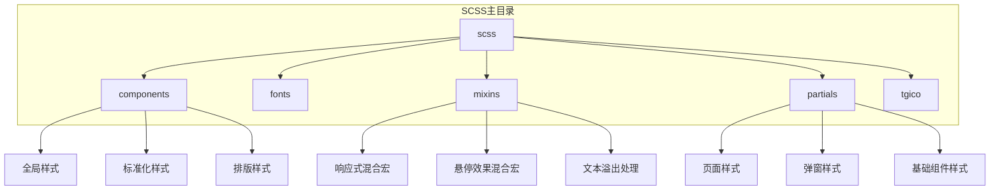
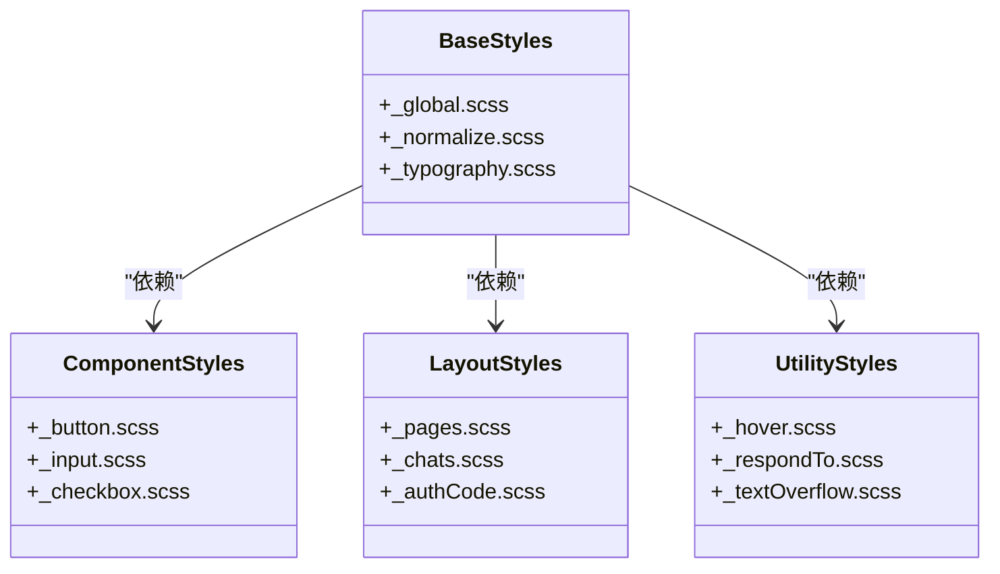
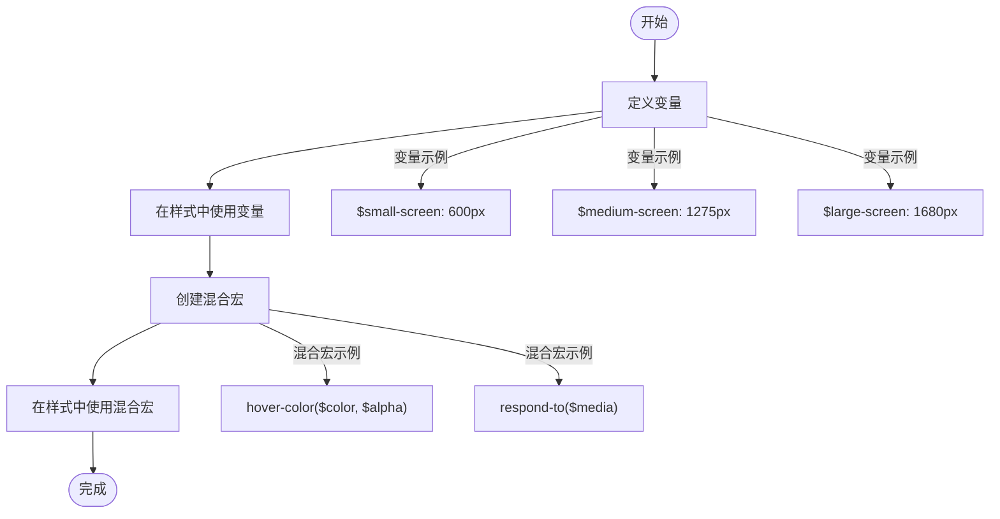
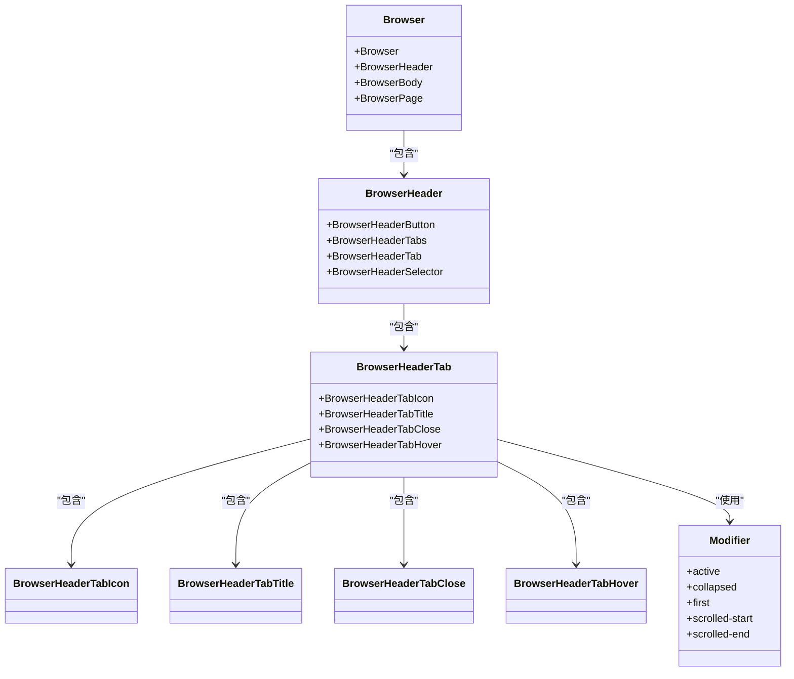
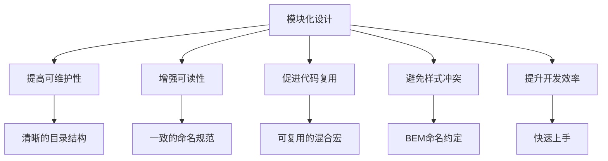
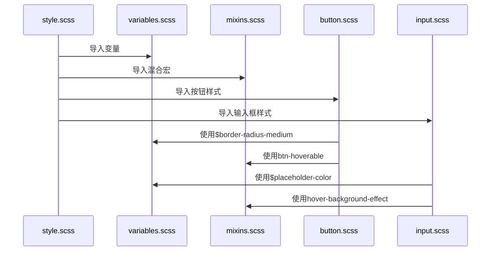

# SCSS模块化设计

<cite>
**本文档引用的文件**  
- [style.scss](file://src/scss/style.scss)
- [variables.scss](file://src/scss/variables.scss)
- [mixins.scss](file://src/scss/mixins.scss)
- [button.scss](file://src/scss/partials/_button.scss)
- [input.scss](file://src/scss/partials/_input.scss)
- [popup.scss](file://src/scss/partials/popups/_popup.scss)
- [chats.scss](file://src/scss/partials/pages/_chats.scss)
- [browser.module.scss](file://src/components/browser.module.scss)
- [chatBackground.module.scss](file://src/components/chat/bubbles/chatBackground.module.scss)
</cite>

## 目录
1. [项目结构](#项目结构)
2. [SCSS模块化组织结构](#scss模块化组织结构)
3. [变量与混合宏规范](#变量与混合宏规范)
4. [BEM命名约定应用](#bem命名约定应用)
5. [模块化设计优势](#模块化设计优势)
6. [代码示例](#代码示例)

## 项目结构

tweb项目的SCSS模块化设计采用清晰的目录结构，将样式文件按功能和用途进行分类管理。主要目录包括components（基础样式）、fonts（字体）、mixins（混合宏）、partials（布局和组件样式）以及tgico（图标相关样式）。这种结构化的组织方式有助于提高代码的可维护性和可扩展性。

**Diagram sources**
- [style.scss](file://src/scss/style.scss)
- [variables.scss](file://src/scss/variables.scss)

**Section sources**
- [style.scss](file://src/scss/style.scss)
- [variables.scss](file://src/scss/variables.scss)

## SCSS模块化组织结构

tweb项目的SCSS模块化设计遵循了清晰的分类原则，将样式分为基础样式、组件样式、布局样式和工具样式四大类。基础样式位于components目录，包含全局样式、标准化样式和排版样式；组件样式分布在partials目录下的各个子目录中，如按钮、输入框等；布局样式主要在partials/pages目录中定义；工具样式则通过mixins目录中的混合宏提供。

这种分类方式确保了样式的可维护性和可复用性。通过将不同类型的样式分离，开发人员可以更容易地找到和修改特定的样式规则，同时也避免了样式冲突。例如，基础样式中的normalize.scss确保了不同浏览器间的一致性，而组件样式则专注于特定UI元素的外观和行为。

**Diagram sources**
- [style.scss](file://src/scss/style.scss)
- [materialize.scss](file://src/materialize.scss)

**Section sources**
- [style.scss](file://src/scss/style.scss)
- [materialize.scss](file://src/materialize.scss)

## 变量与混合宏规范

tweb项目通过variables.scss文件集中管理所有SCSS变量，包括颜色、尺寸、响应式断点等。这些变量的使用遵循一致的命名约定，如$small-screen、$medium-screen、$large-screen等，便于理解和维护。混合宏则定义在mixins目录中，提供了诸如悬停效果、响应式设计等功能的可复用代码块。

变量和混合宏的使用规范确保了样式的统一性和可维护性。通过集中管理变量，可以在一个地方修改设计系统的核心参数，从而影响整个应用的外观。混合宏的使用则减少了重复代码，提高了开发效率。例如，hover-color函数用于生成悬停状态的颜色，而respond-to混合宏则简化了响应式设计的实现。

**Diagram sources**
- [variables.scss](file://src/scss/variables.scss)
- [mixins.scss](file://src/scss/mixins.scss)

**Section sources**
- [variables.scss](file://src/scss/variables.scss)
- [mixins.scss](file://src/scss/mixins.scss)

## BEM命名约定应用

tweb项目广泛采用了BEM（Block-Element-Modifier）命名约定，这种命名方式有助于创建清晰、可维护的CSS类名。BEM命名约定通过将UI分解为独立的块（Block）、元素（Element）和修饰符（Modifier），使得样式更加模块化和可复用。例如，在browser.module.scss文件中，.Browser类作为块，.BrowserHeader作为元素，而.active等状态类作为修饰符。

BEM命名约定的应用不仅提高了代码的可读性，还有效避免了样式冲突。通过使用连字符和下划线来分隔块、元素和修饰符，可以清晰地表达组件的层次结构和状态变化。这种命名方式使得开发人员能够快速理解样式的作用范围和应用场景，从而提高了开发效率和代码质量。

**Diagram sources**
- [browser.module.scss](file://src/components/browser.module.scss)

**Section sources**
- [browser.module.scss](file://src/components/browser.module.scss)

## 模块化设计优势

tweb项目的SCSS模块化设计带来了多方面的优势。首先，通过将样式文件按功能分类，提高了代码的可维护性和可读性。开发人员可以快速定位到特定的样式文件，而不需要在庞大的单一文件中搜索。其次，变量和混合宏的集中管理使得设计系统的调整变得更加容易，只需修改少量文件即可影响整个应用的外观。

此外，BEM命名约定的应用有效避免了样式冲突，确保了组件样式的独立性。这种模块化的设计还促进了代码的复用，减少了重复代码的产生。最后，清晰的目录结构和命名规范使得新开发人员能够更快地理解和上手项目，提高了团队的开发效率。

**Diagram sources**
- [style.scss](file://src/scss/style.scss)
- [variables.scss](file://src/scss/variables.scss)

**Section sources**
- [style.scss](file://src/scss/style.scss)
- [variables.scss](file://src/scss/variables.scss)

## 代码示例

以下代码示例展示了tweb项目中SCSS模块化设计的实际应用。通过导入variables.scss和mixins.scss文件，可以在样式文件中使用预定义的变量和混合宏。例如，在button.scss中，通过使用$border-radius-medium变量和btn-hoverable混合宏，可以快速创建具有一致外观和交互效果的按钮组件。

**Diagram sources**
- [style.scss](file://src/scss/style.scss)
- [variables.scss](file://src/scss/variables.scss)
- [mixins.scss](file://src/scss/mixins.scss)
- [button.scss](file://src/scss/partials/_button.scss)
- [input.scss](file://src/scss/partials/_input.scss)

**Section sources**
- [style.scss](file://src/scss/style.scss)
- [variables.scss](file://src/scss/variables.scss)
- [mixins.scss](file://src/scss/mixins.scss)
- [button.scss](file://src/scss/partials/_button.scss)
- [input.scss](file://src/scss/partials/_input.scss)