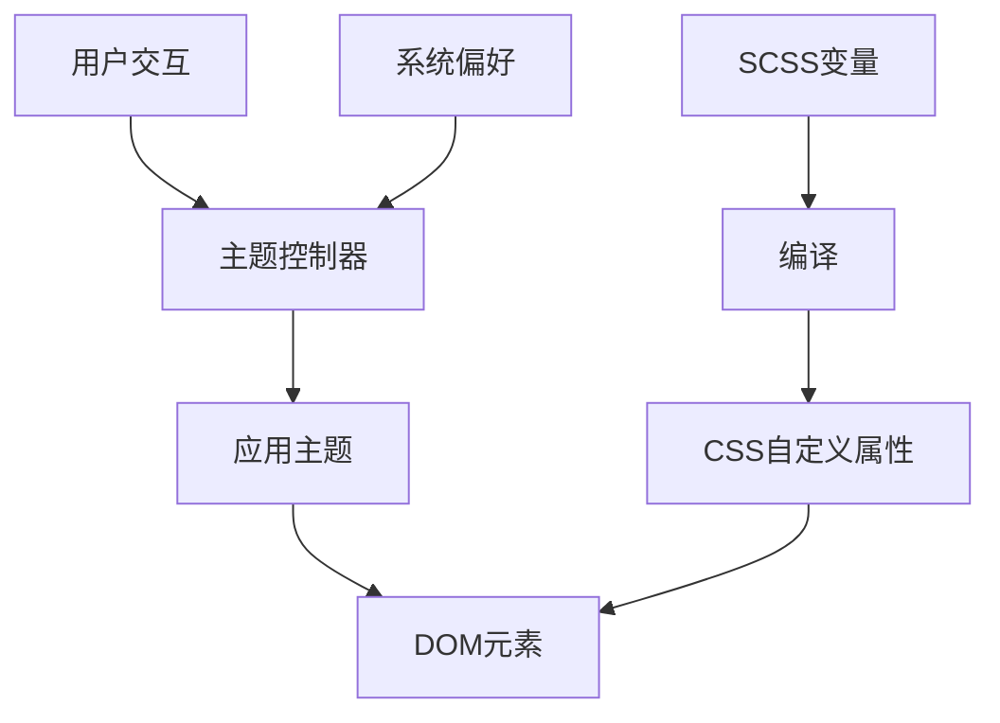
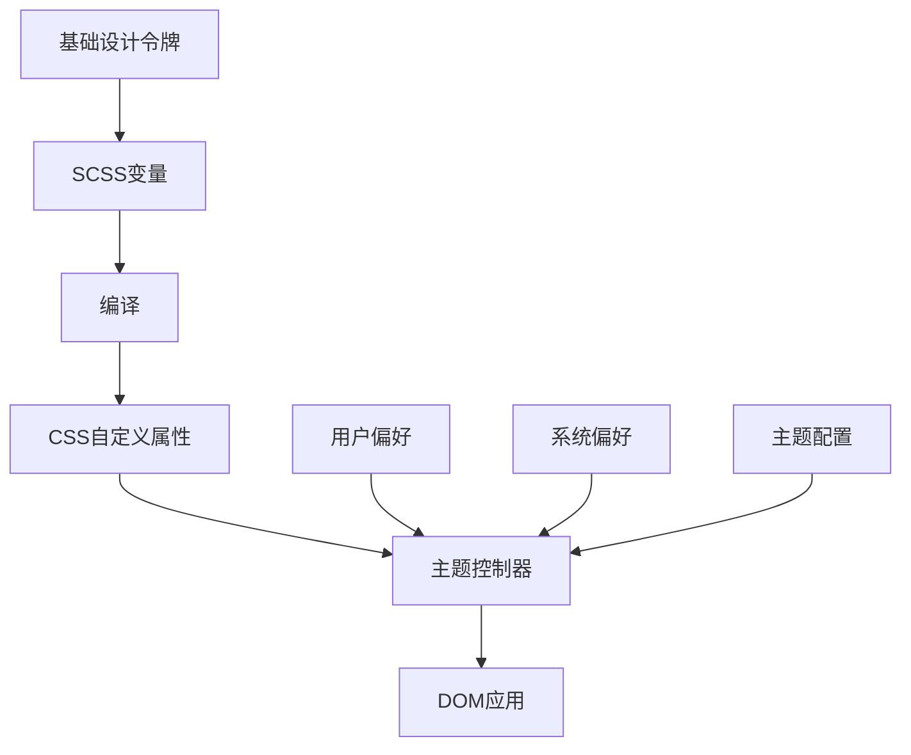
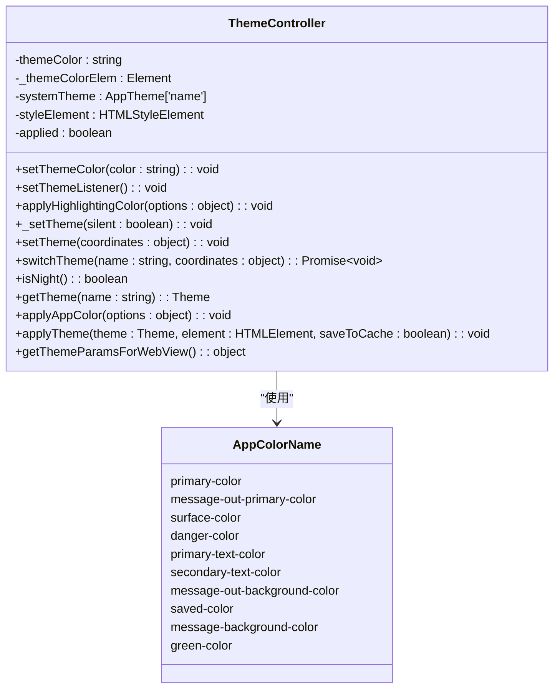
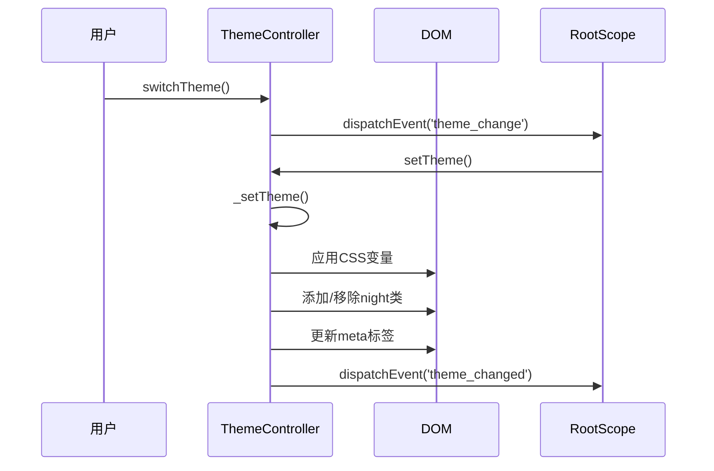
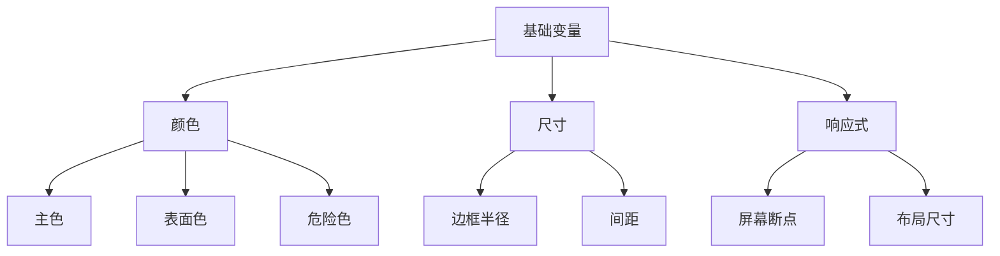
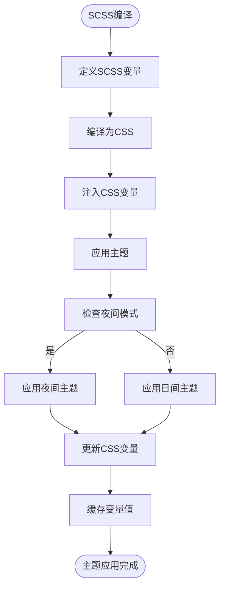
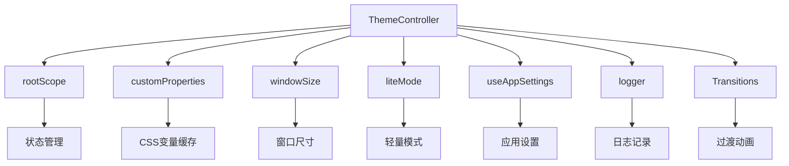

# 主题与变量系统

<cite>
**本文档引用的文件**  
- [variables.scss](file://src/scss/variables.scss)
- [themeController.ts](file://src/helpers/themeController.ts)
- [_themes.scss](file://src/scss/partials/_themes.scss)
- [useIsNightTheme.ts](file://src/hooks/useIsNightTheme.ts)
- [appSettings.ts](file://src/stores/appSettings.ts)
- [state.ts](file://src/config/state.ts)
- [customProperties.ts](file://src/helpers/dom/customProperties.ts)
</cite>

## 目录
1. [项目结构](#项目结构)
2. [核心组件](#核心组件)
3. [架构概述](#架构概述)
4. [详细组件分析](#详细组件分析)
5. [依赖分析](#依赖分析)
6. [性能考虑](#性能考虑)
7. [故障排除指南](#故障排除指南)
8. [结论](#结论)

## 项目结构

tweb项目的主题与变量系统主要由SCSS变量、CSS自定义属性和TypeScript主题控制器组成。系统通过`src/scss/variables.scss`定义基础设计令牌，通过`src/helpers/themeController.ts`实现动态主题切换逻辑，并在各个组件的样式文件中应用这些变量。

**Diagram sources**
- [variables.scss](file://src/scss/variables.scss)
- [themeController.ts](file://src/helpers/themeController.ts)

**Section sources**
- [variables.scss](file://src/scss/variables.scss)
- [themeController.ts](file://src/helpers/themeController.ts)

## 核心组件

主题系统的核心是`ThemeController`类，它负责管理主题状态、应用CSS变量并处理主题切换动画。系统使用CSS自定义属性（CSS变量）作为设计令牌的载体，通过JavaScript动态修改这些变量来实现主题切换。

**Section sources**
- [themeController.ts](file://src/helpers/themeController.ts)
- [customProperties.ts](file://src/helpers/dom/customProperties.ts)

## 架构概述

tweb的主题系统采用分层架构，将设计令牌的定义、存储和应用分离。基础设计令牌在SCSS中定义，编译后作为CSS变量注入到DOM中，主题控制器负责根据用户选择或系统偏好动态更新这些变量。

**Diagram sources**
- [variables.scss](file://src/scss/variables.scss)
- [themeController.ts](file://src/helpers/themeController.ts)

## 详细组件分析

### 主题控制器分析

`ThemeController`是主题系统的核心，负责协调主题的加载、应用和切换。它监听系统主题变化，并提供API供用户手动切换主题。

#### 类图

**Diagram sources**
- [themeController.ts](file://src/helpers/themeController.ts)

#### 主题切换流程

**Diagram sources**
- [themeController.ts](file://src/helpers/themeController.ts)

**Section sources**
- [themeController.ts](file://src/helpers/themeController.ts)

### 变量系统分析

主题变量系统通过SCSS变量和CSS自定义属性的结合使用，实现了设计令牌的集中管理和动态更新。

#### 设计令牌组织

**Diagram sources**
- [variables.scss](file://src/scss/variables.scss)

#### 变量应用流程

**Diagram sources**
- [variables.scss](file://src/scss/variables.scss)
- [themeController.ts](file://src/helpers/themeController.ts)

**Section sources**
- [variables.scss](file://src/scss/variables.scss)
- [themeController.ts](file://src/helpers/themeController.ts)

## 依赖分析

主题系统依赖于多个核心模块，包括状态管理、配置系统和DOM操作工具。

**Diagram sources**
- [themeController.ts](file://src/helpers/themeController.ts)
- [appSettings.ts](file://src/stores/appSettings.ts)
- [customProperties.ts](file://src/helpers/dom/customProperties.ts)

**Section sources**
- [themeController.ts](file://src/helpers/themeController.ts)
- [appSettings.ts](file://src/stores/appSettings.ts)
- [customProperties.ts](file://src/helpers/dom/customProperties.ts)

## 性能考虑

主题系统在设计时考虑了性能优化，通过多种策略确保主题切换的流畅性。

1. **变量缓存**：使用`customProperties`类缓存CSS变量值，避免重复计算
2. **条件渲染**：根据设备性能和用户设置调整动画效果
3. **批量更新**：将多个CSS变量更新合并为一次DOM操作
4. **惰性加载**：仅在需要时加载主题相关资源

**Section sources**
- [themeController.ts](file://src/helpers/themeController.ts)
- [customProperties.ts](file://src/helpers/dom/customProperties.ts)

## 故障排除指南

### 常见问题

1. **主题不切换**：检查`rootScope`事件监听是否正常工作
2. **变量未应用**：确认CSS变量名拼写正确且作用域正确
3. **夜间模式失效**：验证系统偏好检测逻辑是否正常
4. **性能问题**：检查动画设置和变量更新频率

### 调试方法

1. 使用浏览器开发者工具检查CSS变量值
2. 监听`theme_change`和`theme_changed`事件验证流程
3. 检查`customProperties`缓存状态
4. 验证`appSettings`中的主题配置

**Section sources**
- [themeController.ts](file://src/helpers/themeController.ts)
- [useIsNightTheme.ts](file://src/hooks/useIsNightTheme.ts)

## 结论

tweb的主题与变量系统通过SCSS变量、CSS自定义属性和TypeScript控制器的有机结合，实现了灵活、高效的主题管理。系统支持动态主题切换、夜间模式和自定义主题，为用户提供个性化的视觉体验。通过合理的架构设计和性能优化，确保了主题切换的流畅性和系统的可维护性。