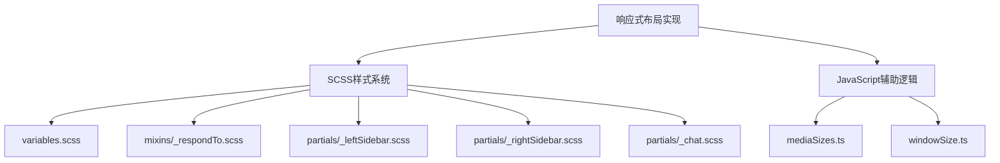

# 响应式布局实现

<cite>
**本文档引用的文件**  
- [variables.scss](file://src/scss/variables.scss)
- [mixins.scss](file://src/scss/mixins.scss)
- [_respondTo.scss](file://src/scss/mixins/_respondTo.scss)
- [_leftSidebar.scss](file://src/scss/partials/_leftSidebar.scss)
- [_rightSidebar.scss](file://src/scss/partials/_rightSidebar.scss)
- [_chat.scss](file://src/scss/partials/_chat.scss)
- [mediaSizes.ts](file://src/helpers/mediaSizes.ts)
- [windowSize.ts](file://src/helpers/windowSize.ts)
- [chat.ts](file://src/components/chat/chat.ts)
- [groupedLayout.ts](file://src/components/groupedLayout.ts)
</cite>

## 目录
1. [项目结构](#项目结构)
2. [核心响应式设计机制](#核心响应式设计机制)
3. [断点系统与媒体查询](#断点系统与媒体查询)
4. [弹性布局与网格布局应用](#弹性布局与网格布局应用)
5. [关键界面布局策略](#关键界面布局策略)
6. [响应式组件开发模式](#响应式组件开发模式)
7. [测试方法](#测试方法)

## 项目结构

tweb项目的响应式布局实现主要集中在`src/scss`目录下的样式文件中，特别是`mixins`和`partials`子目录。核心的响应式设计逻辑通过SCSS的mixin机制实现，主要文件包括`_respondTo.scss`定义的媒体查询系统和`variables.scss`中的断点变量。JavaScript层面的响应式处理则在`src/helpers`目录下的`mediaSizes.ts`和`windowSize.ts`中实现。



**图源**  
- [variables.scss](file://src/scss/variables.scss)
- [mixins/_respondTo.scss](file://src/scss/mixins/_respondTo.scss)
- [mediaSizes.ts](file://src/helpers/mediaSizes.ts)

**节源**  
- [variables.scss](file://src/scss/variables.scss)
- [mixins/_respondTo.scss](file://src/scss/mixins/_respondTo.scss)
- [mediaSizes.ts](file://src/helpers/mediaSizes.ts)

## 核心响应式设计机制

tweb项目采用SCSS mixin结合JavaScript状态管理的混合响应式设计模式。系统通过定义一系列语义化的媒体查询mixin来处理不同屏幕尺寸的布局调整，同时利用JavaScript监听窗口尺寸变化并更新应用状态。

核心机制包括：
- 基于SCSS mixin的媒体查询系统
- JavaScript驱动的屏幕尺寸检测
- CSS变量与动态类名结合的状态管理
- 弹性布局与固定布局的混合使用

系统通过`mediaSizes.ts`中的`WindowSize`类监听窗口尺寸变化，并根据预定义的断点更新应用的响应式状态，这些状态随后影响CSS类名的应用和样式表现。

**节源**  
- [mediaSizes.ts](file://src/helpers/mediaSizes.ts)
- [windowSize.ts](file://src/helpers/windowSize.ts)
- [chat.ts](file://src/components/chat/chat.ts)

## 断点系统与媒体查询

tweb项目定义了一套完整的断点系统，通过`_respondTo.scss`文件中的`respond-to` mixin实现。该系统基于三个主要断点值：`$small-screen` (600px)、`$medium-screen` (1275px)和`$large-screen` (1680px)。

### 断点定义

```scss
$small-screen: 600px;
$medium-screen: 1275px;
$large-screen: 1680px;
$floating-left-sidebar: 925px;
```

### 媒体查询mixin

`respond-to` mixin提供了一系列语义化的媒体查询条件：

```scss
@mixin respond-to($media) {
  @if $media == handhelds {
    @media only screen and (max-width: $small-screen) { @content; }
  } @else if $media == small-screens {
    @media only screen and (min-width: $small-screen + 1) { @content; }
  } @else if $media == medium-screens {
    @media only screen and (min-width: $medium-screen + 1) { @content; }
  } @else if $media == large-screens {
    @media only screen and (min-width: $large-screen + 1) { @content; }
  }
  // ... 其他断点条件
}
```

### 特殊断点场景

系统还定义了一些特殊场景的断点：
- `floating-left-sidebar`: 介于小屏幕和中等屏幕之间的特定宽度范围
- `esg-top` 和 `esg-bottom`: 基于屏幕高度的断点，用于处理特定UI元素的显示
- `until-floating-left-sidebar`: 用于处理左侧边栏浮动状态的断点

这些断点系统使得开发者可以使用语义化的名称而非具体的像素值来编写响应式样式，提高了代码的可读性和维护性。

**图源**  
- [variables.scss](file://src/scss/variables.scss#L10-L16)
- [_respondTo.scss](file://src/scss/mixins/_respondTo.scss#L7-L48)

**节源**  
- [variables.scss](file://src/scss/variables.scss#L9-L16)
- [_respondTo.scss](file://src/scss/mixins/_respondTo.scss#L7-L48)

## 弹性布局与网格布局应用

tweb项目主要采用弹性布局(Flexbox)来实现响应式设计，辅以传统的盒模型布局。系统没有使用CSS Grid布局，而是通过Flexbox的灵活特性来适应不同屏幕尺寸。

### 弹性布局应用场景

#### 主要容器布局

主界面采用三列布局，通过Flexbox实现：
- 左侧边栏：`#column-left`
- 主聊天区域：`.chat`
- 右侧边栏：`#column-right`

```scss
#column-left {
  flex: var(--current-width) 1 auto;
  max-width: calc($large-screen / 4);
}
```

#### 聊天输入区域

聊天输入区域使用嵌套的Flexbox布局：
```scss
.chat-input {
  display: flex;
  flex-direction: column;
  &-container {
    display: flex;
    align-items: flex-end;
    justify-content: center;
  }
}
```

### 布局调整策略

系统通过媒体查询在不同断点下调整Flexbox属性：

```scss
@include respond-to(handhelds) {
  #column-left {
    width: 100%;
    max-width: 100%;
  }
}

@include respond-to(floating-left-sidebar) {
  #column-left {
    position: fixed;
    width: 26.5rem;
  }
}
```

对于复杂的媒体组布局，系统使用`groupedLayout.ts`中的算法动态计算布局：

```typescript
class Layouter {
  private layoutTwoLeftRight(): ReturnType<Layouter['layout']> {
    const secondWidth = Math.min(
      Math.round(Math.max(
        0.4 * (this.maxWidth - this.spacing),
        (this.maxWidth - this.spacing) / this.ratios[0] /
          (1 / this.ratios[0] + 1 / this.ratios[1]))),
      this.maxWidth - this.spacing - minimalWidth);
    // ... 布局计算逻辑
  }
}
```

**图源**  
- [_leftSidebar.scss](file://src/scss/partials/_leftSidebar.scss#L12-L22)
- [_chat.scss](file://src/scss/partials/_chat.scss#L43-L48)
- [groupedLayout.ts](file://src/components/groupedLayout.ts#L137-L164)

**节源**  
- [_leftSidebar.scss](file://src/scss/partials/_leftSidebar.scss)
- [_chat.scss](file://src/scss/partials/_chat.scss)
- [groupedLayout.ts](file://src/components/groupedLayout.ts)

## 关键界面布局策略

### 聊天窗口布局调整

聊天窗口在不同屏幕尺寸下采用不同的布局策略：

#### 移动设备 (handhelds)

在移动设备上，聊天窗口占据全屏宽度，其他侧边栏被隐藏或平移出屏幕：

```scss
@include respond-to(handhelds) {
  #column-left {
    body:not(.is-left-column-shown) & {
      transform: translate3d(-25vw, 0, 0);
      filter: brightness(80%);
    }
  }
}
```

#### 中等屏幕 (floating-left-sidebar)

在中等屏幕尺寸下，左侧边栏采用浮动设计：

```scss
@include respond-to(floating-left-sidebar) {
  #column-left {
    position: fixed;
    left: 0;
    top: 0;
    width: 26.5rem;
    transform: translate3d(-5rem, 0, 0);
  }
}
```

#### 大屏幕 (no-floating-left-sidebar)

在大屏幕上，左侧边栏固定显示，采用可折叠设计：

```scss
@include respond-to(no-floating-left-sidebar) {
  &.is-collapsed {
    width: var(--sidebar-collapsed-width);
    >.sidebar-slider {
      overflow: hidden;
      width: 100%;
    }
  }
}
```

### 侧边栏布局策略

#### 左侧边栏

左侧边栏根据屏幕宽度采用三种显示模式：
1. **全屏模式**：在小屏幕上，侧边栏可以滑入滑出
2. **浮动模式**：在中等屏幕上，侧边栏固定在左侧
3. **折叠模式**：在大屏幕上，侧边栏可以折叠为窄栏

```scss
&.is-collapsed {
  width: var(--sidebar-collapsed-width);
  .chatlist-chat {
    padding-inline-end: 0;
    .row-row {
      display: none;
    }
  }
}
```

#### 右侧边栏

右侧边栏的显示策略与左侧类似，但在小屏幕上完全隐藏：

```scss
@include respond-to(handhelds) {
  body:not(.is-right-column-shown) & {
    transform: translate3d(100vw, 0, 0);
  }
}
```

系统还通过CSS变量动态控制侧边栏宽度：

```scss
:root {
  --sidebar-collapsed-width: 80px;
  --sidebar-max-width: #{calc($large-screen / 4)};
}
```

**图源**  
- [_leftSidebar.scss](file://src/scss/partials/_leftSidebar.scss#L243-L251)
- [_rightSidebar.scss](file://src/scss/partials/_rightSidebar.scss#L15-L18)
- [_chat.scss](file://src/scss/partials/_chat.scss#L627-L634)

**节源**  
- [_leftSidebar.scss](file://src/scss/partials/_leftSidebar.scss)
- [_rightSidebar.scss](file://src/scss/partials/_rightSidebar.scss)
- [_chat.scss](file://src/scss/partials/_chat.scss)

## 响应式组件开发模式

tweb项目的响应式组件开发遵循一套标准化的模式，结合了SCSS mixin、CSS变量和JavaScript状态管理。

### SCSS mixin使用规范

开发者应使用`respond-to` mixin而非直接编写媒体查询：

```scss
// 推荐做法
@include respond-to(handhelds) {
  width: 100%;
}

// 不推荐做法
@media (max-width: 600px) {
  width: 100%;
}
```

### CSS变量应用

系统广泛使用CSS变量来实现动态样式：

```scss
--current-width: var(--current-sidebar-left-width, #{$max-width});
--padding-horizontal: .6875rem;
--chat-input-size: 3.375rem;
```

这些变量可以在JavaScript中动态修改，实现更灵活的响应式效果。

### JavaScript状态集成

组件通过监听媒体查询状态来调整行为：

```typescript
class Chat {
  private onScreenResize = () => {
    const innerWidth = window.innerWidth;
    let activeScreen = this.screenSizes[0].key;
    
    for(let i = this.screenSizes.length - 1; i >= 0; --i) {
      if(this.screenSizes[i].value < innerWidth) {
        activeScreen = (this.screenSizes[i + 1] || this.screenSizes[i]).key;
        break;
      }
    }
    
    this.isMobile = activeScreen === ScreenSize.mobile;
    this.isLessThanFloatingLeftSidebar = innerWidth <= FLOATING_LEFT_SIDEBAR_SIZE;
  }
}
```

### 组件开发最佳实践

1. **使用语义化mixin名称**：优先使用`handhelds`、`small-screens`等语义化名称
2. **避免硬编码尺寸**：使用SCSS变量而非具体像素值
3. **渐进式增强**：先实现基础布局，再通过媒体查询添加增强样式
4. **性能优化**：避免在媒体查询中使用复杂的CSS选择器

**节源**  
- [_respondTo.scss](file://src/scss/mixins/_respondTo.scss)
- [mediaSizes.ts](file://src/helpers/mediaSizes.ts#L126-L159)
- [chat.ts](file://src/components/chat/chat.ts)

## 测试方法

tweb项目的响应式布局测试采用多种方法结合的方式，确保在不同设备和屏幕尺寸下的正确显示。

### 手动测试

开发者应使用浏览器开发者工具的设备模拟功能，测试以下断点：
- 600px (small-screen)
- 925px (floating-left-sidebar)
- 1275px (medium-screen)
- 1680px (large-screen)

### 自动化测试

系统通过JavaScript检测屏幕尺寸变化并更新状态：

```typescript
class WindowSize {
  private setDimensions() {
    const w = this.viewport;
    this._width((w as VisualViewport).width || (w as Window).innerWidth);
    this._height((w as VisualViewport).height || (w as Window).innerHeight);
  }
}
```

### 测试覆盖要点

1. **断点过渡测试**：确保在断点切换时布局平滑过渡
2. **方向切换测试**：测试横屏和竖屏切换时的布局表现
3. **字体缩放测试**：测试不同字体缩放比例下的布局适应性
4. **性能测试**：确保响应式调整不会导致性能问题

### 调试技巧

1. 使用`animation-level`类临时禁用动画，便于观察布局变化
2. 通过控制台修改CSS变量值，快速测试不同尺寸效果
3. 使用`body.is-right-column-shown`等类名手动触发不同状态

**节源**  
- [windowSize.ts](file://src/helpers/windowSize.ts)
- [mediaSizes.ts](file://src/helpers/mediaSizes.ts)