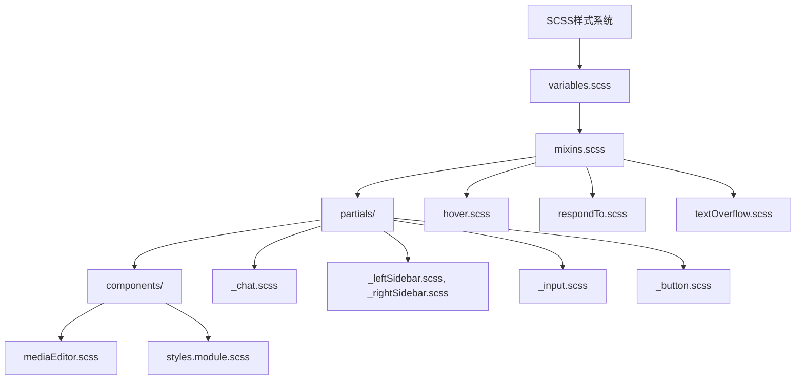

# 样式架构

<cite>
**本文档中引用的文件**  
- [style.scss](file://src/scss/style.scss)
- [variables.scss](file://src/scss/variables.scss)
- [mixins.scss](file://src/scss/mixins.scss)
- [respondTo.scss](file://src/scss/mixins/_respondTo.scss)
- [hover.scss](file://src/scss/mixins/_hover.scss)
- [chat.scss](file://src/scss/partials/_chat.scss)
- [leftSidebar.scss](file://src/scss/partials/_leftSidebar.scss)
- [rightSidebar.scss](file://src/scss/partials/_rightSidebar.scss)
- [mediaEditor.scss](file://src/components/mediaEditor/mediaEditor.scss)
- [simpleFormField/styles.module.scss](file://src/components/simpleFormField/styles.module.scss)
- [dynamicVirtualList/styles.module.scss](file://src/components/dynamicVirtualList/styles.module.scss)
</cite>

## 目录
1. [项目结构](#项目结构)
2. [SCSS模块化样式系统](#scss模块化样式系统)
3. [变量与混合宏](#变量与混合宏)
4. [BEM命名约定](#bem命名约定)
5. [主题系统与CSS变量](#主题系统与css变量)
6. [响应式设计实现](#响应式设计实现)
7. [关键组件样式组织](#关键组件样式组织)
8. [样式开发最佳实践](#样式开发最佳实践)

## 项目结构

tweb项目的样式架构采用模块化SCSS设计，主要样式文件位于`src/scss`目录下。项目通过SCSS的模块化特性实现了样式的可维护性和可扩展性。



**Diagram sources**
- [style.scss](file://src/scss/style.scss)
- [variables.scss](file://src/scss/variables.scss)
- [mixins.scss](file://src/scss/mixins.scss)

**Section sources**
- [style.scss](file://src/scss/style.scss)
- [variables.scss](file://src/scss/variables.scss)

## SCSS模块化样式系统

tweb项目采用SCSS作为样式预处理器，通过模块化设计实现了样式的可维护性和可扩展性。样式系统主要由变量、混合宏、嵌套规则和部分文件组成。

项目通过`@import`指令将不同的SCSS模块组合在一起，形成完整的样式表。主样式文件`style.scss`导入了所有必要的模块，包括变量、混合宏和各个组件的样式部分。

```scss
@import "variables";
@import "mixins";
@import "components/prism";
@import "tgico";
@import "fonts/roboto";
@import "partials/input";
@import "partials/button";
@import "partials/chat";
```

这种模块化设计使得样式代码更加组织化，便于团队协作和维护。

**Section sources**
- [style.scss](file://src/scss/style.scss)
- [variables.scss](file://src/scss/variables.scss)
- [mixins.scss](file://src/scss/mixins.scss)

## 变量与混合宏

### 变量系统

tweb项目通过`variables.scss`文件定义了全局变量，包括颜色、尺寸、断点等。这些变量为整个项目提供了统一的设计语言。

```scss
$small-screen: 600px;
$medium-screen: 1275px;
$large-screen: 1680px;
$border-radius: 8px;
$border-radius-medium: 10px;
$hover-alpha: .08;
```

项目还使用CSS自定义属性（CSS变量）在`:root`选择器中定义了大量样式变量，这些变量可以在运行时动态修改，支持主题切换等功能。

```scss
:root {
  --vh: 1vh;
  --hover-alpha: #{$hover-alpha};
  --transition-standard-easing: cubic-bezier(.4, .0, .2, 1);
  --messages-container-width: #{$messages-container-width};
}
```

### 混合宏系统

项目定义了多个混合宏来复用样式代码，提高开发效率。

#### 响应式混合宏

`respondTo`混合宏用于处理不同屏幕尺寸的响应式设计：

```scss
@mixin respond-to($media) {
  @if $media == handhelds {
    @media only screen and (max-width: $small-screen) { @content; }
  } @else if $media == not-handhelds {
    @media only screen and (min-width: $small-screen + 1) { @content; }
  }
}
```

#### 悬停效果混合宏

`hover`混合宏用于处理元素的悬停效果：

```scss
@mixin hover($color: null, $property: null, $use-transition: false) {
  html.no-touch &:hover,
  html.no-touch &:active {
    @if $property != null {
      @if $use-transition {
        transition: .2s #{$property};
      }
      #{$property}: $color;
    }
    @content;
  }
}
```

#### 颜色分割混合宏

`splitColor`混合宏用于生成不同状态的颜色变量：

```scss
@mixin splitColor($property, $color, $light: true, $dark: true, $rgb: false, $alpha: $hover-alpha) {
  --#{$property}: #{$color};
  $lightened: hover-color($color);
  @if $light != false {
    --light-#{$property}: #{$lightened};
  }
  $darkened: darken($color, $alpha * 100);
  @if $dark != false {
    --dark-#{$property}: #{$darkened};
  }
  @if $rgb != false {
    --#{$property}-rgb: #{red($color)}, #{green($color)}, #{blue($color)};
  }
}
```

**Section sources**
- [variables.scss](file://src/scss/variables.scss)
- [mixins.scss](file://src/scss/mixins.scss)
- [respondTo.scss](file://src/scss/mixins/_respondTo.scss)
- [hover.scss](file://src/scss/mixins/_hover.scss)

## BEM命名约定

tweb项目在组件样式中应用了BEM（Block, Element, Modifier）命名约定，以提高样式的可读性和可维护性。

### 块（Block）

块是独立的、可复用的组件。在项目中，块通常代表一个完整的UI组件。

```scss
.media-editor {
  // 块样式
}
```

### 元素（Element）

元素是块的组成部分，使用双下划线（__）与块名连接。

```scss
.media-editor__overlay {
  // 元素样式
}

.media-editor__container {
  // 元素样式
}
```

### 修饰符（Modifier）

修饰符用于改变块或元素的外观或行为，使用双连字符（--）连接。

```scss
.media-editor__overlay--hidden {
  // 修饰符样式
}

.Container {
  &.clickable {
    // 修饰符样式
  }
  
  &.error {
    // 修饰符样式
  }
}
```

### 嵌套结构

项目使用SCSS的嵌套特性来组织BEM结构，使代码更加清晰：

```scss
.media-editor {
  &__overlay {
    z-index: 4;
    position: fixed;
    
    &--hidden {
      opacity: 0;
    }
  }
  
  &__container {
    position: relative;
  }
  
  &__main-canvas {
    position: relative;
  }
}
```

这种命名约定确保了样式的可预测性和可维护性，避免了样式冲突。

**Section sources**
- [mediaEditor.scss](file://src/components/mediaEditor/mediaEditor.scss)
- [simpleFormField/styles.module.scss](file://src/components/simpleFormField/styles.module.scss)
- [dynamicVirtualList/styles.module.scss](file://src/components/dynamicVirtualList/styles.module.scss)

## 主题系统与CSS变量

tweb项目通过CSS变量实现了动态主题切换功能。主题系统基于`:root`选择器中的CSS自定义属性，允许在运行时动态修改样式。

### 主题变量定义

项目在`:root`选择器中定义了大量的CSS变量，这些变量构成了主题系统的基础：

```scss
:root {
  --body-background-color: #fff;
  --background-color: var(--background-color-true);
  --border-color: #dfe1e5;
  --scrollbar-color: rgba(0, 0, 0, .2);
  --primary-color: #3390ec;
  --primary-text-color: #000;
  --secondary-text-color: #707579;
  --danger-color: #ff595a;
  --light-primary-color: rgba(51, 144, 236, .08);
  --light-danger-color: rgba(255, 89, 90, .08);
}
```

### 夜间主题实现

夜间主题通过`.night`类来切换，覆盖了日间主题的变量值：

```scss
.night {
  --body-background-color: #181818;
  --background-color: var(--background-color-true);
  --border-color: #0f0f0f;
  --scrollbar-color: rgba(255, 255, 255, .2);
  --primary-text-color: #fff;
  --secondary-text-color: #707579;
  --light-primary-color: rgba(255, 255, 255, .08);
  --light-danger-color: rgba(255, 255, 255, .08);
}
```

### 动态主题切换

主题切换通过JavaScript动态添加或移除`.night`类来实现，CSS变量会自动应用新的值，无需重新加载页面。

```scss
.chat {
  --message-time-color: var(--secondary-text-color);
  --message-checkbox-color: #61c642;
  --message-primary-color: var(--primary-color);
}

.night .chat {
  --message-time-color: var(--secondary-text-color);
  --message-checkbox-color: var(--primary-color);
  --message-status-color: var(--secondary-color);
}
```

这种基于CSS变量的主题系统具有以下优势：
- **性能优越**：只需修改一个类名即可切换整个主题
- **易于维护**：所有主题变量集中管理
- **灵活性高**：可以轻松添加新的主题变体
- **运行时可变**：支持用户在运行时切换主题

**Section sources**
- [style.scss](file://src/scss/style.scss)
- [variables.scss](file://src/scss/variables.scss)

## 响应式设计实现

tweb项目通过多种技术实现了响应式设计，确保在不同设备上都能提供良好的用户体验。

### 媒体查询混合宏

项目使用`respondTo`混合宏来处理不同屏幕尺寸的样式：

```scss
@mixin respond-to($media) {
  @if $media == handhelds {
    @media only screen and (max-width: $small-screen) { @content; }
  } @else if $media == small-screens {
    @media only screen and (min-width: $small-screen + 1) { @content; }
  } @else if $media == medium-screens {
    @media only screen and (min-width: $medium-screen + 1) { @content; }
  } @else if $media == large-screens {
    @media only screen and (min-width: $large-screen + 1) { @content; }
  } @else if $media == not-handhelds {
    @media only screen and (min-width: $small-screen + 1) { @content; }
  }
}
```

### 断点定义

项目定义了多个断点来适应不同设备：

```scss
$small-screen: 600px;
$medium-screen: 1275px;
$large-screen: 1680px;
$floating-left-sidebar: 925px;
```

### 弹性布局

项目广泛使用Flexbox布局来实现弹性设计：

```scss
.whole {
  min-height: 100%;
  width: 100%;
  margin: 0 auto;
  max-width: $large-screen;
}

.chat-input-container {
  display: flex;
  align-items: flex-end;
  justify-content: center;
  max-width: var(--chat-input-max-width);
  margin: 0 auto;
  width: 100%;
  padding: 0 var(--padding-horizontal);
  flex: 0 0 auto;
  position: relative;
}
```

### 移动端适配

针对移动端设备，项目使用了特定的样式规则：

```scss
@include respond-to(handhelds) {
  --right-column-width: 100vw;
  --esg-sticker-size: 68px;
  --popup-sticker-size: 68px;
  --round-video-size: 240px;
  
  .chat-input-size: #{$chat-input-handhelds-size};
  .chat-input-padding: #{$chat-padding-handhelds};
  .chat-input-inner-padding: #{$chat-input-inner-padding-handhelds};
}
```

### 安全区域适配

项目还考虑了移动设备的安全区域：

```scss
@supports(padding: unquote('max(0px)')) {
  html {
    padding: 0 unquote('min(16px, env(safe-area-inset-right))') 0 unquote('min(16px, env(safe-area-inset-left))');
  }
}
```

这种响应式设计确保了应用在各种设备上都能提供一致的用户体验。

**Section sources**
- [style.scss](file://src/scss/style.scss)
- [respondTo.scss](file://src/scss/mixins/_respondTo.scss)
- [leftSidebar.scss](file://src/scss/partials/_leftSidebar.scss)
- [rightSidebar.scss](file://src/scss/partials/_rightSidebar.scss)

## 关键组件样式组织

### 聊天界面样式

聊天界面是tweb项目的核心组件之一，其样式组织体现了模块化设计原则。

```scss
.chat-input {
  display: flex;
  width: 100%;
  max-width: 100%;
  flex-direction: column;
  flex: 0 0 auto;
  position: relative;
  
  &-container {
    --padding-horizontal: var(--chat-input-padding);
    display: flex;
    align-items: flex-end;
    justify-content: center;
    max-width: var(--chat-input-max-width);
    margin: 0 auto;
    width: 100%;
    padding: 0 var(--padding-horizontal);
    flex: 0 0 auto;
    position: relative;
  }
}
```

聊天界面样式的特点：
- 使用CSS变量控制尺寸和间距
- 采用Flexbox布局实现弹性设计
- 通过嵌套规则组织子组件样式
- 支持响应式设计

### 侧边栏样式

侧边栏组件的样式组织体现了复杂的布局需求：

```scss
#column-left {
  flex-direction: column;
  --current-width: var(--current-sidebar-left-width, #{$max-width});
  flex: var(--current-width) 1 auto;
  max-width: #{$max-width};
  width: var(--current-width);
}

#column-right {
  position: relative;
  overflow: unset;
  
  @include respond-to(handhelds) {
    body:not(.is-right-column-shown) & {
      transform: translate3d(100vw, 0, 0);
    }
  }
}
```

侧边栏样式的特点：
- 使用CSS变量控制宽度和位置
- 支持折叠和展开状态
- 实现了复杂的动画效果
- 考虑了不同屏幕尺寸的适配

### 媒体编辑器样式

媒体编辑器组件展示了复杂的UI布局：

```scss
.media-editor {
  &__overlay {
    position: fixed;
    left: 0;
    top: 0;
    width: 100%;
    height: 100%;
    background-color: var(--body-background-color);
    display: flex;
    align-items: center;
    justify-content: center;
  }
  
  &__container {
    position: relative;
    width: 100%;
    height: 100%;
    max-width: 1682px;
    max-height: 1080px;
    background-color: #000000;
    box-shadow: 0 0 4px 1px rgba(0, 0, 0, .25);
    display: flex;
  }
  
  &__toolbar {
    background-color: #212121;
    flex: 400px 0 0;
    display: flex;
    flex-direction: column;
    overflow: hidden;
  }
}
```

媒体编辑器样式的特点：
- 使用BEM命名约定
- 实现了复杂的布局结构
- 支持桌面和移动端的不同布局
- 使用CSS变量控制主题颜色

**Section sources**
- [chat.scss](file://src/scss/partials/_chat.scss)
- [leftSidebar.scss](file://src/scss/partials/_leftSidebar.scss)
- [rightSidebar.scss](file://src/scss/partials/_rightSidebar.scss)
- [mediaEditor.scss](file://src/components/mediaEditor/mediaEditor.scss)

## 样式开发最佳实践

### 避免样式冲突

tweb项目通过以下方式避免样式冲突：

1. **使用CSS模块**：在组件级别使用CSS模块，确保样式作用域隔离
2. **BEM命名约定**：采用BEM命名规范，避免类名冲突
3. **CSS变量**：使用CSS变量而不是硬编码值，提高样式的可维护性
4. **嵌套限制**：限制SCSS嵌套深度，避免生成过于具体的选择器

### 提高可维护性

项目通过以下方式提高样式的可维护性：

1. **模块化设计**：将样式分解为小的、可复用的模块
2. **变量集中管理**：将所有设计变量集中在一个文件中
3. **混合宏复用**：创建可复用的混合宏，减少重复代码
4. **文档化**：为复杂的样式规则添加注释，便于理解

### 性能优化

项目考虑了样式性能优化：

1. **减少重排重绘**：使用transform和opacity等属性实现动画
2. **合理使用选择器**：避免使用过于复杂的选择器
3. **按需加载**：将样式按功能模块分割，按需加载
4. **压缩输出**：在构建过程中压缩CSS文件

### 开发规范

建议遵循以下开发规范：

1. **遵循BEM命名约定**：确保类名的可读性和一致性
2. **使用CSS变量**：优先使用CSS变量而不是硬编码值
3. **合理组织文件结构**：按照功能或组件组织样式文件
4. **添加注释**：为复杂的样式规则添加必要的注释
5. **考虑可访问性**：确保颜色对比度和交互元素的可访问性

这些最佳实践确保了tweb项目样式的高质量和可维护性。

**Section sources**
- [style.scss](file://src/scss/style.scss)
- [variables.scss](file://src/scss/variables.scss)
- [mixins.scss](file://src/scss/mixins.scss)