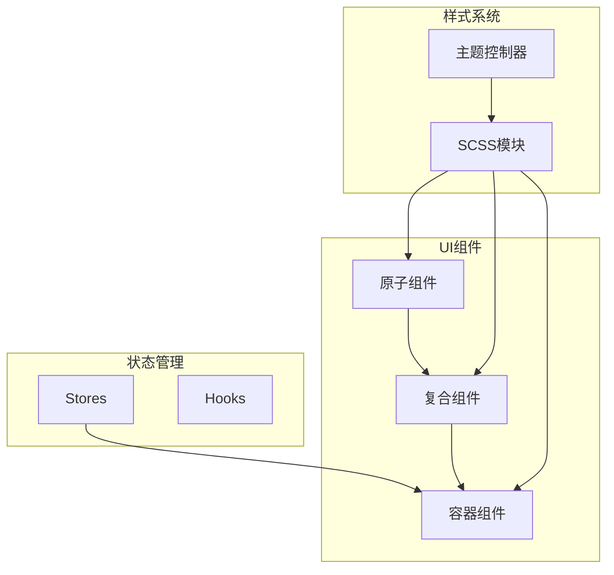
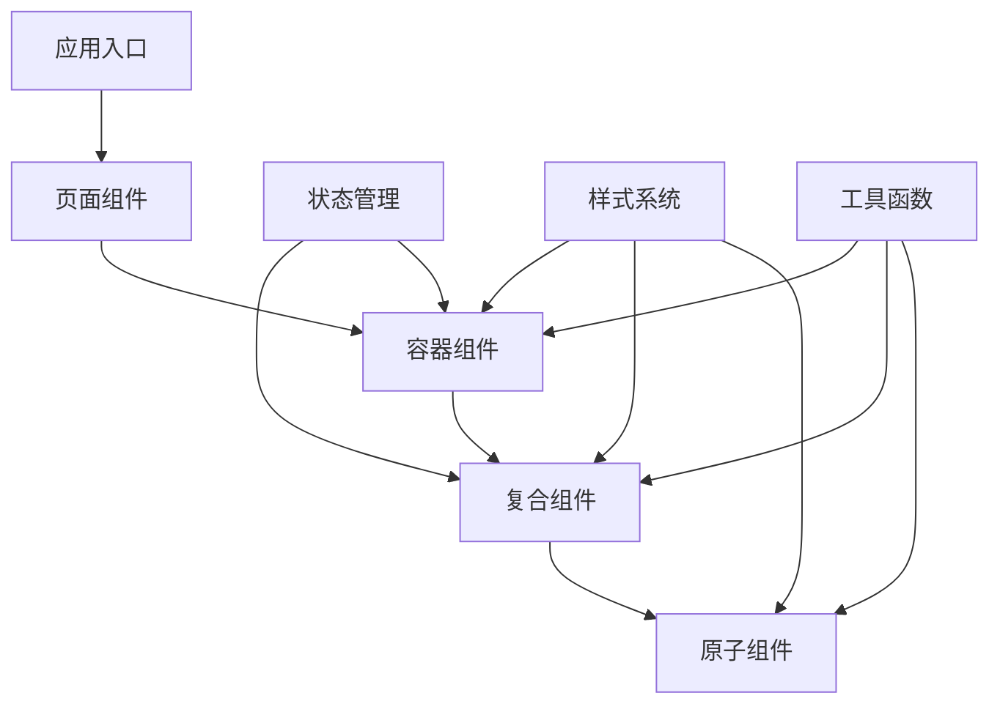
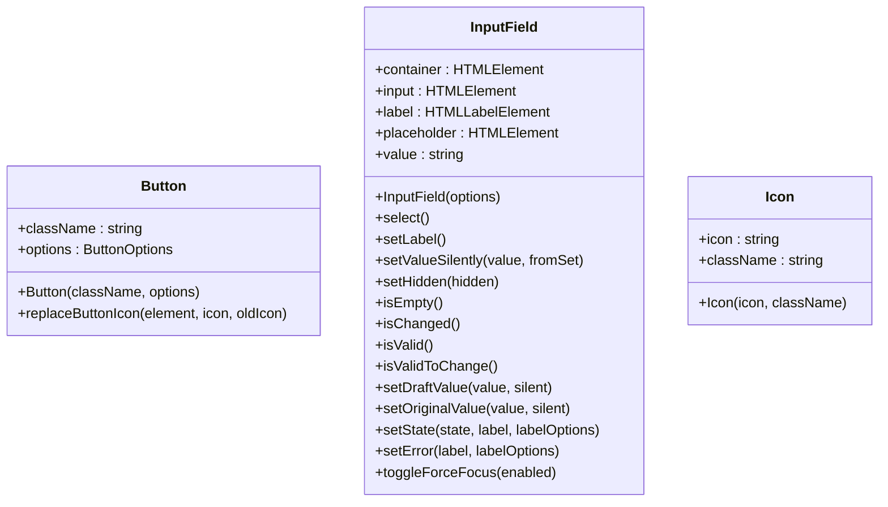
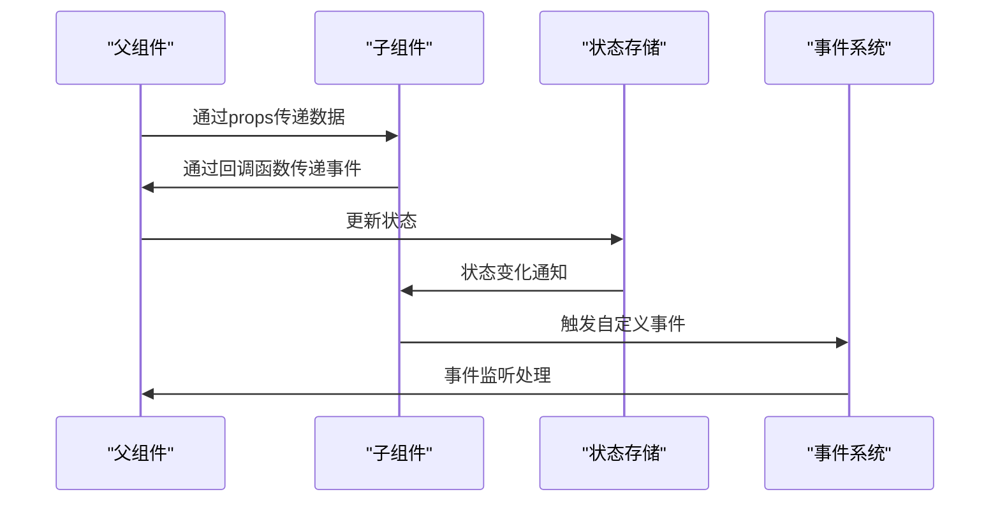
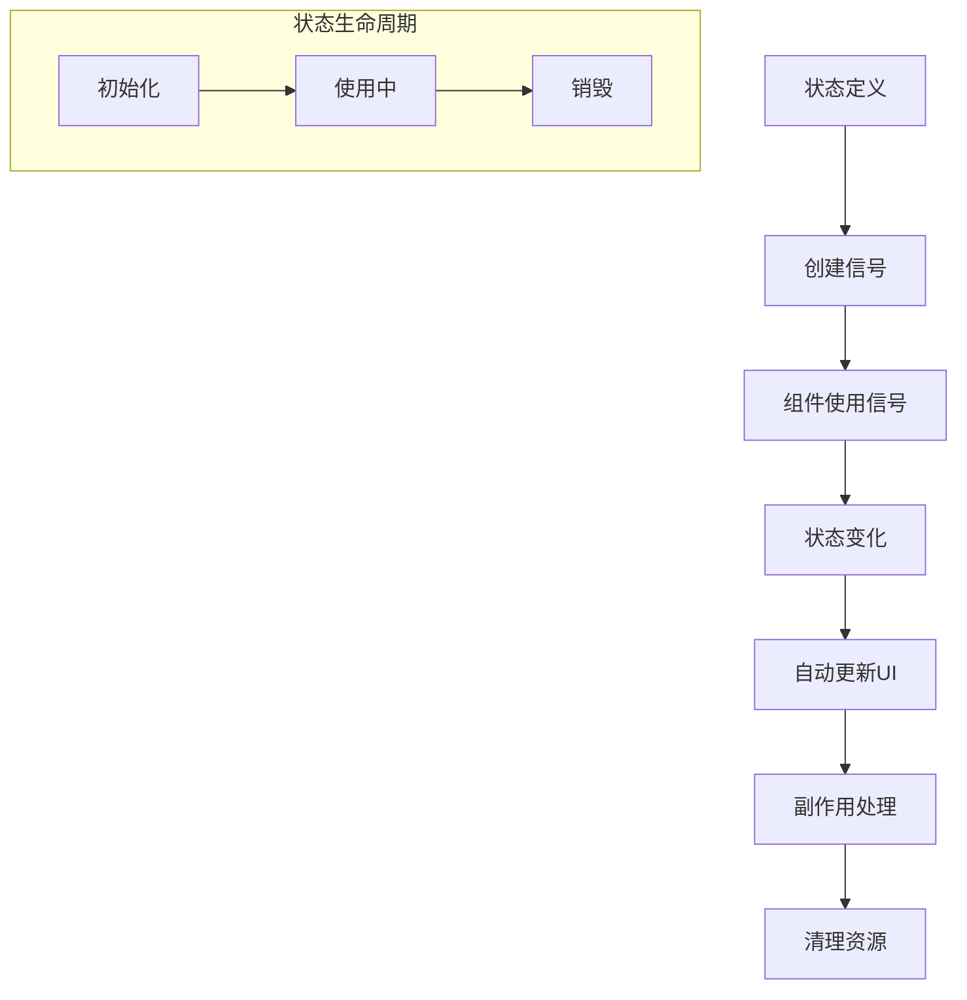
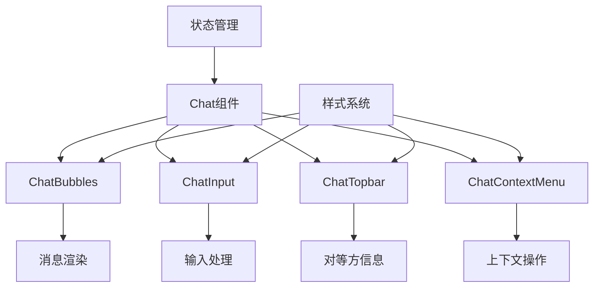
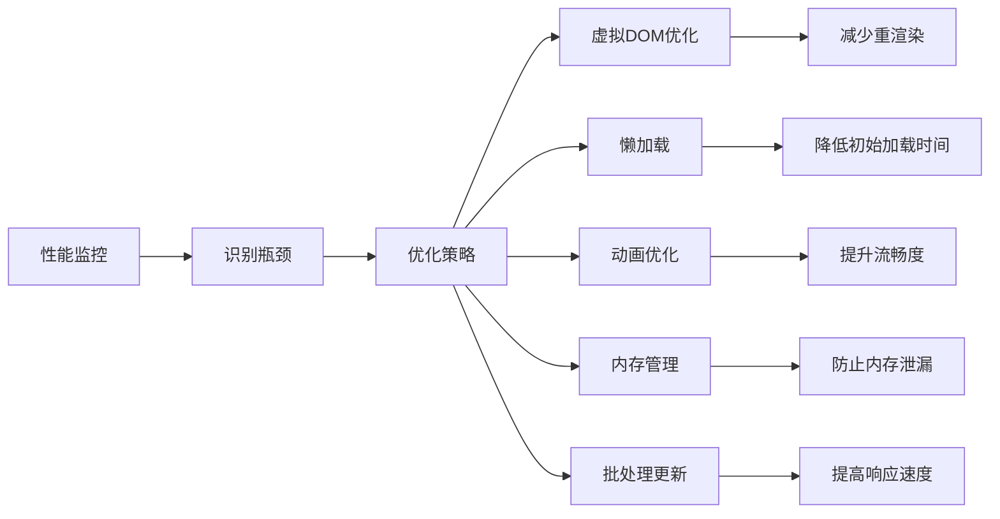

# 组件架构

<cite>
**本文档引用的文件**
- [index.ts](file://src/index.ts)
- [wrappers.ts](file://src/components/wrappers.ts)
- [button.ts](file://src/components/button.ts)
- [inputField.ts](file://src/components/inputField.ts)
- [chat.ts](file://src/components/chat/chat.ts)
- [superTabProvider.tsx](file://src/components/solidJsTabs/superTabProvider.tsx)
- [tabs.ts](file://src/components/solidJsTabs/tabs.ts)
</cite>

## 目录
1. [简介](#简介)
2. [项目结构](#项目结构)
3. [核心组件](#核心组件)
4. [架构概述](#架构概述)
5. [详细组件分析](#详细组件分析)
6. [依赖分析](#依赖分析)
7. [性能考虑](#性能考虑)
8. [故障排除指南](#故障排除指南)
9. [结论](#结论)
10. [附录](#附录)（如有必要）

## 简介
本文档详细描述了tweb项目的组件化架构设计，重点介绍基于Solid.js的UI组件体系。文档涵盖了组件层次结构、复用模式、通信机制、状态管理、生命周期控制以及性能优化策略。同时，文档还记录了组件分类规范、开发最佳实践、SCSS模块化样式系统集成、响应式设计实现和跨浏览器兼容性处理。

## 项目结构
tweb项目采用模块化的组件架构，主要分为以下几个部分：
- `components`：包含所有UI组件，按功能和类型组织
- `scss`：样式文件，包括SCSS模块和全局样式
- `lib`：核心库和管理器
- `stores`：状态管理
- `hooks`：自定义Solid.js钩子

**图表来源**
- [index.ts](file://src/index.ts#L1-L682)
- [wrappers.ts](file://src/components/wrappers.ts#L1-L122)

**章节来源**
- [index.ts](file://src/index.ts#L1-L682)

## 核心组件
tweb项目的核心组件基于Solid.js构建，采用组件化设计模式。主要核心组件包括：
- **Chat组件**：聊天界面的主要容器，管理消息气泡、输入框、顶部栏等
- **Button组件**：可配置的按钮组件，支持图标、文本、禁用状态等
- **InputField组件**：富文本输入框，支持占位符、标签、验证等功能
- **Tab组件**：基于Solid.js的标签页系统，支持动态加载和状态管理

**章节来源**
- [chat.ts](file://src/components/chat/chat.ts#L1-L800)
- [button.ts](file://src/components/button.ts#L1-L60)
- [inputField.ts](file://src/components/inputField.ts#L1-L800)

## 架构概述
tweb项目采用基于Solid.js的组件化架构，整体架构分为以下几个层次：

**图表来源**
- [index.ts](file://src/index.ts#L1-L682)
- [chat.ts](file://src/components/chat/chat.ts#L1-L800)

## 详细组件分析

### 组件分类与规范
tweb项目中的组件分为三类：原子组件、复合组件和容器组件。

#### 原子组件
原子组件是最基本的UI元素，不可再分解。包括：
- 按钮(Button)
- 输入框(InputField)
- 图标(Icon)
- 标签(Label)

**图表来源**
- [button.ts](file://src/components/button.ts#L1-L60)
- [inputField.ts](file://src/components/inputField.ts#L1-L800)

#### 复合组件
复合组件由多个原子组件组合而成，具有特定功能。包括：
- 聊天气泡(ChatBubble)
- 顶部栏(Topbar)
- 上下文菜单(ContextMenu)
- 搜索组件(Search)

#### 容器组件
容器组件负责管理状态和数据流，协调多个复合组件的工作。包括：
- Chat组件
- Tab容器
- 弹窗(Popup)组件

### 组件通信机制
tweb项目采用多种方式实现组件间的通信：

**图表来源**
- [chat.ts](file://src/components/chat/chat.ts#L1-L800)
- [superTabProvider.tsx](file://src/components/solidJsTabs/superTabProvider.tsx#L1-L27)

### 状态传递方式
tweb项目使用Solid.js的响应式系统进行状态管理：

**图表来源**
- [chat.ts](file://src/components/chat/chat.ts#L1-L800)
- [tabs.ts](file://src/components/solidJsTabs/tabs.ts#L1-L77)

## 依赖分析
tweb项目的组件依赖关系如下：

**图表来源**
- [chat.ts](file://src/components/chat/chat.ts#L1-L800)
- [index.ts](file://src/index.ts#L1-L682)

**章节来源**
- [chat.ts](file://src/components/chat/chat.ts#L1-L800)

## 性能考虑
tweb项目在组件架构设计中考虑了多项性能优化策略：

1. **虚拟DOM优化**：利用Solid.js的细粒度响应式系统，最小化DOM更新
2. **懒加载**：对非关键组件采用动态导入
3. **动画优化**：使用CSS动画而非JavaScript动画
4. **内存管理**：及时清理不再使用的组件和事件监听器
5. **批处理更新**：合并多个状态更新以减少重渲染次数

**图表来源**
- [chat.ts](file://src/components/chat/chat.ts#L1-L800)
- [inputField.ts](file://src/components/inputField.ts#L1-L800)

## 故障排除指南
在开发和使用tweb组件时可能遇到的常见问题及解决方案：

### 组件不渲染
- 检查组件是否正确导入
- 确认父组件的props传递是否正确
- 检查状态管理是否正常工作

### 样式不生效
- 确认SCSS模块是否正确导入
- 检查CSS类名是否正确应用
- 验证主题控制器是否正常工作

### 事件不触发
- 检查事件监听器是否正确绑定
- 确认事件冒泡是否被阻止
- 验证组件生命周期是否正确

**章节来源**
- [chat.ts](file://src/components/chat/chat.ts#L1-L800)
- [button.ts](file://src/components/button.ts#L1-L60)
- [inputField.ts](file://src/components/inputField.ts#L1-L800)

## 结论
tweb项目的组件架构基于Solid.js构建，采用模块化、分层的设计理念。通过原子组件、复合组件和容器组件的合理划分，实现了高内聚、低耦合的组件体系。项目充分利用Solid.js的响应式系统进行状态管理，结合SCSS模块化样式系统，实现了高效的UI开发和维护。整体架构具有良好的可扩展性和可维护性，为后续功能开发提供了坚实的基础。

## 附录
### 组件开发最佳实践
1. **单一职责原则**：每个组件只负责一个功能
2. **可复用性**：设计通用组件，提高代码复用率
3. **可测试性**：编写单元测试，确保组件质量
4. **文档化**：为组件编写详细的使用文档
5. **性能优先**：在设计阶段考虑性能影响

### 设计原则
1. **一致性**：保持UI风格和交互模式的一致性
2. **可访问性**：确保组件对所有用户都可用
3. **响应式**：适配不同屏幕尺寸和设备
4. **国际化**：支持多语言环境
5. **可定制性**：提供足够的配置选项