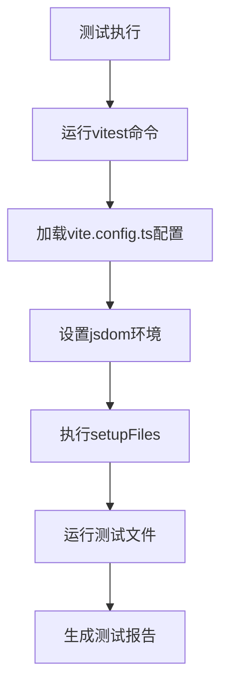
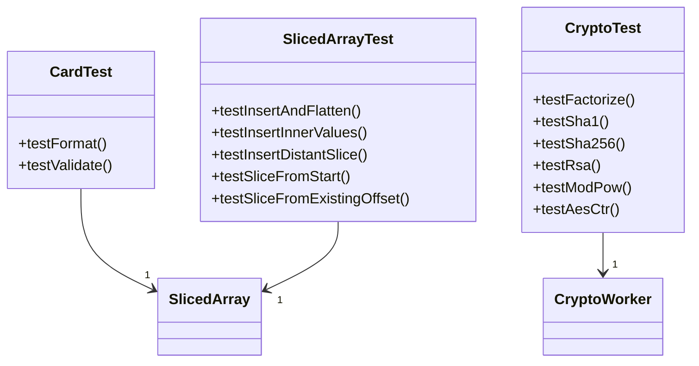
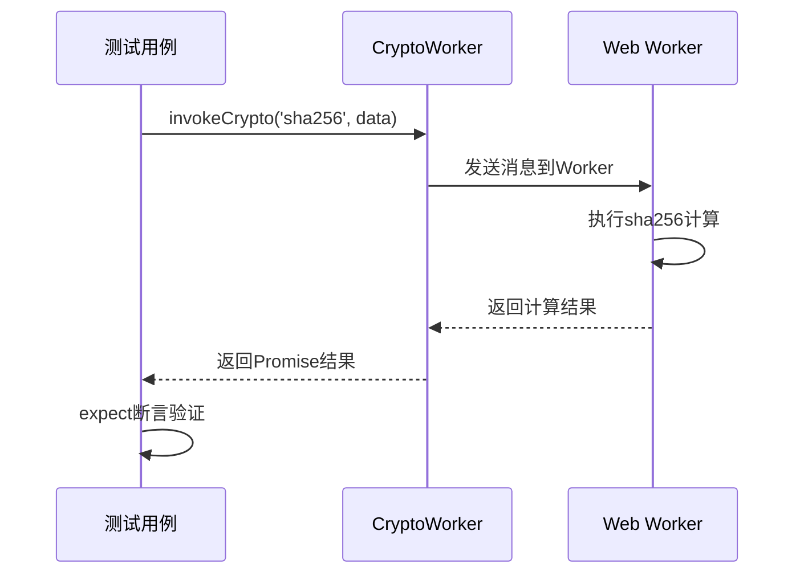

# 测试策略

<cite>
**本文档中引用的文件**   
- [package.json](file://package.json)
- [vite.config.ts](file://vite.config.ts)
- [src/tests/setup.ts](file://src/tests/setup.ts)
- [src/tests/cards.test.ts](file://src/tests/cards.test.ts)
- [src/tests/crypto_methods.test.ts](file://src/tests/crypto_methods.test.ts)
- [src/tests/solid.test.ts](file://src/tests/solid.test.ts)
- [src/tests/slicedArray.test.ts](file://src/tests/slicedArray.test.ts)
- [src/tests/splitString.test.ts](file://src/tests/splitString.test.ts)
- [src/helpers/slicedArray.ts](file://src/helpers/slicedArray.ts)
- [src/lib/crypto/crypto.worker.ts](file://src/lib/crypto/crypto.worker.ts)
</cite>

## 目录
1. [简介](#简介)
2. [测试框架与配置](#测试框架与配置)
3. [单元测试](#单元测试)
4. [集成测试](#集成测试)
5. [端到端测试](#端到端测试)
6. [测试用例编写指南与最佳实践](#测试用例编写指南与最佳实践)
7. [测试覆盖率目标与监控](#测试覆盖率目标与监控)
8. [Mock策略与测试数据管理](#mock策略与测试数据管理)
9. [持续集成中的测试执行流程](#持续集成中的测试执行流程)
10. [性能测试与安全测试指导原则](#性能测试与安全测试指导原则)

## 简介
本测试策略文档旨在为tweb项目建立全面的测试框架，涵盖单元测试、集成测试和端到端测试。文档详细说明了测试框架的选择与配置、测试用例的编写指南、测试覆盖率目标以及在持续集成环境中的执行流程。通过实施本策略，确保代码质量、功能正确性和系统稳定性，为用户提供可靠的产品体验。

## 测试框架与配置

tweb项目采用Vitest作为主要的测试框架，这是一个专为Vite构建的现代测试工具，提供了快速的测试执行速度和良好的开发体验。项目通过`package.json`中的`test`脚本命令`vitest`来运行测试套件。

Vitest的配置在`vite.config.ts`文件中定义，通过`test`属性进行设置。配置中指定了测试环境为`jsdom`，这使得在Node.js环境中可以模拟浏览器DOM，非常适合前端应用的测试。同时，配置中包含了`setupFiles`选项，指向`src/tests/setup.ts`文件，用于在测试运行前设置全局的测试环境。

**Diagram sources**
- [package.json](file://package.json#L12)
- [vite.config.ts](file://vite.config.ts#L92-L118)
- [src/tests/setup.ts](file://src/tests/setup.ts#L1-L9)

**Section sources**
- [package.json](file://package.json#L12)
- [vite.config.ts](file://vite.config.ts#L92-L118)

## 单元测试

单元测试是tweb项目测试策略的基础，主要针对独立的函数、类和模块进行测试，确保每个单元的功能正确性。项目中的单元测试文件位于`src/tests`目录下，使用`.test.ts`后缀命名。

从现有测试文件来看，单元测试主要覆盖了核心的工具函数和业务逻辑。例如，`cards.test.ts`测试了银行卡号格式化和验证功能，`crypto_methods.test.ts`测试了加密算法的正确性，`slicedArray.test.ts`测试了自定义数据结构`SlicedArray`的行为。

单元测试采用`describe`和`test`函数组织测试套件和测试用例，使用`expect`进行断言。测试用例设计遵循给定-当-那么（Given-When-Then）模式，确保测试的可读性和可维护性。

**Diagram sources**
- [src/tests/cards.test.ts](file://src/tests/cards.test.ts#L5-L60)
- [src/tests/crypto_methods.test.ts](file://src/tests/crypto_methods.test.ts#L7-L341)
- [src/tests/slicedArray.test.ts](file://src/tests/slicedArray.test.ts#L3-L232)
- [src/helpers/slicedArray.ts](file://src/helpers/slicedArray.ts#L55-L200)
- [src/lib/crypto/crypto.worker.ts](file://src/lib/crypto/crypto.worker.ts#L30-L51)

**Section sources**
- [src/tests/cards.test.ts](file://src/tests/cards.test.ts#L1-L60)
- [src/tests/crypto_methods.test.ts](file://src/tests/crypto_methods.test.ts#L1-L341)
- [src/tests/slicedArray.test.ts](file://src/tests/slicedArray.test.ts#L1-L232)

## 集成测试

集成测试在tweb项目中用于验证多个模块或组件协同工作的正确性。虽然当前代码库中没有明确标记为集成测试的文件，但从测试的范围和复杂性来看，部分测试已经具备了集成测试的特征。

例如，`crypto_methods.test.ts`中的测试不仅验证了单个加密方法，还通过`cryptoWorker`与Web Worker进行通信，测试了整个加密工作流的集成。这涉及到多个模块的协作，包括消息传递、异步处理和跨线程通信。

集成测试的关键在于模拟模块间的交互，并验证数据流和控制流的正确性。项目通过Vitest的异步测试支持和`jsdom`环境，能够有效地模拟这些复杂的交互场景。

**Diagram sources**
- [src/tests/crypto_methods.test.ts](file://src/tests/crypto_methods.test.ts#L64-L68)
- [src/lib/crypto/crypto.worker.ts](file://src/lib/crypto/crypto.worker.ts#L53-L58)

**Section sources**
- [src/tests/crypto_methods.test.ts](file://src/tests/crypto_methods.test.ts#L64-L341)

## 端到端测试

目前的代码库分析显示，项目尚未实现端到端测试。端到端测试通常需要模拟用户在浏览器中的完整操作流程，从页面加载到用户交互，再到后端API调用和数据库操作。

对于tweb这样的Web应用，端到端测试可以使用Cypress或Playwright等工具来实现。这些工具能够启动真实的浏览器实例，执行用户操作，并验证应用的最终状态。

建议未来引入端到端测试框架，以覆盖关键的用户旅程，如用户登录、消息发送、媒体上传等核心功能，确保整个应用流程的稳定性和可靠性。

## 测试用例编写指南与最佳实践

为了确保测试代码的质量和一致性，项目应遵循以下测试用例编写指南和最佳实践：

1. **测试命名清晰**：使用描述性的`describe`和`test`名称，明确表达测试的目的和预期行为。
2. **单一职责**：每个测试用例应只验证一个功能点，避免测试用例过于复杂。
3. **可重复性**：确保测试不依赖外部状态，每次运行结果一致。
4. **使用setup和teardown**：利用`beforeAll`、`beforeEach`、`afterAll`、`afterEach`等钩子函数管理测试的前置和后置条件。
5. **模拟外部依赖**：对于网络请求、文件系统操作等外部依赖，使用Mock进行模拟，确保测试的隔离性。
6. **断言明确**：使用清晰的`expect`断言，验证预期的结果。

例如，在`cards.test.ts`中，测试用例清晰地分为“Card number”和“Expiry date”两个套件，每个套件下有“Format”和“Validate”等具体测试，体现了良好的组织结构。

**Section sources**
- [src/tests/cards.test.ts](file://src/tests/cards.test.ts#L5-L60)

## 测试覆盖率目标与监控

项目应设定明确的测试覆盖率目标，以衡量测试的充分性。建议的覆盖率目标如下：
- **语句覆盖率**：≥ 80%
- **分支覆盖率**：≥ 70%
- **函数覆盖率**：≥ 85%
- **行覆盖率**：≥ 80%

虽然当前`vite.config.ts`中的测试配置注释掉了覆盖率相关设置，但建议启用Vitest的覆盖率插件（如`@vitest/coverage-v8`或`@vitest/coverage-istanbul`）来生成覆盖率报告。

通过持续集成（CI）流程定期运行覆盖率检查，并将报告集成到代码审查流程中，可以有效监控测试覆盖率的变化，确保代码质量的持续改进。

**Section sources**
- [vite.config.ts](file://vite.config.ts#L102-L107)

## Mock策略与测试数据管理

在tweb项目中，Mock策略主要用于隔离测试单元与外部依赖。从现有代码看，项目主要通过以下方式实现Mock：

1. **全局对象Mock**：在`setup.ts`中，通过`Object.defineProperty`对`global.self.crypto`进行Mock，提供Node.js环境下的加密API实现。
2. **模块Mock**：对于Web Worker等复杂依赖，通过`cryptoWorker`模块进行封装，可以在测试中替换其内部实现。

测试数据管理方面，项目在测试文件中直接定义测试数据，如`cards.test.ts`中的测试数据数组。建议将复杂的测试数据提取到独立的fixtures文件中，以提高可维护性。

对于需要大量测试数据的场景，可以考虑使用工厂模式或数据生成库来动态生成测试数据。

**Section sources**
- [src/tests/setup.ts](file://src/tests/setup.ts#L1-L9)
- [src/tests/cards.test.ts](file://src/tests/cards.test.ts#L7-L10)

## 持续集成中的测试执行流程

项目的持续集成流程应包含自动化测试执行环节。根据`package.json`中的脚本配置，可以通过`pnpm test`命令在CI环境中运行所有测试。

建议的CI流程如下：
1. 代码推送或拉取请求触发CI流水线。
2. 安装项目依赖（`pnpm install`）。
3. 运行代码格式化和静态检查（如ESLint）。
4. 执行单元测试和集成测试（`pnpm test`）。
5. 生成测试覆盖率报告。
6. 如果所有步骤通过，则进行构建和部署。

通过将测试集成到CI流程中，可以确保每次代码变更都不会引入新的缺陷，提高开发效率和代码质量。

**Section sources**
- [package.json](file://package.json#L12)

## 性能测试与安全测试指导原则

### 性能测试
tweb项目作为Web应用，性能测试至关重要。建议关注以下方面：
- **加载性能**：测量页面首次加载时间、资源加载时间等。
- **运行时性能**：监控JavaScript执行时间、内存使用情况、帧率等。
- **网络性能**：优化API请求次数和数据大小，减少网络延迟。

可以使用Lighthouse、WebPageTest等工具进行自动化性能测试，并将其集成到CI流程中。

### 安全测试
鉴于项目涉及加密和用户数据，安全测试尤为重要。建议：
- **代码审计**：定期进行安全代码审计，检查潜在的安全漏洞。
- **依赖扫描**：使用工具扫描第三方依赖的安全漏洞。
- **渗透测试**：模拟攻击者行为，测试应用的安全防护能力。
- **加密验证**：确保所有加密算法和密钥管理符合安全标准。

特别是`crypto_methods.test.ts`中测试的加密功能，应作为安全测试的重点，确保数据传输和存储的安全性。

**Section sources**
- [src/tests/crypto_methods.test.ts](file://src/tests/crypto_methods.test.ts#L7-L341)