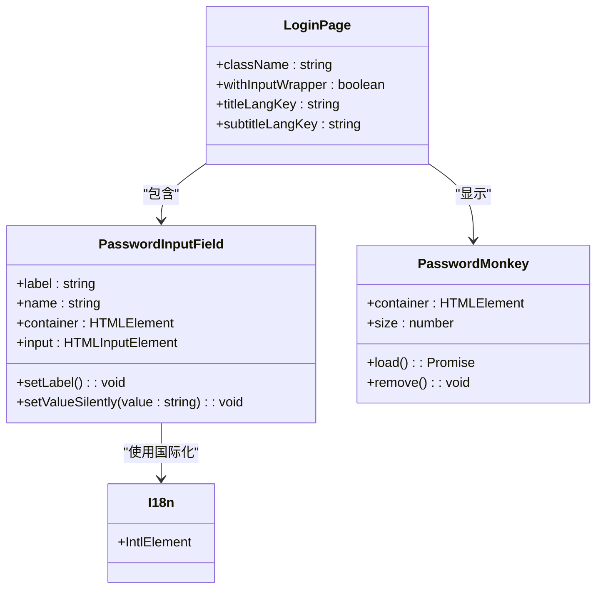
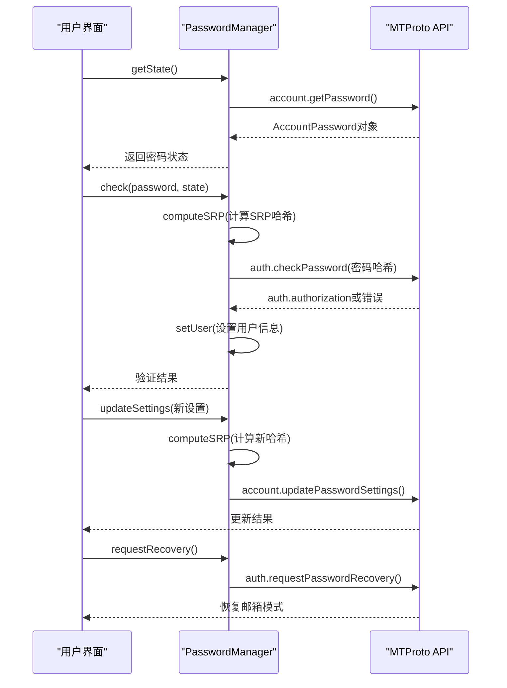
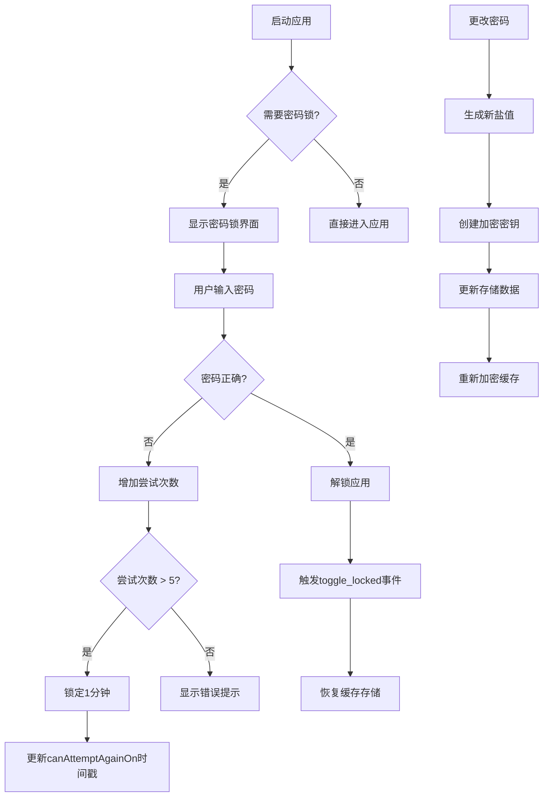
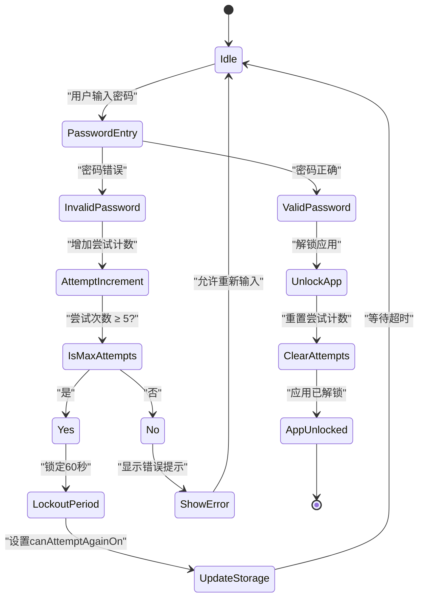

# 密码管理

<cite>
**本文档引用的文件**
- [pagePassword.ts](file://src/pages/pagePassword.ts)
- [passwordManager.ts](file://src/lib/mtproto/passwordManager.ts)
- [passcodeLockScreen.tsx](file://src/components/passcodeLock/passcodeLockScreen.tsx)
- [passcodeLockScreenController.tsx](file://src/components/passcodeLock/passcodeLockScreenController.tsx)
- [actions.ts](file://src/lib/passcode/actions.ts)
- [utils.ts](file://src/lib/passcode/utils.ts)
- [constants.ts](file://src/lib/passcode/constants.ts)
- [keyStore.ts](file://src/lib/passcode/keyStore.ts)
</cite>

## 目录
1. [简介](#简介)
2. [密码输入界面实现](#密码输入界面实现)
3. [MTProto密码操作](#mtproto密码操作)
4. [应用级密码锁功能](#应用级密码锁功能)
5. [密码安全策略](#密码安全策略)
6. [错误处理与防护机制](#错误处理与防护机制)
7. [结论](#结论)

## 简介
本文档详细说明了Telegram Web客户端中的密码管理功能，涵盖用户密码设置、验证以及应用级密码锁的实现。系统通过MTProto协议与Telegram服务器交互处理账户密码，同时提供本地密码锁功能保护用户隐私。文档分析了密码输入界面的用户体验设计、密码强度验证机制、与服务器的加密通信流程，以及本地密码锁的生物识别集成和安全防护措施。

## 密码输入界面实现

该部分分析了`pagePassword.ts`中实现的密码输入界面，包括密码可见性切换和强度指示器等用户体验功能。



**图表来源**
- [pagePassword.ts](file://src/pages/pagePassword.ts#L33-L232)

**本节来源**
- [pagePassword.ts](file://src/pages/pagePassword.ts#L33-L232)

## MTProto密码操作

详细描述了`passwordManager.ts`中与MTProto协议交互的密码相关操作，包括设置新密码、验证现有密码和恢复密码流程。



**图表来源**
- [passwordManager.ts](file://src/lib/mtproto/passwordManager.ts#L16-L121)

**本节来源**
- [passwordManager.ts](file://src/lib/mtproto/passwordManager.ts#L16-L121)

## 应用级密码锁功能

说明`passcode`目录中实现的应用级密码锁功能，包括生物识别集成和错误尝试限制机制。



**图表来源**
- [passcodeLockScreen.tsx](file://src/components/passcodeLock/passcodeLockScreen.tsx#L42-L252)
- [passcodeLockScreenController.tsx](file://src/components/passcodeLock/passcodeLockScreenController.tsx#L15-L180)
- [actions.ts](file://src/lib/passcode/actions.ts#L16-L169)

**本节来源**
- [passcodeLockScreen.tsx](file://src/components/passcodeLock/passcodeLockScreen.tsx#L42-L252)
- [passcodeLockScreenController.tsx](file://src/components/passcodeLock/passcodeLockScreenController.tsx#L15-L180)
- [actions.ts](file://src/lib/passcode/actions.ts#L16-L169)

## 密码安全策略

记录系统的密码安全策略，包括最小长度、复杂度要求和恢复选项。

```mermaid
erDiagram
PASSCODE_SETTINGS {
string verificationHash PK
string verificationSalt
string encryptionSalt
datetime canAttemptAgainOn
}
PASSWORD_POLICY {
int MAX_PASSCODE_LENGTH 32
int SALT_LENGTH 16
int ITERATIONS 100000
string HASH_ALGORITHM "SHA-256"
string KEY_ALGORITHM "AES-GCM"
int MAX_ATTEMPTS 5
int MAX_ATTEMPTS_TIMEOUT_SEC 60
}
CRYPTOGRAPHIC_FUNCTIONS {
function hashPasscode()
function deriveEncryptionKey()
function createEncryptionArtifactsForPasscode()
}
ENCRYPTION_KEY_STORE {
CryptoKey key
deferredPromise deferred
}
PASSCODE_SETTINGS ||--o{ CRYPTOGRAPHIC_FUNCTIONS : "使用"
PASSWORD_POLICY ||--o{ CRYPTOGRAPHIC_FUNCTIONS : "定义参数"
CRYPTOGRAPHIC_FUNCTIONS }|--|| ENCRYPTION_KEY_STORE : "生成"
```

**图表来源**
- [constants.ts](file://src/lib/passcode/constants.ts#L1-L3)
- [utils.ts](file://src/lib/passcode/utils.ts#L1-L46)
- [keyStore.ts](file://src/lib/passcode/keyStore.ts#L1-L39)

**本节来源**
- [constants.ts](file://src/lib/passcode/constants.ts#L1-L3)
- [utils.ts](file://src/lib/passcode/utils.ts#L1-L46)
- [keyStore.ts](file://src/lib/passcode/keyStore.ts#L1-L39)

## 错误处理与防护机制

提供密码相关错误处理的最佳实践，包括暴力破解防护和账户锁定机制。



**图表来源**
- [passcodeLockScreen.tsx](file://src/components/passcodeLock/passcodeLockScreen.tsx#L38-L169)
- [passwordManager.ts](file://src/lib/mtproto/passwordManager.ts#L59-L72)

**本节来源**
- [passcodeLockScreen.tsx](file://src/components/passcodeLock/passcodeLockScreen.tsx#L38-L169)
- [passwordManager.ts](file://src/lib/mtproto/passwordManager.ts#L59-L72)

## 结论
本文档全面分析了Telegram Web客户端的密码管理系统，涵盖了从用户界面到后端加密的完整流程。系统实现了双重密码保护机制：基于MTProto协议的账户密码用于身份验证，本地密码锁用于保护应用访问。密码安全采用PBKDF2-SHA256算法进行密钥派生，AES-GCM进行数据加密，确保了高安全性。错误处理机制包含尝试次数限制和定时锁定功能，有效防止暴力破解攻击。整体设计平衡了安全性和用户体验，为用户提供可靠的密码管理解决方案。