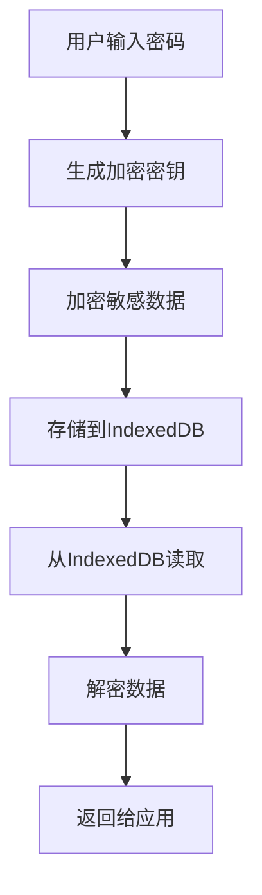
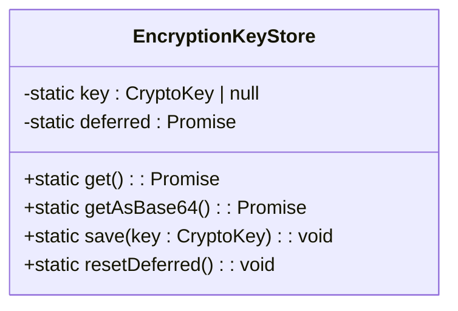
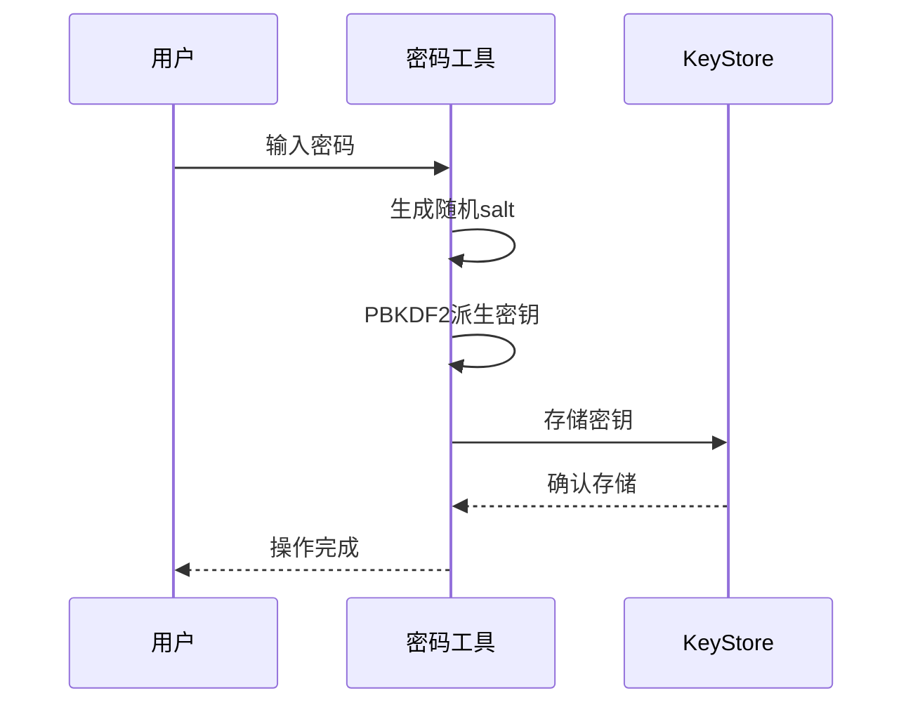
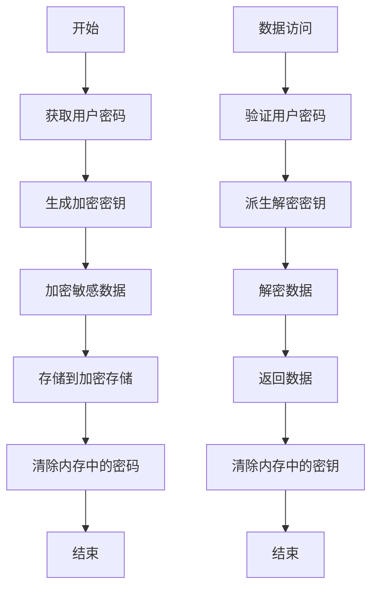
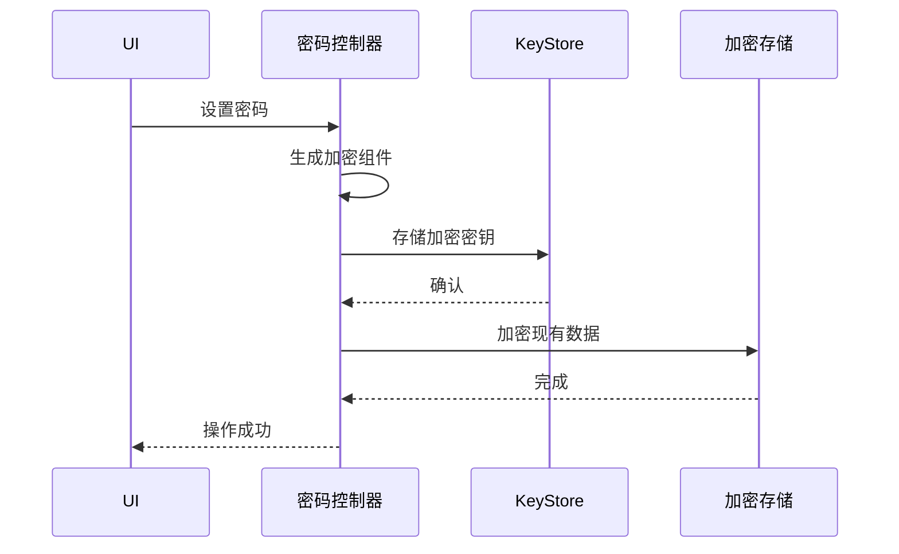
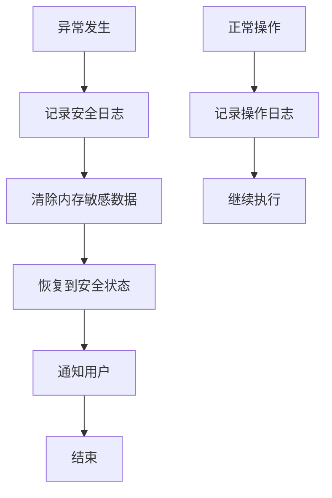

# 安全存储

<cite>
**本文档引用的文件**  
- [keyStore.ts](file://src/lib/passcode/keyStore.ts)
- [utils.ts](file://src/lib/passcode/utils.ts)
- [actions.ts](file://src/lib/passcode/actions.ts)
- [encryptedStorageLayer.ts](file://src/lib/encryptedStorageLayer.ts)
- [localStorage.ts](file://src/lib/localStorage.ts)
- [sessionStorage.ts](file://src/lib/sessionStorage.ts)
- [constants.ts](file://src/lib/passcode/constants.ts)
- [cryptoMessagePort.ts](file://src/lib/crypto/cryptoMessagePort.ts)
- [crypto.worker.ts](file://src/lib/crypto/crypto.worker.ts)
</cite>

## 目录
1. [引言](#引言)
2. [加密存储架构](#加密存储架构)
3. [KeyStore组件实现原理](#keystore组件实现原理)
4. [加密算法与密钥管理](#加密算法与密钥管理)
5. [存储安全机制](#存储安全机制)
6. [组件集成与数据流](#组件集成与数据流)
7. [安全审计与异常处理](#安全审计与异常处理)
8. [结论](#结论)

## 引言

本系统实现了基于密码的敏感数据加密存储机制，通过多层加密架构保护用户隐私数据。系统采用AES-GCM对称加密算法和PBKDF2密钥派生函数，结合Web Crypto API实现安全的密钥管理和数据加密。加密存储层与应用组件紧密集成，在密码设置、验证和数据访问时提供透明的加密解密服务。

**Section sources**
- [keyStore.ts](file://src/lib/passcode/keyStore.ts#L1-L39)
- [utils.ts](file://src/lib/passcode/utils.ts#L1-L46)

## 加密存储架构

系统采用分层加密存储架构，将敏感数据与非敏感数据分离存储。通过LocalStorageController管理存储访问，根据数据敏感性决定是否使用加密存储。加密数据存储在IndexedDB中，使用AES-GCM算法加密，密钥由用户密码派生。

**Diagram sources**
- [encryptedStorageLayer.ts](file://src/lib/encryptedStorageLayer.ts#L1-L230)
- [localStorage.ts](file://src/lib/localStorage.ts#L1-L342)

**Section sources**
- [encryptedStorageLayer.ts](file://src/lib/encryptedStorageLayer.ts#L1-L230)
- [localStorage.ts](file://src/lib/localStorage.ts#L1-L342)

## KeyStore组件实现原理

KeyStore组件是加密系统的核心，负责密钥的存储和管理。它采用静态工具类模式，通过Promise机制确保密钥访问的同步性。密钥存储在内存中，避免持久化存储带来的安全风险。

**Diagram sources**
- [keyStore.ts](file://src/lib/passcode/keyStore.ts#L1-L39)

**Section sources**
- [keyStore.ts](file://src/lib/passcode/keyStore.ts#L1-L39)

## 加密算法与密钥管理

系统采用行业标准的加密算法组合：使用PBKDF2-SHA256进行密钥派生，迭代次数设置为100,000次以增强安全性；使用AES-256-GCM进行数据加密，提供机密性和完整性保护。密钥派生过程中使用随机盐值，防止彩虹表攻击。

**Diagram sources**
- [utils.ts](file://src/lib/passcode/utils.ts#L1-L46)
- [constants.ts](file://src/lib/passcode/constants.ts#L1-L3)

**Section sources**
- [utils.ts](file://src/lib/passcode/utils.ts#L1-L46)
- [constants.ts](file://src/lib/passcode/constants.ts#L1-L3)

## 存储安全机制

系统实现了完整的加密生命周期管理，包括密钥生成、数据加密、存储和清理。在密码更改或禁用时，系统会重新加密或解密所有敏感数据。内存中的敏感数据在使用后立即清除，防止内存泄露。

**Diagram sources**
- [actions.ts](file://src/lib/passcode/actions.ts#L1-L168)
- [localStorage.ts](file://src/lib/localStorage.ts#L1-L342)

**Section sources**
- [actions.ts](file://src/lib/passcode/actions.ts#L1-L168)
- [localStorage.ts](file://src/lib/localStorage.ts#L1-L342)

## 组件集成与数据流

加密存储层与其他组件通过消息端口集成，确保跨线程的安全通信。在密码设置时，系统生成新的加密密钥并重新加密所有敏感数据；在验证时，使用存储的盐值派生密钥进行验证。

**Diagram sources**
- [actions.ts](file://src/lib/passcode/actions.ts#L1-L168)
- [cryptoMessagePort.ts](file://src/lib/crypto/cryptoMessagePort.ts#L1-L68)

**Section sources**
- [actions.ts](file://src/lib/passcode/actions.ts#L1-L168)
- [cryptoMessagePort.ts](file://src/lib/crypto/cryptoMessagePort.ts#L1-L68)

## 安全审计与异常处理

系统实现了全面的安全审计机制，记录关键安全操作。在异常情况下，系统会安全回退，确保数据完整性。密钥派生和加密操作在独立的Web Worker中执行，防止主线程阻塞和侧信道攻击。

**Diagram sources**
- [crypto.worker.ts](file://src/lib/crypto/crypto.worker.ts#L1-L74)
- [actions.ts](file://src/lib/passcode/actions.ts#L1-L168)

**Section sources**
- [crypto.worker.ts](file://src/lib/crypto/crypto.worker.ts#L1-L74)
- [actions.ts](file://src/lib/passcode/actions.ts#L1-L168)

## 结论

本系统通过多层次的安全机制实现了密码数据的安全存储。采用标准加密算法和安全的密钥管理策略，确保敏感数据的机密性和完整性。系统的模块化设计使得加密功能可以灵活集成到不同组件中，同时保持高安全标准。内存安全措施和异常处理机制进一步增强了系统的整体安全性。