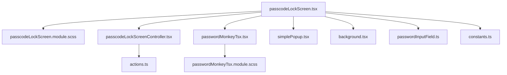
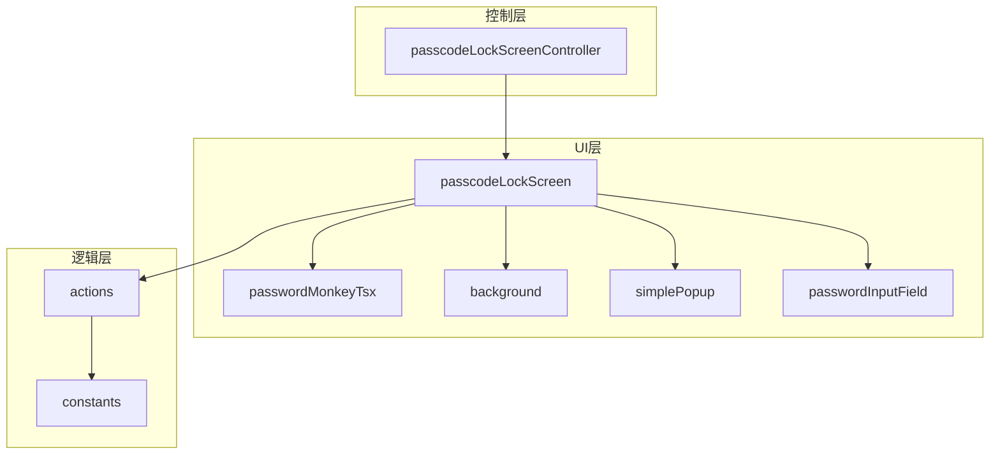
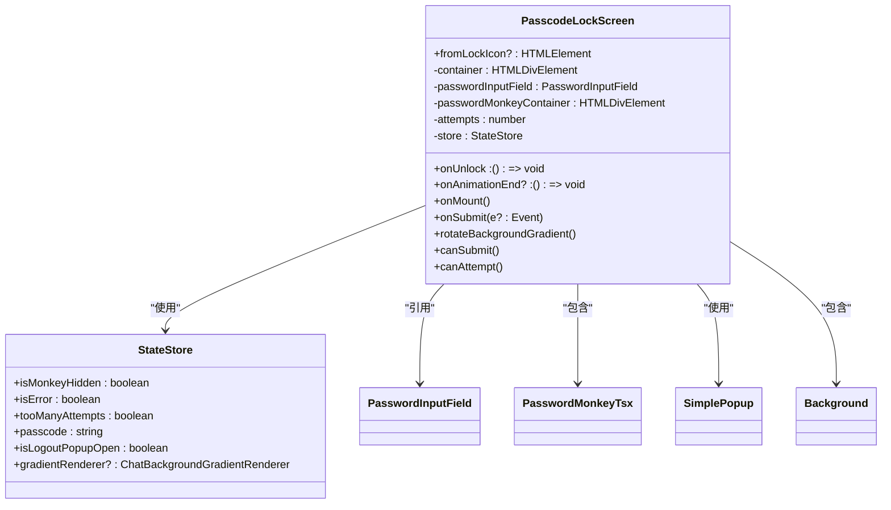
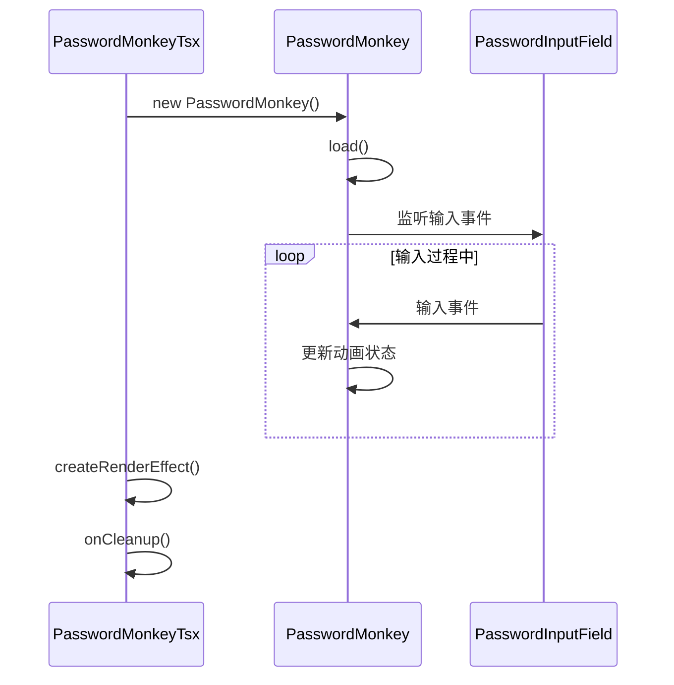
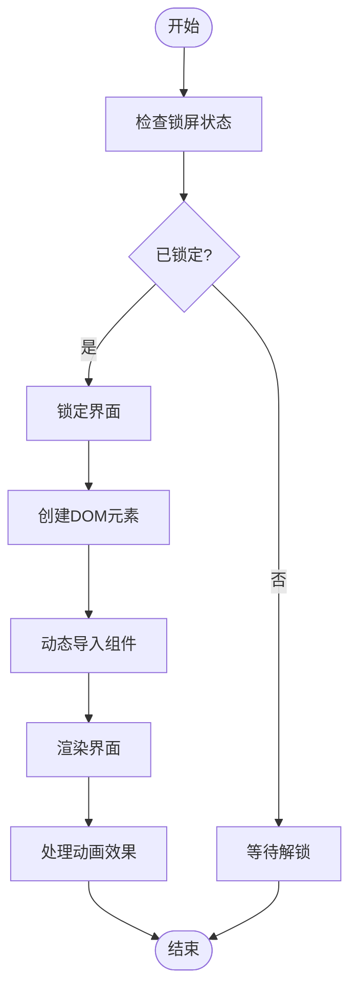
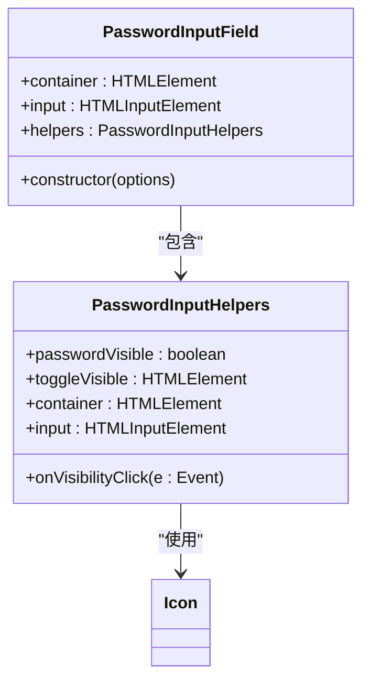
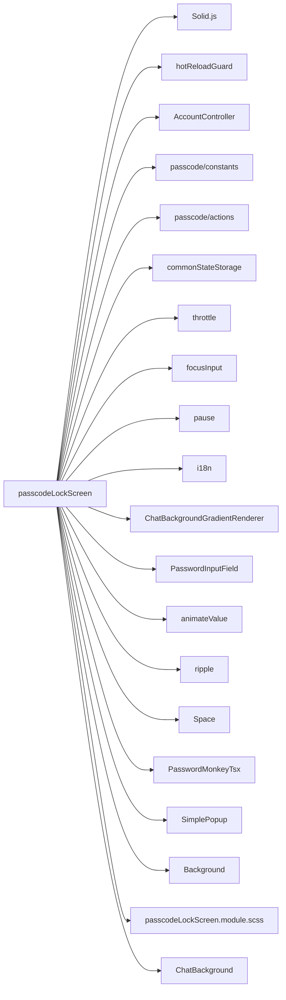
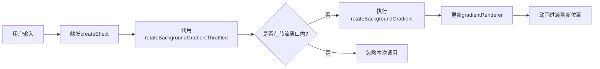
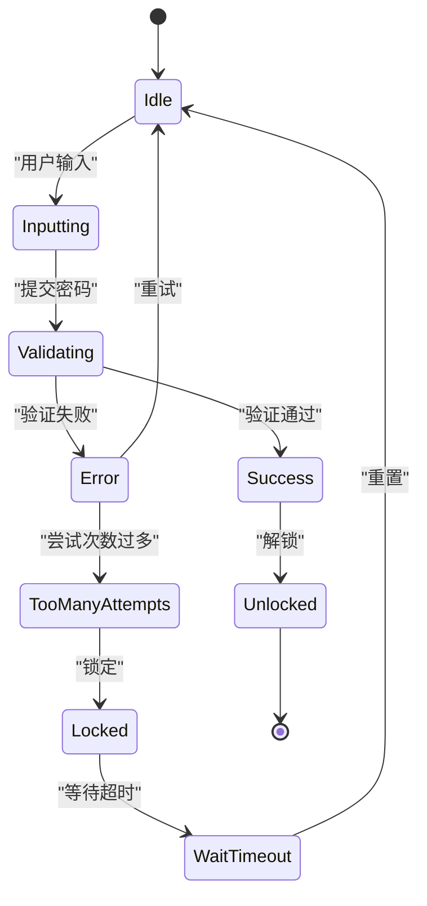

# 密码锁界面

<cite>
**本文档中引用的文件**  
- [passcodeLockScreen.tsx](file://src/components/passcodeLock/passcodeLockScreen.tsx)
- [passcodeLockScreen.module.scss](file://src/components/passcodeLock/passcodeLockScreen.module.scss)
- [passcodeLockScreenController.tsx](file://src/components/passcodeLock/passcodeLockScreenController.tsx)
- [passwordMonkeyTsx.tsx](file://src/components/passcodeLock/passwordMonkeyTsx.tsx)
- [passwordMonkeyTsx.module.scss](file://src/components/passcodeLock/passwordMonkeyTsx.module.scss)
- [background.tsx](file://src/components/passcodeLock/background.tsx)
- [simplePopup.tsx](file://src/components/passcodeLock/simplePopup.tsx)
- [actions.ts](file://src/lib/passcode/actions.ts)
- [constants.ts](file://src/lib/passcode/constants.ts)
- [passwordInputField.ts](file://src/components/passwordInputField.ts)
</cite>

## 目录
1. [项目结构](#项目结构)
2. [核心组件](#核心组件)
3. [架构概述](#架构概述)
4. [详细组件分析](#详细组件分析)
5. [依赖分析](#依赖分析)
6. [性能考虑](#性能考虑)
7. [故障排除指南](#故障排除指南)
8. [结论](#结论)

## 项目结构

密码锁界面组件位于 `src/components/passcodeLock` 目录下，包含多个关键文件，共同实现完整的密码锁功能。该组件采用模块化设计，分离了UI、动画、逻辑控制和状态管理。

**图示来源**  
- [passcodeLockScreen.tsx](file://src/components/passcodeLock/passcodeLockScreen.tsx#L1-L252)
- [passcodeLockScreenController.tsx](file://src/components/passcodeLock/passcodeLockScreenController.tsx#L1-L180)

**本节来源**  
- [src/components/passcodeLock](file://src/components/passcodeLock)

## 核心组件

密码锁界面的核心组件包括主屏幕组件、密码猴子动画、背景渲染器、简单弹窗和密码输入字段。这些组件协同工作，提供安全且用户友好的解锁体验。

**本节来源**  
- [passcodeLockScreen.tsx](file://src/components/passcodeLock/passcodeLockScreen.tsx#L42-L251)
- [passwordMonkeyTsx.tsx](file://src/components/passcodeLock/passwordMonkeyTsx.tsx#L11-L53)

## 架构概述

密码锁界面采用分层架构设计，将UI展示、用户交互、状态管理和安全验证分离。组件使用Solid.js的响应式系统管理输入状态，并通过控制器协调整体流程。

**图示来源**  
- [passcodeLockScreen.tsx](file://src/components/passcodeLock/passcodeLockScreen.tsx#L42-L251)
- [passcodeLockScreenController.tsx](file://src/components/passcodeLock/passcodeLockScreenController.tsx#L15-L179)
- [actions.ts](file://src/lib/passcode/actions.ts#L16-L168)

## 详细组件分析

### 主屏幕组件分析

`passcodeLockScreen.tsx` 是密码锁界面的主要组件，负责整合所有UI元素并处理用户输入。它使用Solid.js的响应式系统管理密码输入状态和错误状态。

**图示来源**  
- [passcodeLockScreen.tsx](file://src/components/passcodeLock/passcodeLockScreen.tsx#L42-L251)

**本节来源**  
- [passcodeLockScreen.tsx](file://src/components/passcodeLock/passcodeLockScreen.tsx#L42-L251)

### 密码猴子组件分析

`passwordMonkeyTsx.tsx` 组件实现了独特的密码猴子动画，为用户提供视觉反馈。该组件使用自定义的PasswordMonkey类来管理动画状态。

**图示来源**  
- [passwordMonkeyTsx.tsx](file://src/components/passcodeLock/passwordMonkeyTsx.tsx#L11-L53)
- [passwordInputField.ts](file://src/components/passwordInputField.ts#L58-L70)

**本节来源**  
- [passwordMonkeyTsx.tsx](file://src/components/passcodeLock/passwordMonkeyTsx.tsx#L11-L53)

### 控制器组件分析

`passcodeLockScreenController.tsx` 是密码锁界面的控制中心，负责管理锁屏状态、处理解锁流程和协调动画效果。

**图示来源**  
- [passcodeLockScreenController.tsx](file://src/components/passcodeLock/passcodeLockScreenController.tsx#L15-L179)

**本节来源**  
- [passcodeLockScreenController.tsx](file://src/components/passcodeLock/passcodeLockScreenController.tsx#L15-L179)

### 密码输入字段分析

`passwordInputField.ts` 组件提供了安全的密码输入功能，包含密码可见性切换等特性，确保用户输入的安全性和便利性。

**图示来源**  
- [passwordInputField.ts](file://src/components/passwordInputField.ts#L58-L70)
- [icon.ts](file://src/components/icon.ts)

**本节来源**  
- [passwordInputField.ts](file://src/components/passwordInputField.ts#L58-L70)

## 依赖分析

密码锁界面组件依赖多个内部和外部模块，形成了复杂的依赖网络。这些依赖关系确保了组件的功能完整性和安全性。

**图示来源**  
- [passcodeLockScreen.tsx](file://src/components/passcodeLock/passcodeLockScreen.tsx#L1-L252)
- [passcodeLockScreen.module.scss](file://src/components/passcodeLock/passcodeLockScreen.module.scss#L1-L66)

**本节来源**  
- [passcodeLockScreen.tsx](file://src/components/passcodeLock/passcodeLockScreen.tsx#L1-L252)

## 性能考虑

密码锁界面在设计时考虑了性能优化，特别是在动画效果和响应式设计方面。组件使用节流函数来优化背景渐变动画的性能。

**图示来源**  
- [passcodeLockScreen.tsx](file://src/components/passcodeLock/passcodeLockScreen.tsx#L111-L118)
- [helpers/schedulers/throttle.ts](file://src/helpers/schedulers/throttle.ts)

**本节来源**  
- [passcodeLockScreen.tsx](file://src/components/passcodeLock/passcodeLockScreen.tsx#L111-L118)

## 故障排除指南

密码锁界面实现了完善的错误处理机制，包括错误状态管理、尝试次数限制和生物识别失败后的降级处理。

**图示来源**  
- [passcodeLockScreen.tsx](file://src/components/passcodeLock/passcodeLockScreen.tsx#L141-L168)
- [actions.ts](file://src/lib/passcode/actions.ts#L81-L89)

**本节来源**  
- [passcodeLockScreen.tsx](file://src/components/passcodeLock/passcodeLockScreen.tsx#L141-L168)

## 结论

密码锁界面组件通过精心设计的架构和实现，提供了安全、直观且用户友好的解锁体验。组件利用Solid.js的响应式系统高效管理状态，通过模块化设计实现了关注点分离。动画效果和视觉反馈增强了用户体验，而严格的错误处理和安全验证确保了系统的安全性。该组件充分考虑了不同屏幕尺寸和设备方向的适配需求，展现了良好的响应式设计能力。