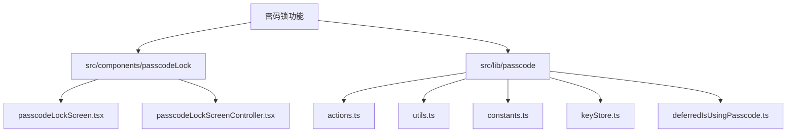
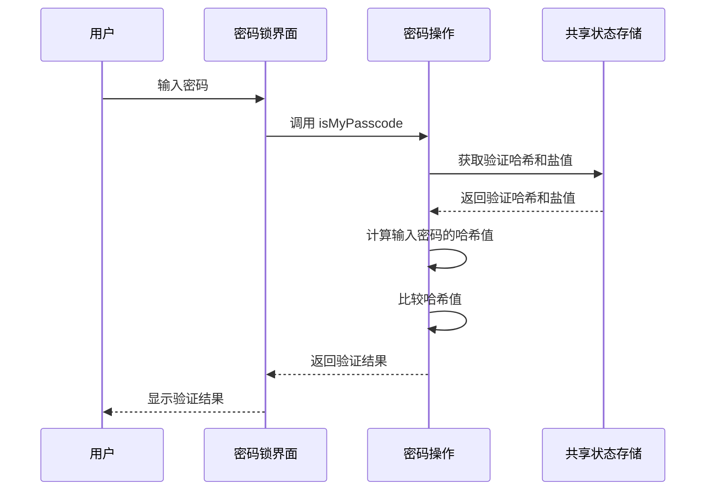
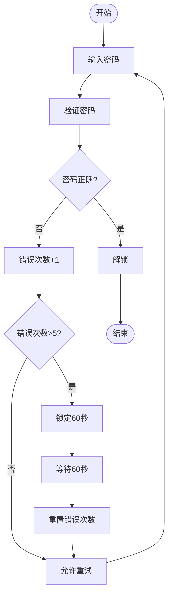
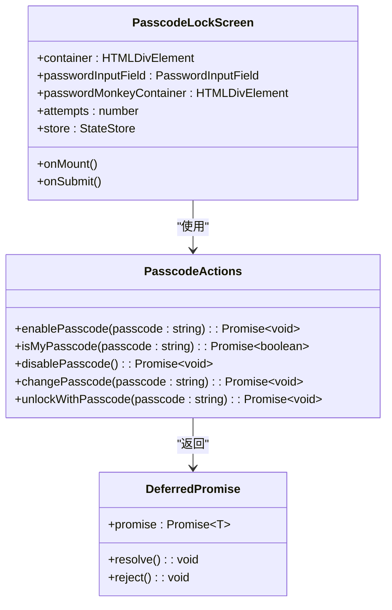
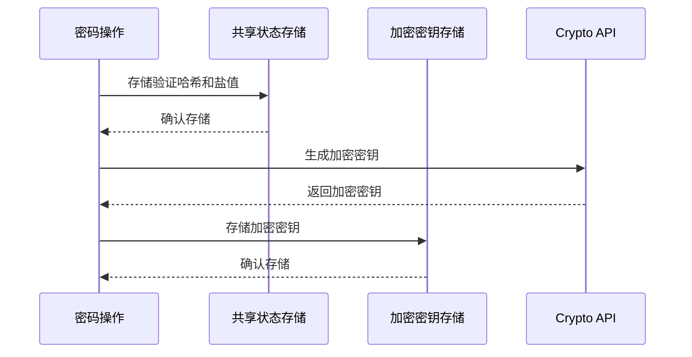

# 密码锁逻辑

<cite>
**本文档引用的文件**
- [passcodeLockScreen.tsx](file://src/components/passcodeLock/passcodeLockScreen.tsx)
- [passcodeLockScreenController.tsx](file://src/components/passcodeLock/passcodeLockScreenController.tsx)
- [actions.ts](file://src/lib/passcode/actions.ts)
- [utils.ts](file://src/lib/passcode/utils.ts)
- [constants.ts](file://src/lib/passcode/constants.ts)
- [keyStore.ts](file://src/lib/passcode/keyStore.ts)
- [deferredIsUsingPasscode.ts](file://src/lib/passcode/deferredIsUsingPasscode.ts)
- [commonStateStorage.ts](file://src/lib/commonStateStorage.ts)
</cite>

## 目录
1. [项目结构](#项目结构)
2. [核心组件](#核心组件)
3. [密码验证流程](#密码验证流程)
4. [错误处理机制](#错误处理机制)
5. [配置管理](#配置管理)
6. [异步处理与状态管理](#异步处理与状态管理)
7. [界面层通信机制](#界面层通信机制)
8. [安全存储层交互](#安全存储层交互)

## 项目结构

密码锁功能主要分布在 `src/components/passcodeLock` 和 `src/lib/passcode` 两个目录中。`src/components/passcodeLock` 包含了密码锁界面相关的组件，而 `src/lib/passcode` 包含了密码锁的核心逻辑和工具函数。

**Diagram sources**
- [passcodeLockScreen.tsx](file://src/components/passcodeLock/passcodeLockScreen.tsx)
- [passcodeLockScreenController.tsx](file://src/components/passcodeLock/passcodeLockScreenController.tsx)
- [actions.ts](file://src/lib/passcode/actions.ts)
- [utils.ts](file://src/lib/passcode/utils.ts)
- [constants.ts](file://src/lib/passcode/constants.ts)
- [keyStore.ts](file://src/lib/passcode/keyStore.ts)
- [deferredIsUsingPasscode.ts](file://src/lib/passcode/deferredIsUsingPasscode.ts)

**Section sources**
- [passcodeLockScreen.tsx](file://src/components/passcodeLock/passcodeLockScreen.tsx)
- [passcodeLockScreenController.tsx](file://src/components/passcodeLock/passcodeLockScreenController.tsx)
- [actions.ts](file://src/lib/passcode/actions.ts)
- [utils.ts](file://src/lib/passcode/utils.ts)
- [constants.ts](file://src/lib/passcode/constants.ts)
- [keyStore.ts](file://src/lib/passcode/keyStore.ts)
- [deferredIsUsingPasscode.ts](file://src/lib/passcode/deferredIsUsingPasscode.ts)

## 核心组件

密码锁功能的核心组件包括 `PasscodeLockScreen` 和 `PasscodeLockScreenController`。`PasscodeLockScreen` 是密码锁的界面组件，负责显示密码输入界面和处理用户输入。`PasscodeLockScreenController` 是密码锁的控制器，负责管理密码锁的状态和生命周期。

**Section sources**
- [passcodeLockScreen.tsx](file://src/components/passcodeLock/passcodeLockScreen.tsx)
- [passcodeLockScreenController.tsx](file://src/components/passcodeLock/passcodeLockScreenController.tsx)

## 密码验证流程

密码验证流程包括输入收集、验证请求发起、结果处理和状态更新。用户在密码锁界面输入密码后，`PasscodeLockScreen` 组件会调用 `usePasscodeActions` 中的 `isMyPasscode` 函数来验证密码。`isMyPasscode` 函数会从 `commonStateStorage` 中获取密码的验证哈希和盐值，然后使用 `hashPasscode` 函数计算输入密码的哈希值，并与存储的哈希值进行比较。

**Diagram sources**
- [passcodeLockScreen.tsx](file://src/components/passcodeLock/passcodeLockScreen.tsx)
- [actions.ts](file://src/lib/passcode/actions.ts)
- [utils.ts](file://src/lib/passcode/utils.ts)
- [commonStateStorage.ts](file://src/lib/commonStateStorage.ts)

**Section sources**
- [passcodeLockScreen.tsx](file://src/components/passcodeLock/passcodeLockScreen.tsx)
- [actions.ts](file://src/lib/passcode/actions.ts)
- [utils.ts](file://src/lib/passcode/utils.ts)
- [commonStateStorage.ts](file://src/lib/commonStateStorage.ts)

## 错误处理机制

密码锁功能实现了连续错误尝试的计数、延迟增加算法和锁定策略。当用户连续输入错误密码超过5次时，密码锁会进入锁定状态，用户需要等待60秒后才能再次尝试。锁定状态的信息会存储在 `commonStateStorage` 中，以便在页面刷新后仍然有效。

**Diagram sources**
- [passcodeLockScreen.tsx](file://src/components/passcodeLock/passcodeLockScreen.tsx)
- [actions.ts](file://src/lib/passcode/actions.ts)
- [commonStateStorage.ts](file://src/lib/commonStateStorage.ts)

**Section sources**
- [passcodeLockScreen.tsx](file://src/components/passcodeLock/passcodeLockScreen.tsx)
- [actions.ts](file://src/lib/passcode/actions.ts)
- [commonStateStorage.ts](file://src/lib/commonStateStorage.ts)

## 配置管理

密码锁的配置管理包括自动锁定时间设置、生物识别开关状态的持久化和超时处理。配置信息存储在 `commonStateStorage` 中，通过 `useAppSettings` 进行访问和更新。自动锁定时间设置决定了用户在多长时间不活动后自动锁定。生物识别开关状态的持久化确保了用户在启用生物识别后，即使页面刷新也能保持启用状态。

**Section sources**
- [actions.ts](file://src/lib/passcode/actions.ts)
- [commonStateStorage.ts](file://src/lib/commonStateStorage.ts)
- [appSettings.ts](file://src/stores/appSettings.ts)

## 异步处理与状态管理

密码锁功能使用 Promise 和状态管理来确保安全性。`PasscodeLockScreen` 组件使用 Solid.js 的 `createResource` 和 `createMutable` 来管理状态。`usePasscodeActions` 中的函数返回 Promise，确保异步操作的正确执行。`deferredPromise` 用于管理异步操作的生命周期，确保在操作完成前不会执行后续操作。

**Diagram sources**
- [passcodeLockScreen.tsx](file://src/components/passcodeLock/passcodeLockScreen.tsx)
- [actions.ts](file://src/lib/passcode/actions.ts)
- [cancellablePromise.ts](file://src/helpers/cancellablePromise.ts)

**Section sources**
- [passcodeLockScreen.tsx](file://src/components/passcodeLock/passcodeLockScreen.tsx)
- [actions.ts](file://src/lib/passcode/actions.ts)
- [cancellablePromise.ts](file://src/helpers/cancellablePromise.ts)

## 界面层通信机制

密码锁的界面层与逻辑层通过事件和回调函数进行通信。`PasscodeLockScreen` 组件通过 `onUnlock` 回调函数通知控制器解锁。控制器通过 `onAnimationEnd` 回调函数通知界面层动画结束。这种通信机制确保了界面层和逻辑层的解耦，提高了代码的可维护性。

**Section sources**
- [passcodeLockScreen.tsx](file://src/components/passcodeLock/passcodeLockScreen.tsx)
- [passcodeLockScreenController.tsx](file://src/components/passcodeLock/passcodeLockScreenController.tsx)

## 安全存储层交互

密码锁功能与安全存储层通过 `commonStateStorage` 和 `EncryptionKeyStore` 进行交互。`commonStateStorage` 用于存储密码的验证哈希、盐值和加密盐值。`EncryptionKeyStore` 用于存储和管理加密密钥。加密密钥通过 `crypto.subtle` API 生成和导入，确保了密钥的安全性。

**Diagram sources**
- [actions.ts](file://src/lib/passcode/actions.ts)
- [commonStateStorage.ts](file://src/lib/commonStateStorage.ts)
- [keyStore.ts](file://src/lib/passcode/keyStore.ts)
- [crypto.ts](file://src/lib/crypto/crypto.ts)

**Section sources**
- [actions.ts](file://src/lib/passcode/actions.ts)
- [commonStateStorage.ts](file://src/lib/commonStateStorage.ts)
- [keyStore.ts](file://src/lib/passcode/keyStore.ts)
- [crypto.ts](file://src/lib/crypto/crypto.ts)