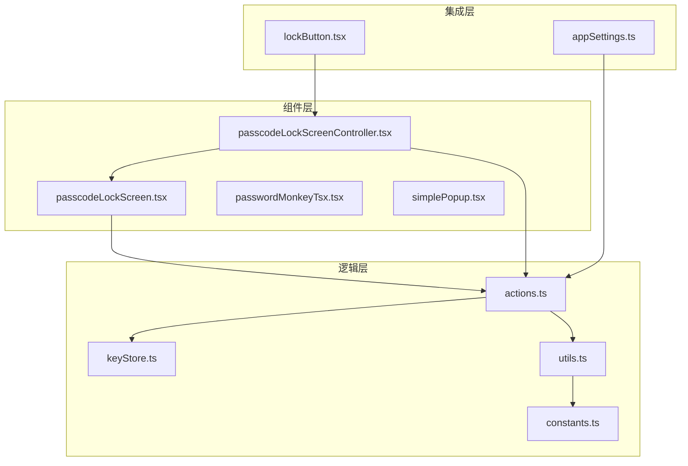
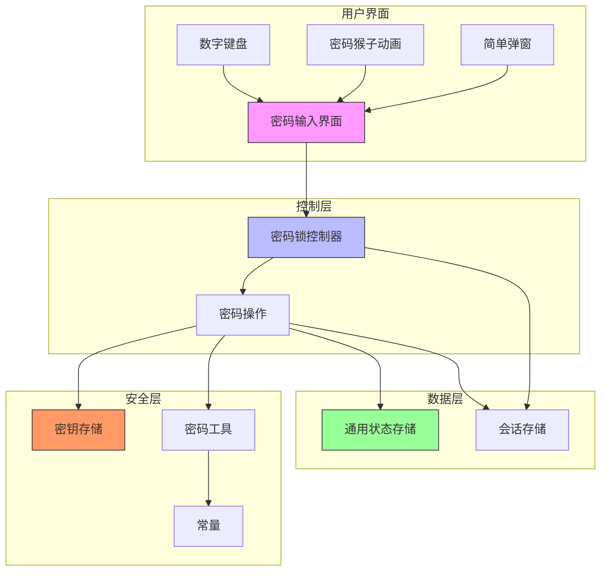
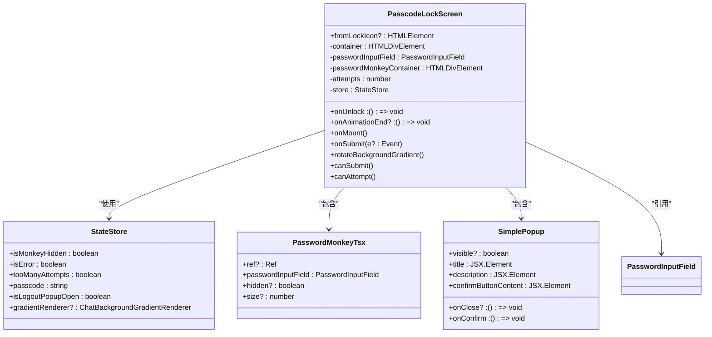
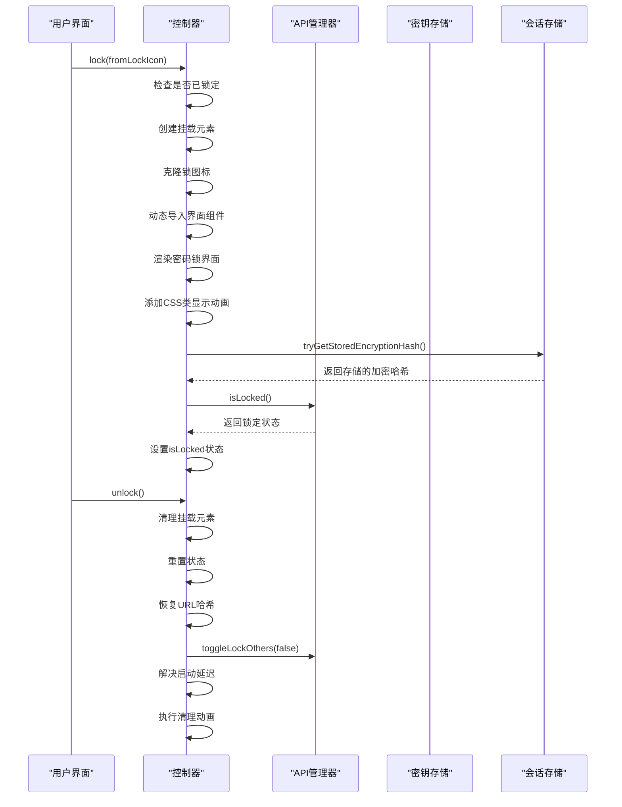
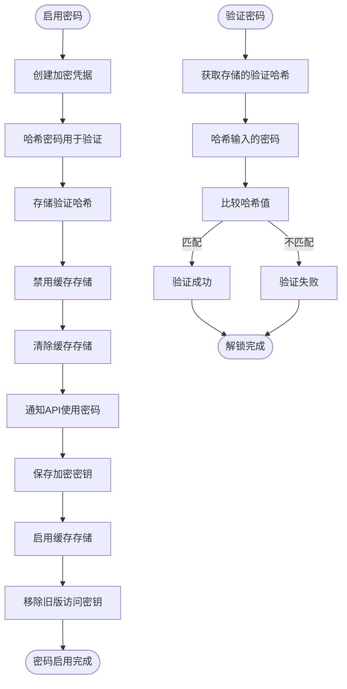
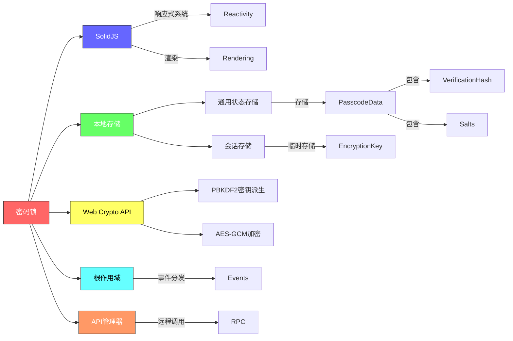

# 应用密码锁

<cite>
**本文档引用的文件**  
- [passcodeLockScreen.tsx](file://src/components/passcodeLock/passcodeLockScreen.tsx)
- [passcodeLockScreenController.tsx](file://src/components/passcodeLock/passcodeLockScreenController.tsx)
- [keyStore.ts](file://src/lib/passcode/keyStore.ts)
- [actions.ts](file://src/lib/passcode/actions.ts)
- [constants.ts](file://src/lib/passcode/constants.ts)
- [utils.ts](file://src/lib/passcode/utils.ts)
- [passwordMonkeyTsx.tsx](file://src/components/passcodeLock/passwordMonkeyTsx.tsx)
- [simplePopup.tsx](file://src/components/passcodeLock/simplePopup.tsx)
- [lockButton.tsx](file://src/components/sidebarLeft/lockButton.tsx)
- [appSettings.ts](file://src/stores/appSettings.ts)
- [commonStateStorage.ts](file://src/lib/commonStateStorage.ts)
</cite>

## 目录
1. [简介](#简介)
2. [项目结构](#项目结构)
3. [核心组件](#核心组件)
4. [架构概述](#架构概述)
5. [详细组件分析](#详细组件分析)
6. [依赖分析](#依赖分析)
7. [性能考虑](#性能考虑)
8. [故障排除指南](#故障排除指南)
9. [结论](#结论)

## 简介
本文档详细描述了Telegram Web应用中的应用密码锁功能，涵盖本地应用级安全保护机制。文档深入解析了密码输入界面的实现，包括数字键盘、错误尝试限制和用户交互反馈。重点分析了密码存储加密、验证流程和超时锁定机制等核心安全逻辑。同时，文档还涵盖了密码锁的配置选项、生命周期管理以及与其他安全功能的集成。

## 项目结构
密码锁功能主要分布在`src/components/passcodeLock`和`src/lib/passcode`两个目录中，形成了清晰的组件与逻辑分离架构。



**图示来源**  
- [passcodeLockScreen.tsx](file://src/components/passcodeLock/passcodeLockScreen.tsx)
- [passcodeLockScreenController.tsx](file://src/components/passcodeLock/passcodeLockScreenController.tsx)
- [actions.ts](file://src/lib/passcode/actions.ts)
- [keyStore.ts](file://src/lib/passcode/keyStore.ts)
- [utils.ts](file://src/lib/passcode/utils.ts)
- [constants.ts](file://src/lib/passcode/constants.ts)
- [lockButton.tsx](file://src/components/sidebarLeft/lockButton.tsx)
- [appSettings.ts](file://src/stores/appSettings.ts)

**本节来源**  
- [src/components/passcodeLock](file://src/components/passcodeLock)
- [src/lib/passcode](file://src/lib/passcode)

## 核心组件
应用密码锁的核心组件包括密码锁界面、控制器、密钥存储和密码验证逻辑。`passcodeLockScreen.tsx`实现了用户界面，`passcodeLockScreenController.tsx`管理密码锁的生命周期，`keyStore.ts`负责加密密钥的安全存储，而`actions.ts`提供了密码启用、禁用、更改和验证等核心操作。

**本节来源**  
- [passcodeLockScreen.tsx](file://src/components/passcodeLock/passcodeLockScreen.tsx)
- [passcodeLockScreenController.tsx](file://src/components/passcodeLock/passcodeLockScreenController.tsx)
- [keyStore.ts](file://src/lib/passcode/keyStore.ts)
- [actions.ts](file://src/lib/passcode/actions.ts)

## 架构概述
应用密码锁采用分层架构设计，将用户界面、业务逻辑和数据存储清晰分离。系统通过事件驱动的方式协调各组件，确保安全性和响应性。



**图示来源**  
- [passcodeLockScreen.tsx](file://src/components/passcodeLock/passcodeLockScreen.tsx)
- [passcodeLockScreenController.tsx](file://src/components/passcodeLock/passcodeLockScreenController.tsx)
- [actions.ts](file://src/lib/passcode/actions.ts)
- [keyStore.ts](file://src/lib/passcode/keyStore.ts)
- [utils.ts](file://src/lib/passcode/utils.ts)
- [constants.ts](file://src/lib/passcode/constants.ts)
- [commonStateStorage.ts](file://src/lib/commonStateStorage.ts)
- [sessionStorage.ts](file://src/lib/sessionStorage.ts)

## 详细组件分析

### 密码锁界面分析
`passcodeLockScreen.tsx`组件实现了密码输入界面，包含密码输入框、提交按钮和忘记密码选项。界面通过SolidJS的响应式系统管理状态，包括密码输入、错误状态和尝试次数。



**图示来源**  
- [passcodeLockScreen.tsx](file://src/components/passcodeLock/passcodeLockScreen.tsx)
- [passwordMonkeyTsx.tsx](file://src/components/passcodeLock/passwordMonkeyTsx.tsx)
- [simplePopup.tsx](file://src/components/passcodeLock/simplePopup.tsx)

**本节来源**  
- [passcodeLockScreen.tsx](file://src/components/passcodeLock/passcodeLockScreen.tsx)
- [passwordMonkeyTsx.tsx](file://src/components/passcodeLock/passwordMonkeyTsx.tsx)
- [simplePopup.tsx](file://src/components/passcodeLock/simplePopup.tsx)

### 密码锁控制器分析
`passcodeLockScreenController.tsx`是密码锁的核心控制器，负责管理密码锁的生命周期，包括锁定、解锁和状态检查。



**图示来源**  
- [passcodeLockScreenController.tsx](file://src/components/passcodeLock/passcodeLockScreenController.tsx)
- [apiManagerProxy.ts](file://src/lib/mtproto/mtprotoworker.ts)
- [keyStore.ts](file://src/lib/passcode/keyStore.ts)
- [sessionStorage.ts](file://src/lib/sessionStorage.ts)

**本节来源**  
- [passcodeLockScreenController.tsx](file://src/components/passcodeLock/passcodeLockScreenController.tsx)

### 密码操作逻辑分析
`actions.ts`文件提供了密码功能的核心操作，包括启用、禁用、更改密码和验证密码。



**图示来源**  
- [actions.ts](file://src/lib/passcode/actions.ts)
- [utils.ts](file://src/lib/passcode/utils.ts)
- [keyStore.ts](file://src/lib/passcode/keyStore.ts)
- [commonStateStorage.ts](file://src/lib/commonStateStorage.ts)

**本节来源**  
- [actions.ts](file://src/lib/passcode/actions.ts)
- [utils.ts](file://src/lib/passcode/utils.ts)

### 密钥存储机制分析
`keyStore.ts`实现了加密密钥的安全存储和访问机制，确保密钥在应用生命周期中的安全管理。

```mermaid
classDiagram
class EncryptionKeyStore {
-key : CryptoKey | null
-deferred : Promise<void>
+get() : Promise<CryptoKey | null>
+getAsBase64() : Promise<string | null>
+save(key? : CryptoKey)
+resetDeferred()
}
class CryptoKey {
+type : string
+extractable : boolean
+algorithm : Algorithm
+usages : KeyUsage[]
}
EncryptionKeyStore --> CryptoKey : "存储"
note right of EncryptionKeyStore
静态工具类，使用单例模式
密钥存储在内存中，不持久化
使用deferred模式确保异步安全访问
end note
```

**图示来源**  
- [keyStore.ts](file://src/lib/passcode/keyStore.ts)

**本节来源**  
- [keyStore.ts](file://src/lib/passcode/keyStore.ts)

### 密码工具与常量分析
`utils.ts`和`constants.ts`提供了密码功能所需的基础工具和常量定义。

```mermaid
erDiagram
UTILS ||--o{ CONSTANTS : "依赖"
UTILS ||--o{ CRYPTO : "使用Web Crypto API"
class constants {
+MAX_PASSCODE_LENGTH: number = 32
+SALT_LENGTH: number = 16
}
class utils {
+hashPasscode(passcode: string, salt: Uint8Array): Promise<Uint8Array>
+deriveEncryptionKey(passcode: string, salt: Uint8Array): Promise<CryptoKey>
+createEncryptionArtifactsForPasscode(passcode: string): Promise<EncryptionArtifacts>
}
class EncryptionArtifacts {
+verificationHash: Uint8Array
+verificationSalt: Uint8Array
+encryptionSalt: Uint8Array
+encryptionKey: CryptoKey
}
utils }o-- EncryptionArtifacts : "创建"
utils --> constants : "使用"
utils --> WebCrypto : "调用"
class WebCrypto {
+crypto.subtle.importKey()
+crypto.subtle.deriveBits()
+crypto.subtle.deriveKey()
+crypto.subtle.exportKey()
+crypto.getRandomValues()
}
```

**图示来源**  
- [utils.ts](file://src/lib/passcode/utils.ts)
- [constants.ts](file://src/lib/passcode/constants.ts)

**本节来源**  
- [utils.ts](file://src/lib/passcode/utils.ts)
- [constants.ts](file://src/lib/passcode/constants.ts)

## 依赖分析
密码锁功能依赖于多个核心模块和外部API，形成了复杂但清晰的依赖关系网络。



**图示来源**  
- [passcodeLockScreen.tsx](file://src/components/passcodeLock/passcodeLockScreen.tsx)
- [actions.ts](file://src/lib/passcode/actions.ts)
- [keyStore.ts](file://src/lib/passcode/keyStore.ts)
- [commonStateStorage.ts](file://src/lib/commonStateStorage.ts)
- [sessionStorage.ts](file://src/lib/sessionStorage.ts)
- [rootScope.ts](file://src/lib/rootScope.ts)
- [mtprotoworker.ts](file://src/lib/mtproto/mtprotoworker.ts)

**本节来源**  
- [src/lib/passcode](file://src/lib/passcode)
- [src/components/passcodeLock](file://src/components/passcodeLock)

## 性能考虑
密码锁功能在设计时考虑了多个性能因素，确保用户体验流畅且安全。

1. **异步操作优化**：所有密码相关的加密操作都使用异步模式，避免阻塞主线程
2. **资源懒加载**：密码锁界面组件采用动态导入，仅在需要时加载
3. **动画性能**：使用CSS过渡和requestAnimationFrame优化动画性能
4. **内存管理**：及时清理不再需要的组件和事件监听器
5. **防抖机制**：对频繁触发的操作使用节流和防抖技术

**本节来源**  
- [passcodeLockScreenController.tsx](file://src/components/passcodeLock/passcodeLockScreenController.tsx)
- [schedulers.ts](file://src/helpers/schedulers/index.ts)

## 故障排除指南
以下是密码锁功能常见问题的排查方法：

**本节来源**  
- [passcodeLockScreen.tsx](file://src/components/passcodeLock/passcodeLockScreen.tsx)
- [actions.ts](file://src/lib/passcode/actions.ts)
- [keyStore.ts](file://src/lib/passcode/keyStore.ts)

## 结论
应用密码锁功能通过分层架构设计，实现了安全、可靠且用户体验良好的本地应用保护机制。系统采用现代Web加密技术，确保用户数据的安全性，同时通过响应式UI和流畅动画提供优秀的用户体验。密码锁与应用其他安全功能紧密集成，形成了完整的安全防护体系。