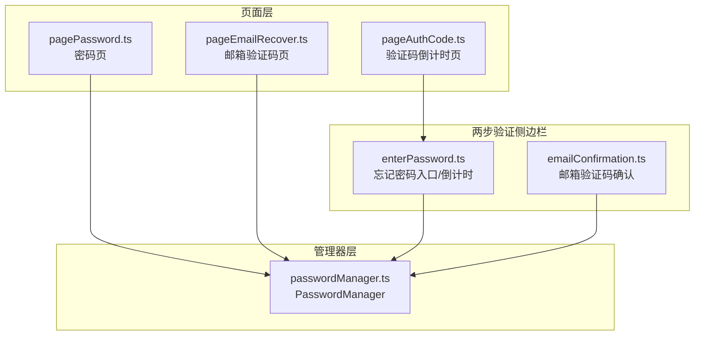
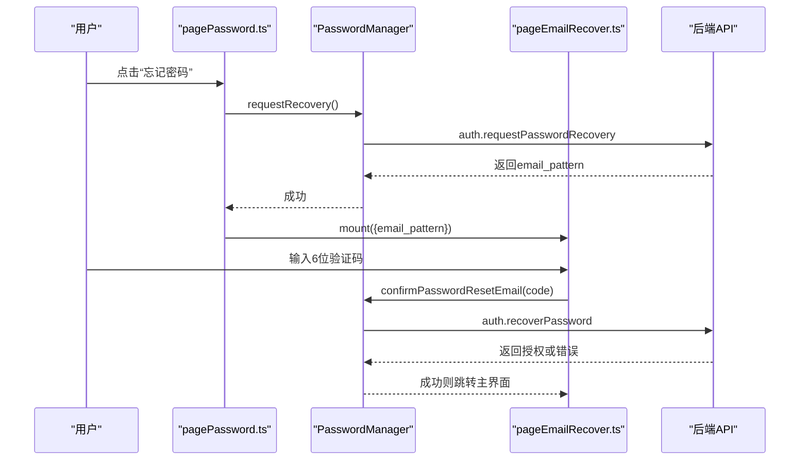
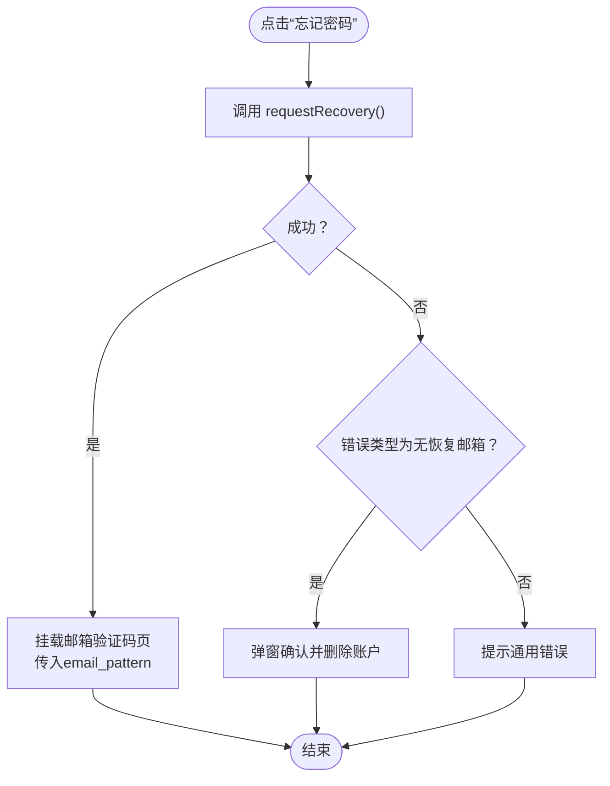
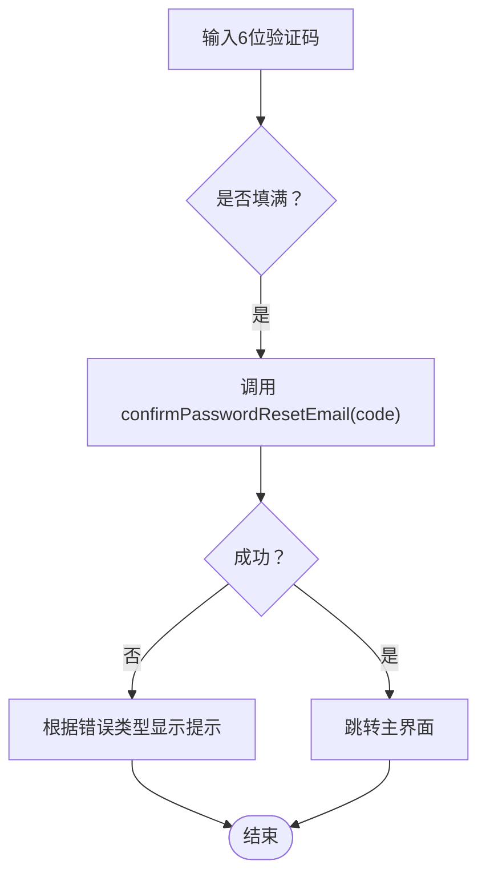
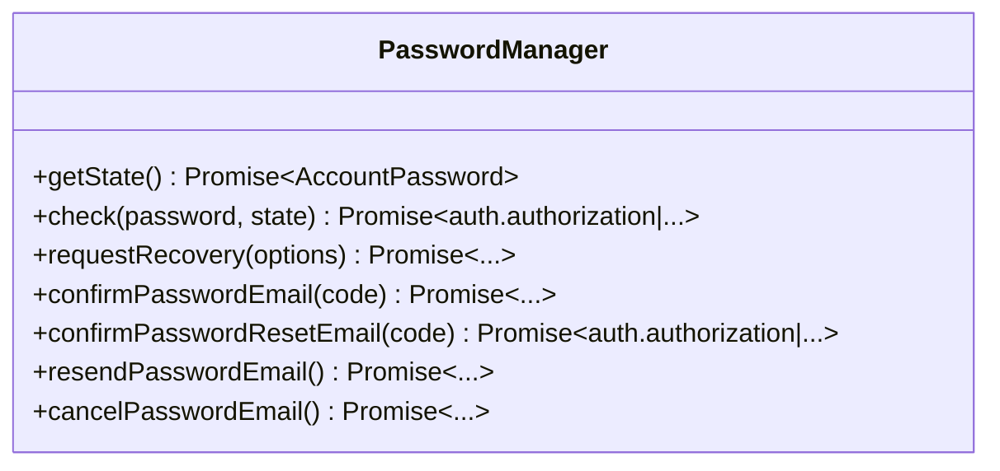
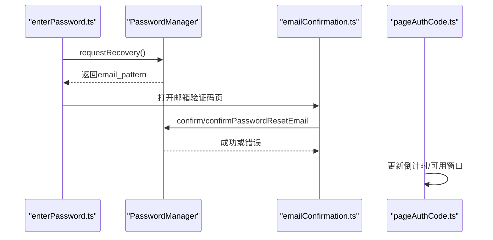
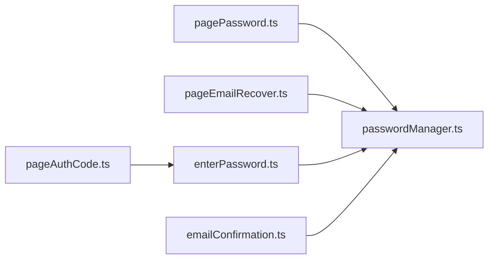

# 密码恢复

<cite>
**本文引用的文件**
- [src/pages/pagePassword.ts](file://src/pages/pagePassword.ts)
- [src/pages/pageEmailRecover.ts](file://src/pages/pageEmailRecover.ts)
- [src/lib/mtproto/passwordManager.ts](file://src/lib/mtproto/passwordManager.ts)
- [src/components/sidebarLeft/tabs/2fa/enterPassword.ts](file://src/components/sidebarLeft/tabs/2fa/enterPassword.ts)
- [src/components/sidebarLeft/tabs/2fa/emailConfirmation.ts](file://src/components/sidebarLeft/tabs/2fa/emailConfirmation.ts)
- [src/pages/pageAuthCode.ts](file://src/pages/pageAuthCode.ts)
</cite>

## 目录
1. [简介](#简介)
2. [项目结构](#项目结构)
3. [核心组件](#核心组件)
4. [架构总览](#架构总览)
5. [详细组件分析](#详细组件分析)
6. [依赖关系分析](#依赖关系分析)
7. [性能考量](#性能考量)
8. [故障排查指南](#故障排查指南)
9. [结论](#结论)

## 简介
本文件面向“忘记密码”场景，系统性梳理从“密码页触发请求恢复”到“邮箱验证码校验并通过恢复码完成登录”的完整流程。重点覆盖以下方面：
- 触发机制：页面“忘记密码”链接如何调用恢复接口
- 邮箱验证界面：输入邮箱模式、发送验证码、输入验证码、跳转下一步
- 核心逻辑：恢复码生成与验证、邮箱所有权确认、旧密码凭证撤销、新密码策略强制执行
- 安全机制：恢复码有效期（通常15分钟）、单次使用限制、IP监控与异常活动检测
- 错误处理：无效恢复码、邮箱验证超时、频繁请求限制、安全锁定机制

## 项目结构
围绕密码恢复的关键文件组织如下：
- 页面层：密码页与邮箱验证码页负责用户交互与路由切换
- 管理器层：密码管理器封装与后端API的交互
- 两步验证侧边栏：提供“忘记密码”入口、倒计时与取消重置等能力
- 验证码页：处理邮件发送后的倒计时与可用窗口

图表来源
- [src/pages/pagePassword.ts](file://src/pages/pagePassword.ts#L54-L120)
- [src/pages/pageEmailRecover.ts](file://src/pages/pageEmailRecover.ts#L57-L81)
- [src/lib/mtproto/passwordManager.ts](file://src/lib/mtproto/passwordManager.ts#L99-L120)
- [src/components/sidebarLeft/tabs/2fa/enterPassword.ts](file://src/components/sidebarLeft/tabs/2fa/enterPassword.ts#L80-L138)
- [src/components/sidebarLeft/tabs/2fa/emailConfirmation.ts](file://src/components/sidebarLeft/tabs/2fa/emailConfirmation.ts#L69-L114)
- [src/pages/pageAuthCode.ts](file://src/pages/pageAuthCode.ts#L212-L234)

章节来源
- [src/pages/pagePassword.ts](file://src/pages/pagePassword.ts#L54-L120)
- [src/pages/pageEmailRecover.ts](file://src/pages/pageEmailRecover.ts#L57-L81)
- [src/lib/mtproto/passwordManager.ts](file://src/lib/mtproto/passwordManager.ts#L99-L120)
- [src/components/sidebarLeft/tabs/2fa/enterPassword.ts](file://src/components/sidebarLeft/tabs/2fa/enterPassword.ts#L80-L138)
- [src/components/sidebarLeft/tabs/2fa/emailConfirmation.ts](file://src/components/sidebarLeft/tabs/2fa/emailConfirmation.ts#L69-L114)
- [src/pages/pageAuthCode.ts](file://src/pages/pageAuthCode.ts#L212-L234)

## 核心组件
- 密码页（pagePassword.ts）
  - 提供“忘记密码”链接，点击后调用密码管理器请求恢复，并在成功后跳转至邮箱验证码页
  - 若服务端返回“无恢复邮箱”，则弹出二次确认并尝试删除账户
- 邮箱验证码页（pageEmailRecover.ts）
  - 展示倒计时提示与邮箱占位符，监听6位验证码输入框填满事件
  - 调用密码管理器进行验证码确认，成功后进入主界面
- 密码管理器（passwordManager.ts）
  - 封装与后端的交互：请求恢复、确认邮箱验证码、恢复密码、重发邮件、取消邮件
- 两步验证侧边栏（enterPassword.ts / emailConfirmation.ts）
  - 提供“忘记密码”入口、倒计时显示、取消重置、重发验证码等
- 验证码倒计时页（pageAuthCode.ts）
  - 显示重置等待时间、可用窗口与可提前重试逻辑

章节来源
- [src/pages/pagePassword.ts](file://src/pages/pagePassword.ts#L54-L120)
- [src/pages/pageEmailRecover.ts](file://src/pages/pageEmailRecover.ts#L57-L81)
- [src/lib/mtproto/passwordManager.ts](file://src/lib/mtproto/passwordManager.ts#L99-L120)
- [src/components/sidebarLeft/tabs/2fa/enterPassword.ts](file://src/components/sidebarLeft/tabs/2fa/enterPassword.ts#L80-L138)
- [src/components/sidebarLeft/tabs/2fa/emailConfirmation.ts](file://src/components/sidebarLeft/tabs/2fa/emailConfirmation.ts#L69-L114)
- [src/pages/pageAuthCode.ts](file://src/pages/pageAuthCode.ts#L212-L234)

## 架构总览
下图展示了从“忘记密码”到“完成登录”的端到端调用序列。

图表来源
- [src/pages/pagePassword.ts](file://src/pages/pagePassword.ts#L54-L120)
- [src/pages/pageEmailRecover.ts](file://src/pages/pageEmailRecover.ts#L57-L81)
- [src/lib/mtproto/passwordManager.ts](file://src/lib/mtproto/passwordManager.ts#L99-L111)

## 详细组件分析

### 组件A：pagePassword.ts 中“忘记密码”触发机制
- 触发条件：用户点击“忘记密码”链接
- 流程要点：
  - 调用密码管理器的请求恢复方法
  - 成功后动态导入并挂载邮箱验证码页，传入邮箱模式参数
  - 若返回“无恢复邮箱”，弹出确认并尝试删除账户
- 关键路径
  - 忘记密码点击回调：[src/pages/pagePassword.ts](file://src/pages/pagePassword.ts#L54-L120)
  - 请求恢复调用：[src/lib/mtproto/passwordManager.ts](file://src/lib/mtproto/passwordManager.ts#L99-L101)

图表来源
- [src/pages/pagePassword.ts](file://src/pages/pagePassword.ts#L54-L120)
- [src/lib/mtproto/passwordManager.ts](file://src/lib/mtproto/passwordManager.ts#L99-L101)

章节来源
- [src/pages/pagePassword.ts](file://src/pages/pagePassword.ts#L54-L120)
- [src/lib/mtproto/passwordManager.ts](file://src/lib/mtproto/passwordManager.ts#L99-L101)

### 组件B：pageEmailRecover.ts 邮箱验证界面实现
- 功能点：
  - 展示邮箱占位符与倒计时文案
  - 6位验证码输入框，填满后自动触发确认
  - 确认失败时根据错误类型显示不同提示
  - 取消按钮返回密码页
- 关键路径
  - 验证码输入与确认：[src/pages/pageEmailRecover.ts](file://src/pages/pageEmailRecover.ts#L57-L81)
  - 密码管理器确认接口：[src/lib/mtproto/passwordManager.ts](file://src/lib/mtproto/passwordManager.ts#L103-L111)

图表来源
- [src/pages/pageEmailRecover.ts](file://src/pages/pageEmailRecover.ts#L57-L81)
- [src/lib/mtproto/passwordManager.ts](file://src/lib/mtproto/passwordManager.ts#L103-L111)

章节来源
- [src/pages/pageEmailRecover.ts](file://src/pages/pageEmailRecover.ts#L57-L81)
- [src/lib/mtproto/passwordManager.ts](file://src/lib/mtproto/passwordManager.ts#L103-L111)

### 组件C：passwordManager.ts 密码恢复核心逻辑
- 接口职责：
  - 获取当前密码状态
  - 检查旧密码（SRP）
  - 请求恢复（auth.requestPasswordRecovery）
  - 确认邮箱验证码（account.confirmPasswordEmail）
  - 恢复密码（auth.recoverPassword）
  - 重发邮件（account.resendPasswordEmail）
  - 取消邮件（account.cancelPasswordEmail）
- 关键路径
  - 请求恢复：[src/lib/mtproto/passwordManager.ts](file://src/lib/mtproto/passwordManager.ts#L99-L101)
  - 确认邮箱验证码：[src/lib/mtproto/passwordManager.ts](file://src/lib/mtproto/passwordManager.ts#L95-L97)
  - 恢复密码：[src/lib/mtproto/passwordManager.ts](file://src/lib/mtproto/passwordManager.ts#L103-L111)
  - 重发/取消邮件：[src/lib/mtproto/passwordManager.ts](file://src/lib/mtproto/passwordManager.ts#L113-L119)

图表来源
- [src/lib/mtproto/passwordManager.ts](file://src/lib/mtproto/passwordManager.ts#L17-L120)

章节来源
- [src/lib/mtproto/passwordManager.ts](file://src/lib/mtproto/passwordManager.ts#L17-L120)

### 组件D：两步验证侧边栏与验证码倒计时
- 忘记密码入口与倒计时：
  - 提供“忘记密码”入口，显示等待时间与取消操作
  - 当到达可重置时间点，允许发起重置
- 邮箱验证码确认：
  - 输入验证码后调用确认接口
  - 支持错误类型区分：验证码无效、邮箱哈希过期
- 验证码倒计时页：
  - 显示重置等待时间、可用窗口与可提前重试逻辑

图表来源
- [src/components/sidebarLeft/tabs/2fa/enterPassword.ts](file://src/components/sidebarLeft/tabs/2fa/enterPassword.ts#L80-L138)
- [src/components/sidebarLeft/tabs/2fa/emailConfirmation.ts](file://src/components/sidebarLeft/tabs/2fa/emailConfirmation.ts#L69-L114)
- [src/pages/pageAuthCode.ts](file://src/pages/pageAuthCode.ts#L212-L234)

章节来源
- [src/components/sidebarLeft/tabs/2fa/enterPassword.ts](file://src/components/sidebarLeft/tabs/2fa/enterPassword.ts#L80-L138)
- [src/components/sidebarLeft/tabs/2fa/emailConfirmation.ts](file://src/components/sidebarLeft/tabs/2fa/emailConfirmation.ts#L69-L114)
- [src/pages/pageAuthCode.ts](file://src/pages/pageAuthCode.ts#L212-L234)

## 依赖关系分析
- 页面与管理器
  - pagePassword.ts 依赖 PasswordManager 的 requestRecovery
  - pageEmailRecover.ts 依赖 PasswordManager 的 confirmPasswordResetEmail
- 侧边栏与管理器
  - enterPassword.ts 依赖 PasswordManager 的 requestRecovery 与 account.resetPassword（在侧边栏中）
  - emailConfirmation.ts 依赖 PasswordManager 的 confirm/confirmPasswordResetEmail
- 倒计时与可用窗口
  - pageAuthCode.ts 负责渲染等待时间与可用窗口，配合侧边栏倒计时逻辑

图表来源
- [src/pages/pagePassword.ts](file://src/pages/pagePassword.ts#L54-L120)
- [src/pages/pageEmailRecover.ts](file://src/pages/pageEmailRecover.ts#L57-L81)
- [src/lib/mtproto/passwordManager.ts](file://src/lib/mtproto/passwordManager.ts#L99-L111)
- [src/components/sidebarLeft/tabs/2fa/enterPassword.ts](file://src/components/sidebarLeft/tabs/2fa/enterPassword.ts#L80-L138)
- [src/components/sidebarLeft/tabs/2fa/emailConfirmation.ts](file://src/components/sidebarLeft/tabs/2fa/emailConfirmation.ts#L69-L114)
- [src/pages/pageAuthCode.ts](file://src/pages/pageAuthCode.ts#L212-L234)

章节来源
- [src/pages/pagePassword.ts](file://src/pages/pagePassword.ts#L54-L120)
- [src/pages/pageEmailRecover.ts](file://src/pages/pageEmailRecover.ts#L57-L81)
- [src/lib/mtproto/passwordManager.ts](file://src/lib/mtproto/passwordManager.ts#L99-L111)
- [src/components/sidebarLeft/tabs/2fa/enterPassword.ts](file://src/components/sidebarLeft/tabs/2fa/enterPassword.ts#L80-L138)
- [src/components/sidebarLeft/tabs/2fa/emailConfirmation.ts](file://src/components/sidebarLeft/tabs/2fa/emailConfirmation.ts#L69-L114)
- [src/pages/pageAuthCode.ts](file://src/pages/pageAuthCode.ts#L212-L234)

## 性能考量
- 交互响应
  - 验证码输入采用“填满即触发”，减少多余点击
  - 加载动画与预加载指示器提升感知速度
- 网络请求
  - 请求恢复与确认均走统一管理器封装，便于统一错误处理与重试策略
- 资源占用
  - 页面卸载时清理输入框与定时器，避免内存泄漏

## 故障排查指南
- 无效恢复码
  - 现象：验证码输入后提示无效
  - 处理：清空输入并提示“验证码无效”
  - 参考：[src/pages/pageEmailRecover.ts](file://src/pages/pageEmailRecover.ts#L73-L78)
- 邮箱验证超时/过期
  - 现象：提示“验证码已过期”
  - 处理：重新请求恢复或重发邮件
  - 参考：[src/components/sidebarLeft/tabs/2fa/emailConfirmation.ts](file://src/components/sidebarLeft/tabs/2fa/emailConfirmation.ts#L99-L104)
- 频繁请求限制
  - 现象：短时间内重复请求被拒绝
  - 处理：显示等待时间或可用窗口，引导稍后再试
  - 参考：[src/pages/pageAuthCode.ts](file://src/pages/pageAuthCode.ts#L212-L234)
- 安全锁定机制
  - 现象：出现“需要二次确认”或“等待更长时间”的提示
  - 处理：按提示完成二次确认或等待
  - 参考：[src/pages/pagePassword.ts](file://src/pages/pagePassword.ts#L90-L112)

章节来源
- [src/pages/pageEmailRecover.ts](file://src/pages/pageEmailRecover.ts#L73-L78)
- [src/components/sidebarLeft/tabs/2fa/emailConfirmation.ts](file://src/components/sidebarLeft/tabs/2fa/emailConfirmation.ts#L99-L104)
- [src/pages/pageAuthCode.ts](file://src/pages/pageAuthCode.ts#L212-L234)
- [src/pages/pagePassword.ts](file://src/pages/pagePassword.ts#L90-L112)

## 结论
该实现以“页面层-管理器层-侧边栏/倒计时页”的分层设计，清晰地完成了“忘记密码”的端到端流程。核心在于：
- 通过密码管理器统一封装与后端交互
- 在页面层完成用户引导与错误提示
- 在侧边栏与倒计时页提供等待与重试能力
- 错误类型明确区分，便于针对性处理

安全方面，代码体现了对验证码有效性、过期时间、重试窗口与二次确认等关键控制点的关注；同时保留了删除账户等极端保护措施的入口，以应对无恢复邮箱场景。