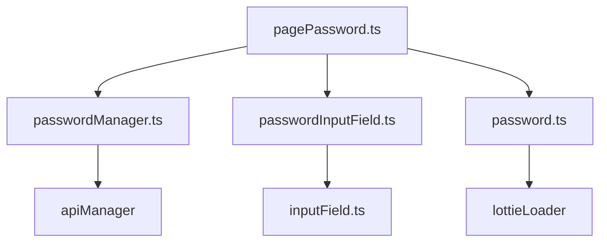
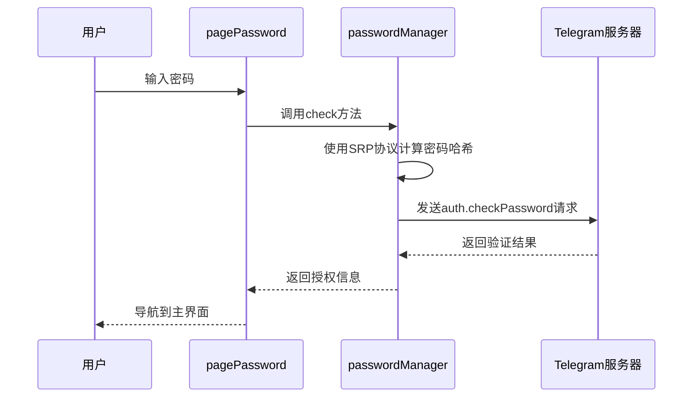
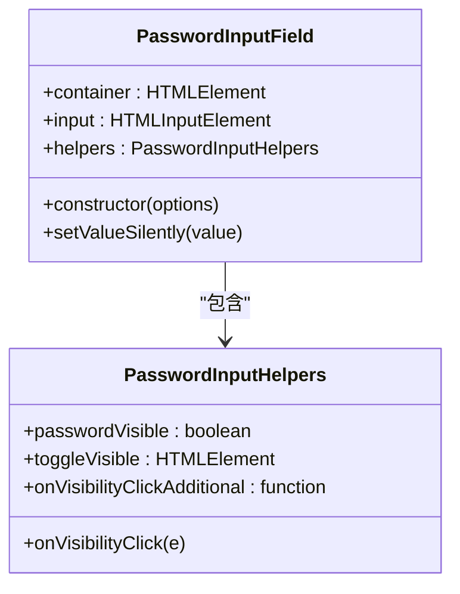
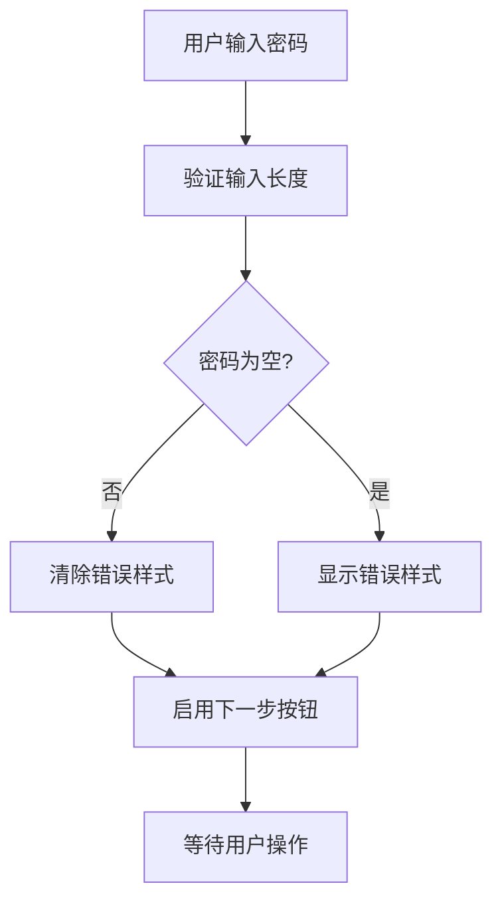
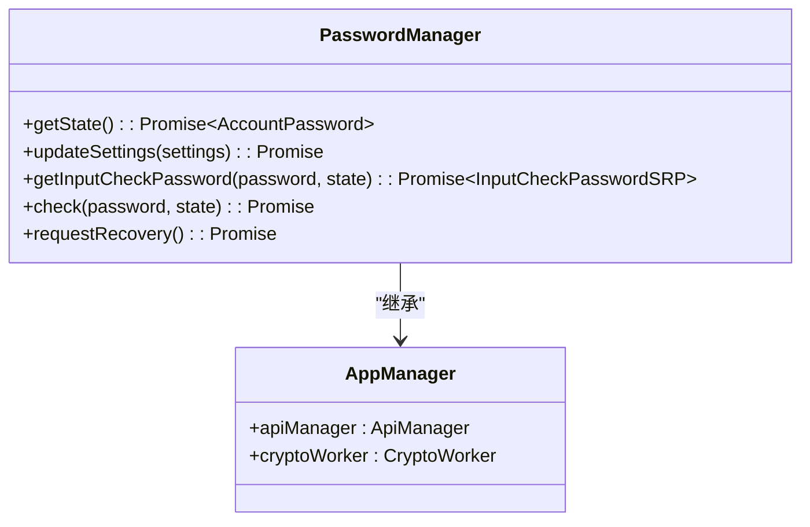
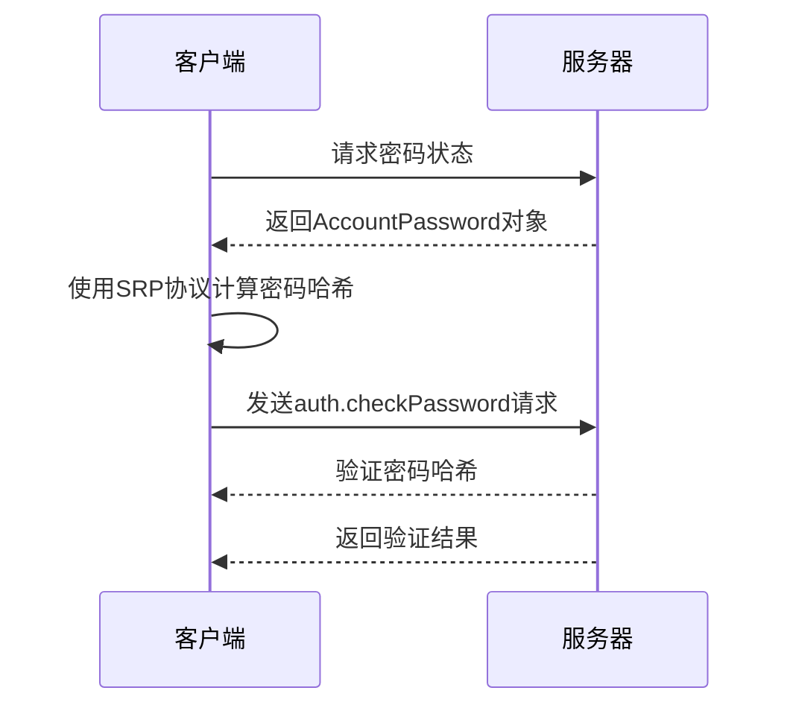
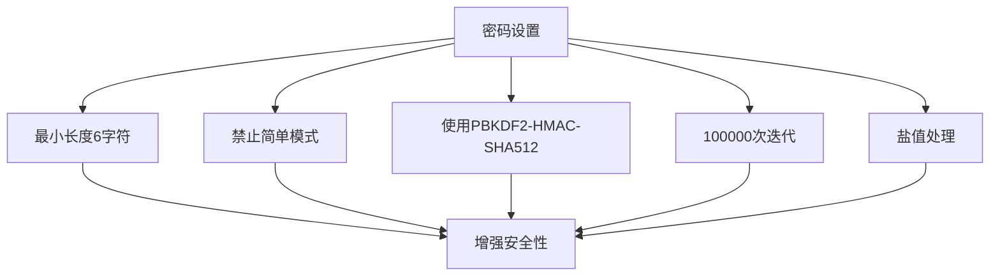
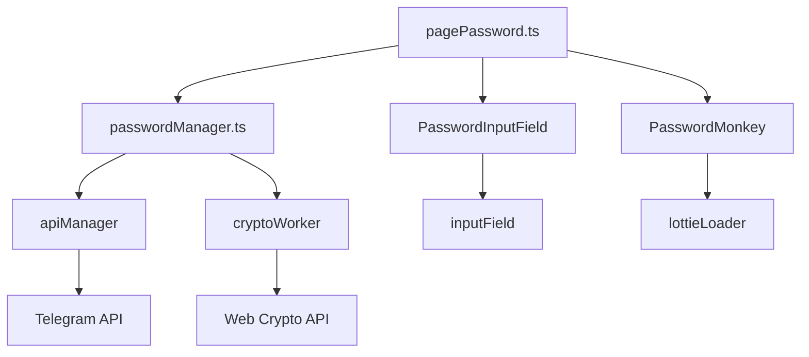

# 密码设置

<cite>
**本文档中引用的文件**  
- [pagePassword.ts](file://src/pages/pagePassword.ts)
- [passwordManager.ts](file://src/lib/mtproto/passwordManager.ts)
- [passwordInputField.ts](file://src/components/passwordInputField.ts)
- [password.ts](file://src/components/monkeys/password.ts)
</cite>

## 目录
1. [简介](#简介)
2. [项目结构](#项目结构)
3. [核心组件](#核心组件)
4. [架构概述](#架构概述)
5. [详细组件分析](#详细组件分析)
6. [依赖分析](#依赖分析)
7. [性能考虑](#性能考虑)
8. [故障排除指南](#故障排除指南)
9. [结论](#结论)

## 简介
本文档详细介绍了Telegram Web客户端中用户首次设置账户密码的完整流程。重点分析了密码设置界面的实现机制、密码管理器的核心逻辑、密码安全策略以及错误处理机制。文档涵盖了从用户界面交互到后端加密协议的完整技术实现，为开发人员和安全研究人员提供了全面的技术参考。

## 项目结构
密码设置功能分布在多个关键文件中，形成了清晰的分层架构。主要组件包括页面控制器、密码管理器、输入字段组件和动画组件。

**图示来源**  
- [pagePassword.ts](file://src/pages/pagePassword.ts#L1-L232)
- [passwordManager.ts](file://src/lib/mtproto/passwordManager.ts#L1-L121)

**本节来源**  
- [pagePassword.ts](file://src/pages/pagePassword.ts#L1-L232)
- [passwordManager.ts](file://src/lib/mtproto/passwordManager.ts#L1-L121)

## 核心组件
密码设置系统由四个核心组件构成：页面控制器负责用户界面的渲染和事件处理，密码管理器处理密码验证和更新逻辑，密码输入字段组件提供用户输入界面，猴子动画组件增强用户体验。

**本节来源**  
- [pagePassword.ts](file://src/pages/pagePassword.ts#L1-L232)
- [passwordManager.ts](file://src/lib/mtproto/passwordManager.ts#L1-L121)

## 架构概述
密码设置流程采用客户端-服务器架构，结合了安全远程密码(SRP)协议和PBKDF2哈希算法。整个流程确保密码在传输和存储过程中的安全性。

**图示来源**  
- [pagePassword.ts](file://src/pages/pagePassword.ts#L147-L209)
- [passwordManager.ts](file://src/lib/mtproto/passwordManager.ts#L80-L92)

## 详细组件分析

### 密码设置界面分析
密码设置界面实现了完整的用户交互流程，包括密码输入、验证和错误处理。

#### 用户界面组件

**图示来源**  
- [passwordInputField.ts](file://src/components/passwordInputField.ts#L1-L71)

#### 密码强度检测机制
系统通过实时事件监听实现密码强度检测，当用户输入密码时触发验证流程。

**图示来源**  
- [pagePassword.ts](file://src/pages/pagePassword.ts#L203-L209)

### 密码管理器分析
密码管理器实现了密码验证和更新的核心逻辑，采用安全的加密协议保护用户密码。

#### 核心逻辑实现

**图示来源**  
- [passwordManager.ts](file://src/lib/mtproto/passwordManager.ts#L16-L121)

#### SRP协议实现
密码管理器使用安全远程密码(SRP)协议进行密码验证，确保密码不会以明文形式传输。

**图示来源**  
- [passwordManager.ts](file://src/lib/mtproto/passwordManager.ts#L76-L92)

### 密码安全策略
系统实施了严格的密码安全策略，确保用户密码的强度和安全性。

#### 密码复杂度要求

**图示来源**  
- [passwordManager.ts](file://src/lib/mtproto/passwordManager.ts#L53-L57)

## 依赖分析
密码设置功能依赖于多个核心模块，形成了完整的依赖链。

**图示来源**  
- [pagePassword.ts](file://src/pages/pagePassword.ts#L7-L26)
- [passwordManager.ts](file://src/lib/mtproto/passwordManager.ts#L12-L15)

**本节来源**  
- [pagePassword.ts](file://src/pages/pagePassword.ts#L1-L232)
- [passwordManager.ts](file://src/lib/mtproto/passwordManager.ts#L1-L121)

## 性能考虑
密码设置流程在保证安全性的同时，也考虑了性能优化。

- **加密计算**：密码哈希计算在Web Worker中执行，避免阻塞主线程
- **动画优化**：猴子动画使用Lottie库进行高效渲染
- **网络请求**：密码状态检查采用定时轮询机制，平衡实时性和网络负载
- **内存管理**：动画资源在不需要时及时释放，避免内存泄漏

## 故障排除指南
密码设置过程中可能遇到各种错误情况，系统提供了相应的处理机制。

**本节来源**  
- [pagePassword.ts](file://src/pages/pagePassword.ts#L183-L198)
- [passwordManager.ts](file://src/lib/mtproto/passwordManager.ts#L95-L119)

### 常见错误处理
- **密码哈希无效**：当密码验证失败时，显示"PASSWORD_HASH_INVALID"错误
- **网络超时**：API调用设置超时机制，超时后提示用户重试
- **服务器验证失败**：捕获API错误并显示相应的用户友好消息
- **重复密码检测**：通过输入字段的autocomplete属性防止浏览器自动填充

## 结论
Telegram Web客户端的密码设置流程实现了高安全性和良好用户体验的平衡。通过SRP协议和PBKDF2哈希算法确保密码安全，同时通过直观的界面设计和动画效果提升用户体验。系统架构清晰，组件职责分明，为密码管理功能提供了可靠的技术基础。