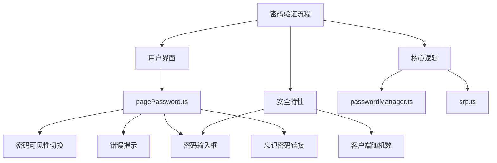
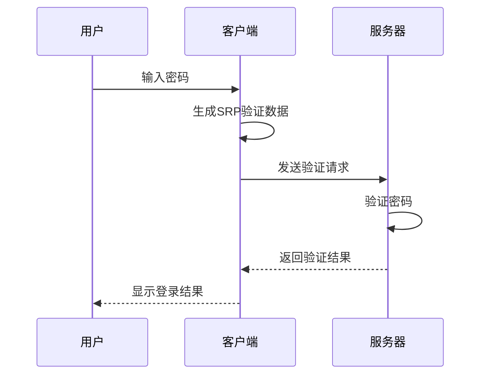
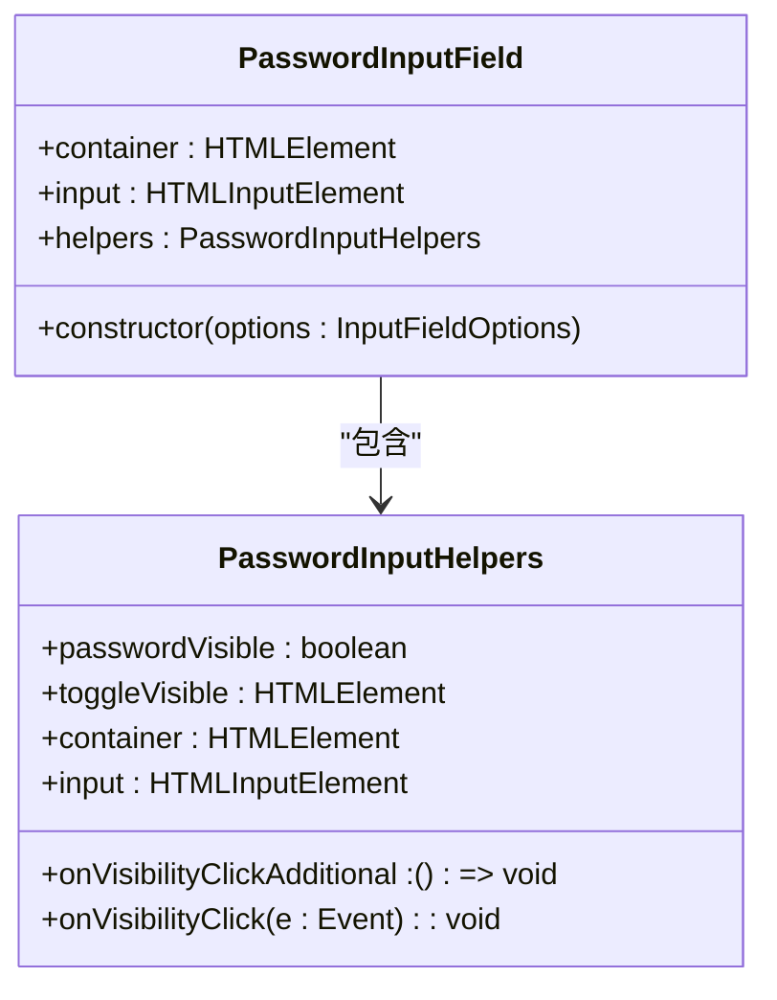
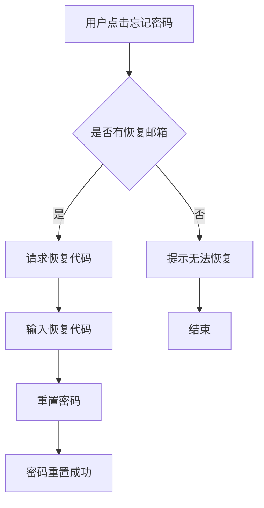
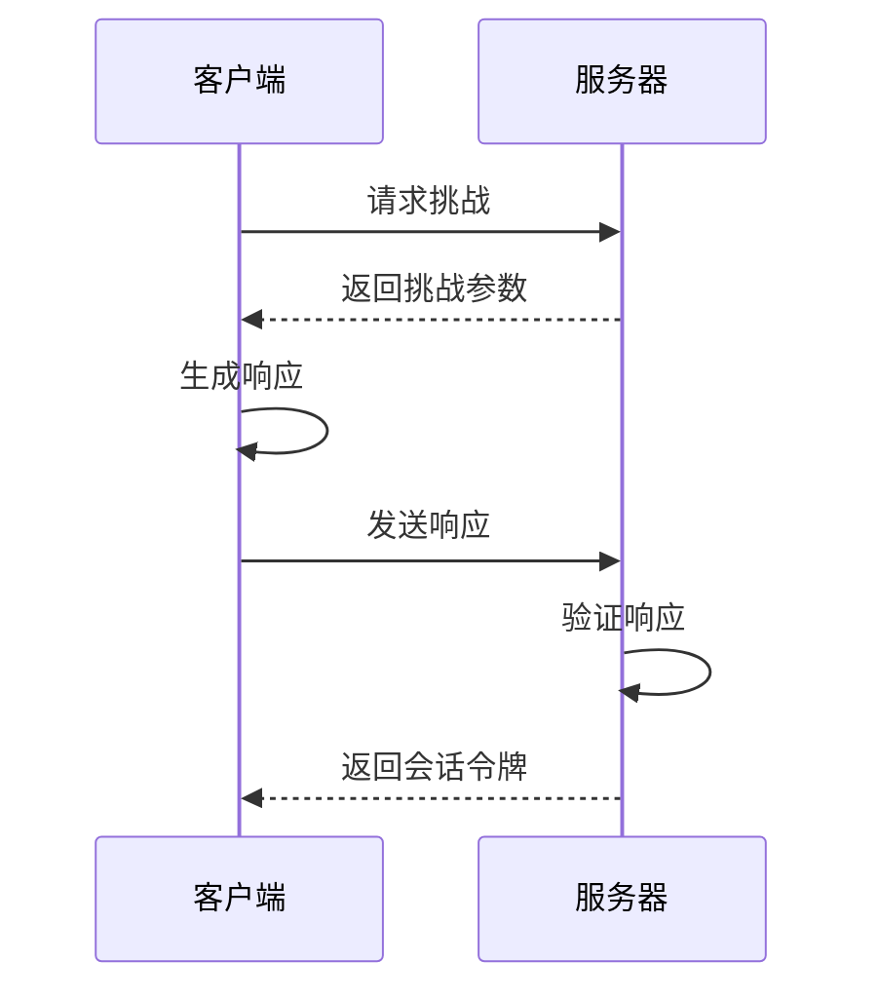
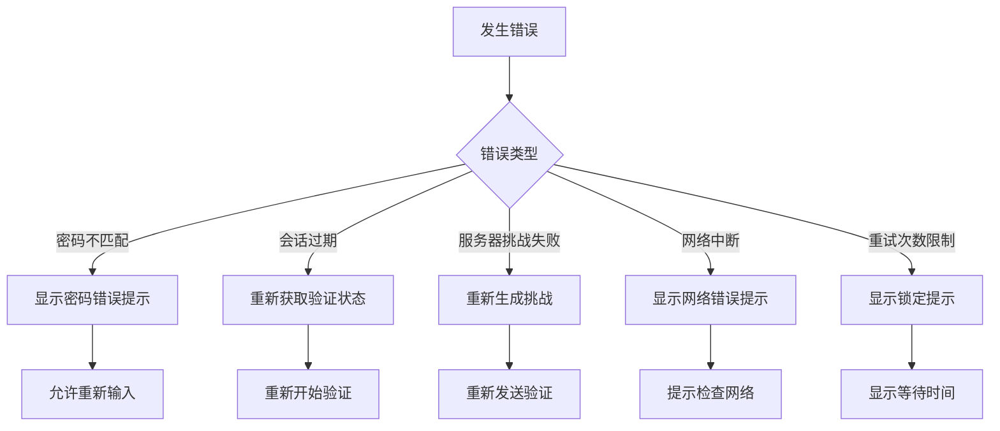
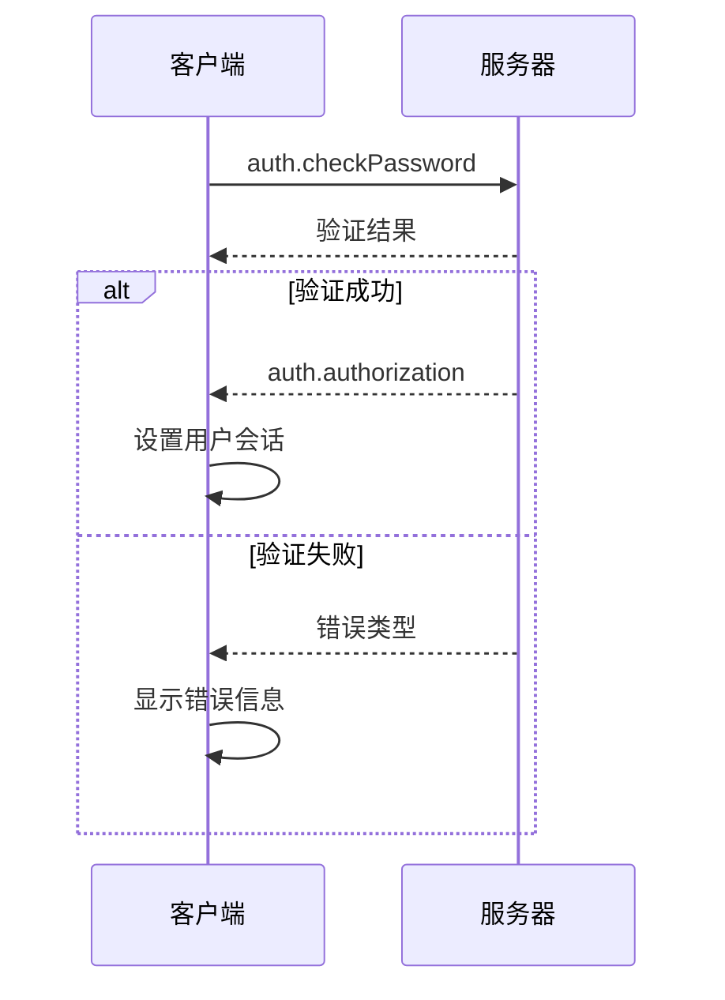

# 密码验证

<cite>
**本文档中引用的文件**  
- [pagePassword.ts](file://src/pages/pagePassword.ts)
- [passwordManager.ts](file://src/lib/mtproto/passwordManager.ts)
- [srp.ts](file://src/lib/crypto/srp.ts)
- [passwordInputField.ts](file://src/components/passwordInputField.ts)
- [password.ts](file://src/components/monkeys/password.ts)
</cite>

## 目录
1. [简介](#简介)
2. [项目结构](#项目结构)
3. [核心组件](#核心组件)
4. [密码验证流程](#密码验证流程)
5. [用户界面实现](#用户界面实现)
6. [安全特性](#安全特性)
7. [错误处理](#错误处理)
8. [API调用流程](#api调用流程)
9. [结论](#结论)

## 简介
本文档详细介绍了用户登录时验证账户密码的完整流程。重点分析了密码验证界面的实现、核心验证逻辑、安全特性以及错误处理机制。文档涵盖了从用户输入密码到服务器验证的整个过程，包括客户端生成的随机数、挑战-响应机制和会话令牌的生成与验证。

## 项目结构
该项目的密码验证功能主要分布在以下几个目录中：
- `src/pages/`：包含密码验证页面的实现
- `src/lib/mtproto/`：包含密码管理器和核心验证逻辑
- `src/lib/crypto/`：包含SRP协议的加密实现
- `src/components/`：包含密码输入框和相关UI组件

**Diagram sources**
- [pagePassword.ts](file://src/pages/pagePassword.ts#L1-L232)
- [passwordManager.ts](file://src/lib/mtproto/passwordManager.ts#L1-L121)
- [srp.ts](file://src/lib/crypto/srp.ts#L1-L167)

**Section sources**
- [pagePassword.ts](file://src/pages/pagePassword.ts#L1-L232)
- [passwordManager.ts](file://src/lib/mtproto/passwordManager.ts#L1-L121)

## 核心组件
密码验证系统由多个核心组件组成，包括密码输入组件、密码管理器、SRP协议实现和用户界面组件。这些组件协同工作，确保密码验证过程的安全性和可靠性。

**Section sources**
- [passwordInputField.ts](file://src/components/passwordInputField.ts#L1-L71)
- [passwordManager.ts](file://src/lib/mtproto/passwordManager.ts#L1-L121)
- [srp.ts](file://src/lib/crypto/srp.ts#L1-L167)

## 密码验证流程
密码验证流程采用安全的SRP（Secure Remote Password）协议，确保密码在传输过程中不会被泄露。流程包括以下步骤：

1. 客户端获取密码验证状态
2. 用户输入密码
3. 客户端使用SRP协议生成验证数据
4. 向服务器发送验证请求
5. 服务器验证并返回结果

**Diagram sources**
- [passwordManager.ts](file://src/lib/mtproto/passwordManager.ts#L80-L93)
- [srp.ts](file://src/lib/crypto/srp.ts#L31-L166)

**Section sources**
- [passwordManager.ts](file://src/lib/mtproto/passwordManager.ts#L80-L93)
- [srp.ts](file://src/lib/crypto/srp.ts#L31-L166)

## 用户界面实现
密码验证界面的实现包括密码输入框、密码可见性切换按钮、错误提示机制和"忘记密码"恢复链接。

### 密码输入框
密码输入框组件提供了安全的密码输入功能，包括：
- 密码掩码显示
- 密码可见性切换
- 输入验证
- 错误提示

**Diagram sources**
- [passwordInputField.ts](file://src/components/passwordInputField.ts#L11-L70)

**Section sources**
- [passwordInputField.ts](file://src/components/passwordInputField.ts#L1-L71)
- [pagePassword.ts](file://src/pages/pagePassword.ts#L46-L52)

### 密码可见性切换
密码可见性切换功能允许用户在输入密码时选择是否显示明文密码，提高用户体验的同时保持安全性。

### 错误提示机制
系统实现了完善的错误提示机制，包括：
- 输入为空时的提示
- 密码错误时的提示
- 服务器错误时的提示
- 网络中断时的提示

### "忘记密码"恢复链接
"忘记密码"链接提供了密码恢复功能，用户可以通过注册的邮箱重置密码。

**Diagram sources**
- [pagePassword.ts](file://src/pages/pagePassword.ts#L54-L120)
- [passwordManager.ts](file://src/lib/mtproto/passwordManager.ts#L99-L101)

**Section sources**
- [pagePassword.ts](file://src/pages/pagePassword.ts#L54-L120)

## 安全特性
密码验证系统实现了多项安全特性，确保用户账户的安全。

### SRP协议实现
系统采用SRP（Secure Remote Password）协议进行密码验证，该协议具有以下安全优势：
- 密码不会在网络上传输
- 服务器不存储明文密码
- 防止中间人攻击
- 防止重放攻击

### 客户端生成的随机数
客户端生成随机数用于增强密码验证的安全性，防止预计算攻击。

### 挑战-响应机制
系统采用挑战-响应机制，每次验证都会生成新的挑战，防止重放攻击。

### 会话令牌的生成与验证
成功验证后，系统会生成会话令牌，用于后续的API调用验证。

**Diagram sources**
- [srp.ts](file://src/lib/crypto/srp.ts#L31-L166)
- [passwordManager.ts](file://src/lib/mtproto/passwordManager.ts#L76-L78)

**Section sources**
- [srp.ts](file://src/lib/crypto/srp.ts#L1-L167)
- [passwordManager.ts](file://src/lib/mtproto/passwordManager.ts#L76-L78)

## 错误处理
系统实现了完善的错误处理机制，能够处理各种验证过程中的异常情况。

### 常见错误类型
- 密码不匹配
- 会话过期
- 服务器挑战失败
- 网络中断
- 重试次数限制

### 错误处理流程

**Diagram sources**
- [pagePassword.ts](file://src/pages/pagePassword.ts#L183-L196)
- [passwordManager.ts](file://src/lib/mtproto/passwordManager.ts#L80-L93)

**Section sources**
- [pagePassword.ts](file://src/pages/pagePassword.ts#L183-L196)

## API调用流程
密码验证过程涉及多个API调用，确保验证的安全性和可靠性。

### 请求参数结构
验证请求包含以下参数：
- srp_id：SRP会话ID
- A：客户端公钥
- M1：客户端证明

### 服务器响应处理
服务器响应可能包含以下状态：
- auth.authorization：验证成功
- PASSWORD_HASH_INVALID：密码错误
- SESSION_PASSWORD_NEEDED：需要密码验证

### 多因素认证集成
系统支持多因素认证，包括：
- 邮箱验证
- 恢复代码验证
- 会话管理

**Diagram sources**
- [passwordManager.ts](file://src/lib/mtproto/passwordManager.ts#L83-L85)
- [apiManager.ts](file://src/lib/mtproto/apiManager.ts#L690-L722)

**Section sources**
- [passwordManager.ts](file://src/lib/mtproto/passwordManager.ts#L80-L93)

## 结论
本文档详细介绍了密码验证系统的实现细节，包括用户界面、核心逻辑、安全特性和错误处理。系统采用SRP协议确保密码验证的安全性，通过客户端生成的随机数和挑战-响应机制防止各种攻击。同时，系统提供了友好的用户界面和完善的错误处理机制，确保用户能够顺利完成密码验证过程。