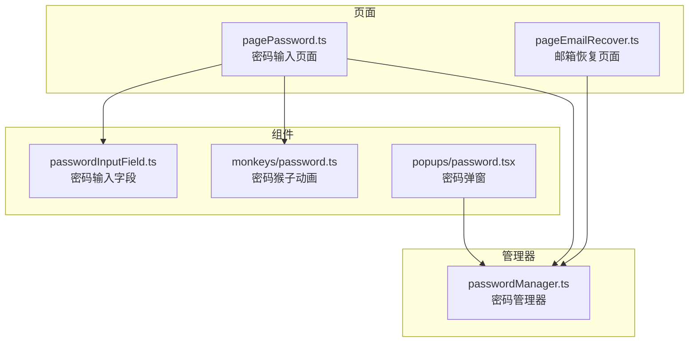
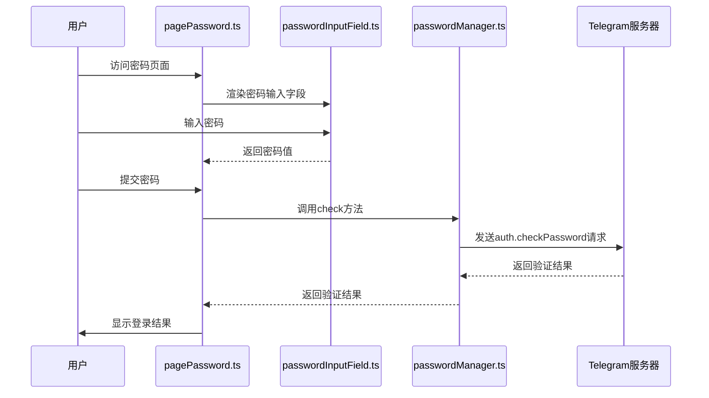
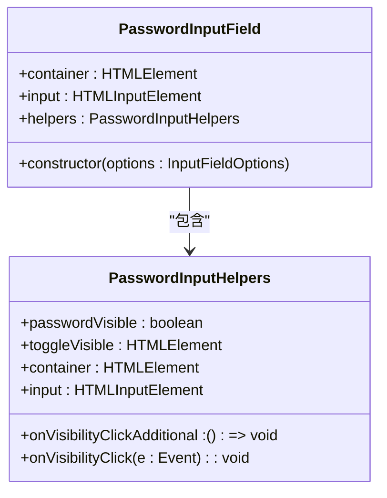
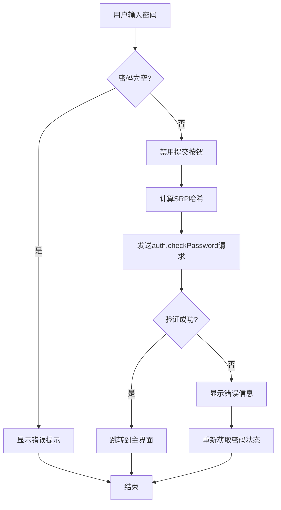
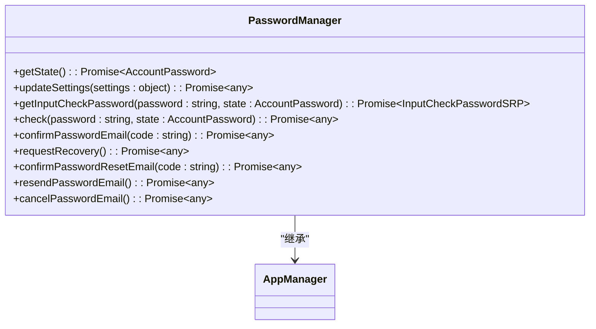
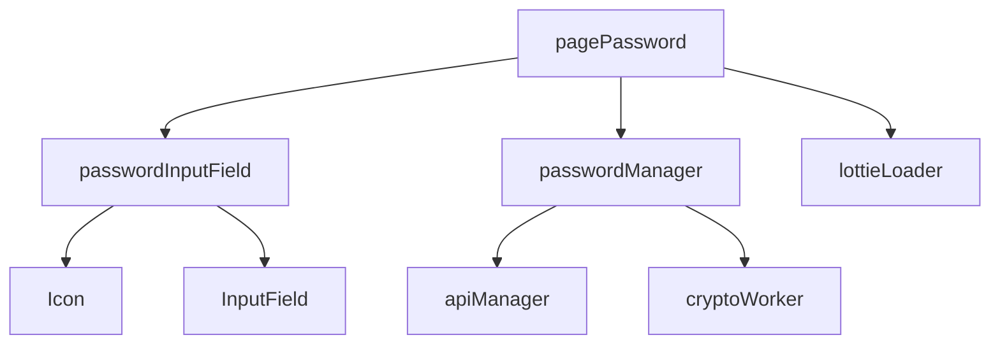

# 账户密码

<cite>
**本文档中引用的文件**  
- [pagePassword.ts](file://src/pages/pagePassword.ts)
- [passwordManager.ts](file://src/lib/mtproto/passwordManager.ts)
- [passwordInputField.ts](file://src/components/passwordInputField.ts)
- [password.ts](file://src/components/monkeys/password.ts)
- [pageEmailRecover.ts](file://src/pages/pageEmailRecover.ts)
- [password.tsx](file://src/components/popups/password.tsx)
</cite>

## 目录
1. [简介](#简介)
2. [项目结构](#项目结构)
3. [核心组件](#核心组件)
4. [架构概述](#架构概述)
5. [详细组件分析](#详细组件分析)
6. [依赖分析](#依赖分析)
7. [性能考虑](#性能考虑)
8. [故障排除指南](#故障排除指南)
9. [结论](#结论)

## 简介
本文档详细介绍了Telegram Web客户端中用户账户密码功能的实现，重点涵盖密码设置、验证和恢复流程。文档深入解析了密码输入界面的实现细节，包括密码可见性切换、强度指示器和错误提示机制。同时，文档还详细说明了与MTProto协议交互的核心密码操作，如设置新密码、验证现有密码、处理密码提示问题和恢复密码流程。此外，文档还包含了密码安全策略的实现细节，如最小长度要求、复杂度规则和恢复邮箱验证机制。

## 项目结构
项目结构清晰地组织了与账户密码功能相关的组件和管理器。核心密码功能主要分布在`src/pages`、`src/lib/mtproto`和`src/components`目录中。`pagePassword.ts`负责密码输入页面的渲染和用户交互，`passwordManager.ts`处理与Telegram服务器的密码相关API调用，而各种密码输入组件则位于`components`目录下。

**图表来源**  
- [pagePassword.ts](file://src/pages/pagePassword.ts#L1-L232)
- [passwordManager.ts](file://src/lib/mtproto/passwordManager.ts#L1-L121)
- [passwordInputField.ts](file://src/components/passwordInputField.ts#L1-L71)
- [password.ts](file://src/components/monkeys/password.ts#L1-L69)
- [pageEmailRecover.ts](file://src/pages/pageEmailRecover.ts#L1-L109)

**章节来源**
- [pagePassword.ts](file://src/pages/pagePassword.ts#L1-L232)
- [passwordManager.ts](file://src/lib/mtproto/passwordManager.ts#L1-L121)

## 核心组件
核心组件包括密码输入页面、密码管理器和密码输入字段。`pagePassword.ts`是用户输入密码的入口点，它集成了密码输入字段和密码猴子动画。`passwordManager.ts`是与Telegram服务器通信的核心，负责所有密码相关的API调用。`passwordInputField.ts`提供了密码输入的UI组件，包括可见性切换按钮。

**章节来源**
- [pagePassword.ts](file://src/pages/pagePassword.ts#L1-L232)
- [passwordManager.ts](file://src/lib/mtproto/passwordManager.ts#L1-L121)
- [passwordInputField.ts](file://src/components/passwordInputField.ts#L1-L71)

## 架构概述
系统架构采用分层设计，将用户界面、业务逻辑和网络通信分离。用户通过`pagePassword.ts`输入密码，该页面使用`passwordInputField.ts`组件处理用户输入。当用户提交密码时，`pagePassword.ts`调用`passwordManager.ts`中的方法进行密码验证。`passwordManager.ts`使用MTProto协议与Telegram服务器通信，执行密码验证、设置和恢复等操作。

**图表来源**  
- [pagePassword.ts](file://src/pages/pagePassword.ts#L1-L232)
- [passwordManager.ts](file://src/lib/mtproto/passwordManager.ts#L1-L121)

## 详细组件分析

### 密码输入页面分析
`pagePassword.ts`实现了密码输入页面的完整逻辑，包括密码输入、验证和错误处理。页面初始化时会加载密码猴子动画，并从服务器获取当前密码状态以显示密码提示。

#### 密码输入字段

**图表来源**  
- [passwordInputField.ts](file://src/components/passwordInputField.ts#L1-L71)

#### 密码验证流程

**图表来源**  
- [pagePassword.ts](file://src/pages/pagePassword.ts#L1-L232)
- [passwordManager.ts](file://src/lib/mtproto/passwordManager.ts#L1-L121)

**章节来源**
- [pagePassword.ts](file://src/pages/pagePassword.ts#L1-L232)
- [passwordManager.ts](file://src/lib/mtproto/passwordManager.ts#L1-L121)

### 密码管理器分析
`passwordManager.ts`是密码功能的核心，它封装了所有与密码相关的API调用。

#### 密码管理器类

**图表来源**  
- [passwordManager.ts](file://src/lib/mtproto/passwordManager.ts#L1-L121)

**章节来源**
- [passwordManager.ts](file://src/lib/mtproto/passwordManager.ts#L1-L121)

## 依赖分析
密码功能依赖于多个核心组件和外部服务。`pagePassword.ts`依赖于`passwordInputField.ts`和`passwordManager.ts`，而`passwordManager.ts`依赖于`apiManager`进行网络通信。此外，密码功能还依赖于Lottie动画库来显示密码猴子动画。

**图表来源**  
- [pagePassword.ts](file://src/pages/pagePassword.ts#L1-L232)
- [passwordManager.ts](file://src/lib/mtproto/passwordManager.ts#L1-L121)
- [passwordInputField.ts](file://src/components/passwordInputField.ts#L1-L71)

**章节来源**
- [pagePassword.ts](file://src/pages/pagePassword.ts#L1-L232)
- [passwordManager.ts](file://src/lib/mtproto/passwordManager.ts#L1-L121)

## 性能考虑
密码功能在性能方面进行了优化，主要体现在以下几个方面：
1. 使用Web Worker进行密码哈希计算，避免阻塞主线程
2. 对Lottie动画进行懒加载，减少初始页面加载时间
3. 使用Promise.all并行执行多个异步操作
4. 对API调用结果进行缓存，减少重复请求

## 故障排除指南
以下是常见的密码相关错误及其解决方案：

| 错误类型 | 描述 | 解决方案 |
|--------|------|--------|
| PASSWORD_HASH_INVALID | 密码哈希无效 | 检查密码是否正确，确认密码策略 |
| CODE_INVALID | 验证码无效 | 检查输入的验证码是否正确 |
| 2FA_RECENT_CONFIRM | 近期已确认 | 等待一段时间后重试 |
| 2FA_CONFIRM_WAIT_X | 等待X秒后重试 | 等待指定时间后重试 |
| FLOOD_WAIT_X | 操作过于频繁 | 等待指定时间后重试 |

**章节来源**
- [pagePassword.ts](file://src/pages/pagePassword.ts#L1-L232)
- [passwordManager.ts](file://src/lib/mtproto/passwordManager.ts#L1-L121)
- [pageEmailRecover.ts](file://src/pages/pageEmailRecover.ts#L1-L109)

## 结论
Telegram Web客户端的密码功能实现了完整的密码设置、验证和恢复流程。通过分层架构设计，将用户界面、业务逻辑和网络通信分离，提高了代码的可维护性和可测试性。密码安全方面采用了SRP协议进行密码验证，确保了密码在传输过程中的安全性。未来可以考虑增加密码强度实时检测和更详细的错误提示信息，以提升用户体验。