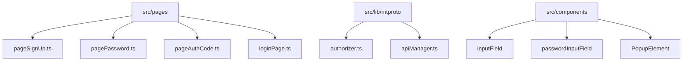
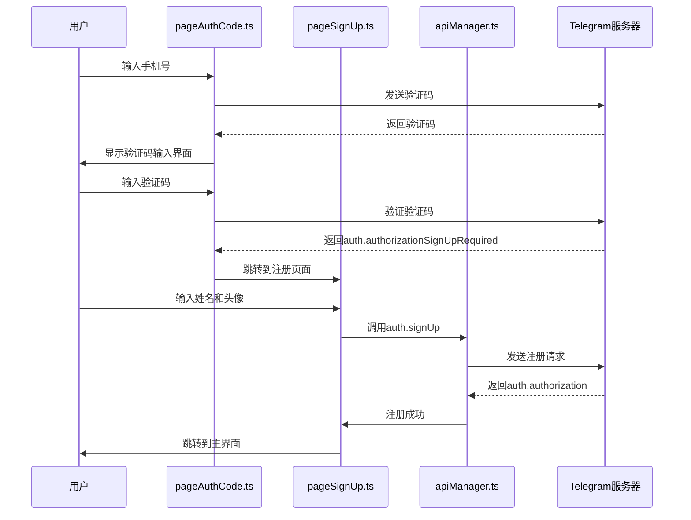
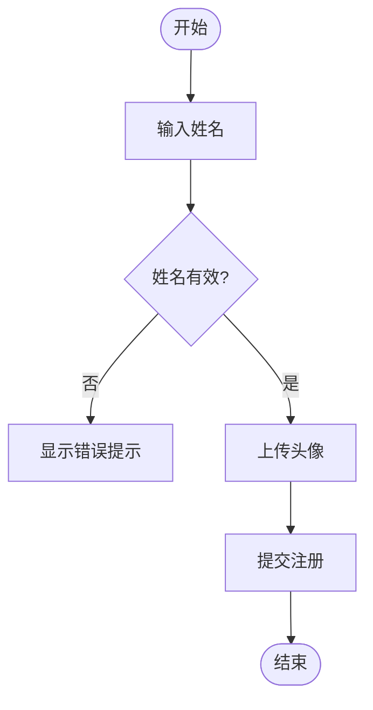
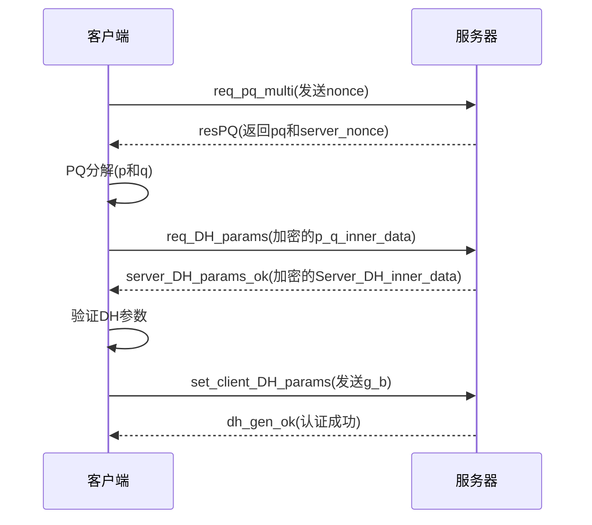
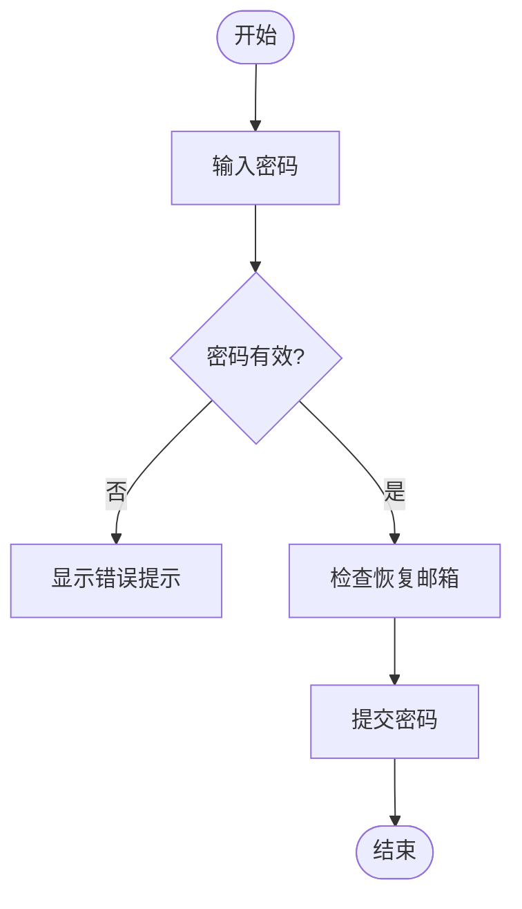
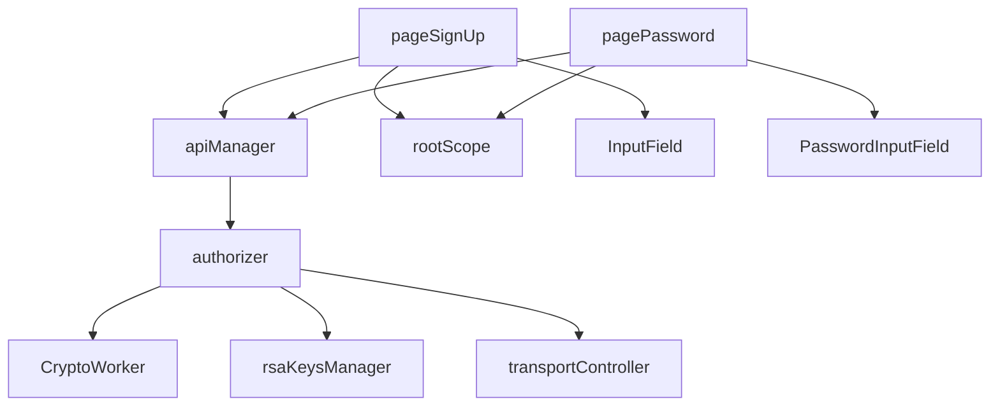

# 注册流程

<cite>
**本文档引用的文件**
- [pageSignUp.ts](file://src/pages/pageSignUp.ts)
- [authorizer.ts](file://src/lib/mtproto/authorizer.ts)
- [pagePassword.ts](file://src/pages/pagePassword.ts)
- [loginPage.ts](file://src/pages/loginPage.ts)
- [layer.d.ts](file://src/layer.d.ts)
- [pageAuthCode.ts](file://src/pages/pageAuthCode.ts)
</cite>

## 目录
1. [简介](#简介)
2. [项目结构](#项目结构)
3. [核心组件](#核心组件)
4. [架构概述](#架构概述)
5. [详细组件分析](#详细组件分析)
6. [依赖分析](#依赖分析)
7. [性能考虑](#性能考虑)
8. [故障排除指南](#故障排除指南)
9. [结论](#结论)
10. [附录](#附录)（如有必要）

## 简介
本文档详细描述了Telegram Web客户端的用户注册流程。文档涵盖了从手机号验证、姓名输入到隐私政策同意的完整注册过程。重点分析了用户信息收集表单的实现、MTProto协议调用细节、密码设置安全要求以及注册过程中的各种验证错误处理机制。

## 项目结构
本项目采用模块化结构，注册相关功能主要分布在`src/pages`目录下。核心注册流程涉及多个组件和管理器的协同工作。



**图表来源**
- [pageSignUp.ts](file://src/pages/pageSignUp.ts)
- [authorizer.ts](file://src/lib/mtproto/authorizer.ts)
- [pagePassword.ts](file://src/pages/pagePassword.ts)

**章节来源**
- [pageSignUp.ts](file://src/pages/pageSignUp.ts)
- [authorizer.ts](file://src/lib/mtproto/authorizer.ts)

## 核心组件
注册流程的核心组件包括`pageSignUp.ts`中的用户信息收集表单、`authorizer.ts`中的MTProto协议调用以及`pagePassword.ts`中的密码设置功能。这些组件共同实现了完整的用户注册和账户创建过程。

**章节来源**
- [pageSignUp.ts](file://src/pages/pageSignUp.ts#L26-L173)
- [authorizer.ts](file://src/lib/mtproto/authorizer.ts#L129-L662)
- [pagePassword.ts](file://src/pages/pagePassword.ts#L33-L232)

## 架构概述
注册流程遵循典型的客户端-服务器交互模式，通过MTProto协议与Telegram服务器进行安全通信。整个流程包括手机号验证、用户信息收集、密码设置和账户初始化等阶段。



**图表来源**
- [pageAuthCode.ts](file://src/pages/pageAuthCode.ts#L50-L84)
- [pageSignUp.ts](file://src/pages/pageSignUp.ts#L118-L137)
- [authorizer.ts](file://src/lib/mtproto/authorizer.ts)

## 详细组件分析
### 用户信息收集表单分析
`pageSignUp.ts`文件实现了用户注册时的信息收集功能，包括姓名输入、头像上传和注册提交。

#### 姓名输入和头像上传


**图表来源**
- [pageSignUp.ts](file://src/pages/pageSignUp.ts#L78-L117)

**章节来源**
- [pageSignUp.ts](file://src/pages/pageSignUp.ts#L26-L173)

### MTProto协议调用分析
`authorizer.ts`文件实现了MTProto协议的认证流程，包括密钥交换和安全通信建立。

#### 密钥交换流程


**图表来源**
- [authorizer.ts](file://src/lib/mtproto/authorizer.ts#L215-L608)

**章节来源**
- [authorizer.ts](file://src/lib/mtproto/authorizer.ts#L129-L662)

### 密码设置安全分析
`pagePassword.ts`文件实现了密码设置的安全要求和验证规则。

#### 密码验证流程


**图表来源**
- [pagePassword.ts](file://src/pages/pagePassword.ts#L147-L198)

**章节来源**
- [pagePassword.ts](file://src/pages/pagePassword.ts#L33-L232)

## 依赖分析
注册流程涉及多个组件和管理器的依赖关系，这些依赖确保了注册过程的完整性和安全性。



**图表来源**
- [pageSignUp.ts](file://src/pages/pageSignUp.ts)
- [pagePassword.ts](file://src/pages/pagePassword.ts)
- [authorizer.ts](file://src/lib/mtproto/authorizer.ts)

**章节来源**
- [pageSignUp.ts](file://src/pages/pageSignUp.ts)
- [pagePassword.ts](file://src/pages/pagePassword.ts)
- [authorizer.ts](file://src/lib/mtproto/authorizer.ts)

## 性能考虑
注册流程在性能方面进行了优化，包括异步加载、预加载和缓存机制。这些优化确保了注册过程的流畅性和响应速度。

## 故障排除指南
注册过程中可能遇到各种错误情况，系统提供了相应的错误处理和用户提示机制。

### 常见注册错误及处理
| 错误类型 | 用户提示 | 处理方式 |
|---------|--------|--------|
| PHONE_CODE_EXPIRED | 验证码已过期 | 重新发送验证码 |
| PHONE_CODE_INVALID | 验证码无效 | 重新输入验证码 |
| PASSWORD_HASH_INVALID | 密码不正确 | 重新输入密码 |
| PHONE_NUMBER_INVALID | 手机号无效 | 检查手机号格式 |
| PHONE_NUMBER_OCCUPIED | 手机号已被使用 | 使用其他手机号或登录 |

**章节来源**
- [pageAuthCode.ts](file://src/pages/pageAuthCode.ts#L90-L113)
- [pagePassword.ts](file://src/pages/pagePassword.ts#L183-L193)

## 结论
本文档详细分析了Telegram Web客户端的注册流程，涵盖了从用户界面到协议层的完整实现。注册流程设计合理，安全机制完善，为用户提供了流畅的注册体验。

## 附录
### 注册流程API调用
```typescript
// 注册请求参数
interface AuthSignUp {
  phone_number: string;
  phone_code_hash: string;
  first_name: string;
  last_name: string;
}

// 注册响应
interface AuthAuthorization {
  _: 'auth.authorization';
  user: User;
}
```

**章节来源**
- [layer.d.ts](file://src/layer.d.ts#L21389-L21390)
- [pageSignUp.ts](file://src/pages/pageSignUp.ts#L113-L117)