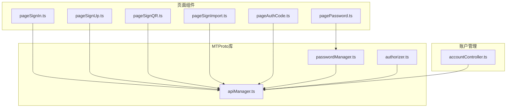
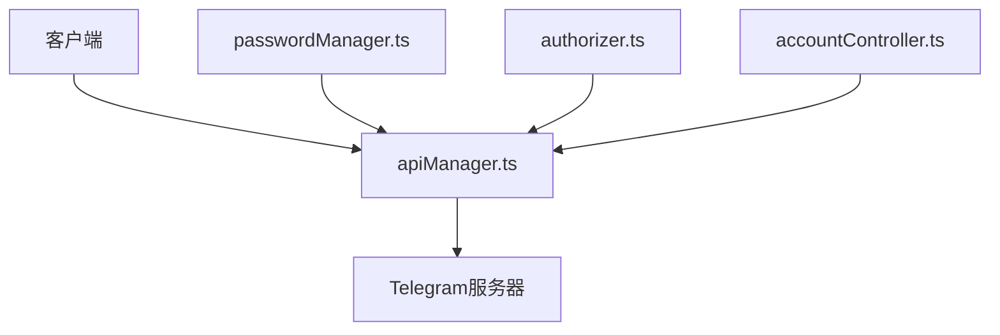
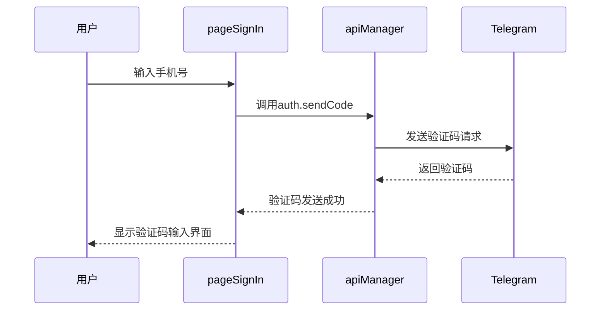
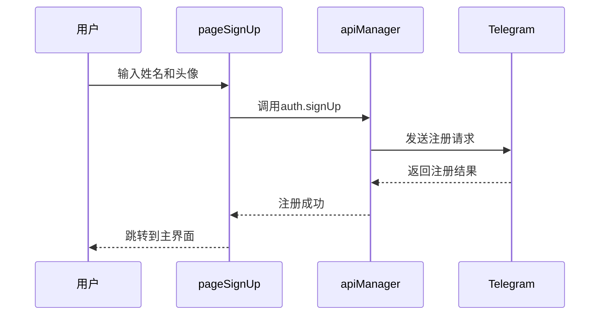
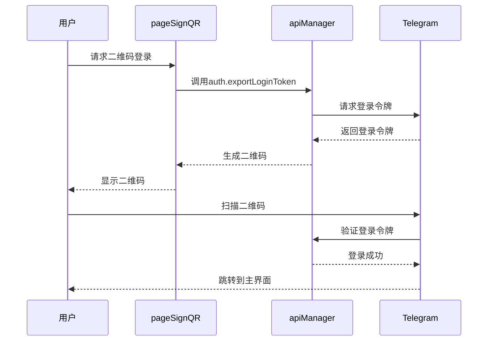
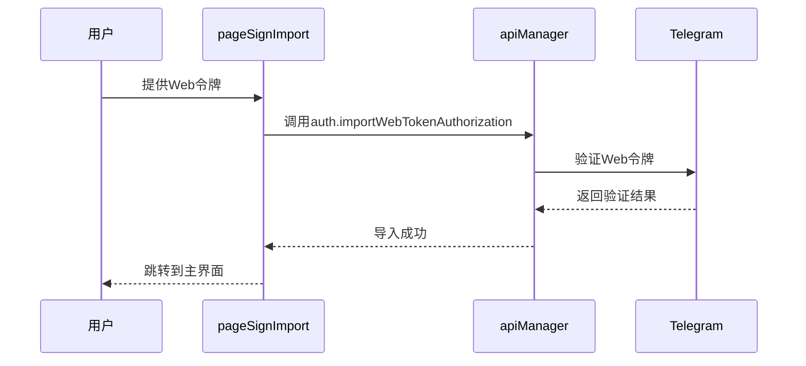
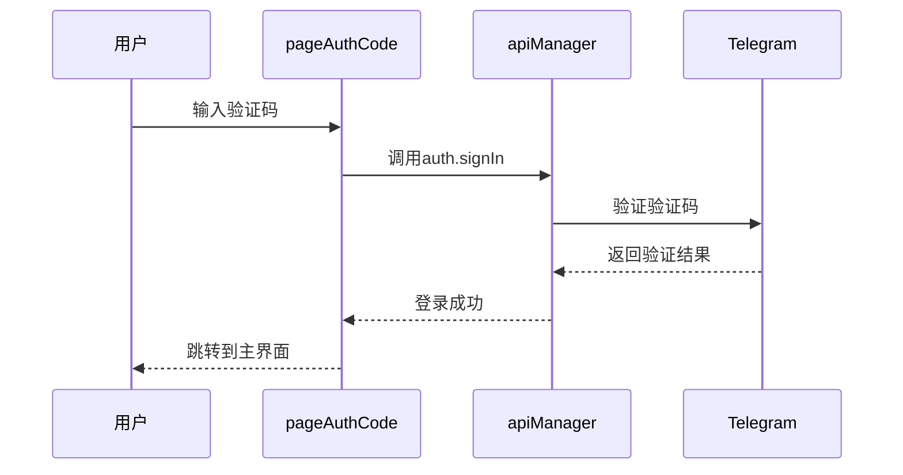
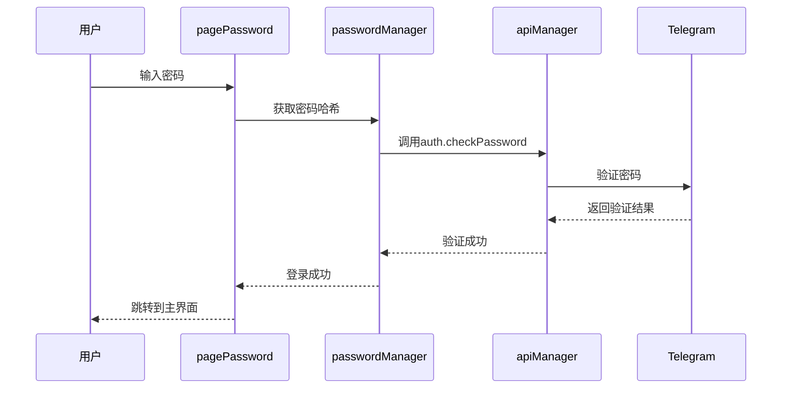
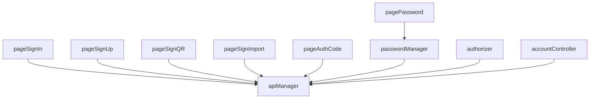

# 用户认证

<cite>
**本文档引用的文件**
- [pageSignIn.ts](file://src/pages/pageSignIn.ts)
- [pageSignUp.ts](file://src/pages/pageSignUp.ts)
- [pageSignQR.ts](file://src/pages/pageSignQR.ts)
- [pageSignImport.ts](file://src/pages/pageSignImport.ts)
- [pageAuthCode.ts](file://src/pages/pageAuthCode.ts)
- [pagePassword.ts](file://src/pages/pagePassword.ts)
- [apiManager.ts](file://src/lib/mtproto/apiManager.ts)
- [passwordManager.ts](file://src/lib/mtproto/passwordManager.ts)
- [authorizer.ts](file://src/lib/mtproto/authorizer.ts)
- [accountController.ts](file://src/lib/accounts/accountController.ts)
</cite>

## 目录
1. [简介](#简介)
2. [项目结构](#项目结构)
3. [核心组件](#核心组件)
4. [架构概述](#架构概述)
5. [详细组件分析](#详细组件分析)
6. [依赖分析](#依赖分析)
7. [性能考虑](#性能考虑)
8. [故障排除指南](#故障排除指南)
9. [结论](#结论)

## 简介
本文档全面解释了用户认证功能的实现细节，包括登录、注册、密码验证和账户导入。文档详细描述了与MTProto协议的集成方式和安全考虑，说明了二维码登录和短信验证码的工作流程。同时，文档记录了错误处理和用户体验优化策略，提供了API接口文档，包含请求/响应格式和状态码。此外，文档还包含了安全最佳实践，如密码存储和传输加密，并解释了多因素认证的实现。

## 项目结构
项目结构清晰地组织了用户认证相关的组件和文件。主要的认证功能实现在`src/pages`目录下的多个页面文件中，包括`pageSignIn.ts`、`pageSignUp.ts`、`pageSignQR.ts`、`pageSignImport.ts`、`pageAuthCode.ts`和`pagePassword.ts`。这些文件分别处理登录、注册、二维码登录、账户导入、验证码输入和密码验证等不同场景。此外，`src/lib/mtproto`目录下的`apiManager.ts`、`passwordManager.ts`和`authorizer.ts`文件负责与MTProto协议的交互和认证管理。

**Diagram sources**
- [pageSignIn.ts](file://src/pages/pageSignIn.ts)
- [pageSignUp.ts](file://src/pages/pageSignUp.ts)
- [pageSignQR.ts](file://src/pages/pageSignQR.ts)
- [pageSignImport.ts](file://src/pages/pageSignImport.ts)
- [pageAuthCode.ts](file://src/pages/pageAuthCode.ts)
- [pagePassword.ts](file://src/pages/pagePassword.ts)
- [apiManager.ts](file://src/lib/mtproto/apiManager.ts)
- [passwordManager.ts](file://src/lib/mtproto/passwordManager.ts)
- [authorizer.ts](file://src/lib/mtproto/authorizer.ts)
- [accountController.ts](file://src/lib/accounts/accountController.ts)

**Section sources**
- [pageSignIn.ts](file://src/pages/pageSignIn.ts)
- [pageSignUp.ts](file://src/pages/pageSignUp.ts)
- [pageSignQR.ts](file://src/pages/pageSignQR.ts)
- [pageSignImport.ts](file://src/pages/pageSignImport.ts)
- [pageAuthCode.ts](file://src/pages/pageAuthCode.ts)
- [pagePassword.ts](file://src/pages/pagePassword.ts)
- [apiManager.ts](file://src/lib/mtproto/apiManager.ts)
- [passwordManager.ts](file://src/lib/mtproto/passwordManager.ts)
- [authorizer.ts](file://src/lib/mtproto/authorizer.ts)
- [accountController.ts](file://src/lib/accounts/accountController.ts)

## 核心组件
用户认证功能的核心组件包括登录、注册、二维码登录、账户导入、验证码输入和密码验证。这些组件通过`apiManager`与MTProto协议进行交互，确保安全的用户认证过程。`passwordManager`负责处理密码相关的操作，如密码验证和更新。`authorizer`则负责与MTProto协议的授权过程，确保用户身份的安全验证。

**Section sources**
- [pageSignIn.ts](file://src/pages/pageSignIn.ts)
- [pageSignUp.ts](file://src/pages/pageSignUp.ts)
- [pageSignQR.ts](file://src/pages/pageSignQR.ts)
- [pageSignImport.ts](file://src/pages/pageSignImport.ts)
- [pageAuthCode.ts](file://src/pages/pageAuthCode.ts)
- [pagePassword.ts](file://src/pages/pagePassword.ts)
- [apiManager.ts](file://src/lib/mtproto/apiManager.ts)
- [passwordManager.ts](file://src/lib/mtproto/passwordManager.ts)
- [authorizer.ts](file://src/lib/mtproto/authorizer.ts)

## 架构概述
用户认证功能的架构基于MTProto协议，通过`apiManager`与Telegram服务器进行通信。`passwordManager`和`authorizer`分别处理密码验证和授权过程。`accountController`负责管理用户账户信息，确保用户数据的安全存储和访问。

**Diagram sources**
- [apiManager.ts](file://src/lib/mtproto/apiManager.ts)
- [passwordManager.ts](file://src/lib/mtproto/passwordManager.ts)
- [authorizer.ts](file://src/lib/mtproto/authorizer.ts)
- [accountController.ts](file://src/lib/accounts/accountController.ts)

## 详细组件分析
### 登录组件分析
登录组件通过`pageSignIn.ts`实现，用户输入手机号后，系统通过`auth.sendCode` API发送验证码。验证码通过短信或应用内通知发送给用户。

#### 登录流程

**Diagram sources**
- [pageSignIn.ts](file://src/pages/pageSignIn.ts)
- [apiManager.ts](file://src/lib/mtproto/apiManager.ts)

**Section sources**
- [pageSignIn.ts](file://src/pages/pageSignIn.ts)
- [apiManager.ts](file://src/lib/mtproto/apiManager.ts)

### 注册组件分析
注册组件通过`pageSignUp.ts`实现，用户在输入验证码后，系统通过`auth.signUp` API完成注册。用户需要提供姓名和头像信息。

#### 注册流程

**Diagram sources**
- [pageSignUp.ts](file://src/pages/pageSignUp.ts)
- [apiManager.ts](file://src/lib/mtproto/apiManager.ts)

**Section sources**
- [pageSignUp.ts](file://src/pages/pageSignUp.ts)
- [apiManager.ts](file://src/lib/mtproto/apiManager.ts)

### 二维码登录组件分析
二维码登录组件通过`pageSignQR.ts`实现，用户通过扫描二维码完成登录。系统生成一个包含登录令牌的二维码，用户通过Telegram应用扫描二维码完成登录。

#### 二维码登录流程

**Diagram sources**
- [pageSignQR.ts](file://src/pages/pageSignQR.ts)
- [apiManager.ts](file://src/lib/mtproto/apiManager.ts)

**Section sources**
- [pageSignQR.ts](file://src/pages/pageSignQR.ts)
- [apiManager.ts](file://src/lib/mtproto/apiManager.ts)

### 账户导入组件分析
账户导入组件通过`pageSignImport.ts`实现，用户通过`auth.importWebTokenAuthorization` API导入账户。系统验证Web令牌后，完成账户导入。

#### 账户导入流程

**Diagram sources**
- [pageSignImport.ts](file://src/pages/pageSignImport.ts)
- [apiManager.ts](file://src/lib/mtproto/apiManager.ts)

**Section sources**
- [pageSignImport.ts](file://src/pages/pageSignImport.ts)
- [apiManager.ts](file://src/lib/mtproto/apiManager.ts)

### 验证码输入组件分析
验证码输入组件通过`pageAuthCode.ts`实现，用户输入收到的验证码后，系统通过`auth.signIn` API完成登录验证。

#### 验证码输入流程

**Diagram sources**
- [pageAuthCode.ts](file://src/pages/pageAuthCode.ts)
- [apiManager.ts](file://src/lib/mtproto/apiManager.ts)

**Section sources**
- [pageAuthCode.ts](file://src/pages/pageAuthCode.ts)
- [apiManager.ts](file://src/lib/mtproto/apiManager.ts)

### 密码验证组件分析
密码验证组件通过`pagePassword.ts`实现，用户输入密码后，系统通过`auth.checkPassword` API完成密码验证。

#### 密码验证流程

**Diagram sources**
- [pagePassword.ts](file://src/pages/pagePassword.ts)
- [passwordManager.ts](file://src/lib/mtproto/passwordManager.ts)
- [apiManager.ts](file://src/lib/mtproto/apiManager.ts)

**Section sources**
- [pagePassword.ts](file://src/pages/pagePassword.ts)
- [passwordManager.ts](file://src/lib/mtproto/passwordManager.ts)
- [apiManager.ts](file://src/lib/mtproto/apiManager.ts)

## 依赖分析
用户认证功能依赖于多个核心组件，包括`apiManager`、`passwordManager`、`authorizer`和`accountController`。这些组件通过`apiManager`与Telegram服务器进行通信，确保用户认证过程的安全性和可靠性。

**Diagram sources**
- [pageSignIn.ts](file://src/pages/pageSignIn.ts)
- [pageSignUp.ts](file://src/pages/pageSignUp.ts)
- [pageSignQR.ts](file://src/pages/pageSignQR.ts)
- [pageSignImport.ts](file://src/pages/pageSignImport.ts)
- [pageAuthCode.ts](file://src/pages/pageAuthCode.ts)
- [pagePassword.ts](file://src/pages/pagePassword.ts)
- [apiManager.ts](file://src/lib/mtproto/apiManager.ts)
- [passwordManager.ts](file://src/lib/mtproto/passwordManager.ts)
- [authorizer.ts](file://src/lib/mtproto/authorizer.ts)
- [accountController.ts](file://src/lib/accounts/accountController.ts)

**Section sources**
- [pageSignIn.ts](file://src/pages/pageSignIn.ts)
- [pageSignUp.ts](file://src/pages/pageSignUp.ts)
- [pageSignQR.ts](file://src/pages/pageSignQR.ts)
- [pageSignImport.ts](file://src/pages/pageSignImport.ts)
- [pageAuthCode.ts](file://src/pages/pageAuthCode.ts)
- [pagePassword.ts](file://src/pages/pagePassword.ts)
- [apiManager.ts](file://src/lib/mtproto/apiManager.ts)
- [passwordManager.ts](file://src/lib/mtproto/passwordManager.ts)
- [authorizer.ts](file://src/lib/mtproto/authorizer.ts)
- [accountController.ts](file://src/lib/accounts/accountController.ts)

## 性能考虑
用户认证功能在设计时考虑了性能优化，通过`apiManager`的缓存机制和`passwordManager`的异步处理，确保用户认证过程的高效性。此外，`authorizer`的授权过程通过MTProto协议的优化，减少了网络延迟和服务器负载。

## 故障排除指南
在用户认证过程中，可能会遇到各种问题，如验证码发送失败、密码验证失败等。以下是一些常见的故障排除方法：

- **验证码发送失败**：检查手机号是否正确，确保网络连接正常。
- **密码验证失败**：确认密码是否正确，检查是否启用了两步验证。
- **二维码登录失败**：确保二维码清晰可见，检查Telegram应用是否最新版本。

**Section sources**
- [pageSignIn.ts](file://src/pages/pageSignIn.ts)
- [pageSignUp.ts](file://src/pages/pageSignUp.ts)
- [pageSignQR.ts](file://src/pages/pageSignQR.ts)
- [pageSignImport.ts](file://src/pages/pageSignImport.ts)
- [pageAuthCode.ts](file://src/pages/pageAuthCode.ts)
- [pagePassword.ts](file://src/pages/pagePassword.ts)
- [apiManager.ts](file://src/lib/mtproto/apiManager.ts)
- [passwordManager.ts](file://src/lib/mtproto/passwordManager.ts)
- [authorizer.ts](file://src/lib/mtproto/authorizer.ts)
- [accountController.ts](file://src/lib/accounts/accountController.ts)

## 结论
本文档详细介绍了用户认证功能的实现细节，包括登录、注册、二维码登录、账户导入、验证码输入和密码验证。通过与MTProto协议的集成，确保了用户认证过程的安全性和可靠性。文档还提供了API接口文档、安全最佳实践和故障排除指南，帮助开发者更好地理解和使用用户认证功能。