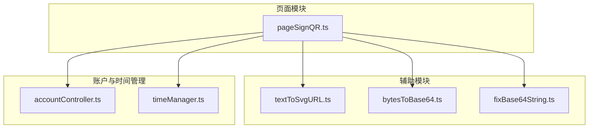
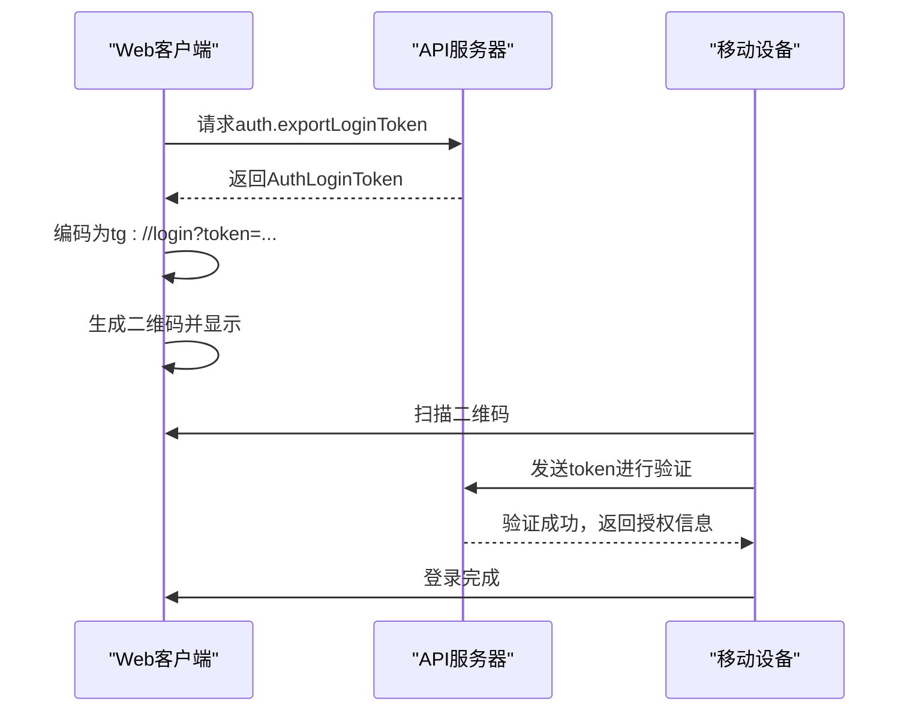
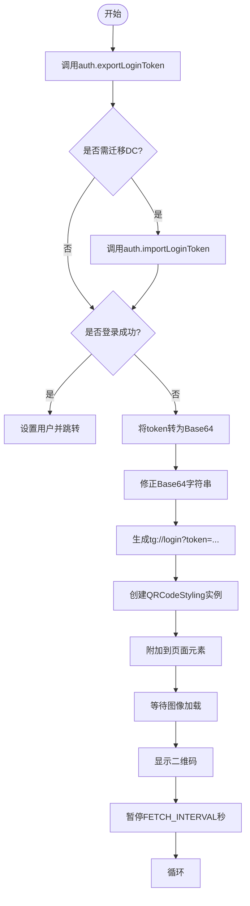
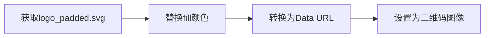
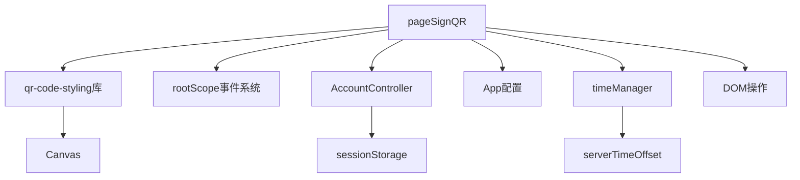

# 二维码生成

<cite>
**本文档引用的文件**
- [pageSignQR.ts](file://src/pages/pageSignQR.ts)
- [textToSvgURL.ts](file://src/helpers/textToSvgURL.ts)
- [bytesToBase64.ts](file://src/helpers/bytes/bytesToBase64.ts)
- [fixBase64String.ts](file://src/helpers/fixBase64String.ts)
- [accountController.ts](file://src/lib/accounts/accountController.ts)
- [timeManager.ts](file://src/lib/mtproto/timeManager.ts)
</cite>

## 目录
1. [简介](#简介)
2. [项目结构](#项目结构)
3. [核心组件](#核心组件)
4. [架构概述](#架构概述)
5. [详细组件分析](#详细组件分析)
6. [依赖分析](#依赖分析)
7. [性能考虑](#性能考虑)
8. [故障排除指南](#故障排除指南)
9. [结论](#结论)

## 简介
本文档详细描述了基于 `pageSignQR.ts` 文件实现的二维码生成机制。重点介绍会话密钥的生成、编码、刷新与过期策略，以及在用户界面中安全显示二维码的流程。同时涵盖异常处理、性能优化建议和关键函数调用方式。

## 项目结构
项目结构中，二维码生成功能主要位于 `src/pages/pageSignQR.ts` 文件中，依赖多个辅助模块完成加密、编码和渲染任务。相关辅助函数分布在 `src/helpers` 和 `src/lib` 目录下。



**Diagram sources**
- [pageSignQR.ts](file://src/pages/pageSignQR.ts#L1-L249)
- [textToSvgURL.ts](file://src/helpers/textToSvgURL.ts#L1-L14)
- [bytesToBase64.ts](file://src/helpers/bytes/bytesToBase64.ts#L1-L39)
- [fixBase64String.ts](file://src/helpers/fixBase64String.ts#L1-L8)
- [accountController.ts](file://src/lib/accounts/accountController.ts#L1-L155)
- [timeManager.ts](file://src/lib/mtproto/timeManager.ts)

**Section sources**
- [pageSignQR.ts](file://src/pages/pageSignQR.ts#L1-L249)

## 核心组件
`pageSignQR.ts` 是二维码登录功能的核心文件，负责生成并展示用于扫码登录的动态二维码。其主要职责包括：
- 调用 API 获取登录令牌（`auth.exportLoginToken`）
- 将令牌编码为 `tg://login?token=...` 格式的 URL
- 使用 `qr-code-styling` 库生成带 Logo 的二维码
- 处理令牌刷新与过期逻辑
- 安全地在界面上渲染二维码

**Section sources**
- [pageSignQR.ts](file://src/pages/pageSignQR.ts#L26-L233)

## 架构概述
二维码生成流程遵循客户端-服务端协同认证模式。客户端定期请求新的登录令牌，并将其编码为二维码供移动设备扫描。服务端验证后完成用户登录。



**Diagram sources**
- [pageSignQR.ts](file://src/pages/pageSignQR.ts#L79-L104)

## 详细组件分析

### 二维码生成流程分析
该流程从获取登录令牌开始，经过编码、样式化处理，最终渲染到 DOM。

#### 令牌获取与比较
系统通过 `auth.exportLoginToken` 接口获取会话令牌，并使用 `bytesCmp` 比较新旧令牌是否变化，仅在变化时重新生成二维码以节省资源。



**Diagram sources**
- [pageSignQR.ts](file://src/pages/pageSignQR.ts#L76-L232)

#### 二维码内容结构
二维码编码的数据遵循特定协议格式：
```
tg://login?token=<base64url-encoded-token>
```
其中：
- `tg://`：Telegram自定义协议头
- `login`：操作类型
- `token`：Base64URL编码的二进制令牌，包含会话密钥和过期时间

编码过程使用 `bytesToBase64` 转换为标准 Base64，再通过 `fixBase64String` 转换为 URL 安全格式（`+`→`-`, `/`→`_`, 去除`=`）。

**Section sources**
- [pageSignQR.ts](file://src/pages/pageSignQR.ts#L112-L113)
- [bytesToBase64.ts](file://src/helpers/bytes/bytesToBase64.ts#L3-L22)
- [fixBase64String.ts](file://src/helpers/fixBase64String.ts#L1-L7)

### 刷新与过期机制
系统采用轮询机制定期刷新二维码。每次获取的 `AuthLoginToken` 包含 `expires` 字段，表示令牌过期时间戳。客户端计算剩余有效时间，并设置下次轮询间隔：

```typescript
const diff = loginToken.expires - timestamp - serverTimeOffset;
await pause(diff > FETCH_INTERVAL ? 1000 * FETCH_INTERVAL : 1000 * diff | 0);
```

若令牌在有效期内被使用，则移动客户端收到 `auth.loginTokenSuccess` 响应，完成登录跳转。

**Section sources**
- [pageSignQR.ts](file://src/pages/pageSignQR.ts#L193-L197)

### 安全显示机制
二维码图像包含动态着色的 Telegram Logo，颜色取自当前主题 CSS 变量（`--primary-color`），通过 `fetch` 加载 SVG 并替换填充色后，转换为 Data URL 使用。



此机制确保品牌一致性且防止跨域问题。

**Diagram sources**
- [pageSignQR.ts](file://src/pages/pageSignQR.ts#L120-L125)
- [textToSvgURL.ts](file://src/helpers/textToSvgURL.ts#L1-L13)

## 依赖分析
二维码生成功能依赖多个内部模块协同工作：



**Diagram sources**
- [pageSignQR.ts](file://src/pages/pageSignQR.ts)
- [accountController.ts](file://src/lib/accounts/accountController.ts)
- [timeManager.ts](file://src/lib/mtproto/timeManager.ts)

## 性能考虑
- **缓存机制**：通过 `cachedPromise` 实现页面挂载逻辑的单例化，避免重复初始化
- **资源优化**：仅在令牌变更时重新生成二维码，减少渲染开销
- **异步加载**：延迟加载 `qr-code-styling` 库，降低首屏加载压力
- **动画优化**：使用 `requestAnimationFrame` 和 CSS 动画平滑过渡二维码显示

## 故障排除指南
常见异常及处理方式：

| 异常类型 | 原因 | 处理方式 |
|--------|------|--------|
| SESSION_PASSWORD_NEEDED | 账户启用了两步验证 | 跳转至密码输入页面 |
| 网络请求失败 | 网络中断或API错误 | 停止轮询并提示用户检查网络 |
| 二维码不刷新 | 令牌未更新 | 检查服务器时间同步状态 |
| 图像加载失败 | SVG资源缺失或CORS问题 | 确保assets/img/logo_padded.svg存在 |

**Section sources**
- [pageSignQR.ts](file://src/pages/pageSignQR.ts#L198-L212)

## 结论
`pageSignQR.ts` 实现了一套完整、安全且用户友好的二维码登录机制。通过合理的加密编码、动态刷新策略和主题适配，提供了流畅的跨设备登录体验。建议进一步优化方向包括：增加错误重试机制、支持离线缓存二维码、增强无障碍访问支持。