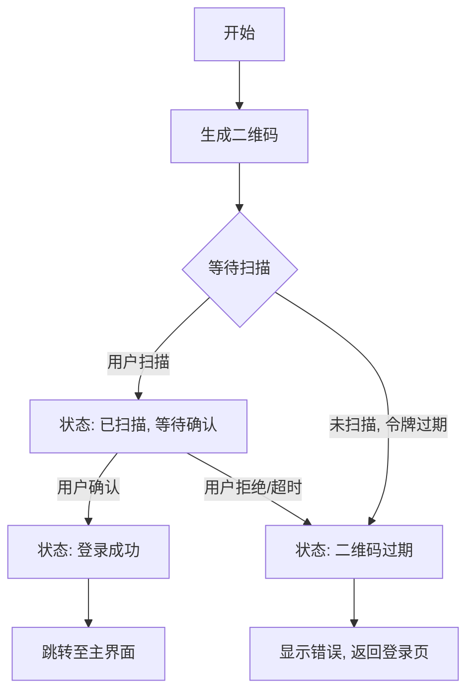

# 二维码登录

<cite>
**本文档引用的文件**
- [pageSignQR.ts](file://src/pages/pageSignQR.ts)
- [authorizer.ts](file://src/lib/mtproto/authorizer.ts)
- [layer.d.ts](file://src/layer.d.ts)
</cite>

## 目录
1. [简介](#简介)
2. [二维码生成流程](#二维码生成流程)
3. [会话密钥与编码](#会话密钥与编码)
4. [客户端轮询机制](#客户端轮询机制)
5. [MTProto协议交互](#mtproto协议交互)
6. [状态流程图](#状态流程图)
7. [错误处理](#错误处理)
8. [用户体验优化](#用户体验优化)
9. [结论](#结论)

## 简介
本文档详细介绍了基于 `pageSignQR.ts` 实现的二维码登录流程。该流程允许用户通过扫描二维码在移动设备上快速登录桌面客户端。文档重点分析了二维码的生成过程、客户端的轮询机制、与 `authorizer.ts` 中MTProto协议的交互，以及从显示二维码到成功认证的完整状态流转。

**Section sources**
- [pageSignQR.ts](file://src/pages/pageSignQR.ts#L1-L249)

## 二维码生成流程
二维码登录流程始于 `pageSignQR.ts` 文件中的 `onFirstMount` 函数。当用户选择二维码登录方式时，该函数被调用以初始化页面并生成二维码。

1.  **页面初始化**：函数首先设置页面UI，包括标题“使用二维码登录Telegram”、操作说明列表（打开手机Telegram、进入设置、链接桌面设备）和一个“通过手机号登录”的取消按钮。
2.  **获取登录令牌**：核心步骤是调用 `auth.exportLoginToken` API。此API请求需要提供应用的 `api_id` 和 `api_hash`，以及一个用户ID列表（`except_ids`），用于排除已登录的账户。
3.  **处理迁移**：如果服务器返回 `auth.loginTokenMigrateTo` 响应，表示需要迁移到另一个数据中心（DC）。客户端会更新其基础DC ID，并使用收到的令牌调用 `auth.importLoginToken` API来获取最终的登录令牌。
4.  **成功登录**：如果响应为 `auth.loginTokenSuccess`，则表示用户已在手机上确认登录。此时，客户端会直接设置用户信息并跳转到主界面 (`pageIm`)。
5.  **生成二维码**：对于 `auth.loginToken` 响应，系统会将二进制的 `token` 数据编码为Base64字符串，并将其嵌入到 `tg://login?token=...` 的URL Scheme中。这个URL是二维码的核心内容。

**Section sources**
- [pageSignQR.ts](file://src/pages/pageSignQR.ts#L78-L113)

## 会话密钥与编码
在二维码生成过程中，会话密钥（即 `token`）的安全编码至关重要。

1.  **Base64编码**：原始的 `token` 是一个 `Uint8Array`（二进制数组）。它首先通过 `bytesToBase64` 函数转换为标准的Base64字符串。
2.  **URL安全化**：为了确保生成的URL可以在各种环境中安全传输，需要对Base64字符串进行URL安全化处理。这通过 `fixBase64String` 函数实现，它将 `+` 替换为 `-`，`/` 替换为 `_`，并移除末尾的 `=` 填充符。
3.  **二维码样式**：使用 `qr-code-styling` 库将最终的URL渲染成美观的二维码。二维码的样式（如点的颜色、角落的形状、背景色）会根据当前主题的CSS变量（如 `--primary-color`）进行动态设置，并在二维码中心嵌入一个经过颜色处理的Telegram Logo SVG。

**Section sources**
- [pageSignQR.ts](file://src/pages/pageSignQR.ts#L112-L149)
- [helpers/bytes/bytesToBase64.ts](file://src/helpers/bytes/bytesToBase64.ts)
- [helpers/fixBase64String.ts](file://src/helpers/fixBase64String.ts)

## 客户端轮询机制
由于二维码登录是一个异步过程，桌面客户端需要持续检查登录状态，这通过一个轮询循环实现。

1.  **轮询循环**：`iterate` 函数被设计为一个可循环执行的异步函数。在初始生成二维码后，它会进入一个 `do-while` 循环，持续调用自身。
2.  **状态检查**：每次循环都会重新调用 `auth.exportLoginToken` API。服务器会根据当前状态返回不同的响应：
    *   **等待扫描**：如果用户尚未扫描，服务器返回一个新的 `auth.loginToken`，其 `expires` 字段指示令牌的有效期。
    *   **已扫描，等待确认**：如果用户已扫描但未确认，服务器可能返回相同或新的令牌。
    *   **登录成功**：如果用户已确认，服务器返回 `auth.loginTokenSuccess`。
3.  **智能等待**：为了避免频繁请求，客户端会计算令牌的剩余有效期（`expires - current_timestamp`），并使用 `pause` 函数等待一个较短的间隔（默认3秒）或直到令牌过期，然后再次发起请求。这确保了在令牌有效期内高效地检查状态。

**Section sources**
- [pageSignQR.ts](file://src/pages/pageSignQR.ts#L192-L197)

## MTProto协议交互
`authorizer.ts` 文件中的 `Authorizer` 类负责处理底层的MTProto协议交互，包括安全的密钥交换。

1.  **身份验证流程**：`Authorizer` 类实现了MTProto的完整身份验证流程，包括 `req_pq`, `req_DH_params`, 和 `set_client_DH_params` 等步骤。
2.  **临时授权密钥**：在 `auth.exportLoginToken` 的上下文中，`Authorizer` 会创建一个临时的授权密钥（`temp: true`）。这个密钥的生命周期较短（`TEMP_EXPIRATION_TIME` 设置为86400秒，即24小时），专用于一次性登录会话。
3.  **安全保证**：整个流程基于Diffie-Hellman密钥交换，确保了即使登录令牌在传输中被截获，攻击者也无法推导出用于加密通信的主密钥。`verifyDhParams` 函数会严格验证服务器提供的DH参数，防止中间人攻击。

**Section sources**
- [authorizer.ts](file://src/lib/mtproto/authorizer.ts#L622-L660)

## 状态流程图
以下流程图展示了从用户选择二维码登录到成功认证的完整状态流转。

**Diagram sources**
- [pageSignQR.ts](file://src/pages/pageSignQR.ts#L78-L113)

## 错误处理
系统对多种错误情况进行了妥善处理。

1.  **会话密码**：如果账户启用了两步验证，服务器会返回 `SESSION_PASSWORD_NEEDED` 错误。此时，客户端会中断二维码流程，并跳转到密码输入页面 (`pagePassword`)。
2.  **二维码过期**：如果用户长时间未扫描，`auth.exportLoginToken` 会返回一个过期的令牌。客户端的轮询逻辑会检测到这一点并重新生成一个新的二维码，确保用户始终看到有效的登录选项。
3.  **网络错误**：代码中使用了 `ignoreErrors: true` 选项来处理网络请求失败，避免因临时网络问题导致流程中断。更严重的错误会在控制台输出日志。

**Section sources**
- [pageSignQR.ts](file://src/pages/pageSignQR.ts#L199-L208)

## 用户体验优化
该实现包含多项用户体验优化细节。

1.  **二维码刷新**：轮询机制不仅检查状态，还会在必要时刷新二维码。当服务器返回一个与之前不同的 `token` 时，系统会自动重新生成并显示新的二维码，无需用户手动刷新页面。
2.  **状态提示**：用户界面清晰地展示了操作步骤（帮助列表），并提供了明确的取消选项，让用户对流程有完全的掌控。
3.  **跨设备同步**：整个流程无缝衔接了移动设备和桌面设备。用户在手机上的操作（扫描和确认）会实时同步到桌面客户端，实现无感的跨设备登录体验。
4.  **主题适配**：生成的二维码会读取当前主题的CSS变量（如主色、文字色、背景色），确保其外观与整个应用的视觉风格保持一致。

**Section sources**
- [pageSignQR.ts](file://src/pages/pageSignQR.ts#L44-L53)
- [pageSignQR.ts](file://src/pages/pageSignQR.ts#L115-L119)

## 结论
综上所述，该二维码登录系统通过 `pageSignQR.ts` 和 `authorizer.ts` 的协同工作，实现了一个安全、高效且用户友好的登录流程。它利用MTProto协议的安全性生成临时会话密钥，通过轮询机制实现状态同步，并通过精心设计的UI和错误处理机制，为用户提供了流畅的跨设备登录体验。