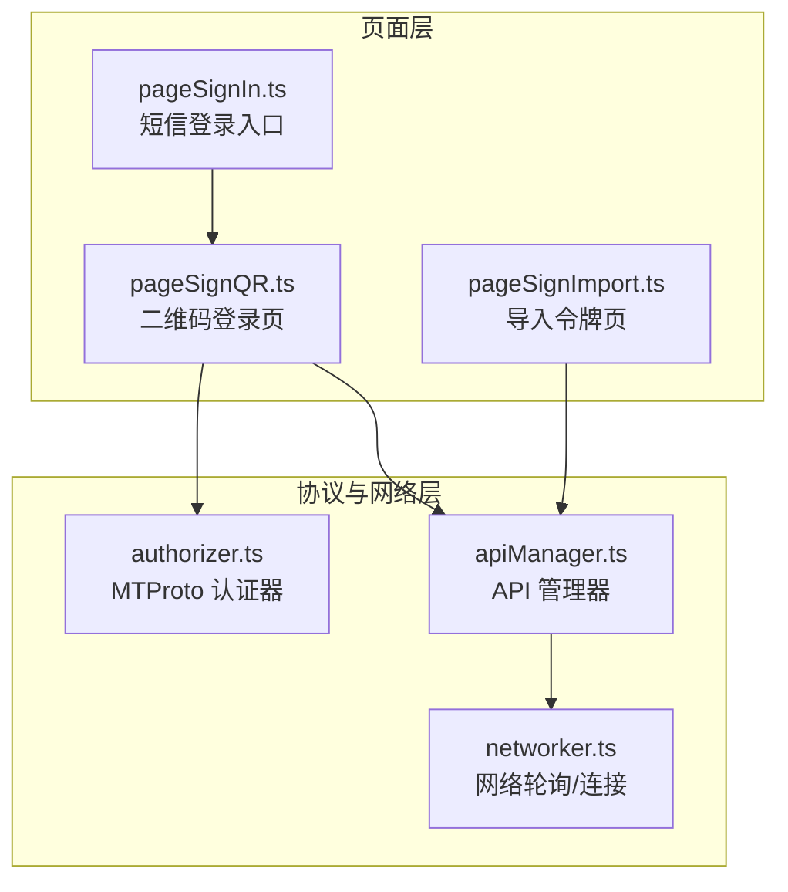
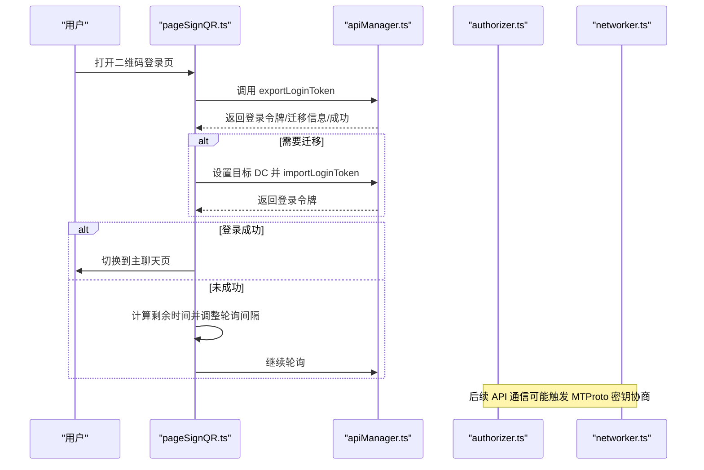
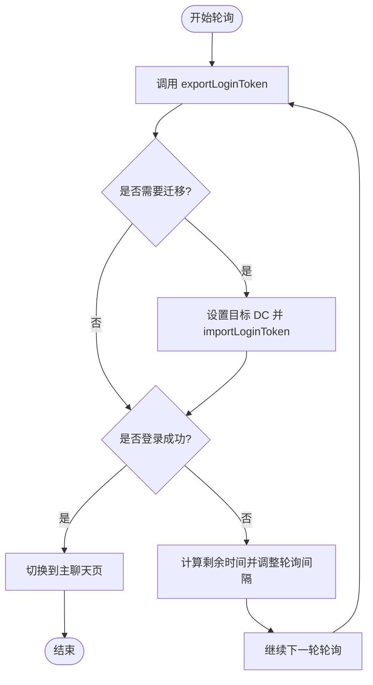
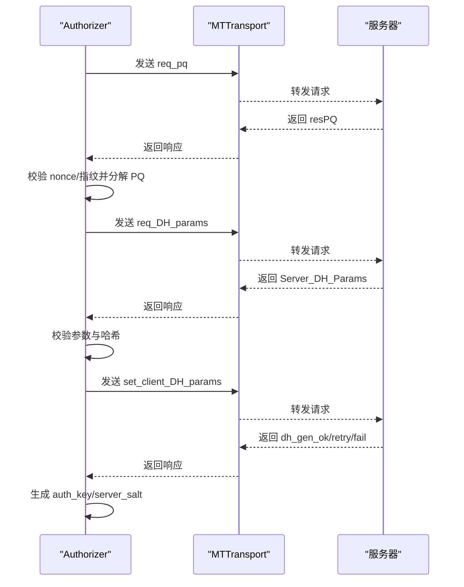
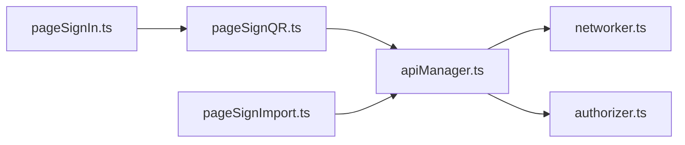

# 登录状态管理

<cite>
**本文引用的文件**
- [pageSignQR.ts](file://src/pages/pageSignQR.ts)
- [authorizer.ts](file://src/lib/mtproto/authorizer.ts)
- [apiManager.ts](file://src/lib/mtproto/apiManager.ts)
- [networker.ts](file://src/lib/mtproto/networker.ts)
- [pageSignIn.ts](file://src/pages/pageSignIn.ts)
- [pageSignImport.ts](file://src/pages/pageSignImport.ts)
</cite>

## 目录
1. [简介](#简介)
2. [项目结构](#项目结构)
3. [核心组件](#核心组件)
4. [架构总览](#架构总览)
5. [详细组件分析](#详细组件分析)
6. [依赖关系分析](#依赖关系分析)
7. [性能考量](#性能考量)
8. [故障排查指南](#故障排查指南)
9. [结论](#结论)

## 简介
本文件围绕“二维码登录”的状态轮询与管理机制展开，重点解析页面组件 pageSignQR.ts 与底层 MTProto 认证模块 authorizer.ts 的协作方式，说明客户端如何通过定时轮询检查登录状态（请求间隔、超时与重试策略），以及 MTProto 在二维码登录过程中的关键交互步骤（设备验证与会话建立）。同时，文档覆盖“等待扫描”、“已扫描等待确认”、“登录成功”等状态转换条件与用户界面反馈，并提供针对二维码过期、设备不匹配、网络中断等常见问题的处理建议与性能优化策略。

## 项目结构
与二维码登录状态管理直接相关的核心文件如下：
- 页面层：pageSignQR.ts 负责生成二维码、展示引导说明、发起轮询并处理登录结果。
- 协议层：authorizer.ts 实现 MTProto 的密钥协商与认证流程，为登录状态检查提供底层能力。
- 网络层：apiManager.ts 提供 API 调用封装；networker.ts 提供长轮询与连接管理。
- 入口与导航：pageSignIn.ts 提供从短信登录跳转到二维码登录的入口；pageSignImport.ts 处理导入令牌后的授权流程。

图表来源
- [pageSignQR.ts](file://src/pages/pageSignQR.ts#L24-L248)
- [authorizer.ts](file://src/lib/mtproto/authorizer.ts#L128-L660)
- [apiManager.ts](file://src/lib/mtproto/apiManager.ts#L64-L200)
- [networker.ts](file://src/lib/mtproto/networker.ts#L630-L728)
- [pageSignIn.ts](file://src/pages/pageSignIn.ts#L146-L194)
- [pageSignImport.ts](file://src/pages/pageSignImport.ts#L1-L63)

章节来源
- [pageSignQR.ts](file://src/pages/pageSignQR.ts#L24-L248)
- [authorizer.ts](file://src/lib/mtproto/authorizer.ts#L128-L660)
- [apiManager.ts](file://src/lib/mtproto/apiManager.ts#L64-L200)
- [networker.ts](file://src/lib/mtproto/networker.ts#L630-L728)
- [pageSignIn.ts](file://src/pages/pageSignIn.ts#L146-L194)
- [pageSignImport.ts](file://src/pages/pageSignImport.ts#L1-L63)

## 核心组件
- 二维码登录页（pageSignQR.ts）
  - 功能要点：生成二维码、展示使用说明、定时轮询检查登录状态、根据返回结果切换页面或处理异常。
  - 关键行为：调用 API 获取登录令牌，必要时迁移至目标 DC 并导入令牌；当返回登录成功时切换到主聊天页。
- MTProto 认证器（authorizer.ts）
  - 功能要点：实现 MTProto 密钥协商流程（req_pq、req_DH_params、set_client_DH_params），校验 DH 参数，生成 auth_key 与 server_salt，支持临时密钥与重试。
- API 管理器（apiManager.ts）
  - 功能要点：封装 invokeApi 调用、维护网络器实例、处理配置刷新与传输类型变更、触发用户授权事件。
- 网络轮询（networker.ts）
  - 功能要点：长轮询与 ping/pong 机制、连接断开与延迟重连、基于延迟的调度策略。

章节来源
- [pageSignQR.ts](file://src/pages/pageSignQR.ts#L72-L106)
- [authorizer.ts](file://src/lib/mtproto/authorizer.ts#L215-L608)
- [apiManager.ts](file://src/lib/mtproto/apiManager.ts#L64-L200)
- [networker.ts](file://src/lib/mtproto/networker.ts#L630-L728)

## 架构总览
二维码登录的端到端流程如下：
- 客户端在二维码页发起轮询，调用 API 获取登录令牌；
- 若返回需要迁移，先设置目标 DC 再导入令牌；
- 当返回登录成功时，写入当前用户并进入主聊天页；
- 否则根据剩余有效期动态调整轮询间隔，避免过度请求；
- MTProto 层在需要时进行密钥协商与认证，为后续 API 通信提供安全通道。

图表来源
- [pageSignQR.ts](file://src/pages/pageSignQR.ts#L72-L106)
- [apiManager.ts](file://src/lib/mtproto/apiManager.ts#L64-L200)
- [authorizer.ts](file://src/lib/mtproto/authorizer.ts#L215-L608)
- [networker.ts](file://src/lib/mtproto/networker.ts#L630-L728)

## 详细组件分析

### 组件A：二维码登录页（pageSignQR.ts）
- 定时轮询与间隔控制
  - 使用固定基础间隔常量与剩余有效期动态计算，避免无效请求与服务器压力。
  - 当剩余时间大于基础间隔时，按固定间隔等待；否则按剩余秒数等待，确保在过期前完成最后一次检查。
- 状态转换与用户反馈
  - “等待扫描”：首次生成二维码并显示引导说明，开始轮询。
  - “已扫描等待确认”：收到非成功响应但仍在有效期内，继续轮询并保持界面提示。
  - “登录成功”：收到登录成功响应后，写入用户信息并切换到主聊天页。
- 异常处理
  - 捕获 SESSION_PASSWORD_NEEDED 等特定错误，跳转到密码页。
  - 其他错误导致停止轮询并清理缓存状态。
- 资源释放
  - 监听用户授权事件以提前结束轮询，释放渲染资源与预加载动画。

图表来源
- [pageSignQR.ts](file://src/pages/pageSignQR.ts#L72-L106)
- [pageSignQR.ts](file://src/pages/pageSignQR.ts#L192-L197)

章节来源
- [pageSignQR.ts](file://src/pages/pageSignQR.ts#L24-L248)

### 组件B：MTProto 认证器（authorizer.ts）
- 设备验证与会话建立的关键步骤
  - req_pq：请求公钥与 PQ 因子分解，校验 nonce 一致性。
  - req_DH_params：使用 RSA 加密数据并发送 DH 参数请求，校验响应类型与哈希。
  - set_client_DH_params：计算 g^b 并加密发送，校验 dh_gen_* 响应，最终生成 auth_key 与 server_salt。
  - DH 参数校验：对 dh_prime、gA 边界进行严格校验，确保安全性。
- 重试与临时密钥
  - 支持 dh_gen_retry 分支自动重试，最多 3 次失败重试。
  - 临时密钥支持较长有效期与过期时间记录，便于后续迁移与清理。
- 与 API 管理器的集成
  - 通过 transport 发送明文请求，解析 TL 序列化响应，抛出标准化错误以便上层处理。

图表来源
- [authorizer.ts](file://src/lib/mtproto/authorizer.ts#L215-L608)

章节来源
- [authorizer.ts](file://src/lib/mtproto/authorizer.ts#L128-L660)

### 组件C：API 管理器与网络轮询（apiManager.ts、networker.ts）
- API 调用封装
  - 统一的 invokeApi 接口，支持忽略错误、设置 DC、缓存与哈希处理。
  - 监听用户授权事件，刷新配置与应用状态。
- 长轮询与连接管理
  - networker 提供长轮询与 ping/pong 机制，基于延迟调整重连策略，避免频繁断开。
  - 在网络不稳定时自动关闭连接并延时重连，降低资源消耗。

章节来源
- [apiManager.ts](file://src/lib/mtproto/apiManager.ts#L64-L200)
- [networker.ts](file://src/lib/mtproto/networker.ts#L630-L728)

## 依赖关系分析
- pageSignQR.ts 依赖 apiManager.ts 进行登录令牌查询与导入，依赖 rootScope 事件监听用户授权。
- apiManager.ts 依赖 networker.ts 进行底层网络通信，依赖 authorizer.ts 在需要时进行 MTProto 密钥协商。
- authorizer.ts 依赖传输层（MTTransport）与加密工作线程（CryptoWorker）执行密钥协商与哈希计算。
- pageSignIn.ts 作为入口，提供跳转到二维码登录页的能力；pageSignImport.ts 用于导入令牌后的授权流程。

图表来源
- [pageSignQR.ts](file://src/pages/pageSignQR.ts#L24-L248)
- [apiManager.ts](file://src/lib/mtproto/apiManager.ts#L64-L200)
- [networker.ts](file://src/lib/mtproto/networker.ts#L630-L728)
- [authorizer.ts](file://src/lib/mtproto/authorizer.ts#L128-L660)
- [pageSignIn.ts](file://src/pages/pageSignIn.ts#L146-L194)
- [pageSignImport.ts](file://src/pages/pageSignImport.ts#L1-L63)

章节来源
- [pageSignQR.ts](file://src/pages/pageSignQR.ts#L24-L248)
- [apiManager.ts](file://src/lib/mtproto/apiManager.ts#L64-L200)
- [networker.ts](file://src/lib/mtproto/networker.ts#L630-L728)
- [authorizer.ts](file://src/lib/mtproto/authorizer.ts#L128-L660)
- [pageSignIn.ts](file://src/pages/pageSignIn.ts#L146-L194)
- [pageSignImport.ts](file://src/pages/pageSignImport.ts#L1-L63)

## 性能考量
- 智能轮询间隔调整
  - 基于剩余有效期动态计算等待时间，避免无效请求与服务器压力；当剩余时间小于固定间隔时，按剩余秒数等待，确保在过期前完成最后一次检查。
- 连接与资源释放
  - 在收到用户授权事件后立即停止轮询，释放预加载动画与二维码绘制资源，减少内存占用。
  - 网络层在 ping 超时或连接异常时主动关闭连接并延时重连，降低资源消耗。
- 重试策略
  - MTProto 层对 dh_gen_retry 自动重试，最多 3 次，避免一次性失败导致长时间不可用。
- 缓存与迁移
  - 对临时密钥与 DC 迁移进行缓存与记录，减少重复协商成本。

章节来源
- [pageSignQR.ts](file://src/pages/pageSignQR.ts#L192-L197)
- [networker.ts](file://src/lib/mtproto/networker.ts#L630-L728)
- [authorizer.ts](file://src/lib/mtproto/authorizer.ts#L637-L660)

## 故障排查指南
- 二维码过期
  - 现象：轮询多次后仍无登录成功响应，且剩余时间接近 0。
  - 处理：停止轮询并提示重新生成二维码；检查系统时间与服务器时间偏移。
- 设备不匹配
  - 现象：服务端返回参数校验失败或 dh_gen_fail。
  - 处理：触发 MTProto 重试流程；若持续失败，提示用户更换设备或清除缓存后重试。
- 网络中断
  - 现象：轮询请求失败或连接断开。
  - 处理：利用网络层的延迟重连与 ping/pong 机制恢复；必要时切换传输类型（如 WebSocket 与 HTTPS）。
- 特定错误分支
  - SESSION_PASSWORD_NEEDED：跳转到密码页进行二次验证。
  - 其他未知错误：停止轮询并清理状态，允许用户重新尝试。

章节来源
- [pageSignQR.ts](file://src/pages/pageSignQR.ts#L198-L212)
- [authorizer.ts](file://src/lib/mtproto/authorizer.ts#L569-L608)
- [networker.ts](file://src/lib/mtproto/networker.ts#L630-L728)

## 结论
二维码登录状态管理通过“页面层轮询 + 协议层认证 + 网络层稳定传输”的三层协作，实现了可靠的登录体验。页面层负责用户交互与状态推进，协议层保证设备验证与会话建立的安全性，网络层保障在弱网环境下的稳定性。结合智能轮询间隔、重试与资源释放策略，系统在可用性与性能之间取得平衡。对于常见问题，建议优先检查二维码有效期、网络连通性与设备参数校验，并在必要时触发 MTProto 重试与迁移流程。