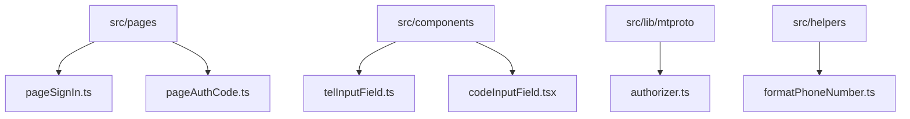
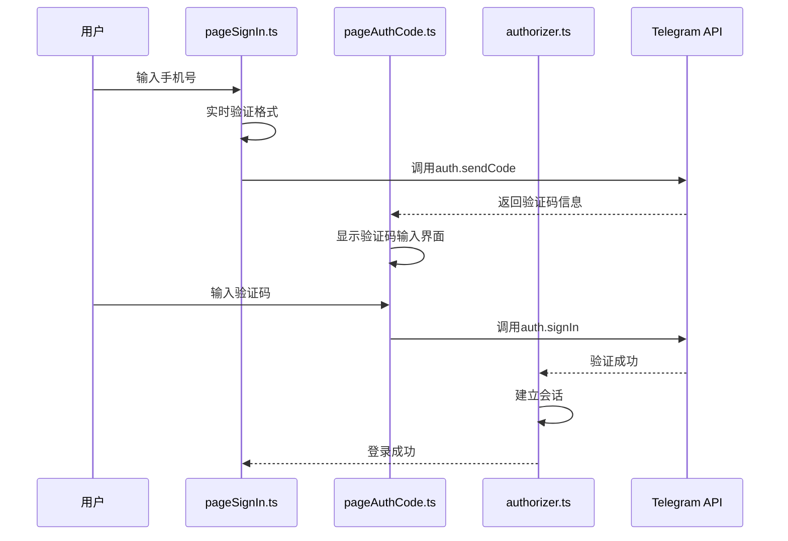
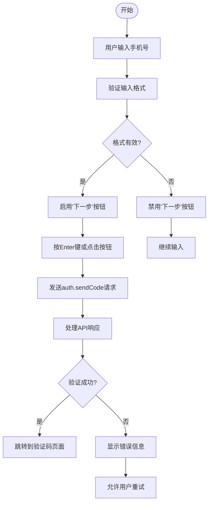
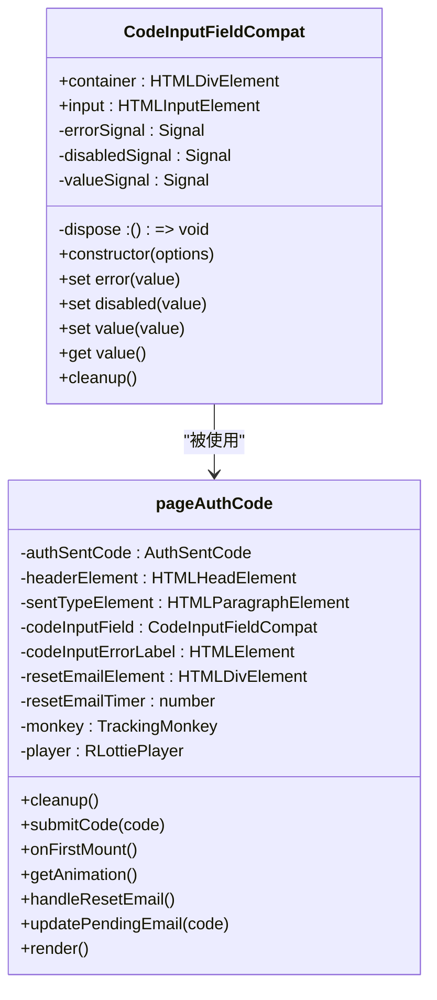
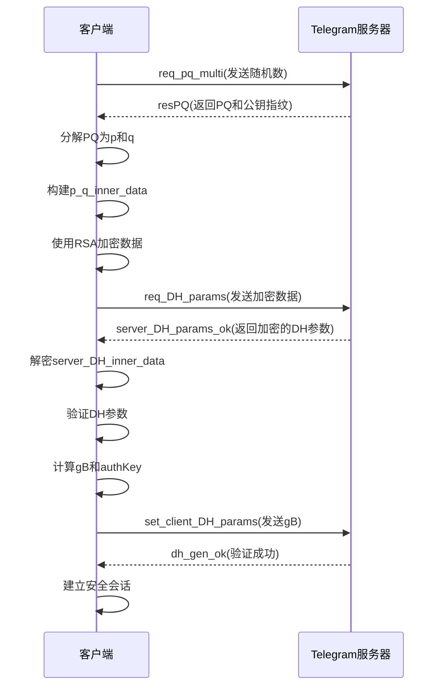
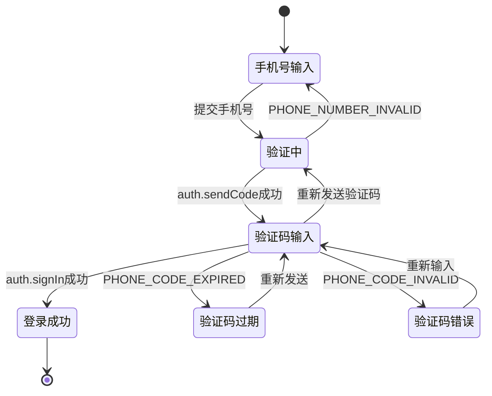
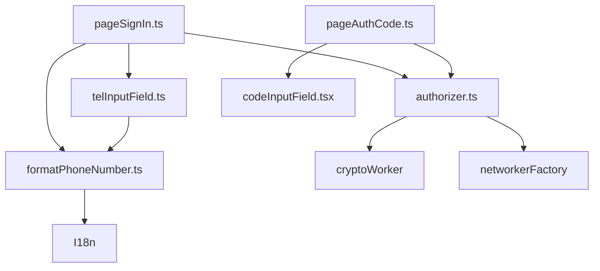

# 手机号登录

<cite>
**本文档引用的文件**
- [pageSignIn.ts](file://src/pages/pageSignIn.ts)
- [pageAuthCode.ts](file://src/pages/pageAuthCode.ts)
- [authorizer.ts](file://src/lib/mtproto/authorizer.ts)
- [telInputField.ts](file://src/components/telInputField.ts)
- [codeInputField.tsx](file://src/components/codeInputField.tsx)
- [formatPhoneNumber.ts](file://src/helpers/formatPhoneNumber.ts)
</cite>

## 目录
1. [简介](#简介)
2. [项目结构](#项目结构)
3. [核心组件](#核心组件)
4. [架构概述](#架构概述)
5. [详细组件分析](#详细组件分析)
6. [依赖分析](#依赖分析)
7. [性能考虑](#性能考虑)
8. [故障排除指南](#故障排除指南)
9. [结论](#结论)

## 简介
本文档详细介绍了Telegram Web客户端的手机号登录流程，重点分析了手机号输入验证逻辑、短信验证码处理流程以及与MTProto协议的交互过程。文档涵盖了从用户界面交互到后端协议通信的完整流程，包括状态转换、错误处理和用户体验优化等方面。

## 项目结构
手机号登录功能主要分布在`src/pages`目录下的登录相关页面组件中，以及`src/components`目录下的输入组件中。核心的MTProto协议交互逻辑位于`src/lib/mtproto`目录下。

**Diagram sources**
- [pageSignIn.ts](file://src/pages/pageSignIn.ts)
- [pageAuthCode.ts](file://src/pages/pageAuthCode.ts)
- [authorizer.ts](file://src/lib/mtproto/authorizer.ts)
- [telInputField.ts](file://src/components/telInputField.ts)
- [codeInputField.tsx](file://src/components/codeInputField.tsx)
- [formatPhoneNumber.ts](file://src/helpers/formatPhoneNumber.ts)

**Section sources**
- [pageSignIn.ts](file://src/pages/pageSignIn.ts)
- [pageAuthCode.ts](file://src/pages/pageAuthCode.ts)
- [authorizer.ts](file://src/lib/mtproto/authorizer.ts)

## 核心组件
手机号登录流程的核心组件包括手机号输入页面、验证码输入页面和MTProto协议授权器。这些组件协同工作，实现了从用户输入手机号到完成身份验证的完整流程。

**Section sources**
- [pageSignIn.ts](file://src/pages/pageSignIn.ts)
- [pageAuthCode.ts](file://src/pages/pageAuthCode.ts)
- [authorizer.ts](file://src/lib/mtproto/authorizer.ts)

## 架构概述
手机号登录流程遵循标准的两步验证模式：首先输入手机号码，然后输入收到的验证码。整个流程涉及用户界面组件、输入验证逻辑和底层协议通信。

**Diagram sources**
- [pageSignIn.ts](file://src/pages/pageSignIn.ts)
- [pageAuthCode.ts](file://src/pages/pageAuthCode.ts)
- [authorizer.ts](file://src/lib/mtproto/authorizer.ts)

## 详细组件分析

### 手机号输入验证分析
`pageSignIn.ts`文件实现了手机号输入的完整验证逻辑，包括格式验证、国家代码自动识别和实时反馈。

**Diagram sources**
- [pageSignIn.ts](file://src/pages/pageSignIn.ts)
- [telInputField.ts](file://src/components/telInputField.ts)
- [formatPhoneNumber.ts](file://src/helpers/formatPhoneNumber.ts)

**Section sources**
- [pageSignIn.ts](file://src/pages/pageSignIn.ts)
- [telInputField.ts](file://src/components/telInputField.ts)
- [formatPhoneNumber.ts](file://src/helpers/formatPhoneNumber.ts)

### 短信验证码处理分析
`pageAuthCode.ts`文件处理短信验证码的输入、倒计时控制和重新发送机制。

**Diagram sources**
- [pageAuthCode.ts](file://src/pages/pageAuthCode.ts)
- [codeInputField.tsx](file://src/components/codeInputField.tsx)

**Section sources**
- [pageAuthCode.ts](file://src/pages/pageAuthCode.ts)
- [codeInputField.tsx](file://src/components/codeInputField.tsx)

### MTProto协议交互分析
`authorizer.ts`文件实现了与MTProto协议的完整交互过程，包括身份验证请求的构建、响应处理和会话建立。

**Diagram sources**
- [authorizer.ts](file://src/lib/mtproto/authorizer.ts)

**Section sources**
- [authorizer.ts](file://src/lib/mtproto/authorizer.ts)

### 状态转换分析
从手机号输入到成功登录的完整状态转换过程。

**Diagram sources**
- [pageSignIn.ts](file://src/pages/pageSignIn.ts)
- [pageAuthCode.ts](file://src/pages/pageAuthCode.ts)
- [authorizer.ts](file://src/lib/mtproto/authorizer.ts)

**Section sources**
- [pageSignIn.ts](file://src/pages/pageSignIn.ts)
- [pageAuthCode.ts](file://src/pages/pageAuthCode.ts)
- [authorizer.ts](file://src/lib/mtproto/authorizer.ts)

## 依赖分析
手机号登录功能依赖于多个核心组件和工具函数，形成了完整的依赖链。

**Diagram sources**
- [pageSignIn.ts](file://src/pages/pageSignIn.ts)
- [pageAuthCode.ts](file://src/pages/pageAuthCode.ts)
- [authorizer.ts](file://src/lib/mtproto/authorizer.ts)
- [telInputField.ts](file://src/components/telInputField.ts)
- [codeInputField.tsx](file://src/components/codeInputField.tsx)
- [formatPhoneNumber.ts](file://src/helpers/formatPhoneNumber.ts)

**Section sources**
- [pageSignIn.ts](file://src/pages/pageSignIn.ts)
- [pageAuthCode.ts](file://src/pages/pageAuthCode.ts)
- [authorizer.ts](file://src/lib/mtproto/authorizer.ts)

## 性能考虑
手机号登录流程在性能方面进行了多项优化，包括：

1. **延迟加载**：验证码页面在需要时才动态导入，减少初始加载时间
2. **缓存机制**：国家代码和语言包信息被缓存，避免重复请求
3. **并行处理**：多个DC服务器的连接尝试并行执行，提高连接成功率
4. **资源预加载**：在用户输入手机号时预加载必要的资源，减少后续等待时间

这些优化措施确保了登录流程的快速响应和良好的用户体验。

## 故障排除指南
以下是常见的错误状态码及其处理方法：

| 错误状态码 | 描述 | 处理方法 |
|-----------|------|---------|
| PHONE_NUMBER_INVALID | 手机号格式无效 | 显示格式错误提示，要求用户重新输入 |
| PHONE_CODE_EXPIRED | 验证码已过期 | 显示过期提示，提供重新发送选项 |
| PHONE_CODE_INVALID | 验证码错误 | 显示错误提示，允许用户重新输入 |
| SESSION_PASSWORD_NEEDED | 需要两步验证密码 | 跳转到密码输入页面 |
| NETWORK_BAD_RESPONSE | 网络响应错误 | 显示网络错误提示，建议检查网络连接 |

**Section sources**
- [pageSignIn.ts](file://src/pages/pageSignIn.ts#L158-L168)
- [pageAuthCode.ts](file://src/pages/pageAuthCode.ts#L90-L113)

## 结论
手机号登录流程是一个复杂的多阶段验证系统，涉及用户界面、输入验证和底层协议通信等多个层面。通过分析`pageSignIn.ts`、`pageAuthCode.ts`和`authorizer.ts`等核心文件，我们深入了解了从用户输入到会话建立的完整流程。该系统具有良好的错误处理机制和用户体验优化，确保了登录过程的安全性和便捷性。