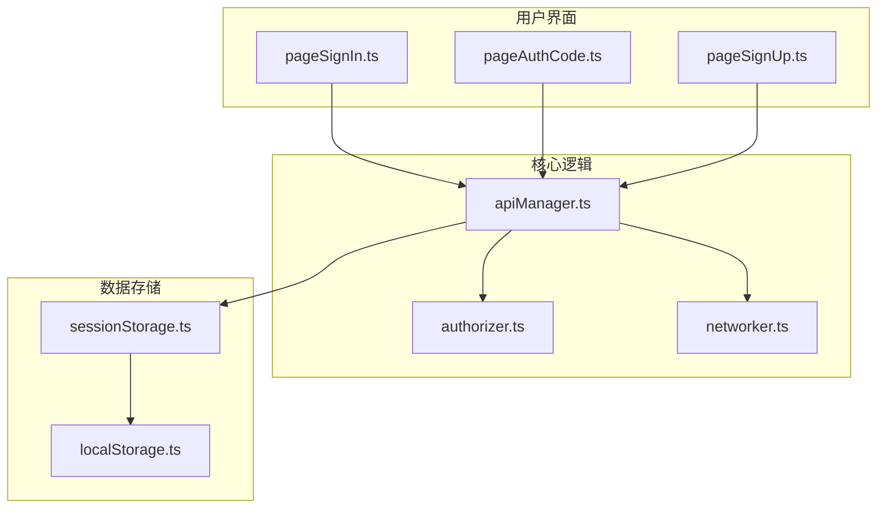
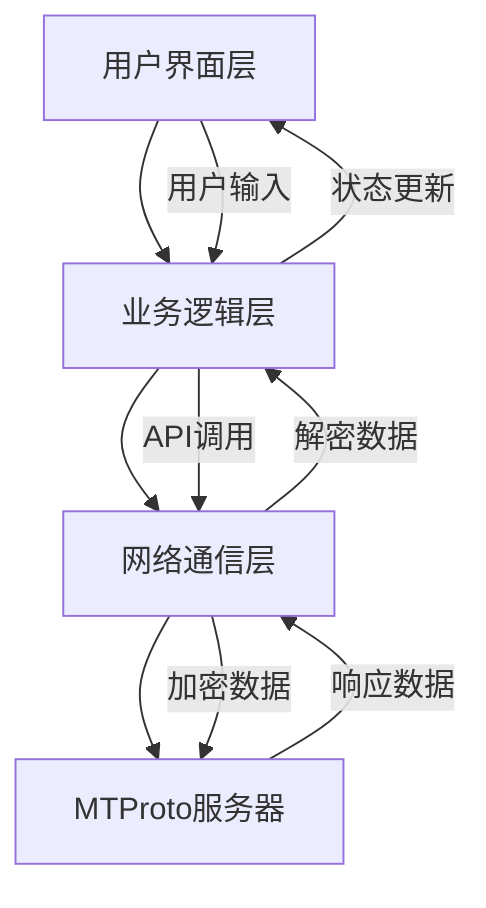
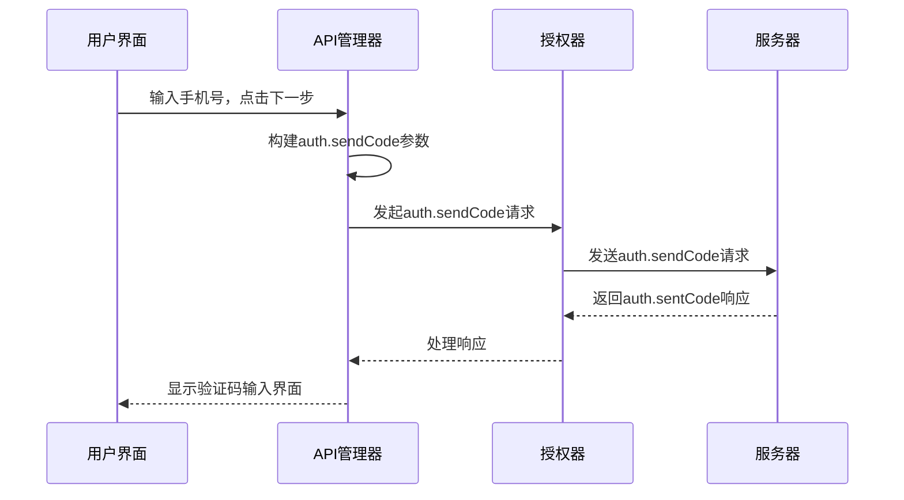
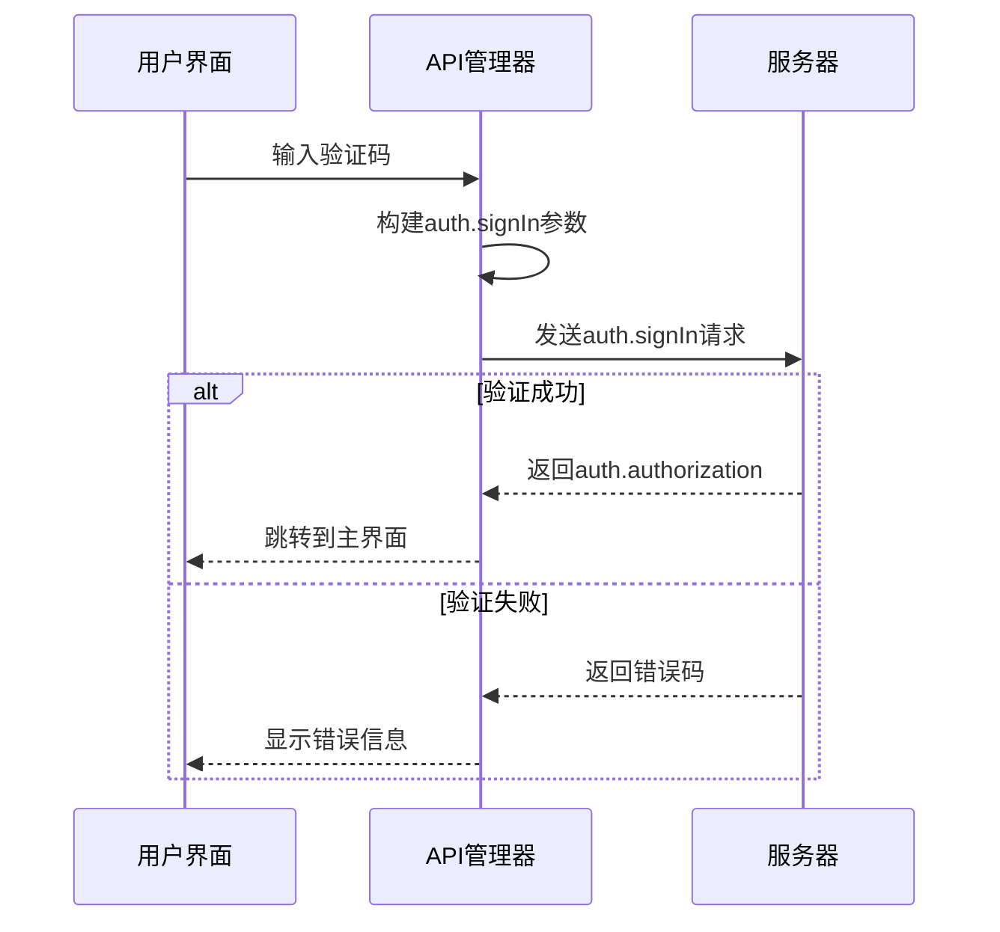
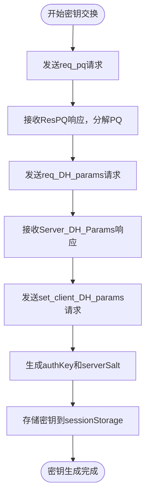
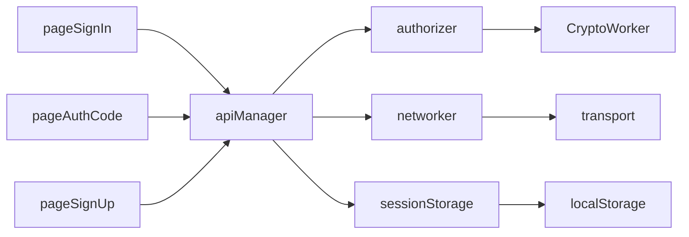

# 手机号登录协议实现

<cite>
**本文档引用的文件**   
- [authorizer.ts](file://src/lib/mtproto/authorizer.ts)
- [pageSignIn.ts](file://src/pages/pageSignIn.ts)
- [pageAuthCode.ts](file://src/pages/pageAuthCode.ts)
- [apiManager.ts](file://src/lib/mtproto/apiManager.ts)
- [networker.ts](file://src/lib/mtproto/networker.ts)
- [sessionStorage.ts](file://src/lib/sessionStorage.ts)
</cite>

## 目录
1. [简介](#简介)
2. [项目结构](#项目结构)
3. [核心组件](#核心组件)
4. [架构概述](#架构概述)
5. [详细组件分析](#详细组件分析)
6. [依赖分析](#依赖分析)
7. [性能考虑](#性能考虑)
8. [故障排除指南](#故障排除指南)
9. [结论](#结论)

## 简介
本文档详细描述了基于MTProto协议的手机号登录实现机制。重点分析了从用户输入手机号到完成身份验证的完整流程，包括auth.sendCode请求的构建、短信验证码的验证、会话密钥的生成与存储，以及安全通信的建立过程。文档还涵盖了常见的错误处理策略和安全考虑，为开发者提供了全面的技术参考。

## 项目结构
项目采用模块化设计，主要功能组件分布在src目录下。身份验证相关的核心逻辑位于lib/mtproto目录，用户界面组件位于pages目录。这种分层架构将协议实现与用户界面分离，提高了代码的可维护性和可测试性。

**Diagram sources**
- [pageSignIn.ts](file://src/pages/pageSignIn.ts)
- [apiManager.ts](file://src/lib/mtproto/apiManager.ts)
- [sessionStorage.ts](file://src/lib/sessionStorage.ts)

**Section sources**
- [pageSignIn.ts](file://src/pages/pageSignIn.ts)
- [apiManager.ts](file://src/lib/mtproto/apiManager.ts)
- [sessionStorage.ts](file://src/lib/sessionStorage.ts)

## 核心组件
核心组件包括身份验证管理器(apiManager)、授权器(authorizer)和网络通信器(networker)。这些组件协同工作，实现了完整的MTProto身份验证流程。apiManager作为高层接口，封装了复杂的协议细节；authorizer负责密钥交换和安全认证；networker处理底层网络通信。

**Section sources**
- [apiManager.ts](file://src/lib/mtproto/apiManager.ts)
- [authorizer.ts](file://src/lib/mtproto/authorizer.ts)
- [networker.ts](file://src/lib/mtproto/networker.ts)

## 架构概述
系统采用分层架构设计，从上到下分为用户界面层、业务逻辑层和网络通信层。用户界面层处理用户输入和显示；业务逻辑层实现身份验证的核心算法；网络通信层负责与服务器的安全数据交换。各层之间通过清晰的接口进行通信，确保了系统的模块化和可扩展性。

**Diagram sources**
- [pageSignIn.ts](file://src/pages/pageSignIn.ts)
- [apiManager.ts](file://src/lib/mtproto/apiManager.ts)
- [networker.ts](file://src/lib/mtproto/networker.ts)

## 详细组件分析

### auth.sendCode请求构建
当用户在登录页面输入手机号并点击下一步时，系统会构建auth.sendCode请求。该请求包含phone_number、api_id、api_hash等关键参数，用于向服务器发起身份验证请求。

**Diagram sources**
- [pageSignIn.ts](file://src/pages/pageSignIn.ts)
- [apiManager.ts](file://src/lib/mtproto/apiManager.ts)

**Section sources**
- [pageSignIn.ts](file://src/pages/pageSignIn.ts)
- [apiManager.ts](file://src/lib/mtproto/apiManager.ts)

### 短信验证码验证流程
当用户输入收到的验证码后，系统会构建auth.signIn请求进行验证。该流程包括参数封装、请求发送和响应处理三个主要步骤。

**Diagram sources**
- [pageAuthCode.ts](file://src/pages/pageAuthCode.ts)
- [apiManager.ts](file://src/lib/mtproto/apiManager.ts)

**Section sources**
- [pageAuthCode.ts](file://src/pages/pageAuthCode.ts)
- [apiManager.ts](file://src/lib/mtproto/apiManager.ts)

### 会话密钥生成与存储
会话密钥的生成遵循MTProto协议的安全规范，通过Diffie-Hellman密钥交换算法实现。生成的密钥对包括authKey和serverSalt，用于后续通信的加密和解密。

**Diagram sources**
- [authorizer.ts](file://src/lib/mtproto/authorizer.ts)
- [sessionStorage.ts](file://src/lib/sessionStorage.ts)

**Section sources**
- [authorizer.ts](file://src/lib/mtproto/authorizer.ts)
- [sessionStorage.ts](file://src/lib/sessionStorage.ts)

## 依赖分析
系统各组件之间存在明确的依赖关系。apiManager依赖于authorizer和networker来完成身份验证流程，同时依赖sessionStorage进行数据持久化。这种依赖关系通过依赖注入的方式实现，确保了组件之间的松耦合。

**Diagram sources**
- [apiManager.ts](file://src/lib/mtproto/apiManager.ts)
- [authorizer.ts](file://src/lib/mtproto/authorizer.ts)
- [networker.ts](file://src/lib/mtproto/networker.ts)

**Section sources**
- [apiManager.ts](file://src/lib/mtproto/apiManager.ts)
- [authorizer.ts](file://src/lib/mtproto/authorizer.ts)
- [networker.ts](file://src/lib/mtproto/networker.ts)

## 性能考虑
系统在性能方面进行了多项优化。网络通信采用WebSocket和HTTP长轮询两种方式，根据网络状况自动切换。密钥交换过程中的计算密集型操作（如大数分解）在Web Worker中执行，避免阻塞主线程。同时，系统实现了网络请求的缓存和重试机制，提高了在不稳定网络环境下的用户体验。

## 故障排除指南
常见错误码及其处理策略如下表所示：

| 错误码 | 描述 | 处理策略 |
|-------|------|---------|
| PHONE_NUMBER_INVALID | 手机号格式无效 | 提示用户输入有效的手机号 |
| PHONE_CODE_EXPIRED | 验证码已过期 | 提示用户重新获取验证码 |
| PHONE_CODE_INVALID | 验证码不正确 | 允许用户重新输入，达到一定次数后要求重新获取 |
| SESSION_PASSWORD_NEEDED | 需要两步验证密码 | 跳转到密码输入界面 |
| NETWORK_BAD_RESPONSE | 网络响应异常 | 检查网络连接，尝试重新连接 |

**Section sources**
- [pageSignIn.ts](file://src/pages/pageSignIn.ts)
- [pageAuthCode.ts](file://src/pages/pageAuthCode.ts)
- [global.d.ts](file://src/global.d.ts)

## 结论
本文档详细分析了手机号登录协议的实现机制，涵盖了从用户界面到核心逻辑的各个层面。系统通过分层架构和模块化设计，实现了安全、可靠的身份验证流程。MTProto协议的正确实现确保了通信的安全性，而合理的错误处理和性能优化则提升了用户体验。未来可以考虑增加更多安全特性，如生物识别验证和设备信任管理，进一步提升账户安全性。