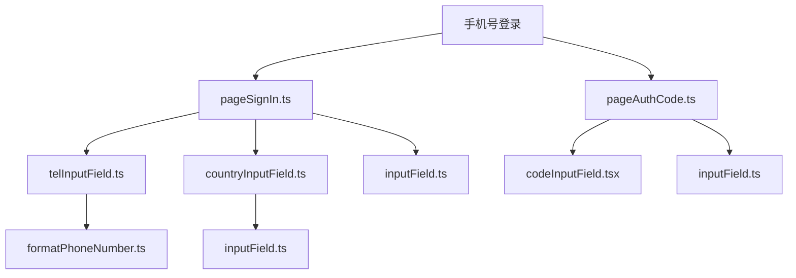
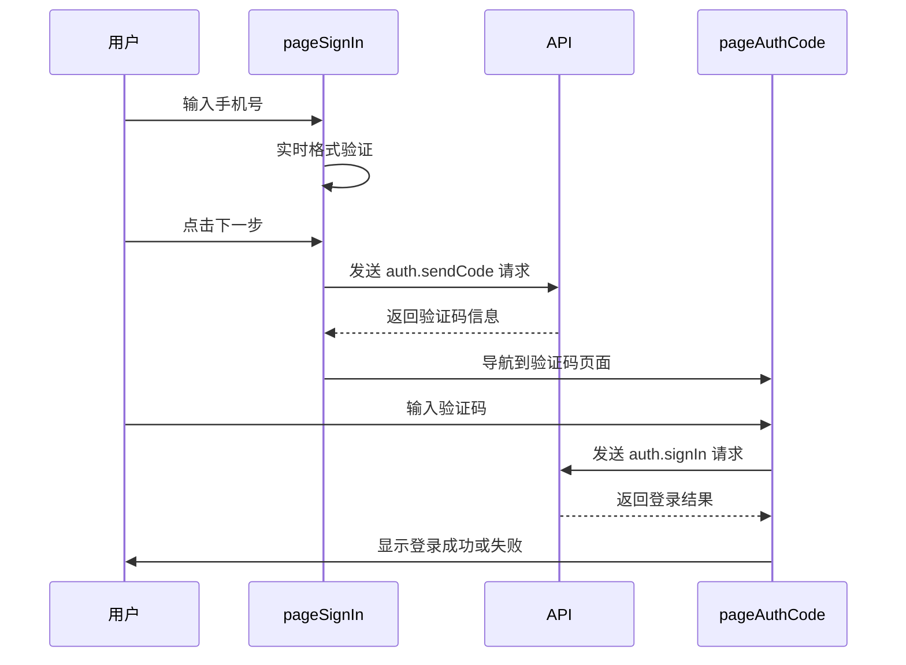
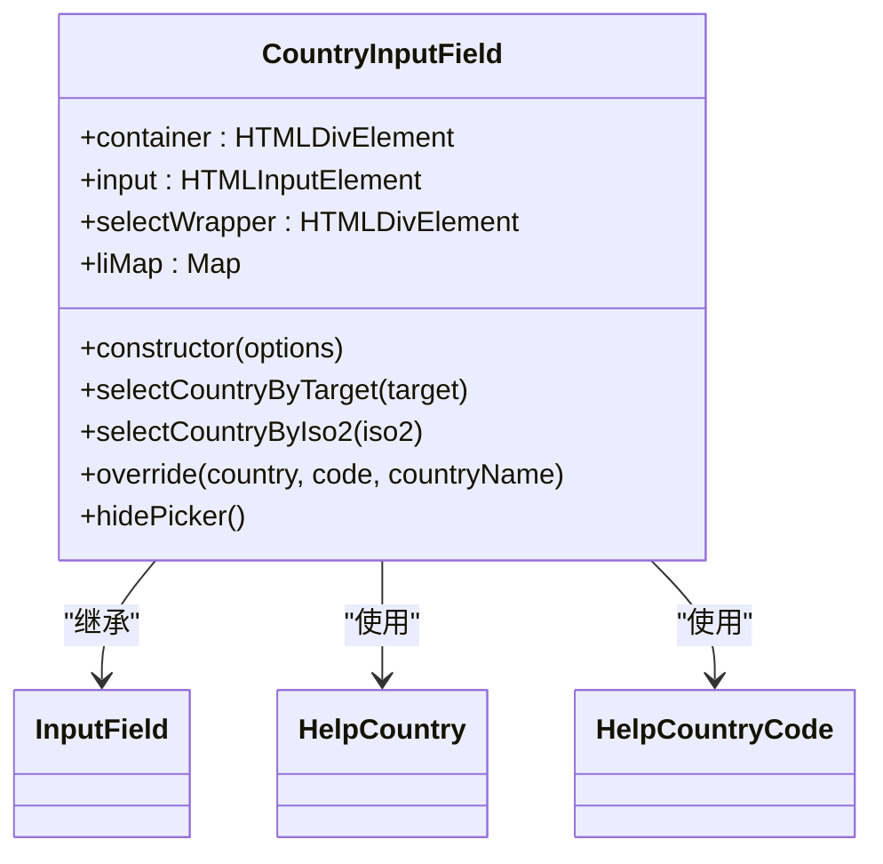
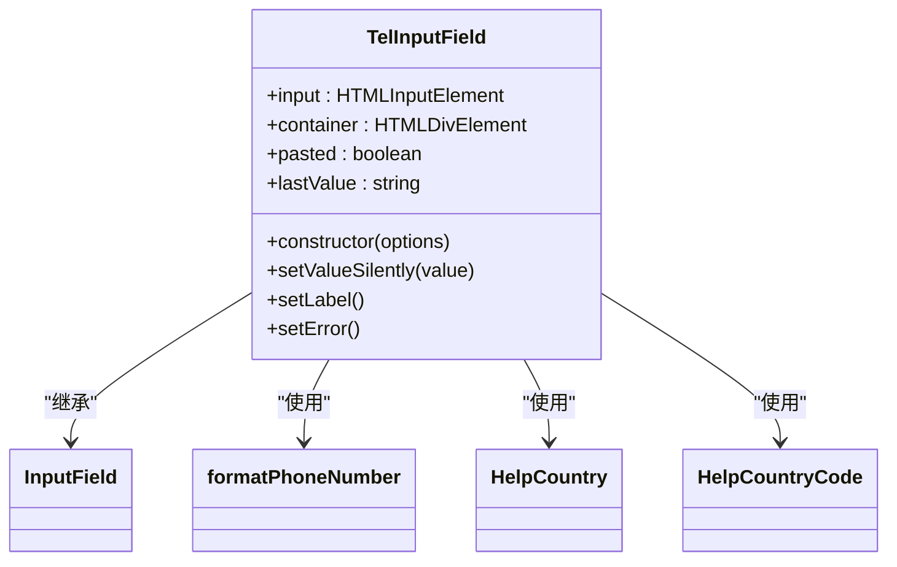
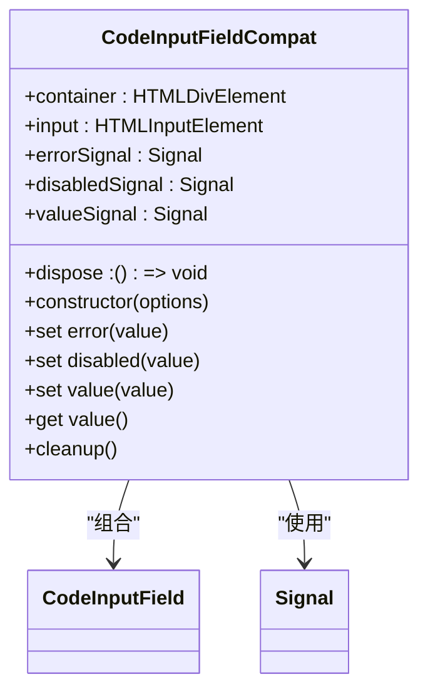
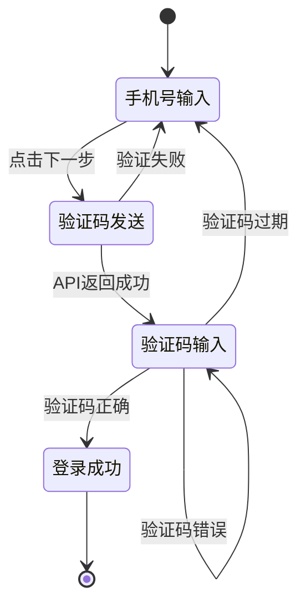
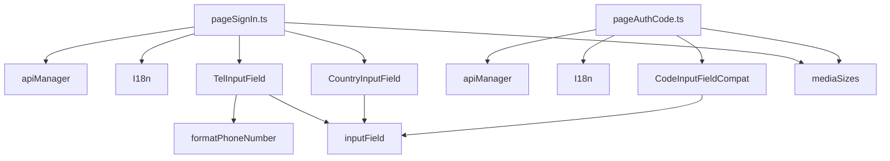

# 手机号登录界面组件

<cite>
**本文档引用的文件**
- [pageSignIn.ts](file://src/pages/pageSignIn.ts)
- [pageAuthCode.ts](file://src/pages/pageAuthCode.ts)
- [telInputField.ts](file://src/components/telInputField.ts)
- [countryInputField.ts](file://src/components/countryInputField.ts)
- [codeInputField.tsx](file://src/components/codeInputField.tsx)
- [formatPhoneNumber.ts](file://src/helpers/formatPhoneNumber.ts)
- [inputField.ts](file://src/components/inputField.ts)
- [mediaSizes.ts](file://src/helpers/mediaSizes.ts)
</cite>

## 目录
1. [项目结构](#项目结构)
2. [核心组件](#核心组件)
3. [架构概述](#架构概述)
4. [详细组件分析](#详细组件分析)
5. [依赖分析](#依赖分析)
6. [性能考虑](#性能考虑)
7. [故障排除指南](#故障排除指南)
8. [结论](#结论)

## 项目结构

手机号登录界面组件主要由两个核心页面组成：`pageSignIn.ts` 负责手机号输入和验证，`pageAuthCode.ts` 负责验证码输入和验证。这些页面依赖于多个UI组件，包括电话号码输入框、国家代码选择器和验证码输入框。

**图表来源**
- [pageSignIn.ts](file://src/pages/pageSignIn.ts#L1-L294)
- [pageAuthCode.ts](file://src/pages/pageAuthCode.ts#L1-L328)

**章节来源**
- [pageSignIn.ts](file://src/pages/pageSignIn.ts#L1-L294)
- [pageAuthCode.ts](file://src/pages/pageAuthCode.ts#L1-L328)

## 核心组件

手机号登录界面的核心组件包括手机号输入组件和验证码输入组件。`pageSignIn.ts` 实现了手机号输入界面，包含国际区号选择和号码格式验证功能。`pageAuthCode.ts` 实现了验证码输入界面，包含6位验证码输入框、倒计时显示和重新发送按钮。

**章节来源**
- [pageSignIn.ts](file://src/pages/pageSignIn.ts#L1-L294)
- [pageAuthCode.ts](file://src/pages/pageAuthCode.ts#L1-L328)

## 架构概述

手机号登录流程采用分步验证架构，首先通过手机号验证，然后进行验证码验证。系统通过事件驱动的方式管理状态转换，确保用户体验的流畅性。

**图表来源**
- [pageSignIn.ts](file://src/pages/pageSignIn.ts#L129-L153)
- [pageAuthCode.ts](file://src/pages/pageAuthCode.ts#L50-L89)

## 详细组件分析

### 手机号输入组件分析

手机号输入组件由国家代码选择器和电话号码输入框组成，提供完整的手机号验证功能。

#### 国家代码选择器实现

**图表来源**
- [countryInputField.ts](file://src/components/countryInputField.ts#L72-L313)
- [inputField.ts](file://src/components/inputField.ts#L456-L800)

#### 电话号码输入框实现

**图表来源**
- [telInputField.ts](file://src/components/telInputField.ts#L13-L112)
- [inputField.ts](file://src/components/inputField.ts#L456-L800)
- [formatPhoneNumber.ts](file://src/helpers/formatPhoneNumber.ts#L23-L127)

### 验证码输入组件分析

验证码输入组件提供6位验证码输入功能，包含焦点管理和状态反馈。

#### 验证码输入框实现

**图表来源**
- [codeInputField.tsx](file://src/components/codeInputField.tsx#L13-L63)
- [codeInputField.tsx](file://src/components/codeInputField.tsx#L65-L297)

### 状态转换分析

手机号登录界面的状态转换展示了从初始状态到成功验证的完整流程。

**图表来源**
- [pageSignIn.ts](file://src/pages/pageSignIn.ts#L117-L170)
- [pageAuthCode.ts](file://src/pages/pageAuthCode.ts#L49-L124)

## 依赖分析

手机号登录组件依赖于多个核心模块，包括API管理、语言包和媒体尺寸检测。

**图表来源**
- [pageSignIn.ts](file://src/pages/pageSignIn.ts#L7-L294)
- [pageAuthCode.ts](file://src/pages/pageAuthCode.ts#L7-L328)
- [go.mod](file://go.mod#L1-L20)

**章节来源**
- [pageSignIn.ts](file://src/pages/pageSignIn.ts#L7-L294)
- [pageAuthCode.ts](file://src/pages/pageAuthCode.ts#L7-L328)

## 性能考虑

手机号登录界面在性能方面进行了多项优化，包括预加载动画资源和延迟加载组件。

**章节来源**
- [pageSignIn.ts](file://src/pages/pageSignIn.ts#L76-L77)
- [pageAuthCode.ts](file://src/pages/pageAuthCode.ts#L143-L166)

## 故障排除指南

手机号登录界面的常见问题包括号码格式错误、验证码过期和网络连接问题。

**章节来源**
- [pageSignIn.ts](file://src/pages/pageSignIn.ts#L157-L168)
- [pageAuthCode.ts](file://src/pages/pageAuthCode.ts#L90-L113)

## 结论

手机号登录界面组件通过模块化设计和清晰的状态管理，提供了流畅的用户体验。组件的可扩展性和可维护性良好，便于后续功能迭代和优化。