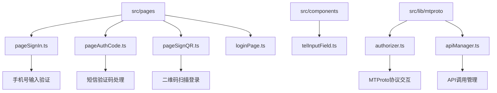
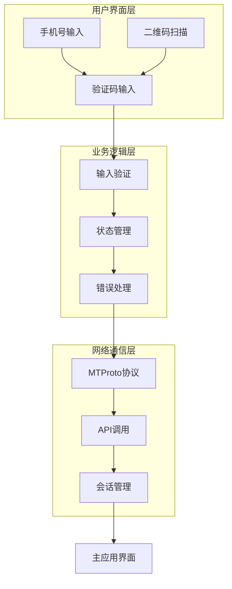
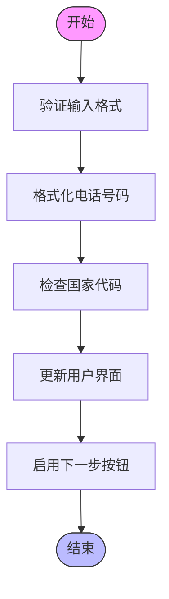
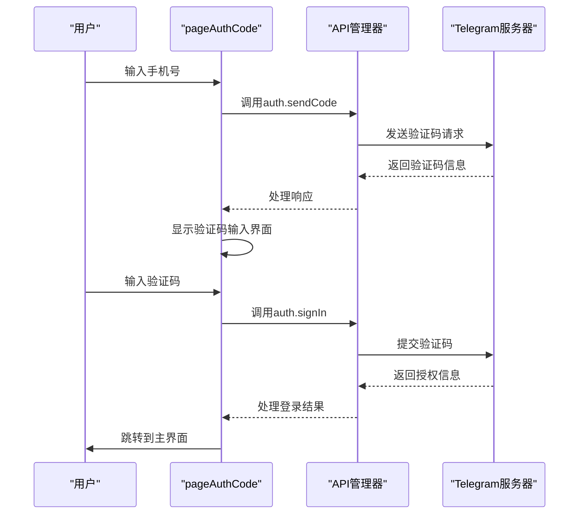
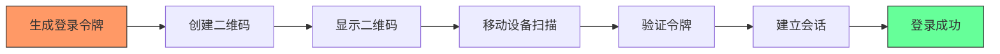
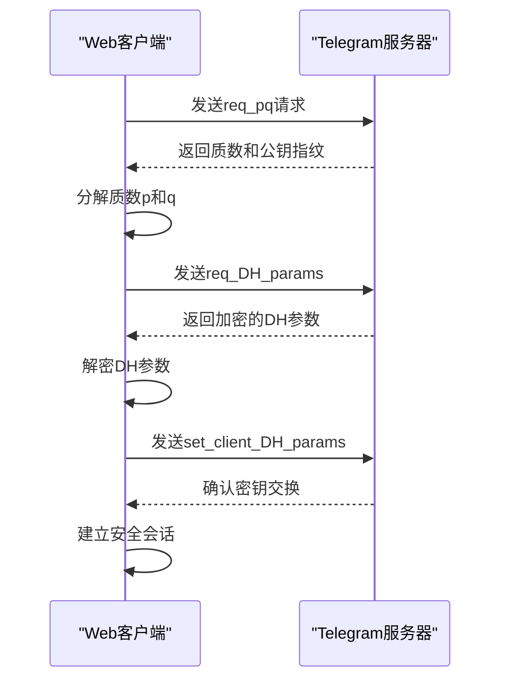
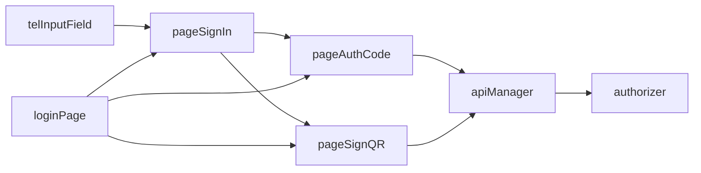

# 登录流程

<cite>
**本文档引用的文件**
- [pageSignIn.ts](file://src/pages/pageSignIn.ts)
- [pageAuthCode.ts](file://src/pages/pageAuthCode.ts)
- [pageSignQR.ts](file://src/pages/pageSignQR.ts)
- [authorizer.ts](file://src/lib/mtproto/authorizer.ts)
- [telInputField.ts](file://src/components/telInputField.ts)
- [apiManager.ts](file://src/lib/mtproto/apiManager.ts)
- [loginPage.ts](file://src/pages/loginPage.ts)
</cite>

## 目录
1. [介绍](#介绍)
2. [项目结构](#项目结构)
3. [核心组件](#核心组件)
4. [架构概述](#架构概述)
5. [详细组件分析](#详细组件分析)
6. [依赖分析](#依赖分析)
7. [性能考虑](#性能考虑)
8. [故障排除指南](#故障排除指南)
9. [结论](#结论)

## 介绍
本文档详细介绍了Telegram Web客户端的登录流程，重点分析了手机号登录和二维码登录两种方式。文档涵盖了从用户界面交互到MTProto协议通信的完整流程，包括输入验证、验证码处理、会话建立和错误处理等关键环节。通过分析核心代码文件，本文档为开发人员提供了深入理解登录机制的全面视角。

## 项目结构
Telegram Web客户端的登录功能主要分布在`src/pages`目录下的多个页面组件中，这些组件协同工作以实现完整的登录流程。核心登录组件包括手机号登录、验证码处理和二维码登录，它们通过模块化的方式组织，确保了代码的可维护性和可扩展性。

**图表来源**
- [pageSignIn.ts](file://src/pages/pageSignIn.ts)
- [pageAuthCode.ts](file://src/pages/pageAuthCode.ts)
- [pageSignQR.ts](file://src/pages/pageSignQR.ts)
- [authorizer.ts](file://src/lib/mtproto/authorizer.ts)
- [apiManager.ts](file://src/lib/mtproto/apiManager.ts)
- [telInputField.ts](file://src/components/telInputField.ts)

**章节来源**
- [pageSignIn.ts](file://src/pages/pageSignIn.ts)
- [pageAuthCode.ts](file://src/pages/pageAuthCode.ts)
- [pageSignQR.ts](file://src/pages/pageSignQR.ts)

## 核心组件
登录流程的核心组件包括手机号输入验证、短信验证码处理、二维码登录机制和MTProto协议交互。这些组件通过清晰的职责划分和紧密的协作，实现了安全可靠的用户认证过程。手机号登录组件负责处理用户输入和初步验证，验证码组件管理短信验证码的接收和提交，二维码组件实现移动设备与Web客户端的无缝连接，而协议交互组件则确保了与Telegram服务器的安全通信。

**章节来源**
- [pageSignIn.ts](file://src/pages/pageSignIn.ts#L34-L294)
- [pageAuthCode.ts](file://src/pages/pageAuthCode.ts#L40-L328)
- [pageSignQR.ts](file://src/pages/pageSignQR.ts#L26-L249)
- [authorizer.ts](file://src/lib/mtproto/authorizer.ts#L129-L662)

## 架构概述
Telegram Web客户端的登录架构采用分层设计，将用户界面、业务逻辑和网络通信分离。这种架构确保了系统的可维护性和可扩展性，同时提供了良好的用户体验。登录流程从用户界面开始，经过业务逻辑处理，最终通过MTProto协议与服务器进行安全通信。

**图表来源**
- [pageSignIn.ts](file://src/pages/pageSignIn.ts)
- [pageAuthCode.ts](file://src/pages/pageAuthCode.ts)
- [authorizer.ts](file://src/lib/mtproto/authorizer.ts)
- [apiManager.ts](file://src/lib/mtproto/apiManager.ts)

## 详细组件分析

### 手机号登录分析
手机号登录组件实现了完整的手机号输入验证逻辑，确保用户输入的电话号码格式正确并符合国际标准。组件通过集成国家代码选择器和智能格式化功能，提供了流畅的用户体验。

#### 手机号输入验证

**图表来源**
- [pageSignIn.ts](file://src/pages/pageSignIn.ts#L58-L109)
- [telInputField.ts](file://src/components/telInputField.ts#L13-L112)

**章节来源**
- [pageSignIn.ts](file://src/pages/pageSignIn.ts#L34-L170)
- [telInputField.ts](file://src/components/telInputField.ts#L1-L112)

### 短信验证码处理分析
短信验证码处理组件管理从服务器请求验证码到用户提交验证码的完整流程。组件通过状态管理和错误处理机制，确保了验证码流程的可靠性和安全性。

#### 验证码流程

**图表来源**
- [pageAuthCode.ts](file://src/pages/pageAuthCode.ts#L49-L124)
- [apiManager.ts](file://src/lib/mtproto/apiManager.ts#L596-L796)

**章节来源**
- [pageAuthCode.ts](file://src/pages/pageAuthCode.ts#L126-L328)
- [apiManager.ts](file://src/lib/mtproto/apiManager.ts#L596-L796)

### 二维码登录分析
二维码登录组件实现了移动设备与Web客户端的安全连接机制。通过生成包含登录令牌的二维码，用户可以快速安全地登录Web客户端，无需手动输入凭证。

#### 二维码登录流程

**图表来源**
- [pageSignQR.ts](file://src/pages/pageSignQR.ts#L76-L215)
- [authorizer.ts](file://src/lib/mtproto/authorizer.ts#L622-L660)

**章节来源**
- [pageSignQR.ts](file://src/pages/pageSignQR.ts#L26-L249)
- [authorizer.ts](file://src/lib/mtproto/authorizer.ts#L129-L662)

### MTProto协议交互分析
MTProto协议交互组件负责与Telegram服务器进行安全通信，实现端到端加密和身份验证。组件通过复杂的加密算法和协议流程，确保了用户数据的安全性。

#### 协议交互流程

**图表来源**
- [authorizer.ts](file://src/lib/mtproto/authorizer.ts#L215-L608)
- [apiManager.ts](file://src/lib/mtproto/apiManager.ts#L484-L496)

**章节来源**
- [authorizer.ts](file://src/lib/mtproto/authorizer.ts#L129-L662)
- [apiManager.ts](file://src/lib/mtproto/apiManager.ts#L401-L548)

## 依赖分析
登录组件之间的依赖关系清晰且合理，确保了系统的模块化和可维护性。主要依赖关系包括页面组件之间的导航、API管理器对协议交互组件的调用，以及UI组件对业务逻辑的依赖。

**图表来源**
- [pageSignIn.ts](file://src/pages/pageSignIn.ts)
- [pageAuthCode.ts](file://src/pages/pageAuthCode.ts)
- [pageSignQR.ts](file://src/pages/pageSignQR.ts)
- [apiManager.ts](file://src/lib/mtproto/apiManager.ts)
- [authorizer.ts](file://src/lib/mtproto/authorizer.ts)

**章节来源**
- [pageSignIn.ts](file://src/pages/pageSignIn.ts)
- [pageAuthCode.ts](file://src/pages/pageAuthCode.ts)
- [pageSignQR.ts](file://src/pages/pageSignQR.ts)
- [apiManager.ts](file://src/lib/mtproto/apiManager.ts)

## 性能考虑
登录流程在性能方面进行了优化，确保了快速响应和流畅的用户体验。主要性能优化包括：
- 异步加载关键资源，避免阻塞主线程
- 缓存网络连接和认证密钥，减少重复握手
- 使用Web Workers处理加密计算，避免UI卡顿
- 智能重试机制，提高网络不稳定环境下的成功率

## 故障排除指南
常见的登录问题及其解决方案包括：

**章节来源**
- [pageSignIn.ts](file://src/pages/pageSignIn.ts#L157-L168)
- [pageAuthCode.ts](file://src/pages/pageAuthCode.ts#L91-L113)
- [pageSignQR.ts](file://src/pages/pageSignQR.ts#L199-L208)
- [apiManager.ts](file://src/lib/mtproto/apiManager.ts#L627-L650)

### 常见错误状态码
| 错误代码 | 描述 | 解决方案 |
|---------|------|---------|
| PHONE_NUMBER_INVALID | 电话号码无效 | 检查号码格式并重新输入 |
| PHONE_CODE_EXPIRED | 验证码已过期 | 请求新的验证码 |
| PHONE_CODE_INVALID | 验证码不正确 | 重新输入正确的验证码 |
| SESSION_PASSWORD_NEEDED | 需要两步验证密码 | 输入设置的两步验证密码 |
| NETWORK_BAD_RESPONSE | 网络响应错误 | 检查网络连接并重试 |

### 用户体验优化
登录流程包含多项用户体验优化：
- 实时输入验证反馈
- 清晰的错误提示信息
- 加载状态指示器
- 键盘快捷键支持
- 移动设备适配

## 结论
Telegram Web客户端的登录流程设计精良，通过模块化的组件结构和安全的通信协议，为用户提供了可靠且便捷的登录体验。手机号登录和二维码登录两种方式满足了不同用户的需求，而详细的错误处理和用户体验优化则确保了高可用性和用户满意度。该架构为未来的功能扩展和安全增强提供了坚实的基础。