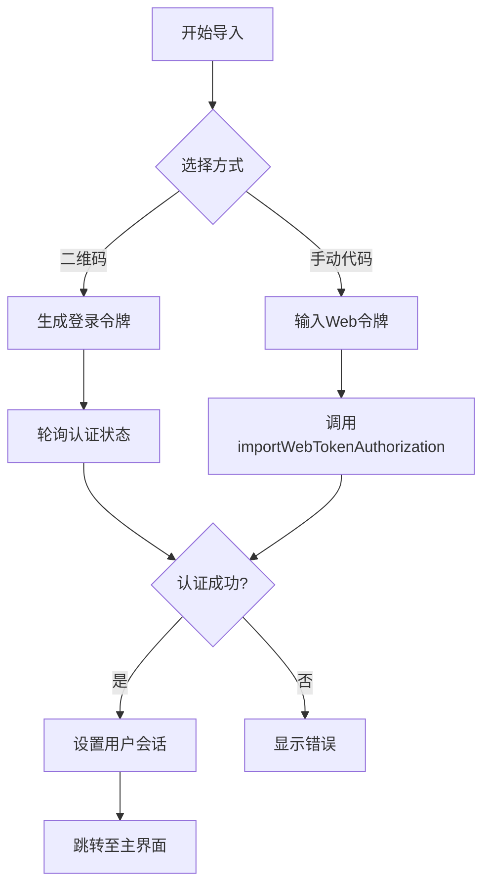

# 账户导入

<cite>
**本文档引用文件**  
- [pageSignImport.ts](file://src/pages/pageSignImport.ts)
- [pageSignQR.ts](file://src/pages/pageSignQR.ts)
- [accountController.ts](file://src/lib/accounts/accountController.ts)
- [types.d.ts](file://src/lib/accounts/types.d.ts)
- [constants.ts](file://src/lib/accounts/constants.ts)
</cite>

## 目录
1. [简介](#简介)
2. [用户界面设计与交互逻辑](#用户界面设计与交互逻辑)
3. [账户数据迁移机制](#账户数据迁移机制)
4. [安全考虑](#安全考虑)
5. [账户配置同步](#账户配置同步)
6. [导入失败原因及解决方案](#导入失败原因及解决方案)

## 简介
本文档详细说明了Telegram Web客户端中从其他设备导入账户的完整流程。该功能允许用户通过二维码扫描或手动输入代码的方式，将现有Telegram账户安全地迁移到当前设备。系统通过MTProto协议实现端到端加密的会话密钥传输，并支持多账户管理。

## 用户界面设计与交互逻辑

账户导入向导提供了两种便捷的身份验证方式：二维码扫描和手动代码输入。用户在登录页面选择“通过二维码登录”后，系统会生成一个动态更新的二维码，包含加密的登录令牌信息。

二维码界面包含清晰的操作指引，列出三个步骤：打开Telegram应用、进入设置菜单并选择“扫描二维码”。界面右上角提供取消按钮，允许用户返回常规登录流程。

对于手动输入方式，系统支持从其他设备复制并粘贴一次性登录代码。两种方式均采用异步处理机制，在后台持续轮询认证状态，一旦检测到成功授权即自动跳转至主界面。

**Section sources**
- [pageSignQR.ts](file://src/pages/pageSignQR.ts#L26-L232)
- [pageSignIn.ts](file://src/pages/pageSignIn.ts#L177-L179)

## 账户数据迁移机制

账户数据迁移基于Telegram的MTProto安全协议，通过`auth.exportLoginToken`和`auth.importLoginToken` API方法实现会话密钥的安全传输。

系统在`accountController.ts`中实现了多账户管理逻辑，支持最多4个账户（免费用户3个）。每个账户的数据以独立的`account{number}`键存储在会话存储中，包含以下关键信息：
- 各DC中心的授权密钥（`dc{Id}_auth_key`）
- 服务器盐值（`dc{Id}_server_salt`）
- 用户ID和DC标识
- 推送密钥和指纹信息

当新账户成功导入时，系统会自动更新账户计数，并维护账户数据的完整性。对于主账户（账户1），还会同步更新遗留存储结构以确保兼容性。

**Diagram sources**
- [accountController.ts](file://src/lib/accounts/accountController.ts#L16-L30)
- [types.d.ts](file://src/lib/accounts/types.d.ts#L5-L14)

**Section sources**
- [accountController.ts](file://src/lib/accounts/accountController.ts#L1-L154)
- [types.d.ts](file://src/lib/accounts/types.d.ts#L1-L17)

## 安全考虑

账户导入过程实施了多层次的安全保护措施：

1. **端到端加密传输**：所有认证数据通过MTProto协议加密传输，登录令牌仅在有效期内可用（通常为120秒）。
2. **动态令牌机制**：二维码中的令牌会定期刷新，防止重放攻击。
3. **设备隔离**：每个账户的授权密钥独立存储，启用密码锁时会自动清除明文密钥。
4. **异常处理**：系统会检测`SESSION_PASSWORD_NEEDED`等特殊状态，引导用户完成两步验证流程。

导入过程中，客户端与Telegram服务器直接通信，不经过中间服务器，确保了传输过程的安全性。同时，系统会自动排除已登录设备的ID，防止循环登录。

**Section sources**
- [pageSignImport.ts](file://src/pages/pageSignImport.ts#L16-L53)
- [pageSignQR.ts](file://src/pages/pageSignQR.ts#L78-L95)

## 账户配置同步

导入成功后，系统会自动同步以下账户配置：

- **基本设置**：语言偏好、通知设置、隐私选项
- **主题与外观**：当前主题、字体大小、聊天背景
- **聊天列表**：所有对话记录、未读状态、置顶聊天
- **账户信息**：用户名、头像、个人简介

这些配置通过`rootScope.managers.apiManager.setUser()`方法初始化，并从服务器获取完整用户数据。多账户环境下，每个账户保持独立的配置状态，切换账户时会自动加载对应设置。

**Section sources**
- [pageSignImport.ts](file://src/pages/pageSignImport.ts#L27-L29)
- [pageSignQR.ts](file://src/pages/pageSignQR.ts#L98-L101)

## 导入失败原因及解决方案

### 常见失败原因

| 错误类型 | 可能原因 | 解决方案 |
|---------|--------|--------|
| 网络连接问题 | 网络不稳定或防火墙限制 | 检查网络连接，尝试切换网络环境 |
| 无效代码 | 代码过期或输入错误 | 重新生成二维码或获取新代码 |
| 会话冲突 | 设备已达最大登录限制 | 注销其他设备会话后重试 |
| 密码保护 | 账户启用了两步验证 | 输入正确的密码完成验证 |

### 解决方案

1. **网络问题**：确保设备网络畅通，可尝试刷新页面重新生成二维码。
2. **代码失效**：二维码每120秒自动更新，需使用最新生成的代码。
3. **多账户限制**：免费账户最多同时登录3个设备，超出限制需先注销旧会话。
4. **两步验证**：当系统返回`SESSION_PASSWORD_NEEDED`错误时，需引导用户进入密码输入页面完成验证。

系统在错误处理中包含了详细的日志记录，便于诊断和排查问题。

**Section sources**
- [pageSignImport.ts](file://src/pages/pageSignImport.ts#L32-L47)
- [pageSignQR.ts](file://src/pages/pageSignQR.ts#L199-L209)