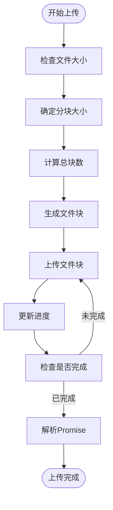
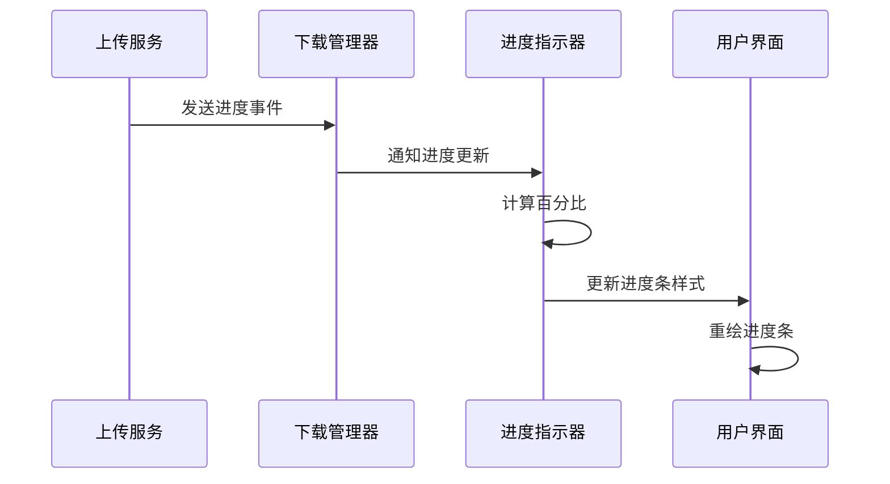
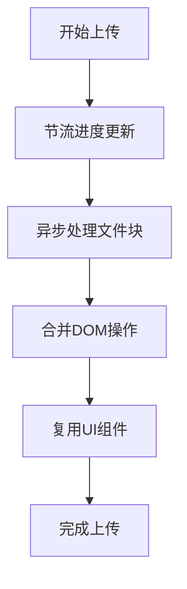
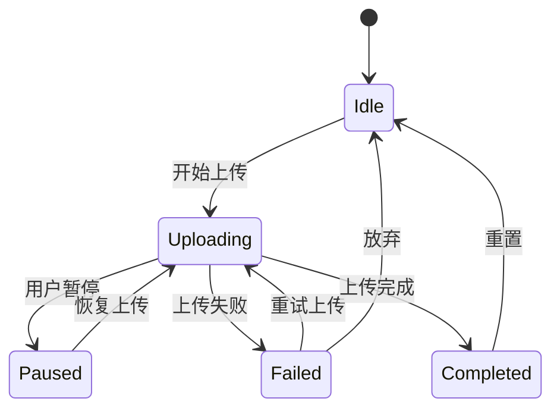

# 上传进度反馈

<cite>
**本文档引用的文件**   
- [preloader.ts](file://src/components/preloader.ts)
- [apiFileManager.ts](file://src/lib/mtproto/apiFileManager.ts)
- [appDownloadManager.ts](file://src/lib/appManagers/appDownloadManager.ts)
- [mediaProgressLine.ts](file://src/components/mediaProgressLine.ts)
- [cancellablePromise.ts](file://src/helpers/cancellablePromise.ts)
</cite>

## 目录
1. [简介](#简介)
2. [进度计算机制](#进度计算机制)
3. [UI更新机制](#ui更新机制)
4. [多文件上传聚合策略](#多文件上传聚合策略)
5. [性能优化建议](#性能优化建议)
6. [异常情况处理](#异常情况处理)
7. [结论](#结论)

## 简介
本系统实现了完整的上传进度反馈机制，通过实时计算上传进度、响应式UI更新和高效的事件处理系统，为用户提供流畅的文件上传体验。系统采用模块化设计，将进度计算、UI更新和事件处理分离，确保代码的可维护性和扩展性。

## 进度计算机制

上传进度反馈系统的核心是精确的进度计算机制。系统通过分块上传的方式处理大文件，每个文件被分割成多个部分进行上传，同时实时跟踪已上传的字节数和总大小，计算出准确的进度百分比。

在 `apiFileManager.ts` 文件中，`upload` 方法负责处理文件上传逻辑。该方法首先根据文件大小确定分块大小，然后创建一个生成器函数来逐个处理每个文件块。在上传每个块时，系统会更新已上传的块数，并通过 `deferred.notify` 方法发送进度更新事件。



**Diagram sources**
- [apiFileManager.ts](file://src/lib/mtproto/apiFileManager.ts#L1038-L1158)

**Section sources**
- [apiFileManager.ts](file://src/lib/mtproto/apiFileManager.ts#L1038-L1158)

## UI更新机制

UI更新机制基于响应式系统实现，通过事件监听和高效的DOM操作确保进度条和状态提示的实时更新。系统使用 `ProgressivePreloader` 类来管理上传进度的视觉反馈，该类封装了进度条的创建、更新和销毁逻辑。

在 `preloader.ts` 文件中，`ProgressivePreloader` 类的 `attachPromise` 方法监听上传Promise的进度通知。当收到进度更新时，`setProgress` 方法会被调用，通过修改SVG元素的 `strokeDasharray` 属性来更新进度条的显示。



**Diagram sources**
- [preloader.ts](file://src/components/preloader.ts#L226-L318)
- [appDownloadManager.ts](file://src/lib/appManagers/appDownloadManager.ts#L55-L66)

**Section sources**
- [preloader.ts](file://src/components/preloader.ts#L226-L318)
- [appDownloadManager.ts](file://src/lib/appManagers/appDownloadManager.ts#L55-L66)

## 多文件上传聚合策略

系统支持多文件上传，并提供了灵活的进度聚合策略。对于单个文件的进度，系统提供精确的百分比显示；对于整体上传进度，系统根据已完成的文件数量和总文件数量计算聚合进度。

在 `appDownloadManager.ts` 文件中，`downloads` 对象用于跟踪每个文件的上传状态。通过 `getNewDeferred` 方法创建的Promise对象可以监听单个文件的上传进度，而整体进度则通过计算已完成上传的文件数量与总文件数量的比例来确定。

```mermaid
classDiagram
class AppDownloadManager {
+downloads : {[fileName : string] : {main : Download} & {[type in DownloadType]? : Download}}
+progress : {[fileName : string] : Progress}
+construct(managers : AppManagers) : void
+getNewDeferred(fileName : string, type? : DownloadType) : CancellablePromise<any>
+getDownload(fileName : string, type? : DownloadType) : Download
+clearDownload(fileName : string, type? : DownloadType) : void
}
class ProgressivePreloader {
+preloader : HTMLDivElement
+circle : SVGCircleElement
+promise : CancellablePromise<any>
+isUpload : boolean
+totalLength : number
+attachPromise(promise : CancellablePromise<any>) : void
+setProgress(percents : number) : void
+attach(elem : Element, reset? : boolean, promise? : CancellablePromise<any>) : void
+detach() : void
}
class CancellablePromise {
+resolve : (value : T) => void
+reject : (...args : any[]) => void
+cancel : (reason? : any) => void
+notify : (...args : any[]) => void
+notifyAll : (...args : any[]) => void
+addNotifyListener : (callback : (...args : any[]) => void) => void
}
AppDownloadManager --> CancellablePromise : "使用"
ProgressivePreloader --> CancellablePromise : "监听"
AppDownloadManager --> ProgressivePreloader : "管理"
```

**Diagram sources**
- [appDownloadManager.ts](file://src/lib/appManagers/appDownloadManager.ts#L46-L138)
- [preloader.ts](file://src/components/preloader.ts#L17-L319)
- [cancellablePromise.ts](file://src/helpers/cancellablePromise.ts#L9-L89)

**Section sources**
- [appDownloadManager.ts](file://src/lib/appManagers/appDownloadManager.ts#L46-L138)
- [preloader.ts](file://src/components/preloader.ts#L17-L319)

## 性能优化建议

为避免频繁UI更新导致的性能问题，系统采用了多种优化策略：

1. **节流更新**：在 `apiFileManager.ts` 中，使用 `throttledDispatchProgress` 函数对进度更新进行节流处理，避免过于频繁的UI更新。
2. **异步处理**：使用生成器函数和Promise链来异步处理文件块的上传，避免阻塞主线程。
3. **事件批处理**：将多个进度更新事件合并处理，减少DOM操作次数。
4. **资源复用**：通过 `ProgressivePreloader` 类的 `detached` 属性管理进度指示器的生命周期，避免重复创建和销毁DOM元素。



**Diagram sources**
- [apiFileManager.ts](file://src/lib/mtproto/apiFileManager.ts#L881-L914)
- [preloader.ts](file://src/components/preloader.ts#L226-L318)

**Section sources**
- [apiFileManager.ts](file://src/lib/mtproto/apiFileManager.ts#L881-L914)
- [preloader.ts](file://src/components/preloader.ts#L226-L318)

## 异常情况处理

系统提供了完善的异常情况处理机制，确保在上传暂停、失败恢复等情况下能够正确管理进度状态。

1. **上传暂停**：当用户暂停上传时，系统会取消当前的上传Promise，并保存已上传的进度信息，以便后续恢复。
2. **失败恢复**：在上传失败后，系统会保留已上传的文件块信息，允许用户从断点处继续上传。
3. **错误处理**：通过 `errorHandler` 函数处理各种上传错误，包括网络错误、文件过大等，并向用户显示适当的错误信息。



**Diagram sources**
- [apiFileManager.ts](file://src/lib/mtproto/apiFileManager.ts#L1120-L1130)
- [preloader.ts](file://src/components/preloader.ts#L142-L152)

**Section sources**
- [apiFileManager.ts](file://src/lib/mtproto/apiFileManager.ts#L1120-L1130)
- [preloader.ts](file://src/components/preloader.ts#L142-L152)

## 结论
上传进度反馈系统通过精确的进度计算、高效的UI更新和完善的异常处理机制，为用户提供流畅的文件上传体验。系统采用模块化设计，各组件职责清晰，便于维护和扩展。通过节流更新、异步处理等性能优化策略，确保了在大量文件上传时的系统稳定性。