# 分块上传

<cite>
**本文档中引用的文件**   
- [apiFileManager.ts](file://src/lib/mtproto/apiFileManager.ts#L1038-L1158)
- [mtproto_config.ts](file://src/lib/mtproto/mtproto_config.ts#L23)
- [fileStorage.ts](file://src/lib/files/fileStorage.ts)
- [streamWriter.ts](file://src/lib/files/streamWriter.ts)
- [networker.ts](file://src/lib/mtproto/networker.ts#L1252-L1340)
- [aesLocal.ts](file://src/lib/crypto/utils/aesLocal.ts)
</cite>

## 目录
1. [简介](#简介)
2. [分片处理机制](#分片处理机制)
3. [MTProto协议集成](#mtproto协议集成)
4. [断点续传实现](#断点续传实现)
5. [性能优化策略](#性能优化策略)
6. [错误处理机制](#错误处理机制)

## 简介
本文档详细阐述了大文件分块上传功能的实现机制。系统通过将大文件分割为多个分片进行上传，确保了大文件传输的稳定性和效率。分块上传功能与MTProto协议深度集成，保障了数据传输的安全性。同时，系统实现了断点续传机制，支持上传状态的持久化存储和异常恢复，提升了用户体验。

## 分片处理机制

分片处理机制是大文件上传的核心，通过将大文件分割为多个较小的分片进行上传，提高了传输的稳定性和效率。

### 分片大小策略
系统根据文件大小动态调整分片大小，以优化上传性能。对于小于10MB的文件，使用较小的分片大小；对于大于等于10MB的文件，使用较大的分片大小。分片大小的计算遵循以下原则：
- 最小分片大小为64KB
- 最大分片大小为512KB
- 根据文件总大小和最大分片数量动态调整分片大小

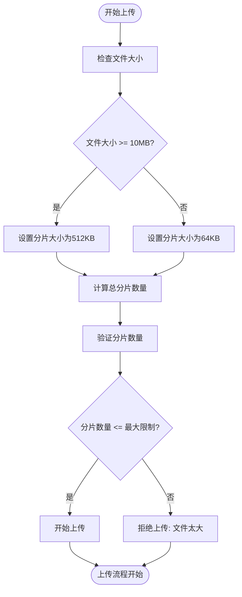

**图源**
- [apiFileManager.ts](file://src/lib/mtproto/apiFileManager.ts#L1043-L1045)

### 分片顺序管理
系统严格保证分片的上传顺序，通过分片索引标识每个分片的位置。上传过程中，系统按顺序处理每个分片，并在上传完成后更新进度信息。

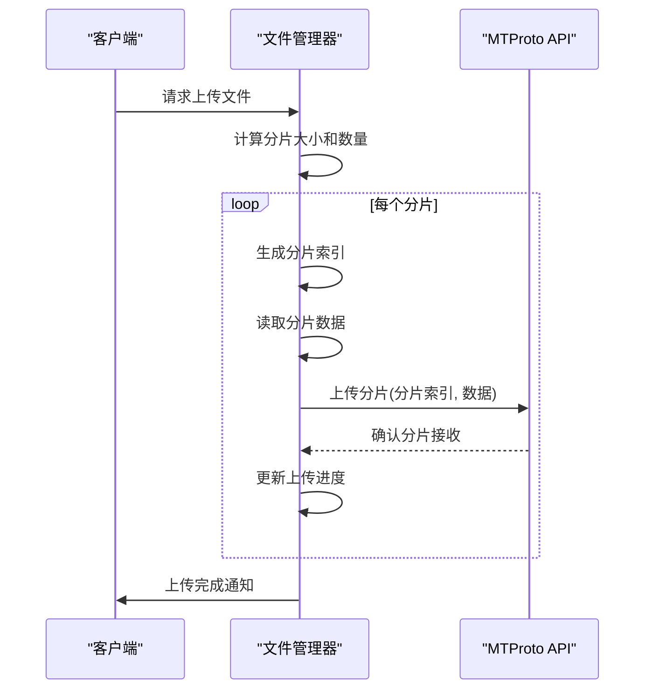

**图源**
- [apiFileManager.ts](file://src/lib/mtproto/apiFileManager.ts#L1077-L1080)

### 并发上传控制
系统通过请求队列和活动限制机制控制并发上传数量，避免过多的并发请求影响系统性能。上传请求被放入队列中，系统根据当前活动请求数量决定是否处理新的上传请求。

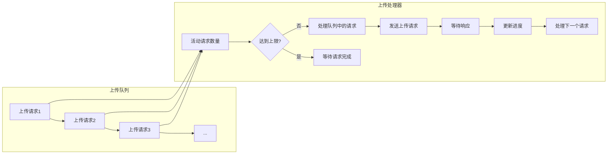

**图源**
- [apiFileManager.ts](file://src/lib/mtproto/apiFileManager.ts#L239-L276)

**分片处理机制源**
- [apiFileManager.ts](file://src/lib/mtproto/apiFileManager.ts#L1038-L1158)

## MTProto协议集成

分块上传功能与MTProto协议深度集成，确保了数据传输的安全性和完整性。

### 安全传输机制
系统使用MTProto协议的加密机制保护上传数据的安全。每个上传请求都经过AES加密，确保数据在传输过程中的机密性。

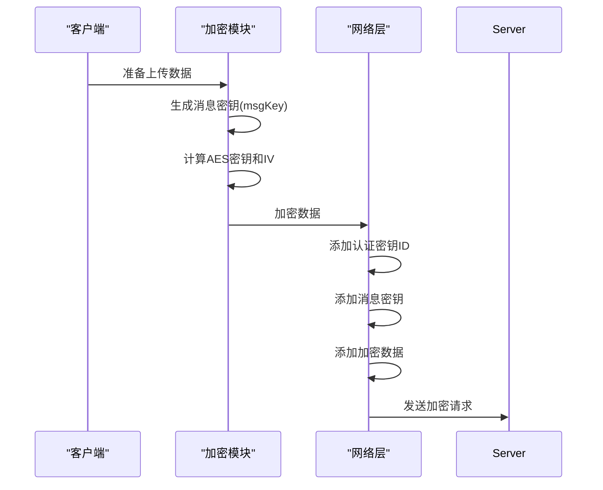

**图源**
- [networker.ts](file://src/lib/mtproto/networker.ts#L1252-L1340)

### 完整性验证
系统通过消息密钥(msgKey)验证数据的完整性。接收方使用相同的算法计算消息密钥，并与接收到的消息密钥进行比对，确保数据未被篡改。

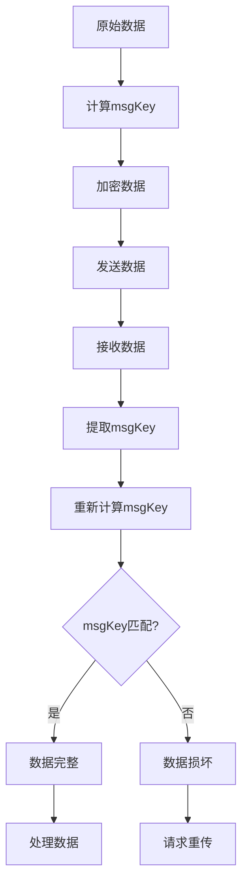

**图源**
- [networker.ts](file://src/lib/mtproto/networker.ts#L1403-L1410)

### 本地数据加密
对于需要在本地存储的敏感数据，系统使用AES-GCM模式进行加密，确保数据在设备上的安全性。

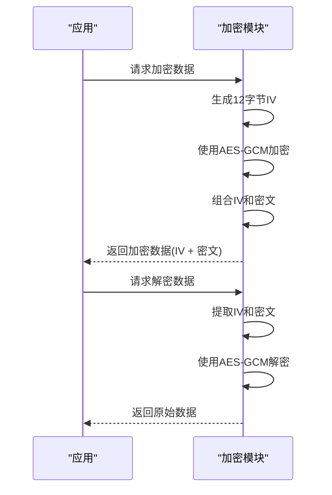

**图源**
- [aesLocal.ts](file://src/lib/crypto/utils/aesLocal.ts)

**MTProto协议集成源**
- [networker.ts](file://src/lib/mtproto/networker.ts#L1252-L1340)
- [aesLocal.ts](file://src/lib/crypto/utils/aesLocal.ts)

## 断点续传实现

断点续传功能允许在上传中断后从上次中断的位置继续上传，避免了重新上传整个文件。

### 上传状态持久化
系统将上传状态信息持久化存储，包括已上传的分片信息、上传进度等。这些信息在上传中断后可以被恢复。

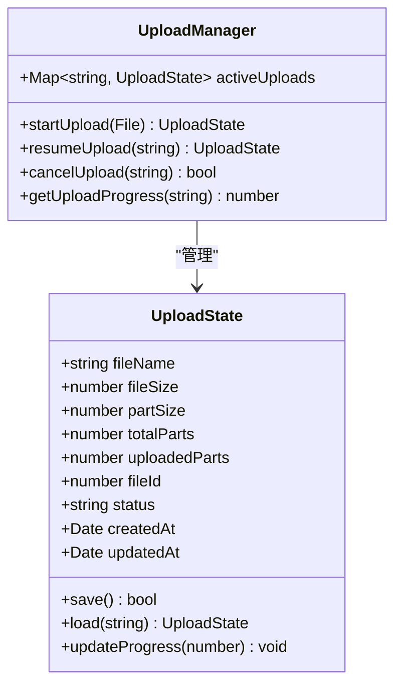

**图源**
- [apiFileManager.ts](file://src/lib/mtproto/apiFileManager.ts#L1142-L1143)

### 已上传分片校验
在恢复上传前，系统会校验已上传的分片，确保它们的完整性和正确性。通过对比分片的元数据和服务器记录，确认哪些分片已经成功上传。

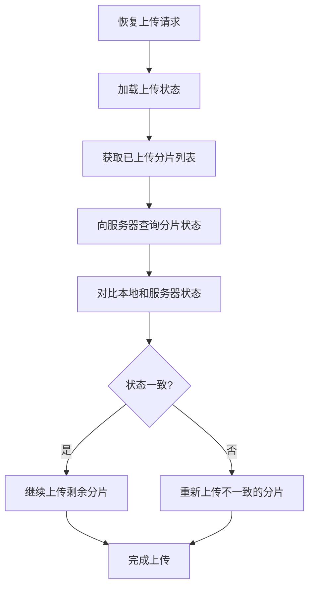

**图源**
- [apiFileManager.ts](file://src/lib/mtproto/apiFileManager.ts#L1119-L1123)

### 恢复上传流程
恢复上传流程包括状态恢复、分片校验和继续上传三个主要步骤。系统确保在恢复上传时不会重复上传已经成功上传的分片。

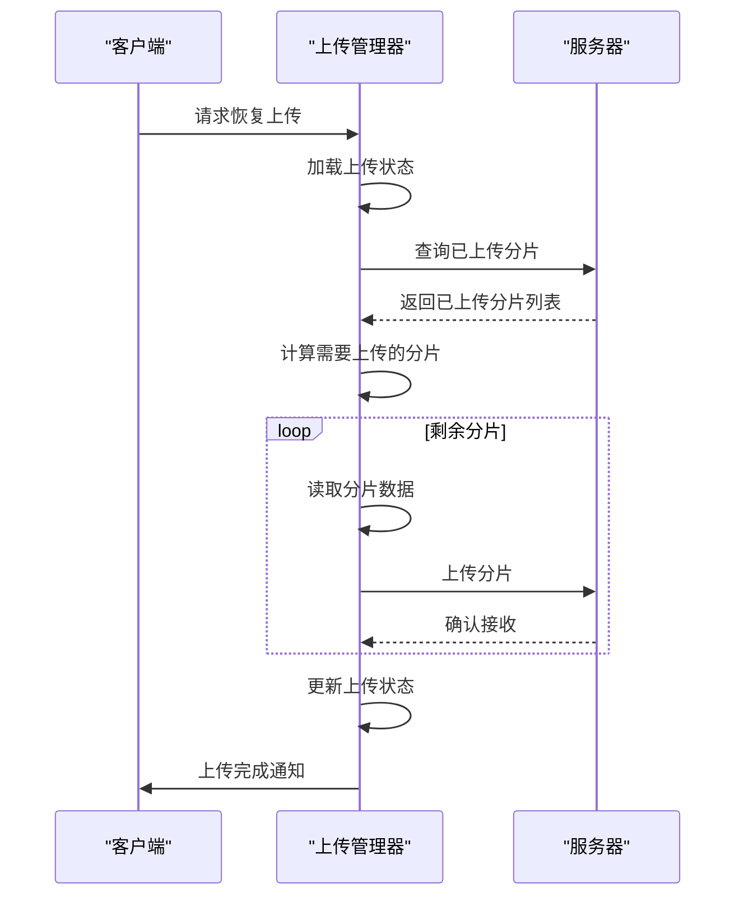

**图源**
- [apiFileManager.ts](file://src/lib/mtproto/apiFileManager.ts#L1144-L1155)

**断点续传实现源**
- [apiFileManager.ts](file://src/lib/mtproto/apiFileManager.ts#L1119-L1158)

## 性能优化策略

系统实现了多种性能优化策略，以提高上传效率和用户体验。

### 动态调整分片大小
系统根据网络状况和文件大小动态调整分片大小。在网络状况良好时使用较大的分片以提高吞吐量，在网络状况较差时使用较小的分片以减少重传成本。

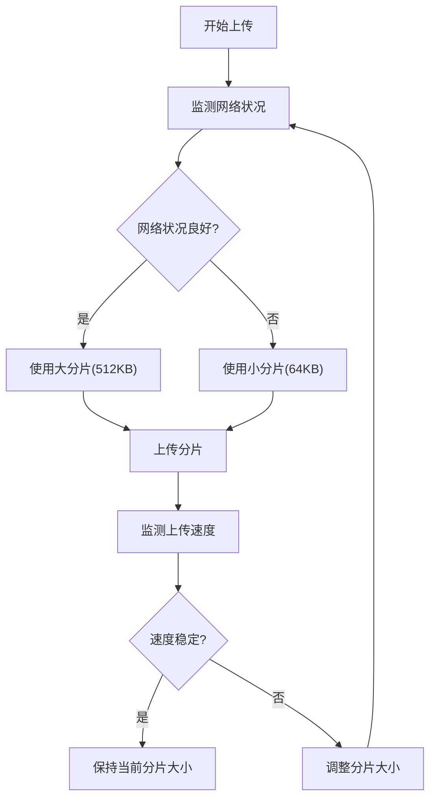

**图源**
- [apiFileManager.ts](file://src/lib/mtproto/apiFileManager.ts#L461-L481)

### 网络状况自适应
系统实时监测网络状况，并根据网络质量调整上传策略。包括调整并发请求数量、分片大小和重试策略。

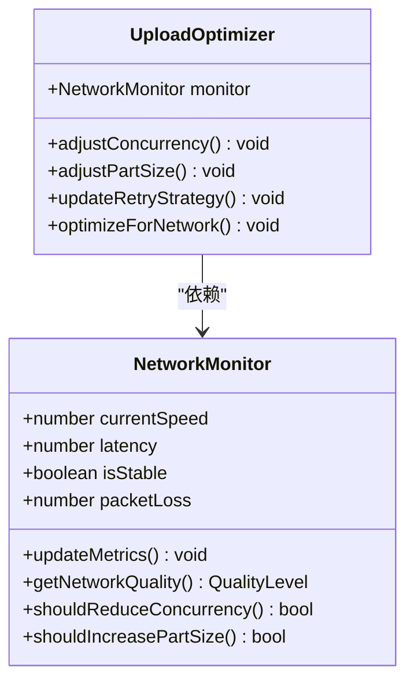

**图源**
- [apiFileManager.ts](file://src/lib/mtproto/apiFileManager.ts#L241-L244)

### 缓存机制
系统实现了多级缓存机制，对于小文件直接在内存中缓存，避免频繁的磁盘I/O操作。

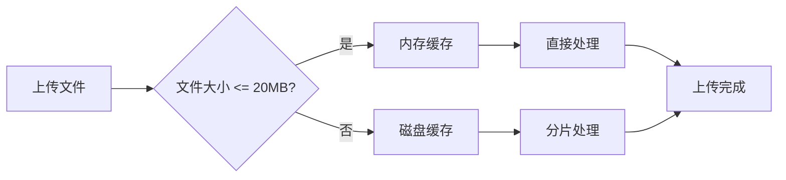

**图源**
- [mtproto_config.ts](file://src/lib/mtproto/mtproto_config.ts#L23)

**性能优化策略源**
- [apiFileManager.ts](file://src/lib/mtproto/apiFileManager.ts#L461-L481)
- [mtproto_config.ts](file://src/lib/mtproto/mtproto_config.ts#L23)

## 错误处理机制

系统实现了完善的错误处理机制，确保在各种异常情况下能够正确恢复。

### 分片丢失恢复
当检测到分片丢失时，系统会自动重新上传该分片，确保文件的完整性。

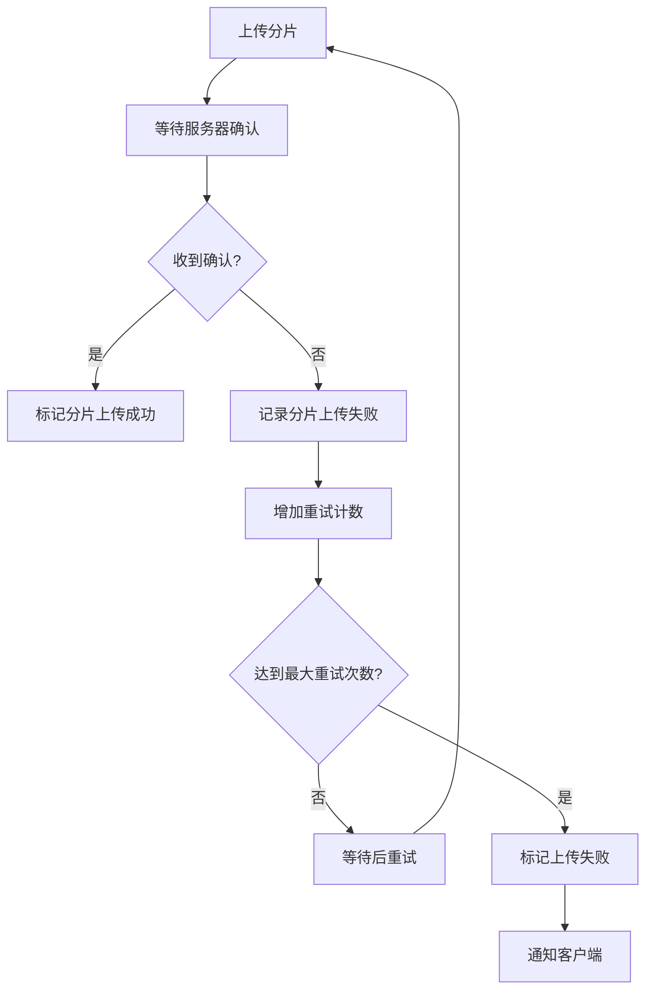

**图源**
- [apiFileManager.ts](file://src/lib/mtproto/apiFileManager.ts#L1112-L1113)

### 校验失败处理
当分片校验失败时，系统会重新上传该分片，确保数据的正确性。

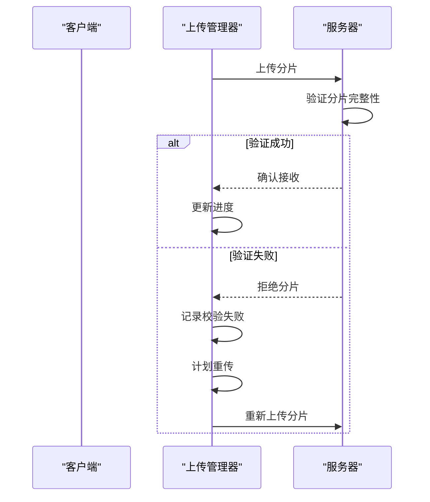

**图源**
- [apiFileManager.ts](file://src/lib/mtproto/apiFileManager.ts#L1100-L1101)

### 异常情况恢复方案
系统为各种异常情况提供了恢复方案，包括网络中断、服务器错误和客户端崩溃等。

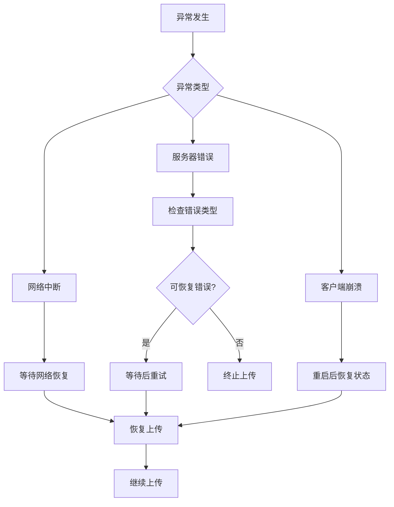

**图源**
- [apiFileManager.ts](file://src/lib/mtproto/apiFileManager.ts#L1125-L1130)

**错误处理机制源**
- [apiFileManager.ts](file://src/lib/mtproto/apiFileManager.ts#L1100-L1130)