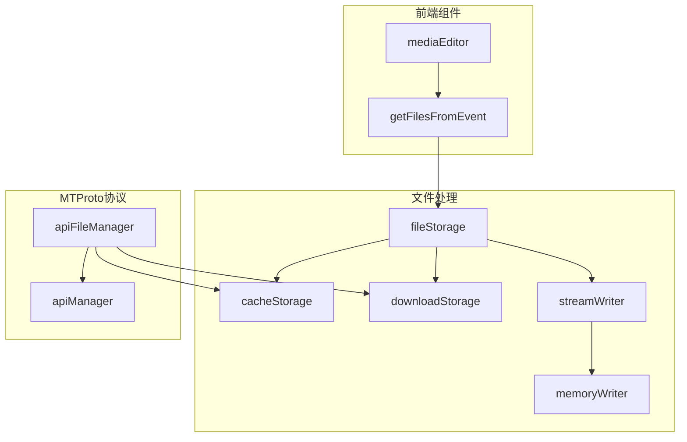
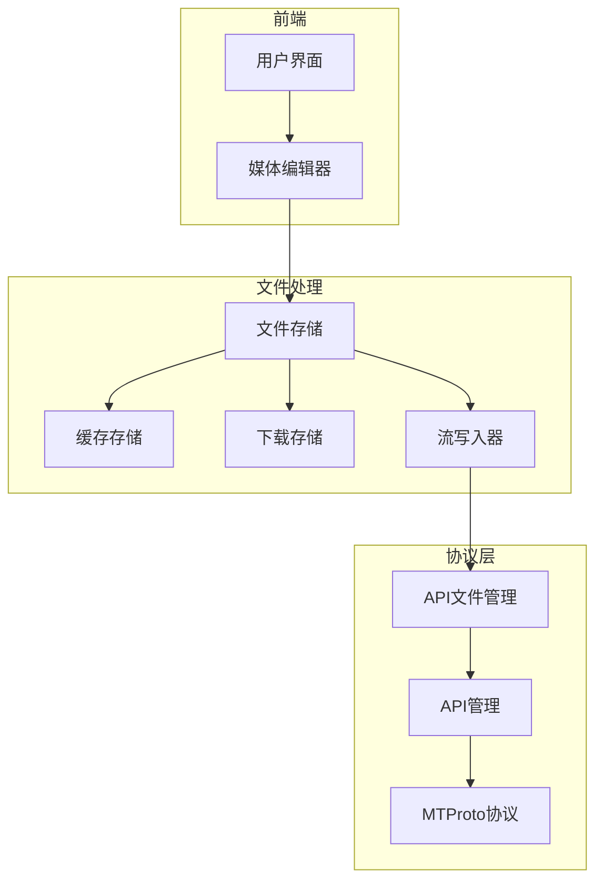
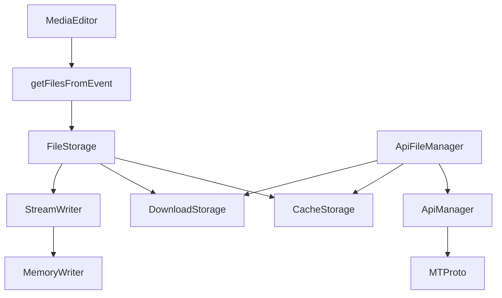

# 媒体上传

<cite>
**本文档中引用的文件**  
- [cacheStorage.ts](file://src/lib/files/cacheStorage.ts)
- [downloadStorage.ts](file://src/lib/files/downloadStorage.ts)
- [apiFileManager.ts](file://src/lib/mtproto/apiFileManager.ts)
- [apiManager.ts](file://src/lib/mtproto/apiManager.ts)
- [memoryWriter.ts](file://src/lib/files/memoryWriter.ts)
- [streamWriter.ts](file://src/lib/files/streamWriter.ts)
- [fileStorage.ts](file://src/lib/files/fileStorage.ts)
</cite>

## 目录
1. [简介](#简介)
2. [项目结构](#项目结构)
3. [核心组件](#核心组件)
4. [架构概述](#架构概述)
5. [详细组件分析](#详细组件分析)
6. [依赖分析](#依赖分析)
7. [性能考虑](#性能考虑)
8. [故障排除指南](#故障排除指南)
9. [结论](#结论)

## 简介
本文档详细描述了媒体上传功能的实现，包括图片、视频、音频等媒体文件的上传流程。文档涵盖了文件选择、格式验证、大小限制等前端处理机制，分块上传策略，上传进度的实时反馈，与MTProto协议的集成，错误处理策略以及上传优化技术。

## 项目结构
项目结构清晰，主要分为以下几个部分：
- `src/components/mediaEditor`：媒体编辑器相关组件
- `src/lib/files`：文件处理和存储相关逻辑
- `src/lib/mtproto`：MTProto协议相关实现
- `src/helpers/files`：文件处理辅助函数



**Diagram sources**
- [src/lib/files/fileStorage.ts](file://src/lib/files/fileStorage.ts)
- [src/lib/files/cacheStorage.ts](file://src/lib/files/cacheStorage.ts)
- [src/lib/files/downloadStorage.ts](file://src/lib/files/downloadStorage.ts)
- [src/lib/files/streamWriter.ts](file://src/lib/files/streamWriter.ts)
- [src/lib/files/memoryWriter.ts](file://src/lib/files/memoryWriter.ts)
- [src/lib/mtproto/apiFileManager.ts](file://src/lib/mtproto/apiFileManager.ts)
- [src/lib/mtproto/apiManager.ts](file://src/lib/mtproto/apiManager.ts)

**Section sources**
- [src/lib/files/fileStorage.ts](file://src/lib/files/fileStorage.ts)
- [src/lib/files/cacheStorage.ts](file://src/lib/files/cacheStorage.ts)
- [src/lib/files/downloadStorage.ts](file://src/lib/files/downloadStorage.ts)
- [src/lib/files/streamWriter.ts](file://src/lib/files/streamWriter.ts)
- [src/lib/files/memoryWriter.ts](file://src/lib/files/memoryWriter.ts)
- [src/lib/mtproto/apiFileManager.ts](file://src/lib/mtproto/apiFileManager.ts)
- [src/lib/mtproto/apiManager.ts](file://src/lib/mtproto/apiManager.ts)

## 核心组件
核心组件包括文件存储管理、分块上传处理、MTProto协议集成等。`CacheStorageController`负责缓存文件，`DownloadStorage`处理下载存储，`ApiFileManager`管理文件上传下载，`ApiManager`处理MTProto协议通信。

**Section sources**
- [src/lib/files/cacheStorage.ts](file://src/lib/files/cacheStorage.ts)
- [src/lib/files/downloadStorage.ts](file://src/lib/files/downloadStorage.ts)
- [src/lib/mtproto/apiFileManager.ts](file://src/lib/mtproto/apiFileManager.ts)
- [src/lib/mtproto/apiManager.ts](file://src/lib/mtproto/apiManager.ts)

## 架构概述
系统采用分层架构，前端组件通过文件处理层与MTProto协议层通信。文件处理层负责文件的读取、写入、缓存和下载，MTProto协议层负责与服务器的安全通信。



**Diagram sources**
- [src/lib/files/fileStorage.ts](file://src/lib/files/fileStorage.ts)
- [src/lib/files/cacheStorage.ts](file://src/lib/files/cacheStorage.ts)
- [src/lib/files/downloadStorage.ts](file://src/lib/files/downloadStorage.ts)
- [src/lib/files/streamWriter.ts](file://src/lib/files/streamWriter.ts)
- [src/lib/mtproto/apiFileManager.ts](file://src/lib/mtproto/apiFileManager.ts)
- [src/lib/mtproto/apiManager.ts](file://src/lib/mtproto/apiManager.ts)

## 详细组件分析

### 文件存储组件分析
文件存储组件负责管理本地文件的读取、写入和缓存。`FileStorage`是接口，`CacheStorageController`和`DownloadStorage`是具体实现。

```mermaid
classDiagram
class FileStorage {
+getFile(fileName : string, method : 'blob' | 'json' | 'text') : Promise<any>
+prepareWriting(fileName : string, fileSize : number, mimeType : string) : {deferred, getWriter}
+saveFile(fileName : string, blob : Blob | Uint8Array) : Promise<Blob>
}
class CacheStorageController {
-dbName : CacheStorageDbName
-openDbPromise : Promise<Cache>
-config : CacheStorageDbConfigEntry
+get(entryName : string) : Promise<Response>
+save(entryName : string, response : Response) : Promise<void>
+delete(entryName : string) : Promise<boolean>
+deleteAll() : Promise<boolean>
+has(entryName : string) : Promise<boolean>
+getFile(fileName : string, method : 'blob' | 'json' | 'text') : Promise<any>
+saveFile(fileName : string, blob : Blob | Uint8Array) : Promise<Blob>
+timeoutOperation<T>(callback : (cache : Cache) => Promise<T>) : Promise<T>
+prepareWriting(fileName : string, fileSize : number, mimeType : string) : {deferred, getWriter}
}
class DownloadStorage {
+getFile(fileName : string) : Promise<any>
+prepareWriting({fileName, downloadId, size}) : {deferred, getWriter}
}
FileStorage <|-- CacheStorageController
FileStorage <|-- DownloadStorage
```

**Diagram sources**
- [src/lib/files/fileStorage.ts](file://src/lib/files/fileStorage.ts)
- [src/lib/files/cacheStorage.ts](file://src/lib/files/cacheStorage.ts)
- [src/lib/files/downloadStorage.ts](file://src/lib/files/downloadStorage.ts)

**Section sources**
- [src/lib/files/fileStorage.ts](file://src/lib/files/fileStorage.ts)
- [src/lib/files/cacheStorage.ts](file://src/lib/files/cacheStorage.ts)
- [src/lib/files/downloadStorage.ts](file://src/lib/files/downloadStorage.ts)

### 流写入器组件分析
流写入器组件负责将文件分块写入存储。`StreamWriter`是抽象类，`MemoryWriter`是具体实现。


**Diagram sources**
- [src/lib/files/streamWriter.ts](file://src/lib/files/streamWriter.ts)
- [src/lib/files/memoryWriter.ts](file://src/lib/files/memoryWriter.ts)

**Section sources**
- [src/lib/files/streamWriter.ts](file://src/lib/files/streamWriter.ts)
- [src/lib/files/memoryWriter.ts](file://src/lib/files/memoryWriter.ts)

### API文件管理组件分析
API文件管理组件负责与MTProto协议通信，处理文件上传下载。

```mermaid
classDiagram
class ApiFileManager {
-cacheStorage : CacheStorageController
-downloadStorage : DownloadStorage
-downloadPromises : {[fileName : string] : DownloadPromise}
-uploadPromises : {[fileName : string] : CancellablePromise<InputFile>}
-downloadPulls : {[dcId : string] : Array<{id, queueId, cb, deferred, activeDelta, priority}>}
-downloadActives : {[dcId : string] : number}
-refreshReferencePromises : {[referenceHex : string] : {deferred, timeout?}}
-tempId : number
-queueId : number
-maxUploadParts : number
-maxDownloadParts : number
-webFileDcId : DcId
+download(options : DownloadOptions) : DownloadPromise
+upload(file : File, fileName? : string, isVideo? : boolean, isVoice? : boolean, isVideoNote? : boolean, isAnimation? : boolean, mimeType? : string, size? : number, dcId? : DcId, queueId? : number) : CancellablePromise<InputFile>
+cancelDownload(fileName : string) : boolean
+cancelDownloadByReference(reference : ReferenceBytes) : void
+requestFilePart({dcId, location, offset, limit, id, queueId, checkCancel, floodMaxTimeout, priority}) : Promise<MyUploadFile>
+requestWebFilePart({dcId, location, offset, limit, id, queueId, checkCancel}) : Promise<UploadWebFile.uploadWebFile>
+invokeApiWithReference<T>({context, callback, checkCancel}) : Promise<T>
+refreshReference(inputFileLocation : {file_reference : ReferenceBytes}, reference : typeof inputFileLocation['file_reference'], hex? : string) : Promise<void>
+getConvertMethod(mimeType : MTMimeType) : {mimeType, process}
}
class ApiManager {
-cachedNetworkers : {[transportType in TransportType] : {[connectionType in ConnectionType] : {[dcId : DcId] : MTPNetworker[]}}}
-cachedExportPromise : {[x : number] : Promise<unknown>}
-gettingNetworkers : {[dcIdAndType : string] : Promise<MTPNetworker>}
-baseDcId : DcId
-afterMessageTempIds : {[tempId : string] : {messageId : string, promise : Promise<any>}}
-transportType : TransportType
-loggingOut : boolean
+getNetworker(dcId : DcId, options? : InvokeApiOptions) : Promise<MTPNetworker>
+getNetworkerVoid(dcId : DcId) : Promise<void>
+invokeApi<T extends keyof MethodDeclMap>(method : T, params : MethodDeclMap[T]['req'], options? : InvokeApiOptions) : CancellablePromise<MethodDeclMap[T]['res']>
+setUpdatesProcessor(callback : (obj : any) => void) : void
+changeTransportType(transportType : TransportType) : void
+getBaseDcId() : Promise<DcId>
+setUserAuth(userAuth : UserAuth | UserId) : Promise<void>
+setBaseDcId(dcId : DcId) : void
+logOut(migrateAccountTo? : ActiveAccountNumber) : Promise<void>
}
ApiFileManager --> ApiManager
ApiFileManager --> CacheStorageController
ApiFileManager --> DownloadStorage
```

**Diagram sources**
- [src/lib/mtproto/apiFileManager.ts](file://src/lib/mtproto/apiFileManager.ts)
- [src/lib/mtproto/apiManager.ts](file://src/lib/mtproto/apiManager.ts)
- [src/lib/files/cacheStorage.ts](file://src/lib/files/cacheStorage.ts)
- [src/lib/files/downloadStorage.ts](file://src/lib/files/downloadStorage.ts)

**Section sources**
- [src/lib/mtproto/apiFileManager.ts](file://src/lib/mtproto/apiFileManager.ts)
- [src/lib/mtproto/apiManager.ts](file://src/lib/mtproto/apiManager.ts)

## 依赖分析
组件之间的依赖关系清晰，前端组件依赖文件处理层，文件处理层依赖MTProto协议层。`ApiFileManager`是核心组件，协调文件存储和协议通信。



**Diagram sources**
- [src/components/mediaEditor](file://src/components/mediaEditor)
- [src/helpers/files/getFilesFromEvent.ts](file://src/helpers/files/getFilesFromEvent.ts)
- [src/lib/files/fileStorage.ts](file://src/lib/files/fileStorage.ts)
- [src/lib/files/cacheStorage.ts](file://src/lib/files/cacheStorage.ts)
- [src/lib/files/downloadStorage.ts](file://src/lib/files/downloadStorage.ts)
- [src/lib/files/streamWriter.ts](file://src/lib/files/streamWriter.ts)
- [src/lib/files/memoryWriter.ts](file://src/lib/files/memoryWriter.ts)
- [src/lib/mtproto/apiFileManager.ts](file://src/lib/mtproto/apiFileManager.ts)
- [src/lib/mtproto/apiManager.ts](file://src/lib/mtproto/apiManager.ts)
- [src/lib/mtproto](file://src/lib/mtproto)

**Section sources**
- [src/lib/files/fileStorage.ts](file://src/lib/files/fileStorage.ts)
- [src/lib/files/cacheStorage.ts](file://src/lib/files/cacheStorage.ts)
- [src/lib/files/downloadStorage.ts](file://src/lib/files/downloadStorage.ts)
- [src/lib/files/streamWriter.ts](file://src/lib/files/streamWriter.ts)
- [src/lib/files/memoryWriter.ts](file://src/lib/files/memoryWriter.ts)
- [src/lib/mtproto/apiFileManager.ts](file://src/lib/mtproto/apiFileManager.ts)
- [src/lib/mtproto/apiManager.ts](file://src/lib/mtproto/apiManager.ts)

## 性能考虑
系统在性能方面做了多项优化：
- 使用分块上传和下载，支持大文件传输和断点续传
- 使用缓存存储，减少重复下载
- 使用流式写入，减少内存占用
- 支持文件压缩和格式转换，减少传输数据量

## 故障排除指南
常见问题及解决方案：
- **网络中断**：系统支持断点续传，网络恢复后可继续上传下载
- **文件损坏**：系统会验证文件完整性，损坏文件会被重新传输
- **上传失败**：检查文件格式和大小限制，确保符合要求
- **进度不更新**：检查网络连接，确保通信正常

**Section sources**
- [src/lib/mtproto/apiFileManager.ts](file://src/lib/mtproto/apiFileManager.ts)
- [src/lib/files/cacheStorage.ts](file://src/lib/files/cacheStorage.ts)
- [src/lib/files/downloadStorage.ts](file://src/lib/files/downloadStorage.ts)

## 结论
本文档详细描述了媒体上传功能的实现，包括文件处理、分块上传、MTProto协议集成等方面。系统设计合理，性能优化到位，能够满足大文件传输和断点续传的需求。