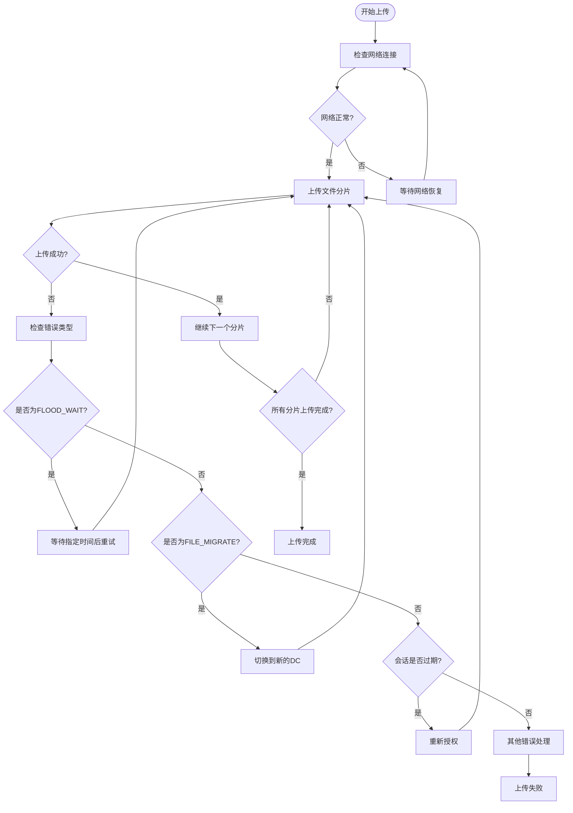
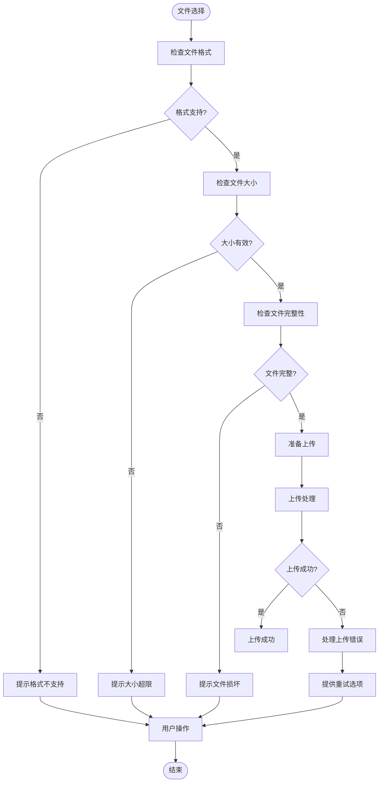
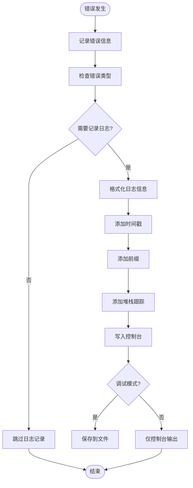
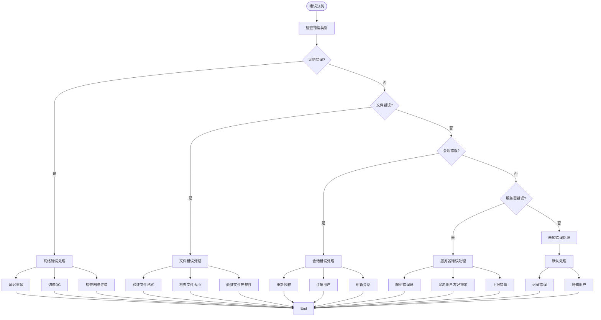
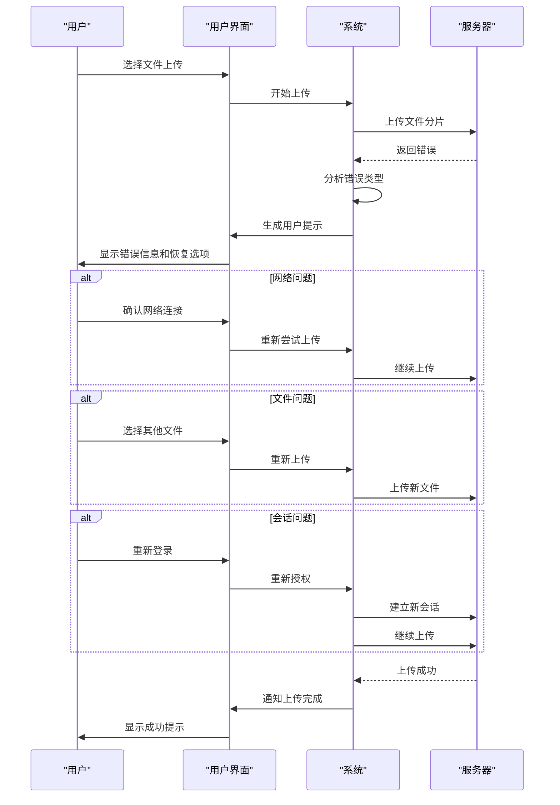

# 错误处理

<cite>
**本文档引用的文件**
- [apiFileManager.ts](file://src/lib/mtproto/apiFileManager.ts)
- [apiManager.ts](file://src/lib/mtproto/apiManager.ts)
- [logger.ts](file://src/lib/logger.ts)
- [makeError.ts](file://src/helpers/makeError.ts)
- [toast.ts](file://src/components/toast.ts)
- [appDownloadManager.ts](file://src/lib/appManagers/appDownloadManager.ts)
- [errors.ts](file://src/lib/serviceWorker/errors.ts)
- [mediaMimeTypesSupport.ts](file://src/environment/mediaMimeTypesSupport.ts)
</cite>

## 目录
1. [简介](#简介)
2. [网络异常处理策略](#网络异常处理策略)
3. [文件相关错误处理](#文件相关错误处理)
4. [服务器端错误响应处理](#服务器端错误响应处理)
5. [错误日志记录机制](#错误日志记录机制)
6. [错误分类处理策略](#错误分类处理策略)
7. [用户可操作的恢复路径](#用户可操作的恢复路径)

## 简介
本文档全面记录了上传错误处理机制，详细描述了网络异常处理、文件相关错误处理、服务器端错误响应处理、错误日志记录机制以及不同错误类型的分类处理策略。系统通过多层次的错误检测、自动重试、超时处理和用户友好的提示信息，确保了文件上传过程的稳定性和用户体验。

## 网络异常处理策略

系统实现了完善的网络异常处理机制，包括网络中断检测、自动重试和超时处理。当网络请求失败时，系统会根据错误类型自动执行相应的恢复策略。



**Diagram sources**
- [apiManager.ts](file://src/lib/mtproto/apiManager.ts#L736-L769)
- [apiFileManager.ts](file://src/lib/mtproto/apiFileManager.ts#L1076-L1155)

**Section sources**
- [apiManager.ts](file://src/lib/mtproto/apiManager.ts#L627-L794)
- [apiFileManager.ts](file://src/lib/mtproto/apiFileManager.ts#L1038-L1158)

## 文件相关错误处理

系统对文件相关错误进行了全面的处理，包括格式不支持、大小超限和文件损坏等情况。通过预检查和实时验证，系统能够及时发现并处理各种文件问题。



**Diagram sources**
- [apiFileManager.ts](file://src/lib/mtproto/apiFileManager.ts#L1056-L1058)
- [mediaMimeTypesSupport.ts](file://src/environment/mediaMimeTypesSupport.ts#L1-L8)

**Section sources**
- [apiFileManager.ts](file://src/lib/mtproto/apiFileManager.ts#L1038-L1158)
- [mediaMimeTypesSupport.ts](file://src/environment/mediaMimeTypesSupport.ts#L1-L8)

## 服务器端错误响应处理

系统对服务器端错误进行了详细的解析和处理，通过错误码解析生成用户友好的提示信息。不同的错误类型对应不同的处理策略和用户提示。

```mermaid
classDiagram
class ApiError {
+string type
+number code
+string message
+string stack
+boolean handled
}
class ErrorType {
+SESSION_REVOKED
+AUTH_KEY_DUPLICATED
+FILE_REFERENCE_EXPIRED
+FILE_REFERENCE_INVALID
+FILE_TOO_BIG
+UPLOAD_CANCELED
+DOWNLOAD_CANCELED
+UNKNOWN
+NO_NEW_CONTEXT
+CONNECTION_NOT_INITED
+MSG_WAIT_FAILED
+MSG_WAIT_TIMEOUT
}
class ErrorHandler {
+rejectPromise(error)
+performRequest()
+refreshReference()
+logOut()
}
ApiError --> ErrorType : "包含"
ErrorHandler --> ApiError : "处理"
ErrorHandler --> toast : "显示提示"
note right of ApiError
服务器端错误对象，
包含错误类型、代码、
消息和堆栈信息
end note
note right of ErrorHandler
错误处理核心逻辑，
根据不同错误类型执行
相应的处理策略
end note
```

**Diagram sources**
- [apiManager.ts](file://src/lib/mtproto/apiManager.ts#L634-L637)
- [makeError.ts](file://src/helpers/makeError.ts#L1-L9)

**Section sources**
- [apiManager.ts](file://src/lib/mtproto/apiManager.ts#L627-L794)
- [makeError.ts](file://src/helpers/makeError.ts#L1-L9)

## 错误日志记录机制

系统实现了完善的错误日志记录机制，便于问题排查和系统优化。通过详细的日志记录，开发人员可以快速定位和解决各种问题。



**Diagram sources**
- [logger.ts](file://src/lib/logger.ts#L1-L183)
- [apiManager.ts](file://src/lib/mtproto/apiManager.ts#L647-L659)

**Section sources**
- [logger.ts](file://src/lib/logger.ts#L1-L183)
- [apiManager.ts](file://src/lib/mtproto/apiManager.ts#L614-L624)

## 错误分类处理策略

系统对不同类型的错误采用了分类处理策略，确保每种错误都能得到适当的处理。错误分为网络错误、文件错误、会话错误和服务器错误等类别。



**Diagram sources**
- [apiManager.ts](file://src/lib/mtproto/apiManager.ts#L634-L794)
- [apiFileManager.ts](file://src/lib/mtproto/apiFileManager.ts#L98-L103)

**Section sources**
- [apiManager.ts](file://src/lib/mtproto/apiManager.ts#L627-L794)
- [apiFileManager.ts](file://src/lib/mtproto/apiFileManager.ts#L98-L103)

## 用户可操作的恢复路径

系统为用户提供了清晰的可操作恢复路径，当上传失败时，用户可以根据提示采取相应的恢复措施。通过友好的用户界面和明确的指引，降低了用户的操作难度。



**Diagram sources**
- [toast.ts](file://src/components/toast.ts#L1-L69)
- [appDownloadManager.ts](file://src/lib/appManagers/appDownloadManager.ts#L69-L134)

**Section sources**
- [toast.ts](file://src/components/toast.ts#L1-L69)
- [appDownloadManager.ts](file://src/lib/appManagers/appDownloadManager.ts#L69-L134)