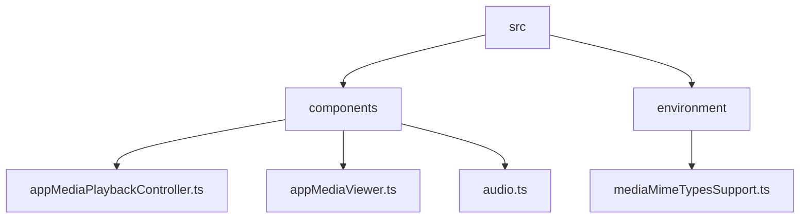
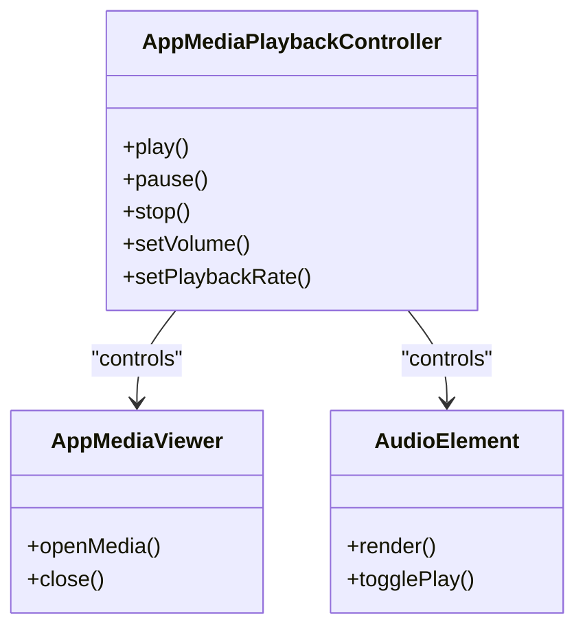
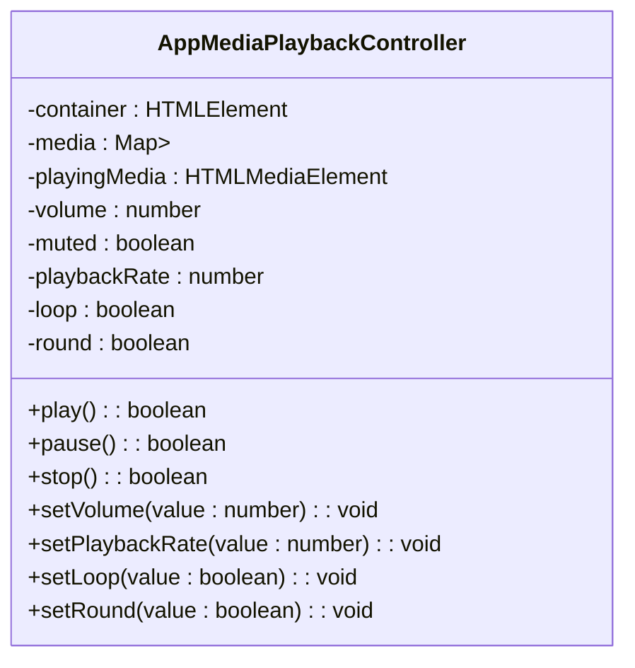
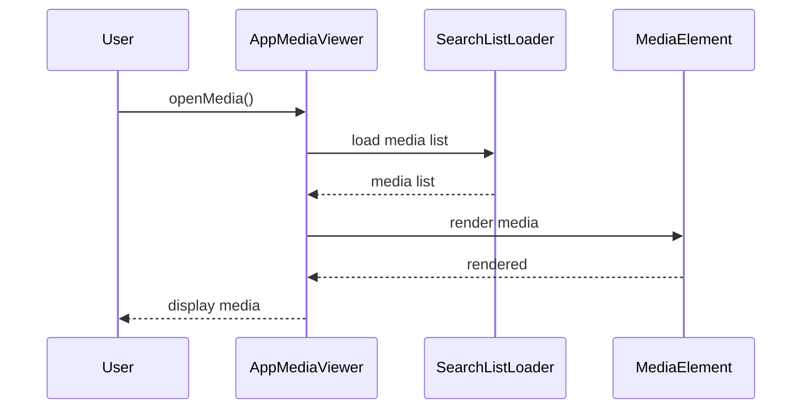
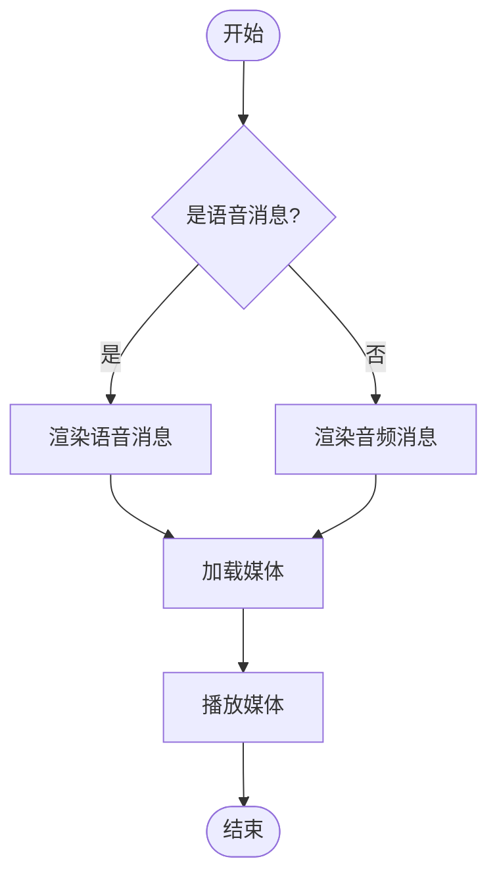
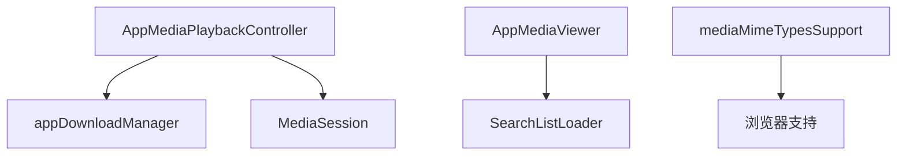

# 媒体播放

<cite>
**本文档引用的文件**   
- [appMediaPlaybackController.ts](file://src/components/appMediaPlaybackController.ts)
- [appMediaViewer.ts](file://src/components/appMediaViewer.ts)
- [appMediaViewerBase.ts](file://src/components/appMediaViewerBase.ts)
- [audio.ts](file://src/components/audio.ts)
- [chat/audio.ts](file://src/components/chat/audio.ts)
- [mediaProgressLine.ts](file://src/components/mediaProgressLine.ts)
- [volumeSelector.ts](file://src/components/volumeSelector.ts)
- [mediaMimeTypesSupport.ts](file://src/environment/mediaMimeTypesSupport.ts)
</cite>

## 目录
1. [简介](#简介)
2. [项目结构](#项目结构)
3. [核心组件](#核心组件)
4. [架构概述](#架构概述)
5. [详细组件分析](#详细组件分析)
6. [依赖分析](#依赖分析)
7. [性能考虑](#性能考虑)
8. [故障排除指南](#故障排除指南)
9. [结论](#结论)

## 简介
本文档详细介绍了媒体播放功能的实现机制，包括图片、视频、音频等媒体消息的播放机制，支持本地播放和流媒体播放两种模式。文档还描述了视频播放器的集成方式，支持HLS流媒体协议和多种视频格式。此外，文档说明了音频消息的播放控制，包括播放、暂停、进度调节等功能，并记录了媒体预加载策略，以实现快速响应和流畅播放体验。

## 项目结构
项目结构中，媒体播放相关的组件主要位于`src/components`目录下，包括`appMediaPlaybackController.ts`、`appMediaViewer.ts`、`audio.ts`等文件。这些文件负责处理媒体的播放、预览、控制等功能。环境相关的支持文件位于`src/environment`目录下，如`mediaMimeTypesSupport.ts`用于检查媒体MIME类型的浏览器支持情况。

**Diagram sources**
- [appMediaPlaybackController.ts](file://src/components/appMediaPlaybackController.ts)
- [appMediaViewer.ts](file://src/components/appMediaViewer.ts)
- [audio.ts](file://src/components/audio.ts)
- [mediaMimeTypesSupport.ts](file://src/environment/mediaMimeTypesSupport.ts)

**Section sources**
- [appMediaPlaybackController.ts](file://src/components/appMediaPlaybackController.ts)
- [appMediaViewer.ts](file://src/components/appMediaViewer.ts)
- [audio.ts](file://src/components/audio.ts)
- [mediaMimeTypesSupport.ts](file://src/environment/mediaMimeTypesSupport.ts)

## 核心组件
核心组件包括`AppMediaPlaybackController`、`AppMediaViewer`和`AudioElement`，它们分别负责媒体的播放控制、媒体预览和音频播放。`AppMediaPlaybackController`管理媒体的播放、暂停、停止等操作，并支持音量、播放速率、循环播放等设置。`AppMediaViewer`提供媒体的预览功能，支持图片和视频的查看。`AudioElement`则专门处理音频消息的播放，包括语音消息和音乐文件。

**Section sources**
- [appMediaPlaybackController.ts](file://src/components/appMediaPlaybackController.ts)
- [appMediaViewer.ts](file://src/components/appMediaViewer.ts)
- [audio.ts](file://src/components/audio.ts)

## 架构概述
媒体播放功能的架构基于事件驱动模型，通过`AppMediaPlaybackController`统一管理所有媒体的播放状态。`AppMediaViewer`和`AudioElement`等组件通过事件监听与`AppMediaPlaybackController`交互，实现媒体的播放控制。媒体的预加载和流媒体支持通过`appDownloadManager`和`appMediaPlaybackController`协同工作，确保媒体能够快速加载和流畅播放。

**Diagram sources**
- [appMediaPlaybackController.ts](file://src/components/appMediaPlaybackController.ts)
- [appMediaViewer.ts](file://src/components/appMediaViewer.ts)
- [audio.ts](file://src/components/audio.ts)

## 详细组件分析
### AppMediaPlaybackController 分析
`AppMediaPlaybackController`是媒体播放的核心控制器，负责管理所有媒体的播放状态。它通过事件监听器与媒体元素交互，支持播放、暂停、停止、音量调节、播放速率调节、循环播放等功能。控制器还支持Safari浏览器的特殊处理，确保在Safari上也能正常播放流媒体。

#### 类图

**Diagram sources**
- [appMediaPlaybackController.ts](file://src/components/appMediaPlaybackController.ts)

**Section sources**
- [appMediaPlaybackController.ts](file://src/components/appMediaPlaybackController.ts)

### AppMediaViewer 分析
`AppMediaViewer`提供媒体的预览功能，支持图片和视频的查看。它通过`SearchListLoader`加载媒体列表，并支持前后切换媒体。预览器还支持点击事件，允许用户与媒体内容交互。

#### 序列图

**Diagram sources**
- [appMediaViewer.ts](file://src/components/appMediaViewer.ts)

**Section sources**
- [appMediaViewer.ts](file://src/components/appMediaViewer.ts)

### AudioElement 分析
`AudioElement`专门处理音频消息的播放，包括语音消息和音乐文件。它支持播放、暂停、进度调节等功能，并提供波形图显示。音频元素还支持预加载和流媒体播放，确保音频能够快速加载和流畅播放。

#### 流程图

**Diagram sources**
- [audio.ts](file://src/components/audio.ts)

**Section sources**
- [audio.ts](file://src/components/audio.ts)

## 依赖分析
媒体播放功能依赖于多个组件和环境支持。`AppMediaPlaybackController`依赖于`appDownloadManager`进行媒体的下载和预加载。`AppMediaViewer`依赖于`SearchListLoader`加载媒体列表。环境支持方面，`mediaMimeTypesSupport.ts`检查浏览器对媒体MIME类型的支持情况，确保媒体能够正确播放。

**Diagram sources**
- [appMediaPlaybackController.ts](file://src/components/appMediaPlaybackController.ts)
- [appMediaViewer.ts](file://src/components/appMediaViewer.ts)
- [mediaMimeTypesSupport.ts](file://src/environment/mediaMimeTypesSupport.ts)

**Section sources**
- [appMediaPlaybackController.ts](file://src/components/appMediaPlaybackController.ts)
- [appMediaViewer.ts](file://src/components/appMediaViewer.ts)
- [mediaMimeTypesSupport.ts](file://src/environment/mediaMimeTypesSupport.ts)

## 性能考虑
为了确保媒体播放的流畅性，系统采用了多种优化策略。媒体预加载策略确保媒体在用户需要时能够快速加载。流媒体支持通过分段加载媒体数据，减少初始加载时间。此外，系统还支持HLS流媒体协议，提供高质量的视频流媒体播放体验。

## 故障排除指南
### 媒体无法播放
- 检查浏览器是否支持媒体MIME类型。
- 确认媒体文件是否已正确下载或流媒体链接是否有效。
- 检查网络连接是否稳定。

### 音频播放问题
- 确认音频文件是否支持流媒体播放。
- 检查Safari浏览器的特殊处理是否已正确应用。
- 确认音量设置是否正确。

**Section sources**
- [appMediaPlaybackController.ts](file://src/components/appMediaPlaybackController.ts)
- [audio.ts](file://src/components/audio.ts)

## 结论
本文档详细介绍了媒体播放功能的实现机制，包括核心组件、架构设计、依赖关系和性能优化策略。通过这些分析，开发者可以更好地理解和维护媒体播放功能，确保其在各种环境下都能稳定运行。