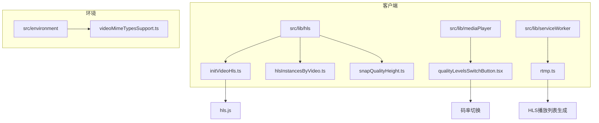
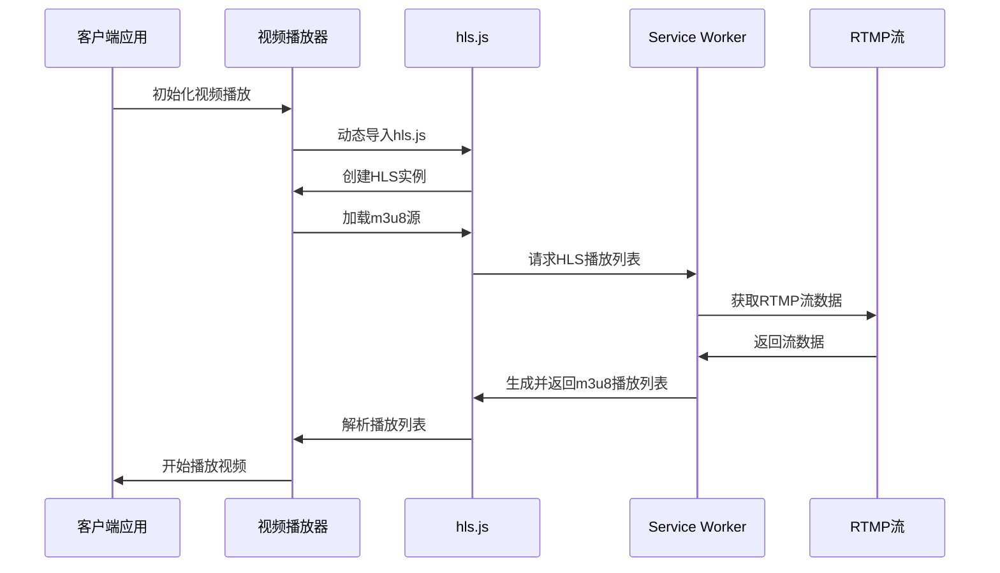
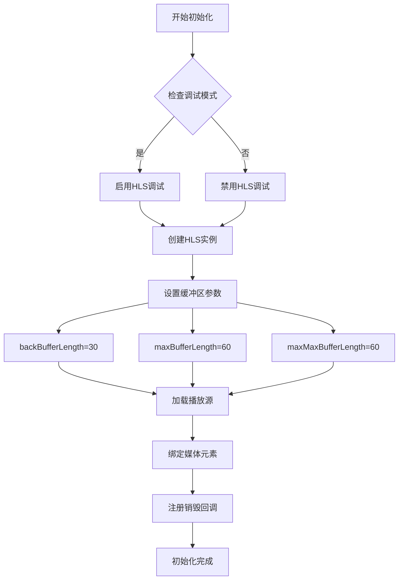
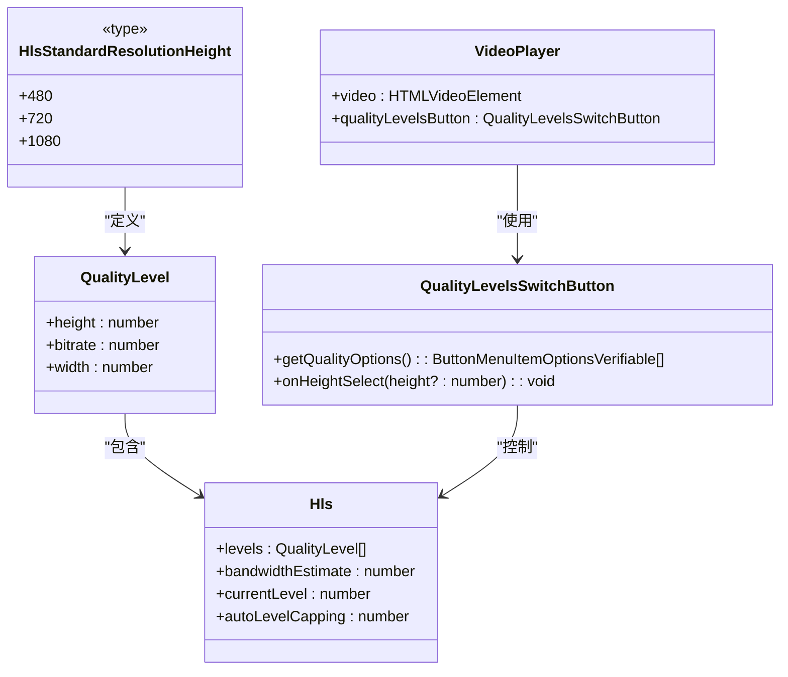
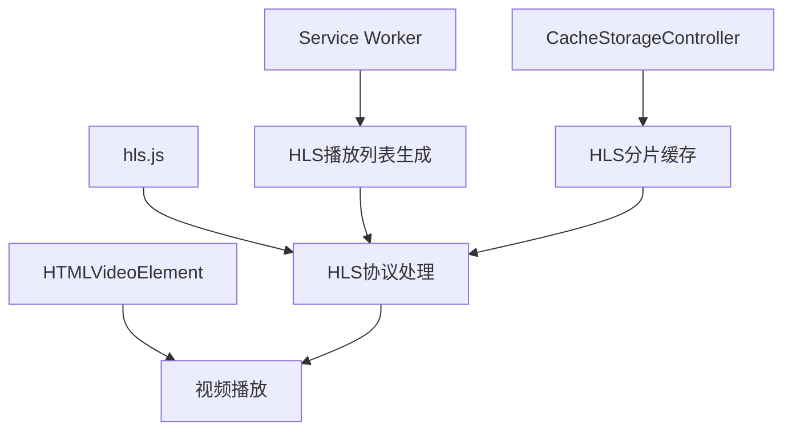

# 流媒体支持

<cite>
**本文档中引用的文件**  
- [initVideoHls.ts](file://src/lib/hls/initVideoHls.ts)
- [hlsInstancesByVideo.ts](file://src/lib/hls/hlsInstancesByVideo.ts)
- [types.ts](file://src/lib/hls/types.ts)
- [snapQualityHeight.ts](file://src/lib/hls/snapQualityHeight.ts)
- [qualityLevelsSwitchButton.tsx](file://src/lib/mediaPlayer/qualityLevelsSwitchButton.tsx)
- [videoMimeTypesSupport.ts](file://src/environment/videoMimeTypesSupport.ts)
- [common.ts](file://src/lib/hls/common.ts)
- [fetchAndConcatFileParts.ts](file://src/lib/hls/fetchAndConcatFileParts.ts)
- [cacheStorage.ts](file://src/lib/files/cacheStorage.ts)
- [rtmp.ts](file://src/lib/serviceWorker/rtmp.ts)
- [safePlay.ts](file://src/helpers/dom/safePlay.ts)
- [onMediaLoad.ts](file://src/helpers/onMediaLoad.ts)
</cite>

## 目录
1. [引言](#引言)
2. [项目结构](#项目结构)
3. [核心组件](#核心组件)
4. [架构概述](#架构概述)
5. [详细组件分析](#详细组件分析)
6. [依赖分析](#依赖分析)
7. [性能考虑](#性能考虑)
8. [故障排除指南](#故障排除指南)
9. [结论](#结论)

## 引言
本文档详细描述了流媒体支持功能的实现，重点介绍HLS（HTTP Live Streaming）协议的集成。系统通过hls.js库处理m3u8播放列表和TS分片文件，实现了流畅的流媒体播放体验。文档涵盖了播放初始化流程、自适应码率切换、缓冲区管理、性能监控以及常见问题的解决方案。

## 项目结构
流媒体相关功能主要分布在`src/lib/hls`和`src/lib/mediaPlayer`目录中。HLS协议处理逻辑集中在`src/lib/hls`目录，而播放器UI和控制逻辑位于`src/lib/mediaPlayer`。服务端流媒体处理在`src/lib/serviceWorker/rtmp.ts`中实现。



**图示来源**
- [initVideoHls.ts](file://src/lib/hls/initVideoHls.ts)
- [rtmp.ts](file://src/lib/serviceWorker/rtmp.ts)
- [qualityLevelsSwitchButton.tsx](file://src/lib/mediaPlayer/qualityLevelsSwitchButton.tsx)

**本节来源**
- [initVideoHls.ts](file://src/lib/hls/initVideoHls.ts)
- [rtmp.ts](file://src/lib/serviceWorker/rtmp.ts)

## 核心组件
流媒体系统的核心组件包括HLS播放器初始化、码率自适应切换、播放缓冲区管理和错误处理机制。系统使用hls.js库作为HLS协议的实现基础，通过WeakMap存储视频元素与HLS实例的映射关系。

**本节来源**
- [initVideoHls.ts](file://src/lib/hls/initVideoHls.ts)
- [hlsInstancesByVideo.ts](file://src/lib/hls/hlsInstancesByVideo.ts)
- [types.ts](file://src/lib/hls/types.ts)

## 架构概述
系统采用客户端-服务端协同的架构模式。客户端负责播放器初始化和用户交互，服务端（Service Worker）负责HLS播放列表和分片的生成与管理。播放器通过动态加载hls.js库实现HLS协议支持，同时集成缓存机制优化流媒体性能。



**图示来源**
- [initVideoHls.ts](file://src/lib/hls/initVideoHls.ts)
- [rtmp.ts](file://src/lib/serviceWorker/rtmp.ts)

## 详细组件分析

### HLS播放器初始化分析
播放器初始化过程包括HLS库的动态加载、HLS实例的创建和配置、播放源的加载和媒体元素的绑定。系统使用延迟导入方式加载hls.js库，减少初始加载时间。



**图示来源**
- [initVideoHls.ts](file://src/lib/hls/initVideoHls.ts#L1-L40)

**本节来源**
- [initVideoHls.ts](file://src/lib/hls/initVideoHls.ts#L1-L40)

### 自适应码率切换分析
系统实现了智能的自适应码率切换策略，根据网络带宽估算值自动选择最优视频质量。码率切换支持480p、720p和1080p三种标准分辨率。



**图示来源**
- [types.ts](file://src/lib/hls/types.ts#L1)
- [snapQualityHeight.ts](file://src/lib/hls/snapQualityHeight.ts#L1-L13)
- [qualityLevelsSwitchButton.tsx](file://src/lib/mediaPlayer/qualityLevelsSwitchButton.tsx#L116-L194)

**本节来源**
- [types.ts](file://src/lib/hls/types.ts#L1)
- [snapQualityHeight.ts](file://src/lib/hls/snapQualityHeight.ts#L1-L13)
- [qualityLevelsSwitchButton.tsx](file://src/lib/mediaPlayer/qualityLevelsSwitchButton.tsx#L116-L194)

### 播放缓冲区管理分析
系统实现了智能的播放缓冲区管理机制，根据网络延迟动态调整缓冲区大小，平衡播放流畅性和延迟。

```mermaid
flowchart TD
A[开始] --> B{RTT数据是否充足?}
B --> |不足| C[等待更多数据]
B --> |充足| D[计算平均RTT]
D --> E[计算目标缓冲区大小]
E --> F[clamp(avgRtt * 3, MIN, MAX)]
F --> G{缓冲区大小变化?}
G --> |是| H[调整缓冲区大小]
H --> I[更新cutoff时间]
I --> J[记录日志]
J --> K[结束]
G --> |否| K
```

**图示来源**
- [rtmp.ts](file://src/lib/serviceWorker/rtmp.ts#L112-L127)

**本节来源**
- [rtmp.ts](file://src/lib/serviceWorker/rtmp.ts#L112-L127)

## 依赖分析
系统依赖hls.js库处理HLS协议，通过Service Worker实现流媒体服务。缓存系统使用CacheStorageController管理HLS分片缓存，支持加密存储。



**图示来源**
- [initVideoHls.ts](file://src/lib/hls/initVideoHls.ts#L14)
- [rtmp.ts](file://src/lib/serviceWorker/rtmp.ts)
- [cacheStorage.ts](file://src/lib/files/cacheStorage.ts)

**本节来源**
- [initVideoHls.ts](file://src/lib/hls/initVideoHls.ts#L14)
- [rtmp.ts](file://src/lib/serviceWorker/rtmp.ts)
- [cacheStorage.ts](file://src/lib/files/cacheStorage.ts)

## 性能考虑
系统通过多种机制优化流媒体性能：使用WeakMap存储HLS实例避免内存泄漏，设置合理的缓冲区长度保证播放流畅性，实现分片缓存减少网络请求，动态调整缓冲区大小适应网络状况。

## 故障排除指南
系统实现了完善的错误处理机制，包括跨域限制处理、播放卡顿优化、加密流支持等。通过MIME类型检测确保视频格式兼容性，使用safePlay函数处理播放权限错误。

**本节来源**
- [safePlay.ts](file://src/helpers/dom/safePlay.ts#L1-L12)
- [onMediaLoad.ts](file://src/helpers/onMediaLoad.ts#L1-L43)
- [videoMimeTypesSupport.ts](file://src/environment/videoMimeTypesSupport.ts#L1-L14)

## 结论
本文档详细介绍了流媒体支持功能的实现，涵盖了HLS协议集成、播放器初始化、自适应码率切换、缓冲区管理和错误处理等关键方面。系统通过客户端-服务端协同架构，实现了高效、流畅的流媒体播放体验。