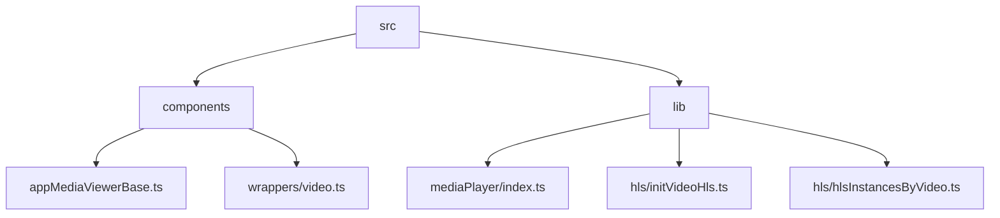
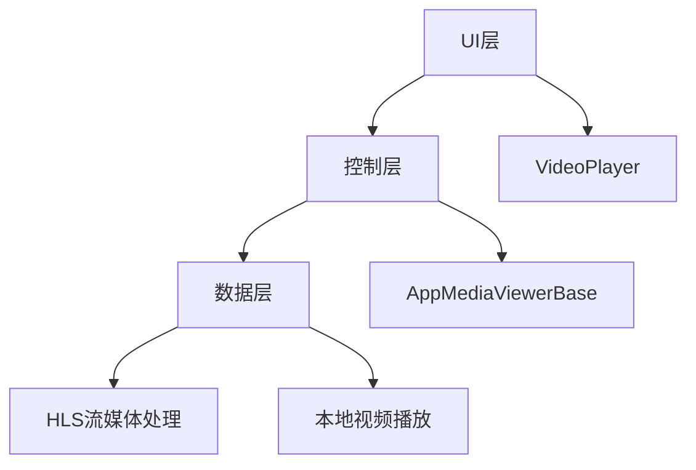
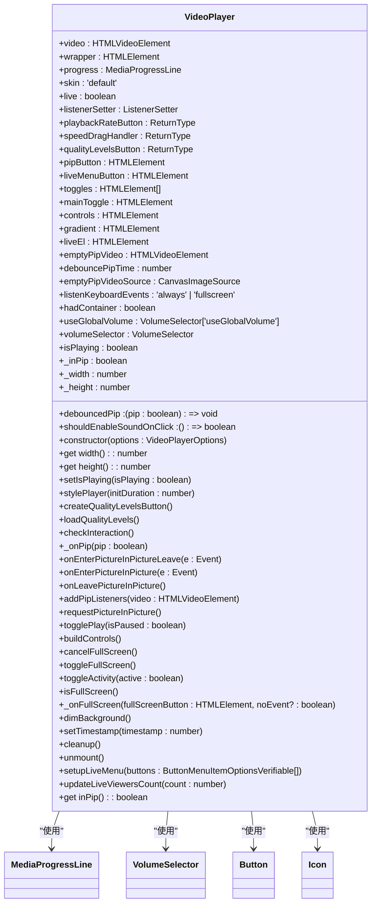
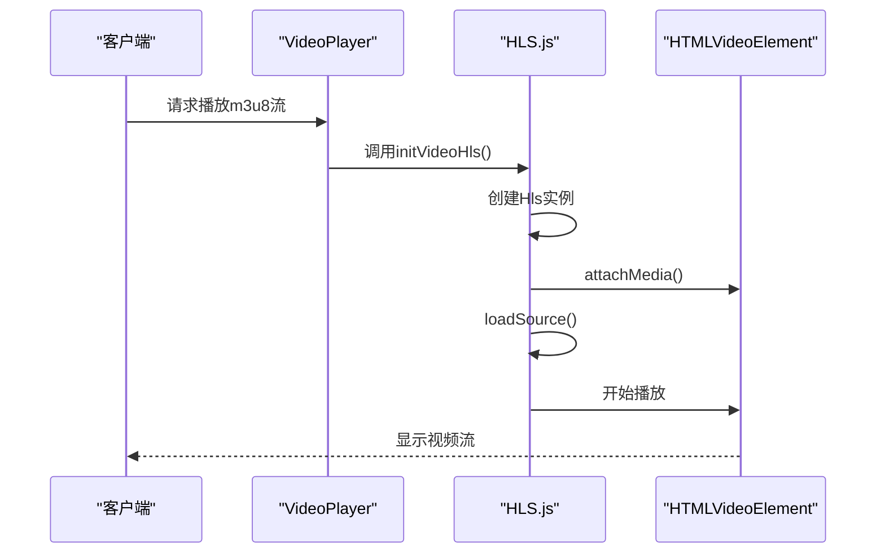
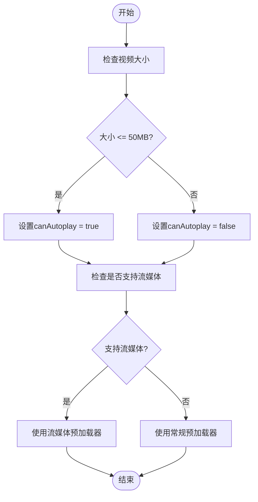
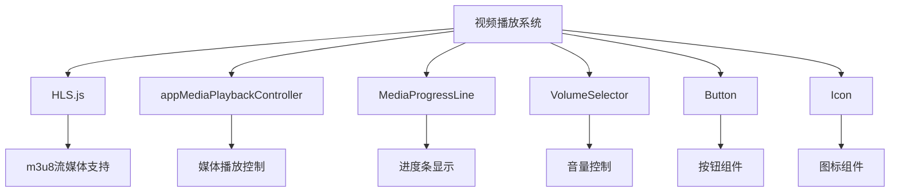

# 视频播放

<cite>
**本文档引用的文件**  
- [initVideoHls.ts](file://src/lib/hls/initVideoHls.ts)
- [hlsInstancesByVideo.ts](file://src/lib/hls/hlsInstancesByVideo.ts)
- [index.ts](file://src/lib/mediaPlayer/index.ts)
- [appMediaViewerBase.ts](file://src/components/appMediaViewerBase.ts)
- [video.ts](file://src/components/wrappers/video.ts)
- [mediaProgressLine.ts](file://src/components/mediaProgressLine.ts)
- [createHlsVideoSource.ts](file://src/lib/hls/createHlsVideoSource.ts)
</cite>

## 目录
1. [简介](#简介)
2. [项目结构](#项目结构)
3. [核心组件](#核心组件)
4. [架构概述](#架构概述)
5. [详细组件分析](#详细组件分析)
6. [依赖分析](#依赖分析)
7. [性能考虑](#性能考虑)
8. [故障排除指南](#故障排除指南)
9. [结论](#结论)

## 简介
本文档详细描述了视频播放功能的实现机制，涵盖本地视频文件播放和HLS流媒体播放两种模式。文档深入分析了视频播放器的核心组件设计，包括播放控制、进度条、全屏切换等功能的实现方式。同时，文档还说明了HLS.js库的集成方法，支持m3u8格式的流媒体播放，并记录了视频预加载和缓冲策略，以优化网络条件下的播放体验。此外，文档还解释了视频缩略图生成和显示机制，以及性能优化建议和常见问题的解决方案。

## 项目结构
项目结构中与视频播放相关的文件主要分布在`src/components`和`src/lib`目录下。`src/components`目录包含视频播放器的UI组件和包装器，而`src/lib`目录则包含核心的媒体播放逻辑和HLS流媒体处理。

**Diagram sources**
- [appMediaViewerBase.ts](file://src/components/appMediaViewerBase.ts)
- [video.ts](file://src/components/wrappers/video.ts)
- [index.ts](file://src/lib/mediaPlayer/index.ts)
- [initVideoHls.ts](file://src/lib/hls/initVideoHls.ts)
- [hlsInstancesByVideo.ts](file://src/lib/hls/hlsInstancesByVideo.ts)

**Section sources**
- [appMediaViewerBase.ts](file://src/components/appMediaViewerBase.ts)
- [video.ts](file://src/components/wrappers/video.ts)
- [index.ts](file://src/lib/mediaPlayer/index.ts)

## 核心组件
视频播放功能的核心组件包括`VideoPlayer`类、`AppMediaViewerBase`类和HLS流媒体处理模块。`VideoPlayer`类负责管理视频播放的UI和控制逻辑，`AppMediaViewerBase`类提供媒体查看器的基础功能，而HLS流媒体处理模块则负责m3u8格式流媒体的播放。

**Section sources**
- [index.ts](file://src/lib/mediaPlayer/index.ts)
- [appMediaViewerBase.ts](file://src/components/appMediaViewerBase.ts)
- [initVideoHls.ts](file://src/lib/hls/initVideoHls.ts)

## 架构概述
视频播放系统的架构分为三个主要层次：UI层、控制层和数据层。UI层负责视频播放器的界面展示，控制层管理播放逻辑和用户交互，数据层处理视频数据的加载和缓冲。

**Diagram sources**
- [index.ts](file://src/lib/mediaPlayer/index.ts)
- [appMediaViewerBase.ts](file://src/components/appMediaViewerBase.ts)
- [initVideoHls.ts](file://src/lib/hls/initVideoHls.ts)

## 详细组件分析

### VideoPlayer 组件分析
`VideoPlayer`类是视频播放器的核心，负责管理播放控制、进度条、音量控制和全屏切换等功能。该类通过事件监听器响应用户交互，并根据播放状态更新UI。

**Diagram sources**
- [index.ts](file://src/lib/mediaPlayer/index.ts)

**Section sources**
- [index.ts](file://src/lib/mediaPlayer/index.ts)

### HLS流媒体处理分析
HLS流媒体处理模块负责m3u8格式流媒体的播放。该模块通过`initVideoHls`函数初始化HLS播放器，并将视频元素与HLS实例关联。

**Diagram sources**
- [initVideoHls.ts](file://src/lib/hls/initVideoHls.ts)

**Section sources**
- [initVideoHls.ts](file://src/lib/hls/initVideoHls.ts)

### 视频预加载和缓冲策略
视频预加载和缓冲策略通过`wrapVideo`函数实现，该函数根据视频大小和网络条件决定是否自动播放，并管理预加载器的显示和隐藏。

**Diagram sources**
- [video.ts](file://src/components/wrappers/video.ts)

**Section sources**
- [video.ts](file://src/components/wrappers/video.ts)

## 依赖分析
视频播放系统依赖于多个外部库和内部模块。主要依赖包括HLS.js库用于m3u8流媒体播放，以及项目内部的`appMediaPlaybackController`用于媒体播放控制。

**Diagram sources**
- [initVideoHls.ts](file://src/lib/hls/initVideoHls.ts)
- [index.ts](file://src/lib/mediaPlayer/index.ts)

**Section sources**
- [initVideoHls.ts](file://src/lib/hls/initVideoHls.ts)
- [index.ts](file://src/lib/mediaPlayer/index.ts)

## 性能考虑
视频播放系统的性能优化主要集中在内存释放、解码优化和网络缓冲策略上。通过合理管理视频元素的生命周期和使用高效的缓冲策略，可以显著提升播放体验。

**Section sources**
- [index.ts](file://src/lib/mediaPlayer/index.ts)
- [appMediaViewerBase.ts](file://src/components/appMediaViewerBase.ts)

## 故障排除指南
常见问题包括视频无法播放、格式不支持等。解决方案包括检查视频格式是否支持、确保网络连接稳定、以及正确配置HLS.js库。

**Section sources**
- [initVideoHls.ts](file://src/lib/hls/initVideoHls.ts)
- [video.ts](file://src/components/wrappers/video.ts)

## 结论
本文档详细描述了视频播放功能的实现机制，涵盖了本地视频播放和HLS流媒体播放两种模式。通过分析核心组件和架构，提供了深入的技术细节和优化建议，为开发者提供了全面的参考。