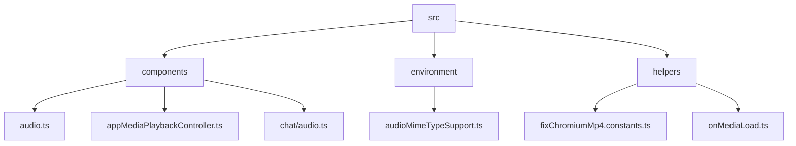
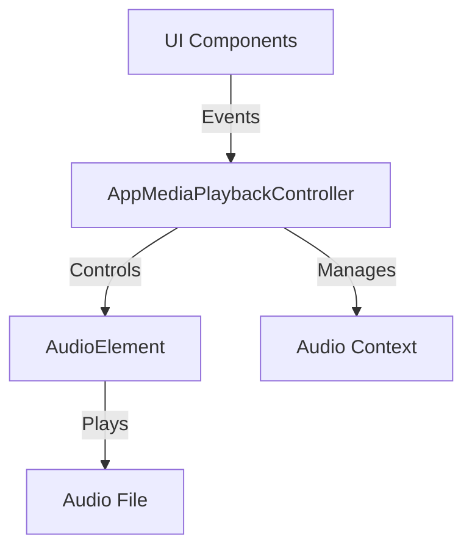
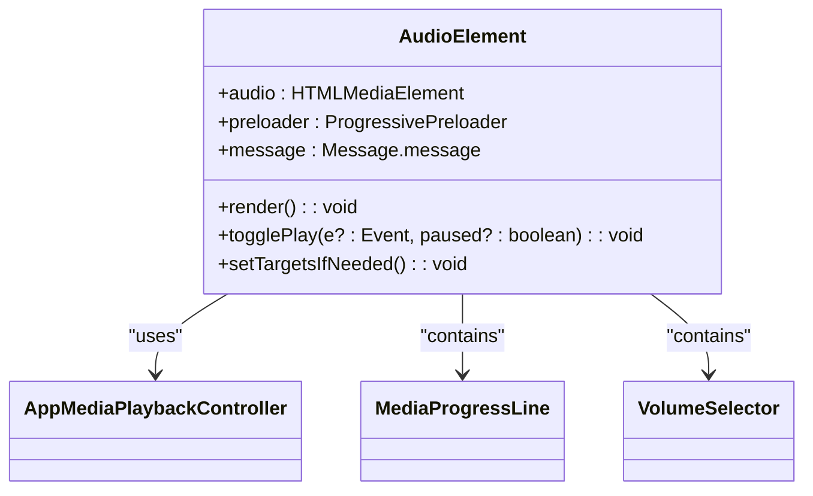
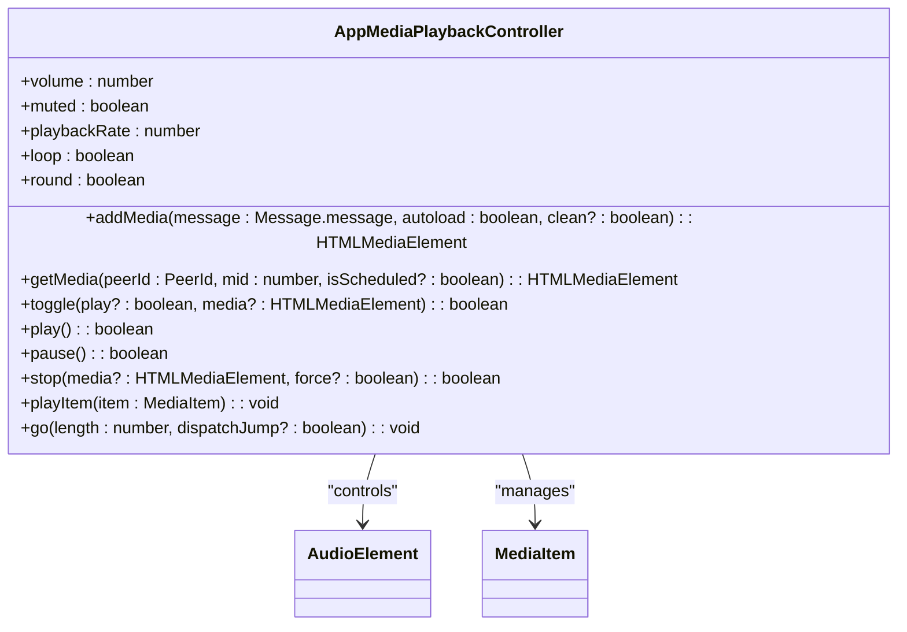
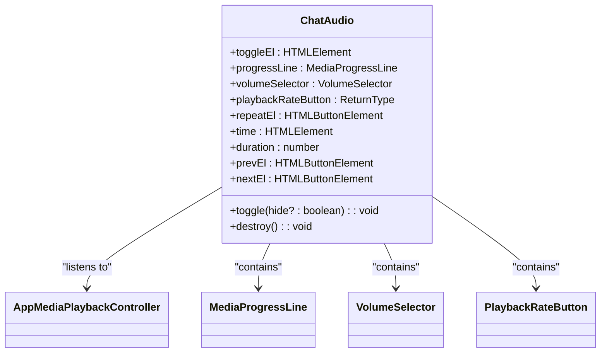
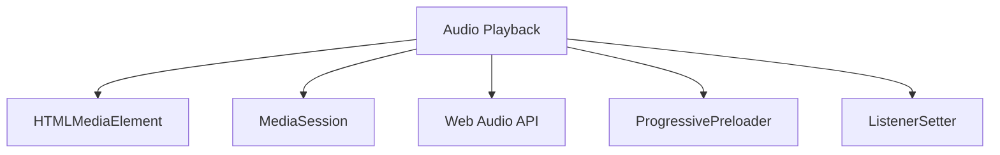
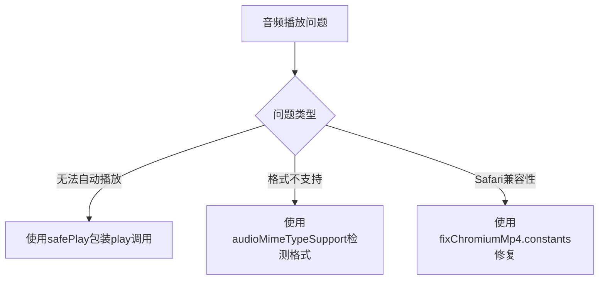

# 音频播放

<cite>
**本文档引用的文件**  
- [audio.ts](file://src/components/audio.ts)
- [appMediaPlaybackController.ts](file://src/components/appMediaPlaybackController.ts)
- [chat/audio.ts](file://src/components/chat/audio.ts)
- [mediaProgressLine.ts](file://src/components/mediaProgressLine.ts)
- [volumeSelector.ts](file://src/components/volumeSelector.ts)
- [playbackRateButton.ts](file://src/components/playbackRateButton.ts)
- [audioMimeTypeSupport.ts](file://src/environment/audioMimeTypeSupport.ts)
- [fixChromiumMp4.constants.ts](file://src/helpers/fixChromiumMp4.constants.ts)
- [onMediaLoad.ts](file://src/helpers/onMediaLoad.ts)
- [safePlay.ts](file://src/helpers/dom/safePlay.ts)
- [opusSupport.ts](file://src/environment/opusSupport.ts)
</cite>

## 目录
1. [简介](#简介)
2. [项目结构](#项目结构)
3. [核心组件](#核心组件)
4. [架构概述](#架构概述)
5. [详细组件分析](#详细组件分析)
6. [依赖分析](#依赖分析)
7. [性能考虑](#性能考虑)
8. [故障排除指南](#故障排除指南)
9. [结论](#结论)

## 简介
本文档全面阐述了音频播放功能的实现机制，包括播放、暂停、进度调节、音量控制等核心功能。详细描述了音频播放器的UI组件设计，如播放按钮状态切换、进度条更新、波形显示等交互细节。说明了音频文件的加载策略，支持多种音频格式（如MP3、AAC、WAV）的解码播放。记录了音频上下文管理，避免多个音频同时播放冲突。提供了性能优化建议，如Web Audio API的使用、内存管理、后台播放支持等技术细节，并列出了常见问题如音频无法自动播放、格式不支持等的解决方案。

## 项目结构
音频播放功能主要分布在`src/components`目录下，核心组件包括`audio.ts`、`appMediaPlaybackController.ts`、`chat/audio.ts`等。`src/environment`目录下包含了音频格式支持的检测逻辑，`src/helpers`目录下包含了音频相关的辅助函数。

**图源**
- [audio.ts](file://src/components/audio.ts)
- [appMediaPlaybackController.ts](file://src/components/appMediaPlaybackController.ts)
- [audioMimeTypeSupport.ts](file://src/environment/audioMimeTypeSupport.ts)
- [fixChromiumMp4.constants.ts](file://src/helpers/fixChromiumMp4.constants.ts)
- [onMediaLoad.ts](file://src/helpers/onMediaLoad.ts)

## 核心组件
音频播放功能的核心组件包括`AudioElement`、`AppMediaPlaybackController`、`ChatAudio`等。`AudioElement`负责音频元素的渲染和交互，`AppMediaPlaybackController`负责音频的播放控制和状态管理，`ChatAudio`负责聊天界面中的音频播放UI。

**节源**
- [audio.ts](file://src/components/audio.ts#L504-L857)
- [appMediaPlaybackController.ts](file://src/components/appMediaPlaybackController.ts#L66-L800)
- [chat/audio.ts](file://src/components/chat/audio.ts#L36-L273)

## 架构概述
音频播放功能采用分层架构，上层为UI组件，中层为播放控制器，底层为音频元素。播放控制器统一管理所有音频的播放状态，避免多个音频同时播放冲突。UI组件通过事件监听与播放控制器交互，实现播放、暂停、进度调节等功能。

**图源**
- [appMediaPlaybackController.ts](file://src/components/appMediaPlaybackController.ts#L66-L800)
- [audio.ts](file://src/components/audio.ts#L504-L857)

## 详细组件分析

### AudioElement 分析
`AudioElement`是音频播放功能的基础组件，负责音频元素的渲染和交互。它通过`appMediaPlaybackController`添加媒体，管理音频的加载、播放、暂停等状态。

**图源**
- [audio.ts](file://src/components/audio.ts#L504-L857)
- [appMediaPlaybackController.ts](file://src/components/appMediaPlaybackController.ts#L66-L800)
- [mediaProgressLine.ts](file://src/components/mediaProgressLine.ts#L26-L457)
- [volumeSelector.ts](file://src/components/volumeSelector.ts#L19-L160)

### AppMediaPlaybackController 分析
`AppMediaPlaybackController`是音频播放功能的核心控制器，负责管理所有音频的播放状态。它通过`MediaItem`对象管理音频的播放列表，支持播放、暂停、停止、跳转等功能。

**图源**
- [appMediaPlaybackController.ts](file://src/components/appMediaPlaybackController.ts#L66-L800)
- [audio.ts](file://src/components/audio.ts#L504-L857)

### ChatAudio 分析
`ChatAudio`是聊天界面中的音频播放UI组件，负责显示当前播放的音频信息，如标题、艺术家、进度条等。它通过监听`AppMediaPlaybackController`的事件来更新UI状态。

**图源**
- [chat/audio.ts](file://src/components/chat/audio.ts#L36-L273)
- [appMediaPlaybackController.ts](file://src/components/appMediaPlaybackController.ts#L66-L800)
- [mediaProgressLine.ts](file://src/components/mediaProgressLine.ts#L26-L457)
- [volumeSelector.ts](file://src/components/volumeSelector.ts#L19-L160)
- [playbackRateButton.ts](file://src/components/playbackRateButton.ts#L8-L73)

## 依赖分析
音频播放功能依赖于多个外部组件和库，包括`HTMLMediaElement`、`MediaSession`、`Web Audio API`等。这些依赖提供了音频播放、控制、元数据管理等功能。

**图源**
- [appMediaPlaybackController.ts](file://src/components/appMediaPlaybackController.ts#L66-L800)
- [audio.ts](file://src/components/audio.ts#L504-L857)

## 性能考虑
音频播放功能在性能方面做了多项优化，包括使用`requestAnimationFrame`进行动画更新，使用`IntersectionObserver`进行懒加载，使用`Web Workers`进行音频解码等。这些优化确保了音频播放的流畅性和响应性。

**节源**
- [mediaProgressLine.ts](file://src/components/mediaProgressLine.ts#L34-L333)
- [appMediaPlaybackController.ts](file://src/components/appMediaPlaybackController.ts#L314-L329)
- [opusDecodeController.ts](file://src/lib/opusDecodeController.ts#L139-L187)

## 故障排除指南
音频播放功能在实现过程中遇到了一些常见问题，如音频无法自动播放、格式不支持、Safari浏览器兼容性问题等。这些问题通过以下方式解决：

1. **音频无法自动播放**：通过`safePlay`函数包装`play`调用，捕获并忽略播放错误。
2. **格式不支持**：通过`audioMimeTypeSupport`检测浏览器支持的音频格式，选择合适的格式进行播放。
3. **Safari浏览器兼容性问题**：通过`fixChromiumMp4.constants`检测并修复Safari浏览器的音频播放问题。

**图源**
- [safePlay.ts](file://src/helpers/dom/safePlay.ts#L1-L12)
- [audioMimeTypeSupport.ts](file://src/environment/audioMimeTypeSupport.ts#L1-L9)
- [fixChromiumMp4.constants.ts](file://src/helpers/fixChromiumMp4.constants.ts#L1-L6)
- [onMediaLoad.ts](file://src/helpers/onMediaLoad.ts#L1-L69)

**节源**
- [safePlay.ts](file://src/helpers/dom/safePlay.ts#L1-L12)
- [audioMimeTypeSupport.ts](file://src/environment/audioMimeTypeSupport.ts#L1-L9)
- [fixChromiumMp4.constants.ts](file://src/helpers/fixChromiumMp4.constants.ts#L1-L6)
- [onMediaLoad.ts](file://src/helpers/onMediaLoad.ts#L1-L69)

## 结论
音频播放功能通过分层架构和模块化设计，实现了播放、暂停、进度调节、音量控制等核心功能。通过`AppMediaPlaybackController`统一管理音频播放状态，避免了多个音频同时播放冲突。通过`AudioElement`和`ChatAudio`组件实现了丰富的UI交互。通过`safePlay`、`audioMimeTypeSupport`、`fixChromiumMp4.constants`等工具解决了常见问题，确保了音频播放的稳定性和兼容性。