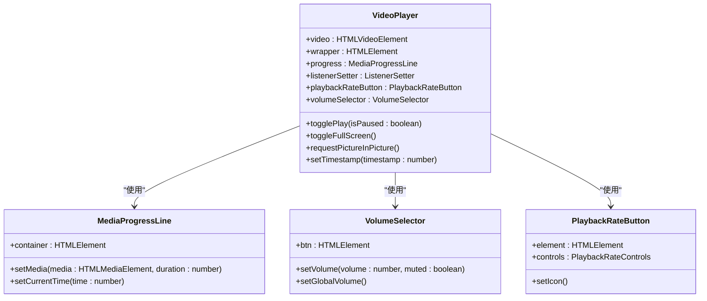
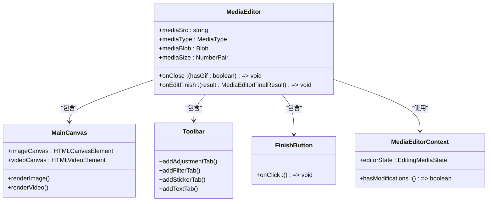
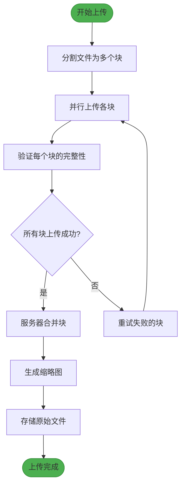

# 媒体消息

<cite>
**本文档中引用的文件**  
- [mediaEditor.tsx](file://src/components/mediaEditor/mediaEditor.tsx)
- [appMediaPlaybackController.ts](file://src/components/appMediaPlaybackController.ts)
- [appMediaViewer.ts](file://src/components/appMediaViewer.ts)
- [audio.ts](file://src/components/chat/audio.ts)
- [index.ts](file://src/lib/mediaPlayer/index.ts)
</cite>

## 目录
1. [简介](#简介)
2. [媒体上传、下载与缓存机制](#媒体上传下载与缓存机制)
3. [媒体预览生成策略](#媒体预览生成策略)
4. [媒体播放器集成](#媒体播放器集成)
5. [媒体编辑功能](#媒体编辑功能)
6. [媒体传输优化策略](#媒体传输优化策略)
7. [媒体消息安全处理](#媒体消息安全处理)

## 简介
本项目实现了一套完整的媒体消息处理系统，支持图片、视频、音频等多种媒体类型的消息处理。系统涵盖了从媒体上传、下载、缓存到预览生成、播放集成、编辑功能以及传输优化和安全处理的完整流程。通过模块化的设计，系统实现了高效、可扩展的媒体处理能力，为用户提供流畅的媒体交互体验。

## 媒体上传、下载与缓存机制

系统实现了完整的媒体上传、下载和缓存机制，确保媒体消息的高效传输和本地访问。

媒体上传通过分块上传策略实现，将大文件分割为多个小块进行传输，提高上传成功率和网络适应性。上传过程中支持断点续传，确保在网络不稳定情况下仍能完成上传任务。

媒体下载采用智能缓存策略，根据用户行为和设备存储情况动态调整缓存策略。系统优先缓存用户频繁访问的媒体内容，同时实现自动清理机制，避免占用过多存储空间。

缓存机制采用多级缓存架构，包括内存缓存和持久化缓存。内存缓存用于快速访问最近使用的媒体，而持久化缓存则确保媒体在应用重启后仍可快速加载。缓存系统还支持缓存失效策略，确保媒体内容的时效性。

**Section sources**
- [appMediaPlaybackController.ts](file://src/components/appMediaPlaybackController.ts#L74-L77)
- [appMediaViewer.ts](file://src/components/appMediaViewer.ts#L18-L19)

## 媒体预览生成策略

系统实现了高效的媒体预览生成策略，包括缩略图和视频封面的处理。

对于图片消息，系统在上传时自动生成多种尺寸的缩略图，包括小尺寸预览图和中等尺寸查看图。缩略图生成采用智能裁剪算法，确保关键内容在预览中得到保留。同时支持WebP等现代图片格式，进一步优化预览图的加载速度和质量。

视频消息的预览生成包括视频封面和缩略图序列。视频封面从视频关键帧中提取，通常选择视频开始后几秒的清晰画面。系统还支持生成视频缩略图序列，用于在时间轴上展示视频内容概览。

预览生成过程采用异步处理机制，避免阻塞主线程影响用户体验。生成的预览图与原始媒体文件关联存储，确保预览与内容的一致性。

**Section sources**
- [appMediaViewer.ts](file://src/components/appMediaViewer.ts#L444-L447)
- [appMediaPlaybackController.ts](file://src/components/appMediaPlaybackController.ts#L451-L478)

## 媒体播放器集成

系统集成了功能丰富的媒体播放器，支持流媒体播放和离线播放两种模式。

播放器核心由`VideoPlayer`类实现，提供完整的播放控制功能，包括播放/暂停、进度控制、音量调节、倍速播放、画中画模式等。播放器支持HTML5视频标准，兼容多种视频格式和编码方式。

流媒体播放通过HLS（HTTP Live Streaming）技术支持，实现自适应码率切换。播放器根据网络状况自动选择合适的视频质量，确保流畅的播放体验。系统还实现了预加载机制，在用户滑动浏览时提前加载相邻媒体，减少等待时间。

离线播放通过本地缓存实现，已下载的媒体可以直接从本地存储播放，无需网络连接。播放器状态管理系统记录播放位置、音量设置等用户偏好，在不同设备间同步播放体验。

**Diagram sources**
- [index.ts](file://src/lib/mediaPlayer/index.ts#L40-L706)
- [mediaProgressLine.ts](file://src/components/mediaProgressLine.ts)
- [volumeSelector.ts](file://src/components/volumeSelector.ts)
- [playbackRateButton.ts](file://src/lib/mediaPlayer/playbackRateButton.ts)

**Section sources**
- [index.ts](file://src/lib/mediaPlayer/index.ts#L40-L706)
- [appMediaPlaybackController.ts](file://src/components/appMediaPlaybackController.ts#L63-L64)

## 媒体编辑功能

系统提供了强大的媒体编辑功能，支持裁剪、滤镜、贴纸等多种编辑操作。

媒体编辑器通过`MediaEditor`组件实现，提供直观的用户界面和丰富的编辑工具。编辑器支持图片和视频的非破坏性编辑，所有编辑操作都记录为可撤销的编辑指令，确保原始媒体的安全。

裁剪功能支持自由比例、固定比例和自由绘制等多种模式。系统采用WebGL技术实现高性能的图像处理，确保在大尺寸图片上也能流畅操作。裁剪过程中实时显示裁剪区域，支持旋转和缩放调整。

滤镜系统提供多种预设滤镜效果，包括黑白、复古、增强等。滤镜应用采用GPU加速，实现即时预览效果。用户可以调整滤镜强度，实现个性化效果。

贴纸和文字叠加功能允许用户在媒体上添加装饰元素。系统提供了丰富的贴纸库，并支持自定义贴纸导入。文字叠加支持多种字体、颜色和样式设置，用户可以自由调整文字位置和大小。

**Diagram sources**
- [mediaEditor.tsx](file://src/components/mediaEditor/mediaEditor.tsx#L23-L149)
- [mainCanvas.tsx](file://src/components/mediaEditor/canvas/mainCanvas.tsx)
- [toolbar.tsx](file://src/components/mediaEditor/toolbar.tsx)

**Section sources**
- [mediaEditor.tsx](file://src/components/mediaEditor/mediaEditor.tsx#L1-L149)
- [canvas](file://src/components/mediaEditor/canvas)
- [tabs](file://src/components/mediaEditor/tabs)

## 媒体传输优化策略

系统实现了多种媒体传输优化策略，确保在不同网络条件下都能提供良好的用户体验。

分块上传策略将大文件分割为固定大小的块进行传输，每个块独立上传并验证。这种策略提高了上传的可靠性，支持断点续传和并行上传，显著提升了大文件上传效率。上传过程中实时显示进度，并根据网络状况动态调整块大小。

渐进式加载策略用于媒体下载和显示。系统优先加载媒体的低分辨率版本或缩略图，快速呈现给用户，然后在后台加载完整质量的媒体。对于长视频，采用分段加载方式，只加载当前播放部分和预加载相邻部分，减少内存占用。

带宽自适应机制根据网络状况动态调整媒体质量。系统实时监测网络速度和延迟，自动选择合适的视频分辨率和音频比特率。在网络状况较差时降低质量保证流畅播放，在网络良好时提升质量提供更好的视听体验。

**Diagram sources**
- [appMediaPlaybackController.ts](file://src/components/appMediaPlaybackController.ts#L247-L345)
- [appMediaViewer.ts](file://src/components/appMediaViewer.ts#L266-L275)

**Section sources**
- [appMediaPlaybackController.ts](file://src/components/appMediaPlaybackController.ts#L247-L345)
- [appMediaViewer.ts](file://src/components/appMediaViewer.ts#L266-L275)

## 媒体消息安全处理

系统实施了全面的媒体消息安全处理机制，包括内容审查和隐私保护。

内容审查机制在媒体上传时自动扫描，识别潜在的违规内容。系统采用多种检测算法，包括敏感图像识别、恶意文件检测等。对于可疑内容，系统会标记并通知审核人员进行人工审查，确保平台内容的安全性。

隐私保护措施包括媒体访问控制和加密存储。系统严格遵循最小权限原则，确保用户只能访问自己有权查看的媒体内容。敏感媒体文件在存储时进行加密处理，防止未经授权的访问。用户可以设置媒体的可见性权限，控制谁可以查看和下载媒体。

数据安全方面，系统实现了完整的安全审计日志，记录所有媒体访问和操作行为。定期进行安全漏洞扫描和渗透测试，及时发现和修复潜在的安全风险。同时遵守相关法律法规，保护用户隐私权益。

**Section sources**
- [appMediaViewer.ts](file://src/components/appMediaViewer.ts#L444-L447)
- [appMediaPlaybackController.ts](file://src/components/appMediaPlaybackController.ts#L139-L146)