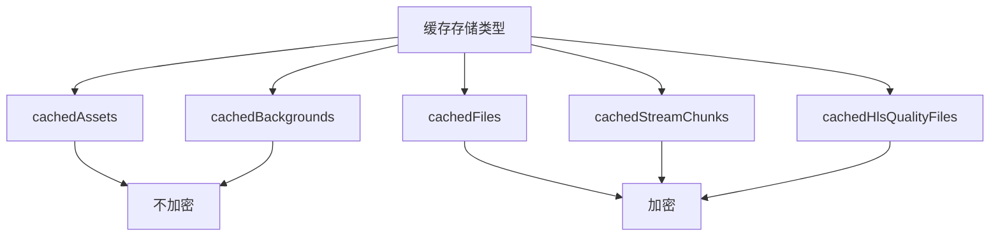
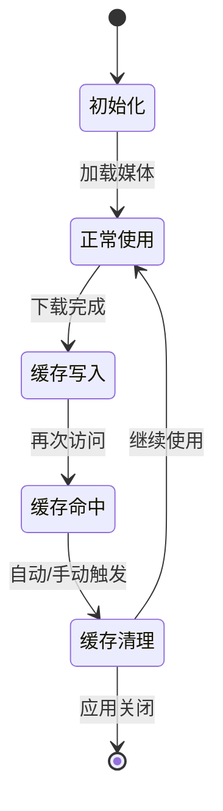
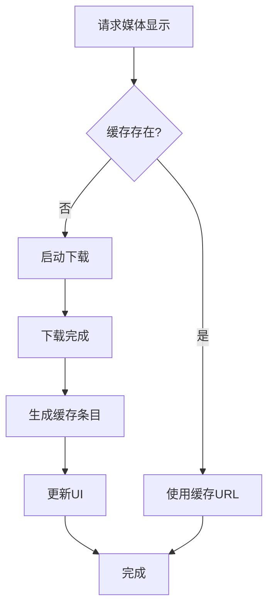
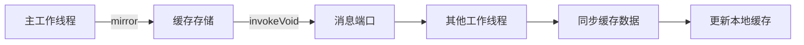
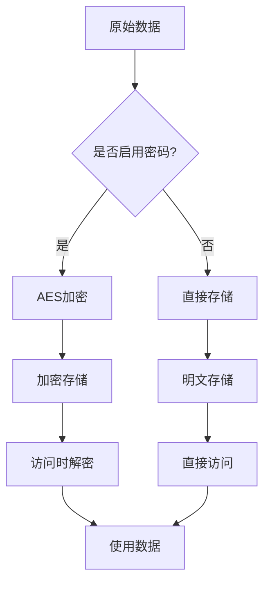
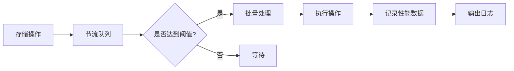

# 媒体缓存

<cite>
**本文档中引用的文件**  
- [thumbs.ts](file://src/lib/storages/thumbs.ts)
- [cacheStorage.ts](file://src/lib/files/cacheStorage.ts)
- [storage.ts](file://src/lib/storage.ts)
- [getThumbKey.ts](file://src/lib/storages/utils/thumbs/getThumbKey.ts)
- [generateEmptyThumb.ts](file://src/lib/storages/utils/thumbs/generateEmptyThumb.ts)
- [fileStorage.ts](file://src/lib/files/fileStorage.ts)
- [memoryWriter.ts](file://src/lib/files/memoryWriter.ts)
</cite>

## 目录
1. [简介](#简介)
2. [缓存目录结构与文件命名规则](#缓存目录结构与文件命名规则)
3. [缓存生命周期管理](#缓存生命周期管理)
4. [缩略图缓存机制](#缩略图缓存机制)
5. [缓存同步策略](#缓存同步策略)
6. [缓存安全性措施](#缓存安全性措施)
7. [缓存性能监控](#缓存性能监控)
8. [结论](#结论)

## 简介
本项目实现了一套完整的媒体缓存机制，用于高效管理图片、视频、音频等媒体消息的本地存储。系统采用分层架构设计，结合IndexedDB和Cache API实现持久化存储，并通过加密机制保障用户数据安全。缓存系统支持自动清理和手动清除功能，确保应用性能稳定。同时，通过缩略图预生成和多设备同步策略，优化了消息列表的加载速度和用户体验。

**Section sources**
- [thumbs.ts](file://src/lib/storages/thumbs.ts#L1-L152)
- [cacheStorage.ts](file://src/lib/files/cacheStorage.ts#L1-L323)

## 缓存目录结构与文件命名规则
媒体缓存系统采用分类存储策略，将不同类型的媒体文件分别存储在独立的数据库中。系统定义了五种主要的缓存存储类型：

- `cachedAssets`: 存储应用资产文件，不加密
- `cachedBackgrounds`: 存储聊天背景，不加密  
- `cachedFiles`: 存储用户媒体文件，支持加密
- `cachedStreamChunks`: 存储流媒体分片，支持加密
- `cachedHlsQualityFiles`: 存储HLS质量文件，支持加密

文件命名基于媒体内容的唯一标识符生成，通过`getThumbKey`函数实现。对于Web文件位置，使用`getFileNameByLocation`函数生成文件名；对于其他媒体类型，使用媒体类型加上ID或URL组合生成唯一键值。

**Diagram sources**
- [cacheStorage.ts](file://src/lib/files/cacheStorage.ts#L25-L44)
- [getThumbKey.ts](file://src/lib/storages/utils/thumbs/getThumbKey.ts#L7-L13)

**Section sources**
- [cacheStorage.ts](file://src/lib/files/cacheStorage.ts#L25-L44)
- [getThumbKey.ts](file://src/lib/storages/utils/thumbs/getThumbKey.ts#L7-L13)

## 缓存生命周期管理
缓存系统实现了完整的生命周期管理机制，支持自动清理和手动清除功能。系统通过`CacheStorageController`类管理缓存存储，提供了以下核心功能：

- `delete(entryName)`: 删除指定缓存条目
- `deleteAll()`: 删除所有缓存数据
- `clearEncryptableStorages()`: 清除所有可加密存储
- `reset()`: 重置缓存状态

自动清理机制基于存储使用情况和系统策略触发，当缓存达到一定阈值时会自动清理较早或不常用的缓存数据。手动清除功能允许用户通过界面操作完全清除缓存，提升存储空间利用率。

**Diagram sources**
- [cacheStorage.ts](file://src/lib/files/cacheStorage.ts#L122-L136)
- [cacheStorage.ts](file://src/lib/files/cacheStorage.ts#L271-L311)

**Section sources**
- [cacheStorage.ts](file://src/lib/files/cacheStorage.ts#L122-L136)
- [cacheStorage.ts](file://src/lib/files/cacheStorage.ts#L271-L311)

## 缩略图缓存机制
缩略图缓存系统是优化消息列表加载速度的核心组件。系统通过`ThumbsStorage`类管理缩略图缓存，采用预生成和按需加载相结合的策略。

每个缩略图缓存条目包含以下信息：
- `downloaded`: 已下载字节数
- `url`: 缓存URL
- `type`: 缓存类型

系统使用`generateEmptyThumb`函数为未下载的缩略图生成占位符，确保UI渲染的连续性。当媒体内容需要显示时，系统首先检查缓存，如果存在则直接使用，否则启动下载流程并将结果存入缓存。

**Diagram sources**
- [thumbs.ts](file://src/lib/storages/thumbs.ts#L18-L22)
- [generateEmptyThumb.ts](file://src/lib/storages/utils/thumbs/generateEmptyThumb.ts#L3-L5)

**Section sources**
- [thumbs.ts](file://src/lib/storages/thumbs.ts#L18-L22)
- [thumbs.ts](file://src/lib/storages/thumbs.ts#L47-L58)
- [generateEmptyThumb.ts](file://src/lib/storages/utils/thumbs/generateEmptyThumb.ts#L3-L5)

## 缓存同步策略
为确保多设备间缓存数据的一致性，系统实现了缓存同步机制。通过`MTProtoMessagePort`进行跨上下文通信，将缓存变更同步到其他工作线程或设备。

主要同步操作包括：
- `mirrorCacheContext`: 同步普通缓存上下文
- `mirrorStickerThumb`: 同步贴纸缩略图
- `mirrorAll`: 全量同步所有缓存数据

同步机制采用增量更新策略，只传输变更的部分，减少网络开销。同时支持端口指定，可将数据同步到特定的目标端口。

**Diagram sources**
- [thumbs.ts](file://src/lib/storages/thumbs.ts#L60-L92)
- [thumbs.ts](file://src/lib/storages/thumbs.ts#L94-L106)

**Section sources**
- [thumbs.ts](file://src/lib/storages/thumbs.ts#L60-L92)
- [thumbs.ts](file://src/lib/storages/thumbs.ts#L94-L106)

## 缓存安全性措施
缓存系统实施了多层次的安全保护措施，确保用户数据的机密性和完整性。核心安全特性包括：

1. **加密存储**: 对敏感媒体文件采用AES本地加密
2. **访问控制**: 基于密码锁屏的访问权限管理
3. **内存管理**: 及时释放不再使用的资源URL

系统通过`EncryptionKeyStore`管理加密密钥，使用`cryptoMessagePort`进行加密解密操作。只有在启用密码保护的情况下，才会对可加密存储中的数据进行加密处理。

**Diagram sources**
- [cacheStorage.ts](file://src/lib/files/cacheStorage.ts#L78-L112)
- [cacheStorage.ts](file://src/lib/files/cacheStorage.ts#L149-L158)
- [cacheStorage.ts](file://src/lib/files/cacheStorage.ts#L168-L177)

**Section sources**
- [cacheStorage.ts](file://src/lib/files/cacheStorage.ts#L78-L112)
- [cacheStorage.ts](file://src/lib/files/cacheStorage.ts#L149-L158)

## 缓存性能监控
系统提供了完善的性能监控工具，帮助开发者分析缓存效率和内存使用情况。通过`logger`组件记录关键操作的性能数据，包括：

- 缓存读写操作耗时
- 数据库连接状态
- 存储操作错误信息

监控系统采用节流机制(`throttleWith`)批量处理存储操作，减少频繁的磁盘I/O。同时提供`temporarilyToggle`功能，可临时禁用缓存操作，便于性能测试和问题排查。

**Diagram sources**
- [storage.ts](file://src/lib/storage.ts#L43)
- [storage.ts](file://src/lib/storage.ts#L99-L101)
- [storage.ts](file://src/lib/storage.ts#L121-L161)

**Section sources**
- [storage.ts](file://src/lib/storage.ts#L43)
- [storage.ts](file://src/lib/storage.ts#L99-L161)

## 结论
本媒体缓存系统设计合理，功能完整，有效提升了应用的性能和用户体验。通过分类存储、缩略图预生成、多设备同步和加密保护等机制，实现了高效、安全、可靠的媒体管理。系统具有良好的扩展性和维护性，为未来的功能迭代奠定了坚实基础。