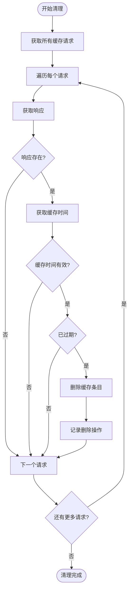
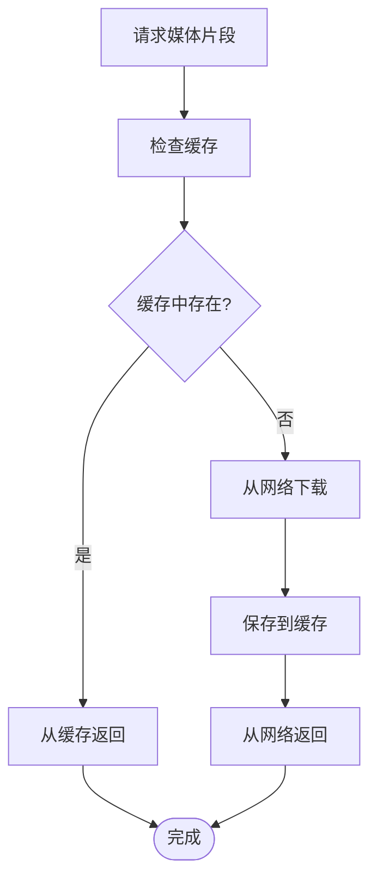
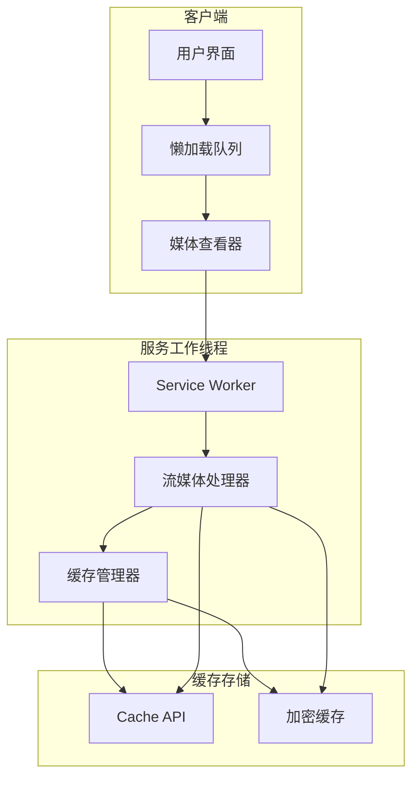

# 生命周期管理

<cite>
**本文档中引用的文件**  
- [cacheStorage.ts](file://src\lib\files\cacheStorage.ts)
- [fetchAndConcatFileParts.ts](file://src\lib\hls\fetchAndConcatFileParts.ts)
- [stream.ts](file://src\lib\serviceWorker\stream.ts)
- [lazyLoadQueueBase.ts](file://src\components\lazyLoadQueueBase.ts)
- [photo.ts](file://src\components\wrappers\photo.ts)
- [index.service.ts](file://src\lib\serviceWorker\index.service.ts)
</cite>

## 目录
1. [介绍](#介绍)
2. [缓存创建与更新](#缓存创建与更新)
3. [自动清理策略](#自动清理策略)
4. [手动清除功能](#手动清除功能)
5. [预加载与懒加载策略](#预加载与懒加载策略)
6. [缓存状态监控](#缓存状态监控)
7. [开发者调试接口](#开发者调试接口)
8. [架构概览](#架构概览)

## 介绍
本文档详细阐述了媒体缓存的生命周期管理机制，包括缓存的创建、更新、过期和清除。系统实现了基于时间的过期清理和基于存储空间的压力清理两种自动清理策略。同时支持按类型（图片、视频、音频）或按时间范围进行手动清除。文档还描述了缓存预加载和懒加载策略，以及缓存状态监控机制和开发者调试接口。

## 缓存创建与更新

媒体缓存系统通过 `CacheStorageController` 类实现，该类封装了浏览器的 Cache API，提供了统一的缓存操作接口。缓存的创建和更新主要通过 `save` 方法完成，该方法接受一个条目名称和一个 Response 对象作为参数。

当媒体文件需要缓存时，系统会创建一个包含文件数据的 Response 对象，并在头部添加 `Time-Cached` 字段记录缓存时间戳。这个时间戳在后续的过期检查中起着关键作用。对于需要加密的缓存（如 `cachedFiles`、`cachedStreamChunks` 等），系统会在保存前使用 AES 加密算法对数据进行加密。

缓存更新是通过相同的 `save` 方法实现的，当使用相同的条目名称调用该方法时，新的 Response 会覆盖旧的缓存条目。系统支持多种缓存存储，包括 `cachedAssets`（静态资源）、`cachedBackgrounds`（背景图片）、`cachedFiles`（文件）和 `cachedStreamChunks`（流媒体片段）等，每种存储都有其特定的用途和配置。

**Section sources**
- [cacheStorage.ts](file://src\lib\files\cacheStorage.ts#L163-L180)

## 自动清理策略

系统实现了两种自动清理策略：基于时间的过期清理和基于存储空间的压力清理。

基于时间的过期清理通过定时任务实现。系统设置了每 30 分钟（1800e3 毫秒）执行一次的定时器，检查并删除过期的缓存条目。对于 HLS 流媒体片段，过期时间为 24 小时（`CHUNK_LIFETIME_SECONDS = 24 * 60 * 60`）；对于普通流媒体片段，过期时间为 86400 秒（`CHUNK_TTL = 86400`）。清理过程会遍历缓存中的所有请求，检查每个响应的 `Time-Cached` 头部，如果当前时间减去缓存时间超过过期时间，则删除该缓存条目。

**Diagram sources**
- [fetchAndConcatFileParts.ts](file://src\lib\hls\fetchAndConcatFileParts.ts#L92-L117)
- [stream.ts](file://src\lib\serviceWorker\stream.ts#L32-L58)

## 手动清除功能

系统提供了灵活的手动清除功能，支持按类型或按时间范围清除缓存。`CacheStorageController` 类提供了多个静态方法来实现这些功能。

`deleteAllStorages` 方法可以删除所有缓存存储，而 `clearEncryptableStorages` 方法则专门用于清除所有可加密的存储（如 `cachedFiles`、`cachedStreamChunks` 等）。这些方法通过遍历配置中的存储名称，为每个存储创建一个新的 `CacheStorageController` 实例，然后调用其 `deleteAll` 方法来清除缓存。

此外，系统还提供了更细粒度的清除功能。`toggleStorage` 方法可以临时启用或禁用所有缓存存储，而 `temporarilyToggle` 方法则可以临时切换缓存的启用状态。这些功能为开发者提供了强大的调试和管理工具。

**Section sources**
- [cacheStorage.ts](file://src\lib\files\cacheStorage.ts#L271-L308)

## 预加载与懒加载策略

系统实现了高效的预加载和懒加载策略，以优化用户体验和资源利用。

懒加载通过 `LazyLoadQueueBase` 类实现，该类维护一个待处理的加载队列和一个正在处理的集合。加载过程由 `processQueue` 方法控制，该方法使用节流（throttle）技术限制并发加载的数量（默认为 8 个）。当元素被添加到队列时，`processQueue` 会被调用，尝试处理队列中的元素。每个元素的加载通过 `processItem` 方法完成，该方法会将元素添加到 `inProcess` 集合中，执行加载操作，然后从集合中移除。

预加载策略主要应用于流媒体播放。`Stream` 类的 `preloadChunks` 方法会根据当前播放位置预加载后续的媒体片段。预加载的大小默认为 20MB（`PRELOAD_SIZE = 20 * 1024 * 1024`）。当请求媒体片段时，系统会首先尝试从缓存中获取，如果缓存中不存在，则从网络下载，并在下载完成后自动保存到缓存中。

**Diagram sources**
- [lazyLoadQueueBase.ts](file://src\components\lazyLoadQueueBase.ts#L113-L134)
- [stream.ts](file://src\lib\serviceWorker\stream.ts#L179-L210)

## 缓存状态监控

系统通过多种机制监控缓存状态，实时跟踪缓存大小和命中率。

`CacheStorageController` 类的 `get` 和 `has` 方法可以用于检查特定条目是否存在或获取其内容，这些方法可以用于实现缓存命中率的统计。`timeoutOperation` 方法为所有缓存操作提供了超时机制（15秒），防止操作长时间阻塞。

服务工作线程（Service Worker）中的 `onFetch` 事件监听器负责处理所有网络请求，它可以根据请求的 URL 将请求路由到不同的处理函数。例如，以 `/stream` 开头的请求会被路由到 `onStreamFetch` 处理，以 `/download` 开头的请求会被路由到 `onDownloadFetch` 处理。这种路由机制使得系统可以对不同类型的资源进行精细化的缓存管理。

**Section sources**
- [cacheStorage.ts](file://src\lib\files\cacheStorage.ts#L138-L141)
- [index.service.ts](file://src\lib\serviceWorker\index.service.ts#L216-L288)

## 开发者调试接口

系统提供了丰富的开发者调试接口，便于分析缓存使用情况和性能瓶颈。

服务工作线程暴露了多个调试相关的事件监听器。`toggleStorages` 事件可以启用或禁用所有缓存存储，`toggleCacheStorage` 事件可以临时切换缓存的启用状态，`resetEncryptableCacheStorages` 事件可以重置所有可加密的缓存存储。这些接口使得开发者可以在运行时动态调整缓存行为，进行各种测试和调试。

此外，系统还提供了 `watchMtprotoOnDev` 函数，用于在开发环境中监控 MTProto 协议的通信。`invokeVoidAll` 函数可以向所有窗口客户端发送消息，这对于调试多窗口应用非常有用。

**Section sources**
- [index.service.ts](file://src\lib\serviceWorker\index.service.ts#L120-L143)

## 架构概览

**Diagram sources**
- [lazyLoadQueueBase.ts](file://src\components\lazyLoadQueueBase.ts)
- [stream.ts](file://src\lib\serviceWorker\stream.ts)
- [cacheStorage.ts](file://src\lib\files\cacheStorage.ts)