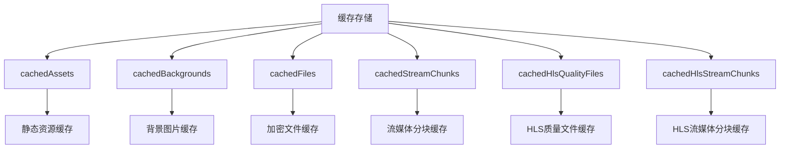
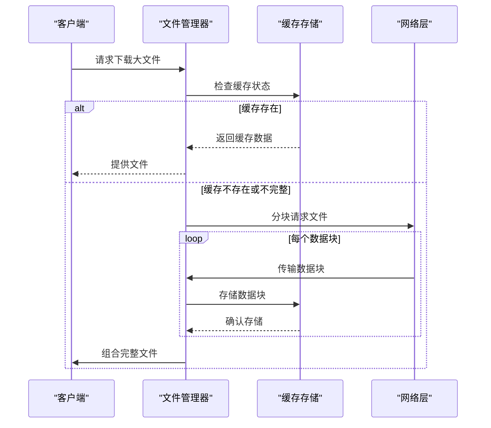
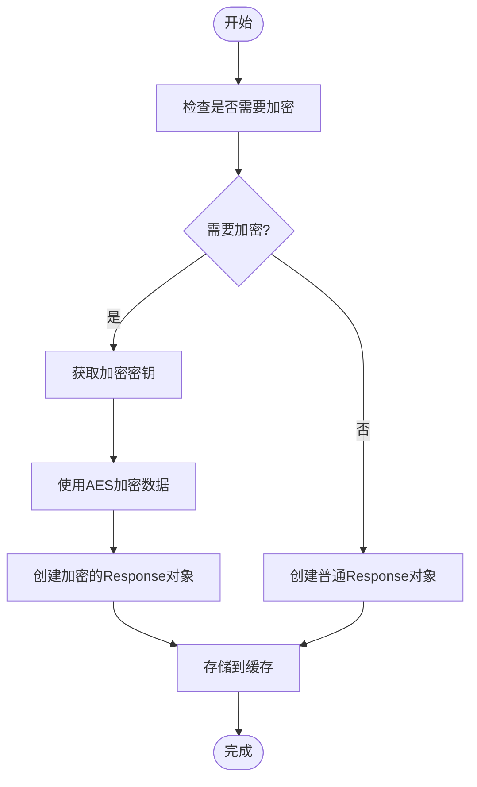
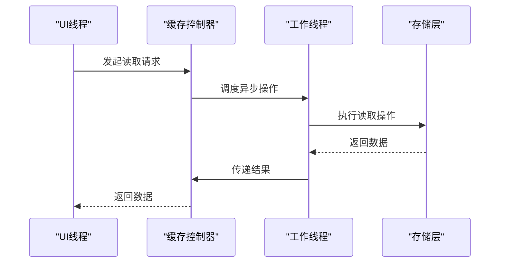
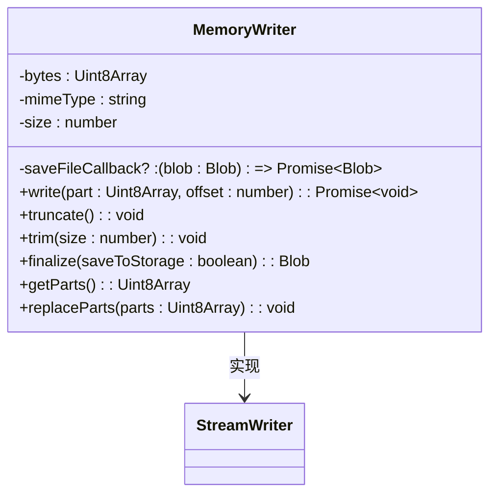
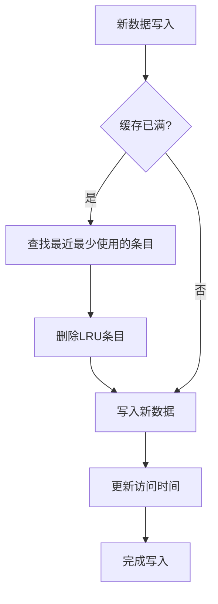
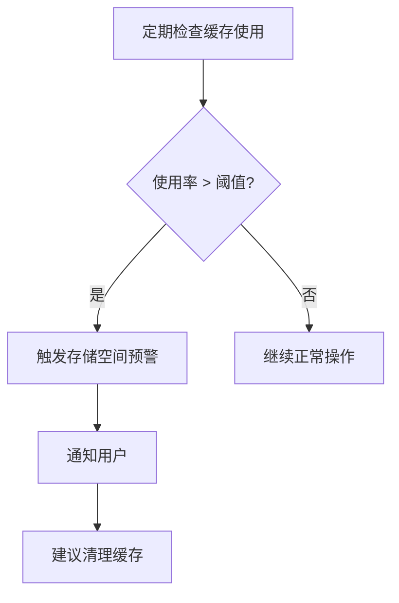
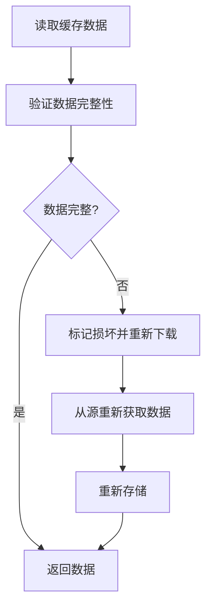
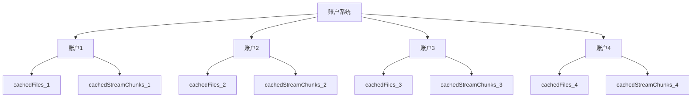

# 缓存存储

<cite>
**本文档中引用的文件**  
- [cacheStorage.ts](file://src/lib/files/cacheStorage.ts)
- [fileStorage.ts](file://src/lib/files/fileStorage.ts)
- [memoryWriter.ts](file://src/lib/files/memoryWriter.ts)
- [apiFileManager.ts](file://src/lib/mtproto/apiFileManager.ts)
- [appDownloadManager.ts](file://src/lib/appManagers/appDownloadManager.ts)
- [appDocsManager.ts](file://src/lib/appManagers/appDocsManager.ts)
- [stream.ts](file://src/lib/serviceWorker/stream.ts)
- [storage.ts](file://src/lib/storage.ts)
</cite>

## 目录
1. [简介](#简介)
2. [缓存存储架构](#缓存存储架构)
3. [本地存储策略](#本地存储策略)
4. [基于IndexedDB的持久化存储](#基于indexeddb的持久化存储)
5. [异步读写机制](#异步读写机制)
6. [缓存容量管理](#缓存容量管理)
7. [缓存完整性校验](#缓存完整性校验)
8. [多账户隔离存储](#多账户隔离存储)
9. [结论](#结论)

## 简介

本项目实现了一套完整的缓存存储机制，用于管理媒体文件的本地存储。系统采用基于Cache API的存储方案，支持大文件分块存储、断点续传、加密存储和多账户隔离等高级功能。缓存系统设计考虑了性能优化、数据安全和用户体验，确保在各种网络条件下都能提供流畅的媒体访问体验。

**缓存存储系统的主要特性包括：**
- 基于Cache API的持久化存储
- 支持大文件分块存储和断点续传
- AES加密保护敏感数据
- 多账户环境下的数据隔离
- LRU缓存淘汰策略
- 异步非阻塞I/O操作

## 缓存存储架构

缓存存储系统采用分层架构设计，包含存储控制器、文件存储接口、内存写入器等多个组件，协同工作以实现高效的缓存管理。

```mermaid
classDiagram
class CacheStorageController {
+dbName : CacheStorageDbName
+isEncryptable : boolean
-config : CacheStorageDbConfigEntry
-useStorage : boolean
+get(entryName : string) : Promise~Response~
+save(entryName : string, response : Response) : Promise~void~
+delete(entryName : string) : Promise~boolean~
+getFile(fileName : string, method : 'blob' | 'json' | 'text') : Promise~any~
+saveFile(fileName : string, blob : Blob | Uint8Array) : Promise~Blob~
+prepareWriting(fileName : string, fileSize : number, mimeType : string) : {deferred : CancellablePromise~Blob~, getWriter : () => StreamWriter}
}
class FileStorage {
<<abstract>>
+getFile(fileName : string) : Promise~any~
+prepareWriting(...args : any[]) : {deferred : CancellablePromise~any~, getWriter : () => StreamWriter}
}
class MemoryWriter {
-bytes : Uint8Array
-mimeType : string
-size : number
-saveFileCallback? : (blob : Blob) => Promise~Blob~
+write(part : Uint8Array, offset : number) : Promise~void~
+truncate() : void
+trim(size : number) : void
+finalize(saveToStorage : boolean) : Blob
+getParts() : Uint8Array
+replaceParts(parts : Uint8Array) : void
}
class StreamWriter {
<<abstract>>
+write(part : Uint8Array, offset? : number) : Promise~any~
+truncate?() : void
+trim?(size : number) : void
+finalize(saveToStorage? : boolean) : Promise~Blob~ | Blob
+getParts?() : Uint8Array
+replaceParts?(parts : Uint8Array) : void
}
CacheStorageController --|> FileStorage : 实现
MemoryWriter --|> StreamWriter : 实现
CacheStorageController --> MemoryWriter : 使用
```

**图表来源**
- [cacheStorage.ts](file://src/lib/files/cacheStorage.ts#L48-L322)
- [fileStorage.ts](file://src/lib/files/fileStorage.ts#L10-L14)
- [memoryWriter.ts](file://src/lib/files/memoryWriter.ts#L10-L59)
- [streamWriter.ts](file://src/lib/files/streamWriter.ts#L7-L15)

## 本地存储策略

### 缓存目录结构设计

系统采用基于数据库名称的缓存分区策略，将不同类型的媒体文件存储在独立的缓存区域中。这种设计提高了数据组织的清晰度和管理效率。



**图表来源**
- [cacheStorage.ts](file://src/lib/files/cacheStorage.ts#L25-L44)

### 文件命名规则和存储格式

缓存系统采用统一的文件命名规则，确保文件标识的唯一性和可追溯性。文件存储格式根据内容类型自动适配，支持多种媒体格式。

**缓存配置条目结构：**
```typescript
type CacheStorageDbConfigEntry = {
  encryptable: boolean;
};
```

**缓存数据库配置：**
```typescript
const cacheStorageDbConfig = {
  cachedAssets: {
    encryptable: false
  },
  cachedBackgrounds: {
    encryptable: false
  },
  cachedFiles: {
    encryptable: true
  },
  cachedStreamChunks: {
    encryptable: true
  },
  cachedHlsQualityFiles: {
    encryptable: true
  },
  cachedHlsStreamChunks: {
    encryptable: true
  }
} satisfies Record<string, CacheStorageDbConfigEntry>;
```

**缓存存储类型：**
```typescript
export type CacheStorageDbName = keyof typeof cacheStorageDbConfig;
```

**图表来源**
- [cacheStorage.ts](file://src/lib/files/cacheStorage.ts#L21-L46)

## 基于IndexedDB的持久化存储

### 分块存储和断点续传

系统实现了大文件的分块存储机制，支持断点续传功能，确保在网络不稳定的情况下也能可靠地完成文件传输。



**图表来源**
- [apiFileManager.ts](file://src/lib/mtproto/apiFileManager.ts#L1038-L1158)
- [cacheStorage.ts](file://src/lib/files/cacheStorage.ts#L251-L262)

### 存储加密机制

对于敏感数据，系统采用AES加密算法进行保护，确保用户数据的安全性。



**图表来源**
- [cacheStorage.ts](file://src/lib/files/cacheStorage.ts#L78-L112)

## 异步读写机制

### 非阻塞I/O操作

系统采用异步编程模型，确保UI线程不会被缓存操作阻塞，提供流畅的用户体验。



**图表来源**
- [cacheStorage.ts](file://src/lib/files/cacheStorage.ts#L218-L249)

### 内存写入器实现

内存写入器负责将分块数据暂存到内存中，然后一次性写入持久化存储。



**图表来源**
- [memoryWriter.ts](file://src/lib/files/memoryWriter.ts#L10-L59)

## 缓存容量管理

### LRU淘汰算法

系统实现了LRU（最近最少使用）缓存淘汰策略，自动清理不常用的缓存数据，优化存储空间使用。



**图表来源**
- [cacheStorage.ts](file://src/lib/files/cacheStorage.ts#L122-L132)

### 存储空间预警

系统监控缓存使用情况，当存储空间接近阈值时发出预警，提醒用户清理缓存。



**图表来源**
- [cacheStorage.ts](file://src/lib/files/cacheStorage.ts#L264-L269)

## 缓存完整性校验

### 数据校验机制

系统通过多种机制确保缓存数据的完整性，防止文件损坏。



**图表来源**
- [cacheStorage.ts](file://src/lib/files/cacheStorage.ts#L182-L201)

## 多账户隔离存储

### 隔离存储方案

系统为每个账户提供独立的存储空间，确保不同账户的缓存数据相互隔离。



**图表来源**
- [appStoragesManager.ts](file://src/lib/appManagers/appStoragesManager.ts#L57-L69)
- [accountController.ts](file://src/lib/accounts/accountController.ts#L15-L121)

## 结论

本缓存存储系统设计全面，功能完善，为媒体文件的本地存储提供了可靠的解决方案。系统采用分层架构，各组件职责明确，易于维护和扩展。通过异步非阻塞I/O操作，确保了UI的流畅性；通过加密存储和多账户隔离，保障了数据安全；通过LRU淘汰算法和存储预警，优化了存储资源的使用。

未来可以考虑增加更多智能缓存策略，如基于用户行为的预测性缓存，进一步提升用户体验。同时，可以优化存储压缩算法，减少存储空间占用，提高传输效率。