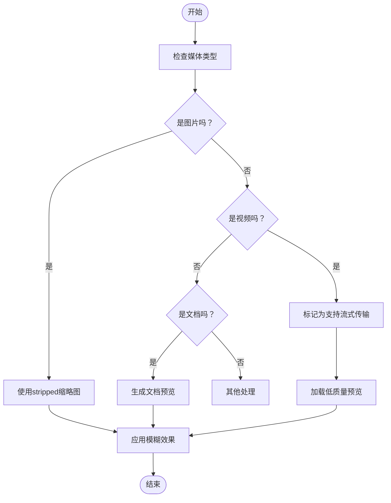
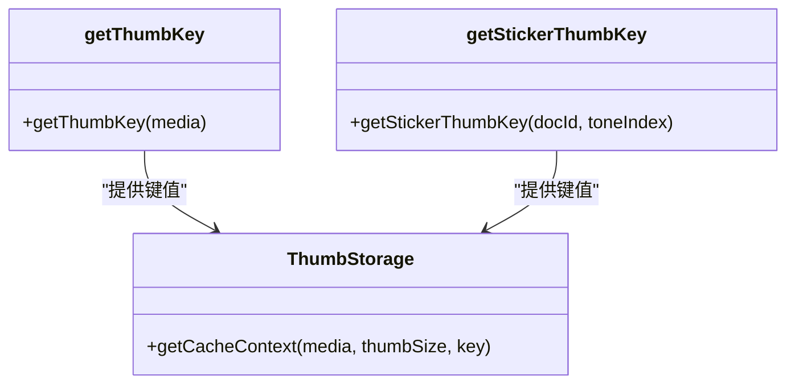
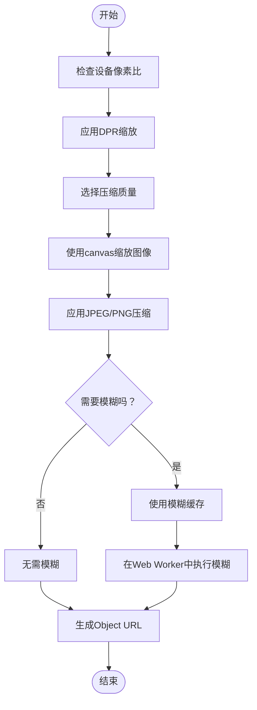
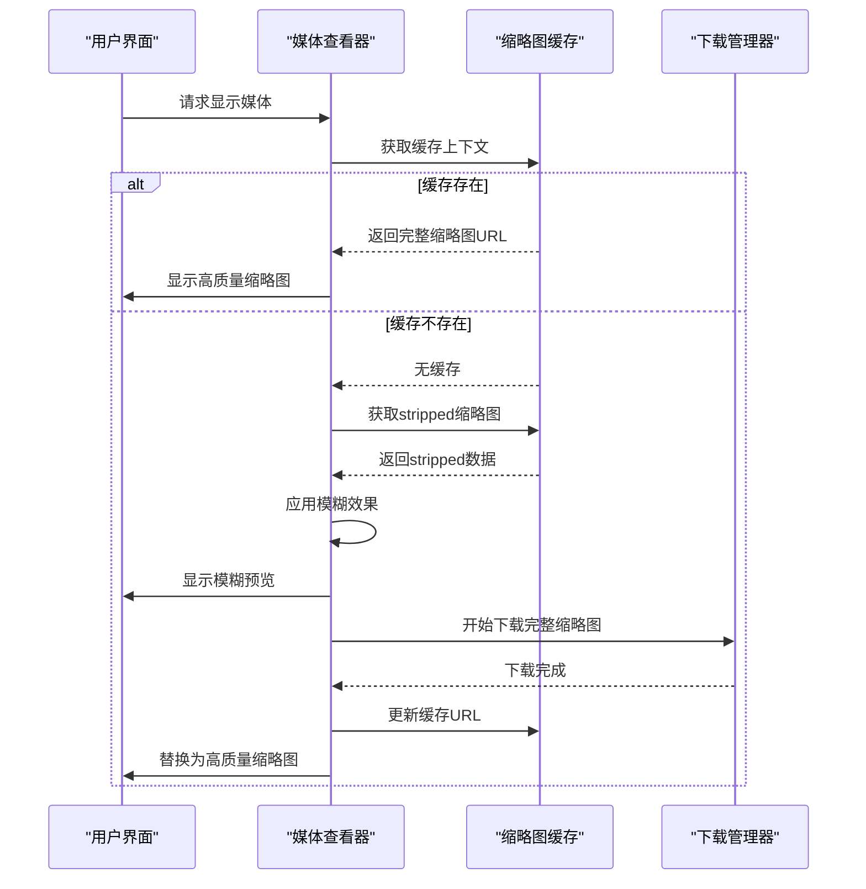
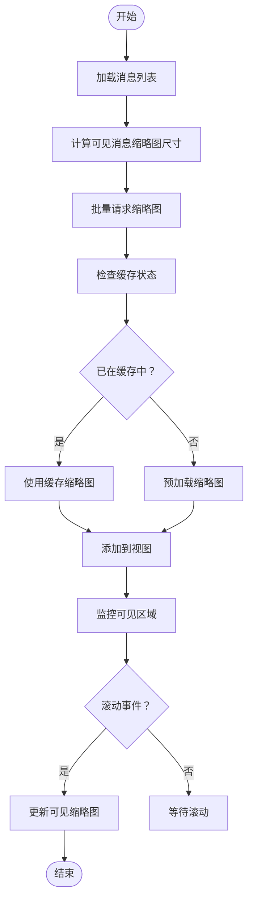

# 缩略图处理

<cite>
**本文档中引用的文件**  
- [thumbs.ts](file://src/lib/storages/thumbs.ts)
- [getStrippedThumbIfNeeded.ts](file://src/helpers/getStrippedThumbIfNeeded.ts)
- [getImageFromStrippedThumb.ts](file://src/helpers/getImageFromStrippedThumb.ts)
- [getPreviewURLFromThumb.ts](file://src/helpers/getPreviewURLFromThumb.ts)
- [blur.ts](file://src/helpers/blur.ts)
- [getThumbKey.ts](file://src/lib/storages/utils/thumbs/getThumbKey.ts)
- [mediaSizes.ts](file://src/helpers/mediaSizes.ts)
- [mediaSize.ts](file://src/helpers/mediaSize.ts)
- [apiFileManager.ts](file://src/lib/mtproto/apiFileManager.ts)
- [appDocsManager.ts](file://src/lib/appManagers/appDocsManager.ts)
- [appMediaViewerBase.ts](file://src/components/appMediaViewerBase.ts)
- [scaleMediaElement.ts](file://src/helpers/canvas/scaleMediaElement.ts)
</cite>

## 目录
1. [简介](#简介)
2. [缩略图生成流程](#缩略图生成流程)
3. [缓存机制](#缓存机制)
4. [不同媒体类型的缩略图处理](#不同媒体类型的缩略图处理)
5. [缓存键值生成规则](#缓存键值生成规则)
6. [质量优化策略](#质量优化策略)
7. [渐进式加载机制](#渐进式加载机制)
8. [预生成与批量处理](#预生成与批量处理)

## 简介
本系统实现了完整的缩略图处理机制，包括生成、存储、缓存和显示。缩略图用于在消息列表和媒体查看器中快速预览图片、视频和文档等媒体内容，同时通过渐进式加载和模糊预览提升用户体验。系统支持多种媒体类型，采用高效的缓存策略和质量优化算法，在保证视觉效果的同时最小化存储占用和网络传输。

## 缩略图生成流程
缩略图的生成流程始于媒体文件的接收或上传。系统首先检查媒体是否包含内嵌的缩略图数据（如photoStrippedSize），如果存在则直接使用；否则根据媒体类型和尺寸要求生成新的缩略图。对于图片，系统使用canvas进行缩放和压缩；对于视频和文档，则依赖服务器提供的缩略图或生成静态预览。生成的缩略图经过质量优化后存储在内存缓存中，并通过URL.createObjectURL创建可访问的本地URL。

**Section sources**
- [getStrippedThumbIfNeeded.ts](file://src/helpers/getStrippedThumbIfNeeded.ts#L15-L65)
- [getImageFromStrippedThumb.ts](file://src/helpers/getImageFromStrippedThumb.ts#L14-L33)
- [scaleMediaElement.ts](file://src/helpers/canvas/scaleMediaElement.ts#L4-L45)

## 缓存机制
系统采用两级缓存机制：内存缓存和跨线程镜像缓存。ThumbsStorage类管理所有缩略图的缓存，使用媒体标识作为键，存储不同尺寸的缩略图上下文（包含下载大小和URL）。缓存上下文通过getCacheContext方法获取，如果不存在则创建空的缓存对象。当缩略图下载完成或生成后，通过setCacheContextURL方法更新缓存，并通过MTProtoMessagePort将变更同步到其他线程，确保缓存一致性。

```mermaid
classDiagram
class ThumbsStorage {
+thumbsCache : ThumbsCache
+stickerCachedThumbs : StickerCachedThumbs
+getCacheContext(media, thumbSize, key)
+setCacheContextURL(media, thumbSize, url, downloaded, key)
+deleteCacheContext(media, thumbSize, key)
+mirrorAll(port)
}
class ThumbCache {
+downloaded : number
+url : string
+type : string
}
class ThumbsCache {
[key : string] : {
[size : string] : ThumbCache
}
}
ThumbsStorage --> ThumbCache : "包含"
ThumbsStorage --> ThumbsCache : "管理"
```

**Diagram sources**
- [thumbs.ts](file://src/lib/storages/thumbs.ts#L43-L152)

**Section sources**
- [thumbs.ts](file://src/lib/storages/thumbs.ts#L43-L152)
- [apiFileManager.ts](file://src/lib/mtproto/apiFileManager.ts#L1011-L1027)

## 不同媒体类型的缩略图处理
系统对不同媒体类型采用不同的缩略图处理策略。图片媒体优先使用内嵌的stripped缩略图，通过getImageFromStrippedThumb函数将其转换为图像元素。视频和GIF文件由于可能较大，系统会标记为支持流式传输，并优先加载低质量预览。文档文件的缩略图处理与图片类似，但会根据文件类型调整显示策略。所有缩略图在加载时都支持模糊效果，提供平滑的视觉过渡。



**Diagram sources**
- [getStrippedThumbIfNeeded.ts](file://src/helpers/getStrippedThumbIfNeeded.ts#L28-L65)
- [appDocsManager.ts](file://src/lib/appManagers/appDocsManager.ts#L258-L280)

**Section sources**
- [getStrippedThumbIfNeeded.ts](file://src/helpers/getStrippedThumbIfNeeded.ts#L28-L65)
- [appDocsManager.ts](file://src/lib/appManagers/appDocsManager.ts#L258-L280)

## 缓存键值生成规则
缩略图缓存使用唯一的键值来标识每个媒体文件的不同尺寸缩略图。键值由getThumbKey函数生成，对于Web文件使用文件位置生成名称，对于其他媒体则使用媒体类型和ID（或URL）的组合。这种生成规则确保了键值的唯一性和可预测性，避免了不同媒体之间的缓存冲突。对于贴纸缩略图，使用getStickerThumbKey函数生成包含文档ID和色调索引的复合键。



**Diagram sources**
- [getThumbKey.ts](file://src/lib/storages/utils/thumbs/getThumbKey.ts#L7-L13)
- [getStickerThumbKey.ts](file://src/lib/storages/utils/thumbs/getStickerThumbKey.ts#L1-L3)

**Section sources**
- [getThumbKey.ts](file://src/lib/storages/utils/thumbs/getThumbKey.ts#L7-L13)
- [getStickerThumbKey.ts](file://src/lib/storages/utils/thumbs/getStickerThumbKey.ts#L1-L3)

## 质量优化策略
系统采用多种策略优化缩略图的质量和性能。首先，利用设备像素比（devicePixelRatio）生成适合高DPI屏幕的高质量缩略图。其次，通过scaleMediaElement函数在缩放时应用适当的压缩质量，平衡视觉效果和文件大小。对于模糊预览，系统实现了一个缓存机制，避免重复计算，并使用Web Worker处理繁重的模糊计算任务。此外，系统根据屏幕尺寸和设备类型动态调整缩略图尺寸，确保在不同设备上都有最佳的显示效果。



**Diagram sources**
- [scaleMediaElement.ts](file://src/helpers/canvas/scaleMediaElement.ts#L4-L45)
- [blur.ts](file://src/helpers/blur.ts#L49-L102)

**Section sources**
- [scaleMediaElement.ts](file://src/helpers/canvas/scaleMediaElement.ts#L4-L45)
- [blur.ts](file://src/helpers/blur.ts#L49-L102)

## 渐进式加载机制
系统实现了渐进式加载机制，先显示低质量的模糊预览，再逐步加载高质量的完整缩略图。当媒体加载时，系统首先检查是否有已下载的完整缩略图，如果没有则尝试获取stripped缩略图并应用模糊效果作为预览。同时启动完整缩略图的下载任务，下载完成后替换预览图像。这种机制显著提升了用户体验，特别是在网络较慢的情况下，用户可以立即看到内容的大致轮廓，而不是等待空白占位符。



**Diagram sources**
- [appMediaViewerBase.ts](file://src/components/appMediaViewerBase.ts#L1748-L1791)
- [getStrippedThumbIfNeeded.ts](file://src/helpers/getStrippedThumbIfNeeded.ts#L29-L65)

**Section sources**
- [appMediaViewerBase.ts](file://src/components/appMediaViewerBase.ts#L1748-L1791)
- [getStrippedThumbIfNeeded.ts](file://src/helpers/getStrippedThumbIfNeeded.ts#L29-L65)

## 预生成与批量处理
为了提升消息列表的滚动流畅度，系统支持缩略图的预生成和批量处理。在消息列表加载时，系统会预先计算可见消息的缩略图尺寸，并批量请求缩略图数据。通过mediaSizes模块，系统根据屏幕尺寸和设备类型确定最佳的缩略图尺寸，然后使用setAttachmentSize等函数批量设置附件尺寸。这种预生成机制减少了滚动时的即时计算开销，确保了流畅的用户体验。同时，系统会监控可见区域，动态加载和卸载缩略图，优化内存使用。



**Diagram sources**
- [mediaSizes.ts](file://src/helpers/mediaSizes.ts#L56-L183)
- [photo.ts](file://src/components/wrappers/photo.ts#L101-L140)

**Section sources**
- [mediaSizes.ts](file://src/helpers/mediaSizes.ts#L56-L183)
- [photo.ts](file://src/components/wrappers/photo.ts#L101-L140)