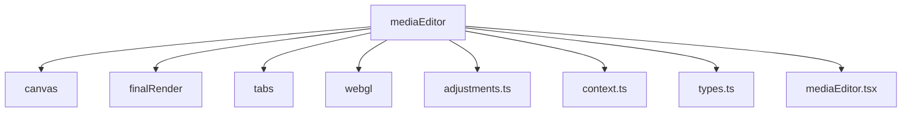
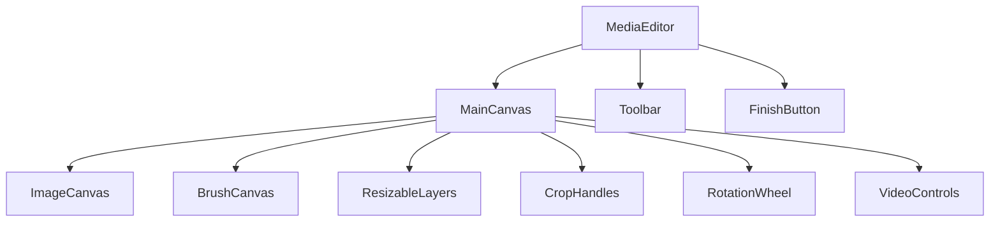
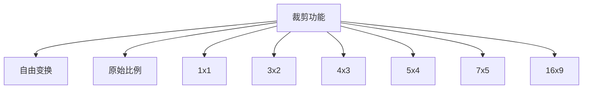
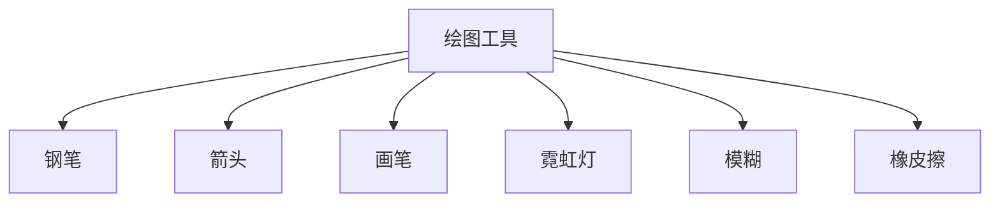
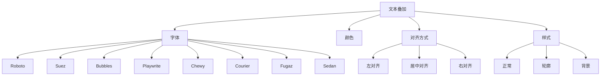
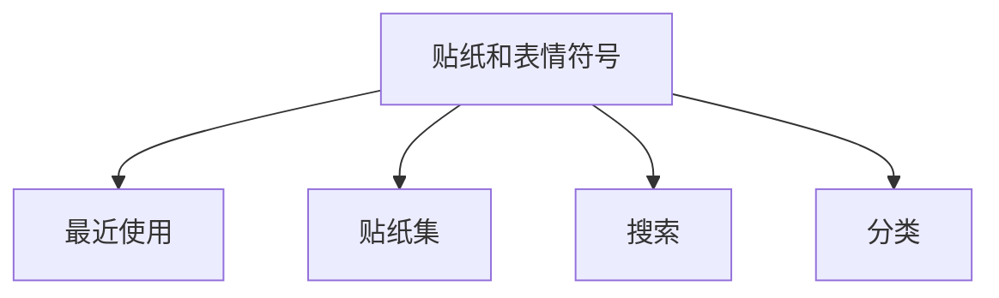
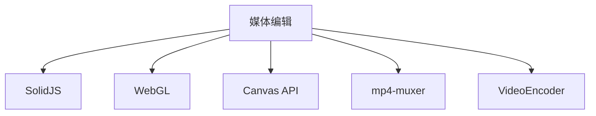

# 媒体编辑

<cite>
**本文档中引用的文件**  
- [mediaEditor.tsx](file://src/components/mediaEditor/mediaEditor.tsx)
- [context.ts](file://src/components/mediaEditor/context.ts)
- [types.ts](file://src/components/mediaEditor/types.ts)
- [cropTab.tsx](file://src/components/mediaEditor/tabs/cropTab.tsx)
- [brushTab.tsx](file://src/components/mediaEditor/tabs/brushTab.tsx)
- [textTab.tsx](file://src/components/mediaEditor/tabs/textTab.tsx)
- [stickersTab.tsx](file://src/components/mediaEditor/tabs/stickersTab.tsx)
- [adjustments.ts](file://src/components/mediaEditor/adjustments.ts)
- [createFinalResult.ts](file://src/components/mediaEditor/finalRender/createFinalResult.ts)
- [mainCanvas.tsx](file://src/components/mediaEditor/canvas/mainCanvas.tsx)
- [imageCanvas.tsx](file://src/components/mediaEditor/canvas/imageCanvas.tsx)
- [brushPainter.ts](file://src/components/mediaEditor/canvas/brushPainter.ts)
</cite>

## 目录
1. [简介](#简介)
2. [项目结构](#项目结构)
3. [核心组件](#核心组件)
4. [架构概述](#架构概述)
5. [详细组件分析](#详细组件分析)
6. [依赖分析](#依赖分析)
7. [性能考虑](#性能考虑)
8. [故障排除指南](#故障排除指南)
9. [结论](#结论)

## 简介
本文档详细介绍了媒体编辑功能，包括图片和视频的编辑能力、绘图工具、贴纸和表情符号添加、文本叠加、实时预览以及保存和导出策略。

## 项目结构
媒体编辑功能位于 `src/components/mediaEditor` 目录下，包含多个子目录和文件，分别处理不同的编辑功能。

**Diagram sources**
- [mediaEditor.tsx](file://src/components/mediaEditor/mediaEditor.tsx)
- [context.ts](file://src/components/mediaEditor/context.ts)

**Section sources**
- [mediaEditor.tsx](file://src/components/mediaEditor/mediaEditor.tsx)
- [context.ts](file://src/components/mediaEditor/context.ts)

## 核心组件
媒体编辑功能的核心组件包括裁剪、旋转、滤镜应用、绘图工具、贴纸和表情符号添加、文本叠加等。

**Section sources**
- [mediaEditor.tsx](file://src/components/mediaEditor/mediaEditor.tsx)
- [types.ts](file://src/components/mediaEditor/types.ts)

## 架构概述
媒体编辑功能的架构包括多个组件和模块，通过上下文和状态管理实现数据共享和交互。

**Diagram sources**
- [mediaEditor.tsx](file://src/components/mediaEditor/mediaEditor.tsx)
- [mainCanvas.tsx](file://src/components/mediaEditor/canvas/mainCanvas.tsx)

## 详细组件分析

### 裁剪功能分析
裁剪功能允许用户调整媒体的宽高比，支持多种预设比例。

**Diagram sources**
- [cropTab.tsx](file://src/components/mediaEditor/tabs/cropTab.tsx)

**Section sources**
- [cropTab.tsx](file://src/components/mediaEditor/tabs/cropTab.tsx)

### 绘图工具分析
绘图工具支持多种笔刷类型，包括钢笔、箭头、画笔、霓虹灯、模糊和橡皮擦。

**Diagram sources**
- [brushTab.tsx](file://src/components/mediaEditor/tabs/brushTab.tsx)
- [brushPainter.ts](file://src/components/mediaEditor/canvas/brushPainter.ts)

**Section sources**
- [brushTab.tsx](file://src/components/mediaEditor/tabs/brushTab.tsx)
- [brushPainter.ts](file://src/components/mediaEditor/canvas/brushPainter.ts)

### 文本叠加分析
文本叠加功能支持多种字体、颜色、对齐方式和样式。

**Diagram sources**
- [textTab.tsx](file://src/components/mediaEditor/tabs/textTab.tsx)

**Section sources**
- [textTab.tsx](file://src/components/mediaEditor/tabs/textTab.tsx)

### 贴纸和表情符号分析
贴纸和表情符号功能支持从本地和在线库中添加贴纸。

**Diagram sources**
- [stickersTab.tsx](file://src/components/mediaEditor/tabs/stickersTab.tsx)

**Section sources**
- [stickersTab.tsx](file://src/components/mediaEditor/tabs/stickersTab.tsx)

## 依赖分析
媒体编辑功能依赖于多个外部库和内部模块，包括 SolidJS、WebGL、Canvas API 等。

**Diagram sources**
- [mediaEditor.tsx](file://src/components/mediaEditor/mediaEditor.tsx)
- [createFinalResult.ts](file://src/components/mediaEditor/finalRender/createFinalResult.ts)

**Section sources**
- [mediaEditor.tsx](file://src/components/mediaEditor/mediaEditor.tsx)
- [createFinalResult.ts](file://src/components/mediaEditor/finalRender/createFinalResult.ts)

## 性能考虑
媒体编辑功能在处理大文件时需要考虑性能优化，包括使用 WebGL 进行硬件加速、分块处理和异步渲染。

**Section sources**
- [imageCanvas.tsx](file://src/components/mediaEditor/canvas/imageCanvas.tsx)
- [createFinalResult.ts](file://src/components/mediaEditor/finalRender/createFinalResult.ts)

## 故障排除指南
常见问题包括无法加载媒体、编辑操作无响应、导出失败等。建议检查文件格式、浏览器兼容性和网络连接。

**Section sources**
- [mediaEditor.tsx](file://src/components/mediaEditor/mediaEditor.tsx)
- [createFinalResult.ts](file://src/components/mediaEditor/finalRender/createFinalResult.ts)

## 结论
媒体编辑功能提供了丰富的编辑能力，支持图片和视频的裁剪、旋转、滤镜应用、绘图、贴纸和文本叠加。通过合理的架构设计和性能优化，确保了良好的用户体验。