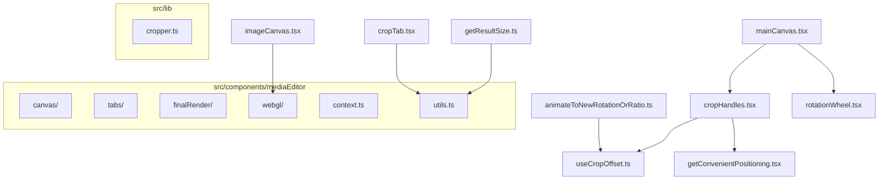
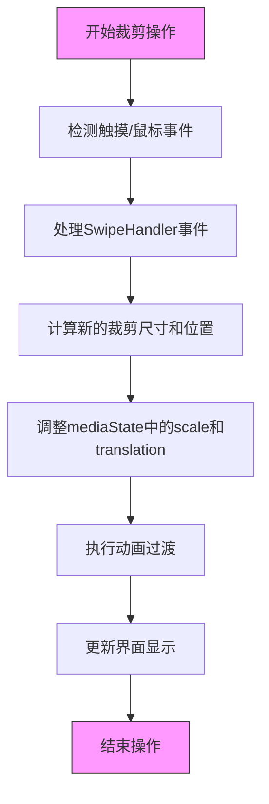
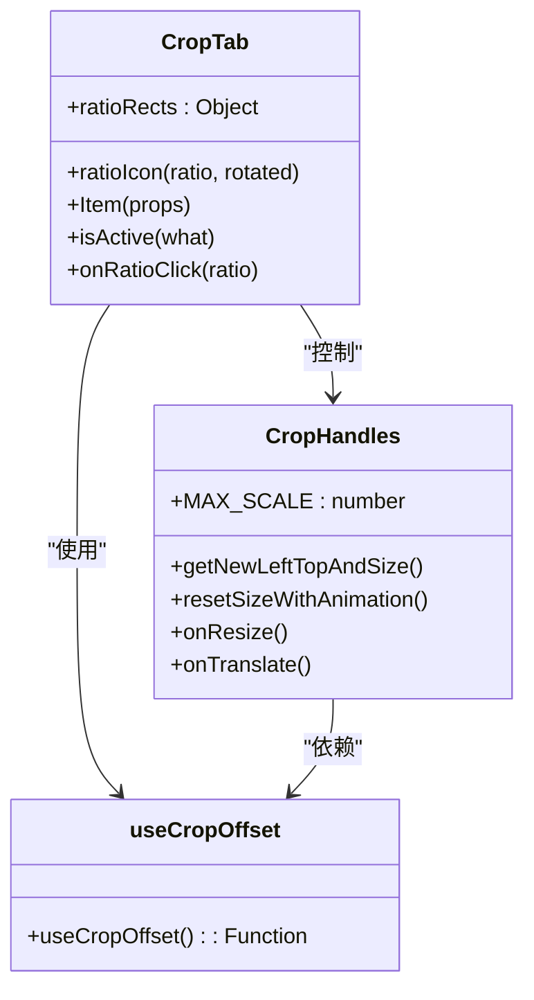
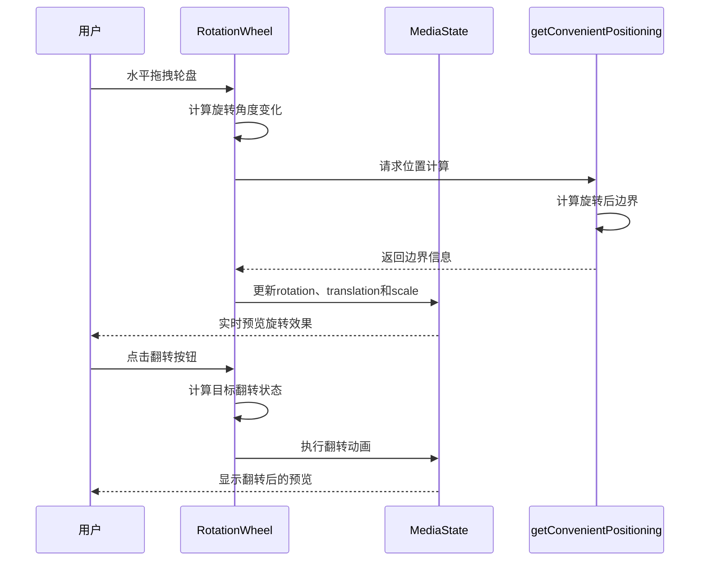
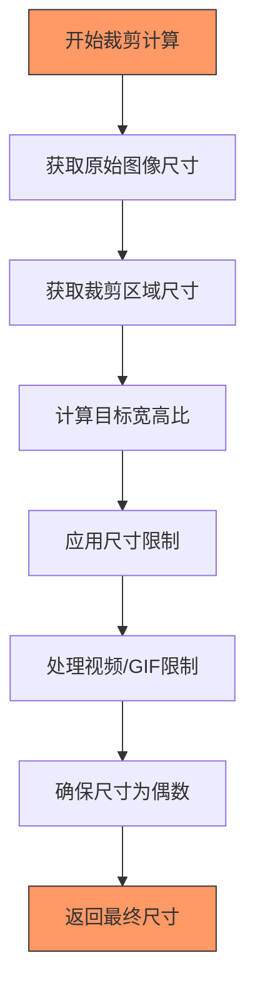
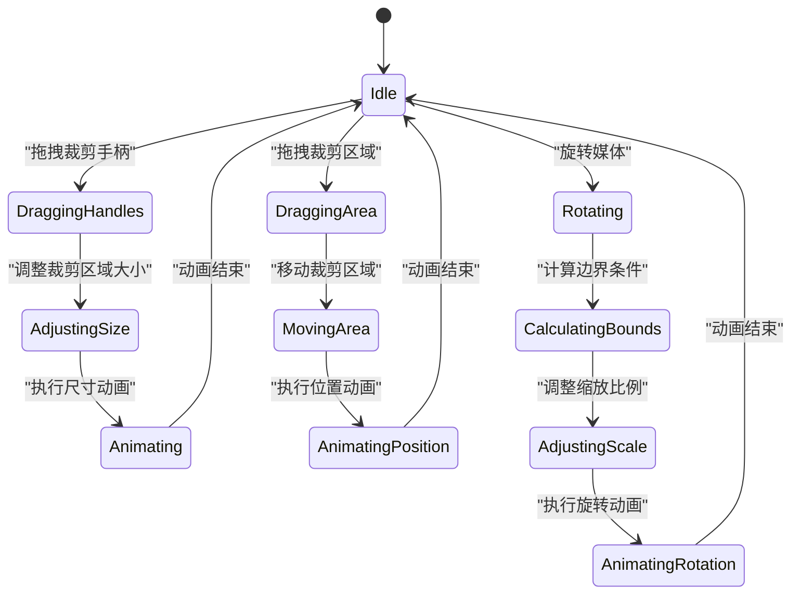

# 媒体裁剪

<cite>
**本文档引用的文件**   
- [cropHandles.tsx](file://src/components/mediaEditor/canvas/cropHandles.tsx)
- [cropTab.tsx](file://src/components/mediaEditor/tabs/cropTab.tsx)
- [useCropOffset.ts](file://src/components/mediaEditor/canvas/useCropOffset.ts)
- [getConvenientPositioning.tsx](file://src/components/mediaEditor/canvas/getConvenientPositioning.tsx)
- [mainCanvas.tsx](file://src/components/mediaEditor/canvas/mainCanvas.tsx)
- [animateToNewRotationOrRatio.ts](file://src/components/mediaEditor/canvas/animateToNewRotationOrRatio.ts)
- [getResultSize.ts](file://src/components/mediaEditor/finalRender/getResultSize.ts)
- [rotationWheel.tsx](file://src/components/mediaEditor/canvas/rotationWheel.tsx)
- [imageCanvas.tsx](file://src/components/mediaEditor/canvas/imageCanvas.tsx)
- [cropper.ts](file://src/lib/cropper.ts)
</cite>

## 目录
1. [项目结构](#项目结构)
2. [核心组件](#核心组件)
3. [裁剪界面实现](#裁剪界面实现)
4. [裁剪比例处理逻辑](#裁剪比例处理逻辑)
5. [旋转和翻转功能](#旋转和翻转功能)
6. [裁剪算法技术细节](#裁剪算法技术细节)
7. [用户交互模式](#用户交互模式)
8. [错误处理机制](#错误处理机制)

## 项目结构

**Diagram sources**
- [mainCanvas.tsx](file://src/components/mediaEditor/canvas/mainCanvas.tsx)
- [cropHandles.tsx](file://src/components/mediaEditor/canvas/cropHandles.tsx)
- [cropTab.tsx](file://src/components/mediaEditor/tabs/cropTab.tsx)
- [useCropOffset.ts](file://src/components/mediaEditor/canvas/useCropOffset.ts)
- [getConvenientPositioning.tsx](file://src/components/mediaEditor/canvas/getConvenientPositioning.tsx)
- [getResultSize.ts](file://src/components/mediaEditor/finalRender/getResultSize.ts)
- [animateToNewRotationOrRatio.ts](file://src/components/mediaEditor/canvas/animateToNewRotationOrRatio.ts)
- [rotationWheel.tsx](file://src/components/mediaEditor/canvas/rotationWheel.tsx)
- [imageCanvas.tsx](file://src/components/mediaEditor/canvas/imageCanvas.tsx)

**Section sources**
- [mainCanvas.tsx](file://src/components/mediaEditor/canvas/mainCanvas.tsx)
- [cropHandles.tsx](file://src/components/mediaEditor/canvas/cropHandles.tsx)
- [cropTab.tsx](file://src/components/mediaEditor/tabs/cropTab.tsx)

## 核心组件

媒体裁剪功能的核心组件包括裁剪手柄、裁剪区域、旋转轮盘和翻转按钮。这些组件共同协作，为用户提供直观的媒体编辑体验。裁剪手柄允许用户通过拖拽来调整裁剪区域的大小和位置，而旋转轮盘则提供了精确的旋转控制。翻转按钮实现了图像的水平翻转功能，满足用户对镜像效果的需求。

**Section sources**
- [cropHandles.tsx](file://src/components/mediaEditor/canvas/cropHandles.tsx)
- [rotationWheel.tsx](file://src/components/mediaEditor/canvas/rotationWheel.tsx)

## 裁剪界面实现

裁剪界面的实现基于SolidJS框架，通过响应式编程模型确保界面的实时更新。裁剪区域由四个角点和四条边组成，每个角点和边都配备了可拖拽的手柄。这些手柄通过SwipeHandler类处理触摸和鼠标事件，实现了流畅的交互体验。裁剪区域的实时预览通过CSS的clip-path属性实现，该属性定义了一个多边形遮罩，精确地展示了裁剪边界。

裁剪界面的布局计算基于useCropOffset函数，该函数根据画布尺寸动态计算裁剪区域的初始位置和大小。默认情况下，裁剪区域的左右边距为60像素，上下边距为60像素和180像素，确保了足够的操作空间。

**Diagram sources**
- [cropHandles.tsx](file://src/components/mediaEditor/canvas/cropHandles.tsx)
- [useCropOffset.ts](file://src/components/mediaEditor/canvas/useCropOffset.ts)

**Section sources**
- [cropHandles.tsx](file://src/components/mediaEditor/canvas/cropHandles.tsx)
- [useCropOffset.ts](file://src/components/mediaEditor/canvas/useCropOffset.ts)

## 裁剪比例处理逻辑

裁剪比例的处理逻辑通过cropTab组件实现，支持自由裁剪和多种预设比例选择。预设比例包括1:1（正方形）、3:2、4:3、5:4、7:5和16:9等常见比例，以及它们的旋转版本。当用户选择特定比例时，系统会自动调整裁剪区域的宽高比，并通过animateToNewRotationOrRatio函数执行平滑的动画过渡。

自由裁剪模式允许用户不受比例限制地调整裁剪区域，而"原始"选项则保持媒体的原始宽高比。比例选择的实现基于ratioRects对象，该对象定义了不同比例的SVG矩形表示，通过动态渲染提供直观的视觉反馈。

**Diagram sources**
- [cropTab.tsx](file://src/components/mediaEditor/tabs/cropTab.tsx)
- [cropHandles.tsx](file://src/components/mediaEditor/canvas/cropHandles.tsx)
- [useCropOffset.ts](file://src/components/mediaEditor/canvas/useCropOffset.ts)

**Section sources**
- [cropTab.tsx](file://src/components/mediaEditor/tabs/cropTab.tsx)
- [cropHandles.tsx](file://src/components/mediaEditor/canvas/cropHandles.tsx)

## 旋转和翻转功能

旋转和翻转功能集成在rotationWheel组件中，提供了直观的媒体方向调整工具。旋转功能通过一个可滑动的轮盘实现，用户可以通过水平拖拽来旋转媒体，旋转角度以15度为步进。轮盘中央显示当前旋转角度，提供精确的视觉反馈。翻转功能通过一个专用按钮实现，点击后执行水平翻转动画。

旋转逻辑的核心是getConvenientPositioning函数，该函数计算旋转后媒体与裁剪区域的相对位置，确保旋转过程中媒体不会完全移出裁剪区域。当旋转导致媒体超出边界时，系统会自动调整缩放比例和位置，保持媒体的可见性。

**Diagram sources**
- [rotationWheel.tsx](file://src/components/mediaEditor/canvas/rotationWheel.tsx)
- [getConvenientPositioning.tsx](file://src/components/mediaEditor/canvas/getConvenientPositioning.tsx)

**Section sources**
- [rotationWheel.tsx](file://src/components/mediaEditor/canvas/rotationWheel.tsx)
- [getConvenientPositioning.tsx](file://src/components/mediaEditor/canvas/getConvenientPositioning.tsx)

## 裁剪算法技术细节

裁剪算法的技术细节主要体现在getResultSize函数中，该函数负责计算最终裁剪结果的尺寸。算法首先根据当前裁剪比例和画布尺寸计算目标尺寸，然后应用各种限制条件。对于视频和GIF格式，算法会根据预设的编解码器限制最大尺寸；对于静态图像，则限制最大边长为2560像素，最小边长为240像素。

裁剪过程的核心是坐标变换和像素映射。原始图像的像素坐标需要经过一系列变换才能映射到裁剪后的坐标空间。这些变换包括平移、缩放和旋转，确保裁剪结果的几何准确性。算法还确保最终尺寸的宽度和高度均为偶数，以满足某些编解码器的要求。

**Diagram sources**
- [getResultSize.ts](file://src/components/mediaEditor/finalRender/getResultSize.ts)

**Section sources**
- [getResultSize.ts](file://src/components/mediaEditor/finalRender/getResultSize.ts)

## 用户交互模式

用户交互模式设计考虑了触摸和鼠标操作的适配。通过SwipeHandler类统一处理各种指针事件，确保在不同设备上的一致体验。对于触摸设备，系统支持多点触控手势；对于鼠标设备，则支持点击、拖拽和滚轮操作。

裁剪手柄的交互设计特别注重防误触机制。通过firstTarget变量跟踪初始触发事件的元素，防止在复杂交互中产生意外行为。动画过渡的使用增强了操作的流畅感，200毫秒的动画时长既提供了足够的视觉反馈，又不会造成操作延迟。

**Diagram sources**
- [cropHandles.tsx](file://src/components/mediaEditor/canvas/cropHandles.tsx)
- [rotationWheel.tsx](file://src/components/mediaEditor/canvas/rotationWheel.tsx)

**Section sources**
- [cropHandles.tsx](file://src/components/mediaEditor/canvas/cropHandles.tsx)
- [rotationWheel.tsx](file://src/components/mediaEditor/canvas/rotationWheel.tsx)

## 错误处理机制

错误处理机制主要针对无效裁剪区域的情况。系统通过边界检查确保裁剪区域不会完全超出媒体范围。当用户尝试创建过小的裁剪区域时，系统会自动限制最小尺寸，防止产生无意义的裁剪结果。

在旋转操作中，系统会预计算旋转后的媒体边界，如果发现媒体将完全移出裁剪区域，则自动调整缩放比例。这种预防性错误处理避免了用户界面出现空白或错误状态。此外，系统还处理了异步操作中的潜在错误，如图像加载失败或WebGL初始化错误。

**Section sources**
- [cropHandles.tsx](file://src/components/mediaEditor/canvas/cropHandles.tsx)
- [rotationWheel.tsx](file://src/components/mediaEditor/canvas/rotationWheel.tsx)
- [imageCanvas.tsx](file://src/components/mediaEditor/canvas/imageCanvas.tsx)