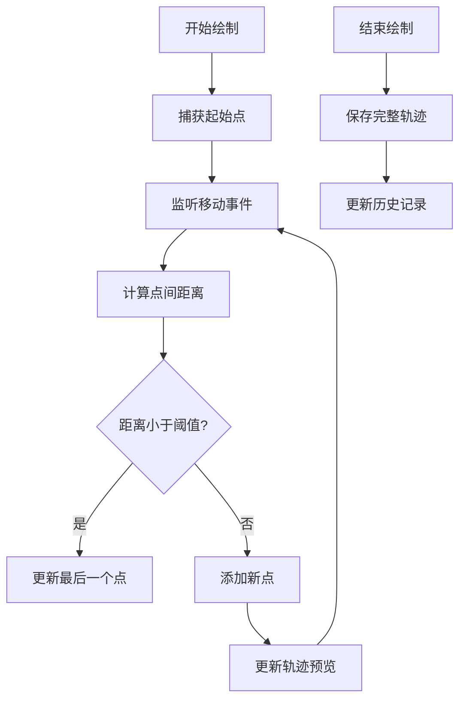
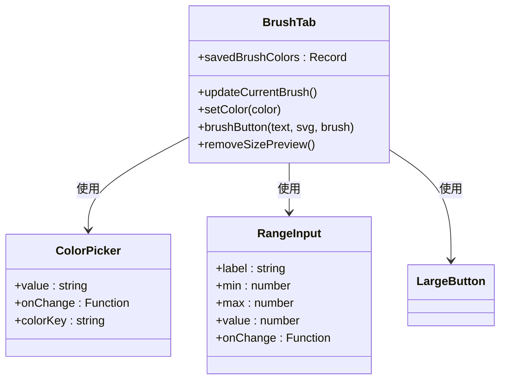
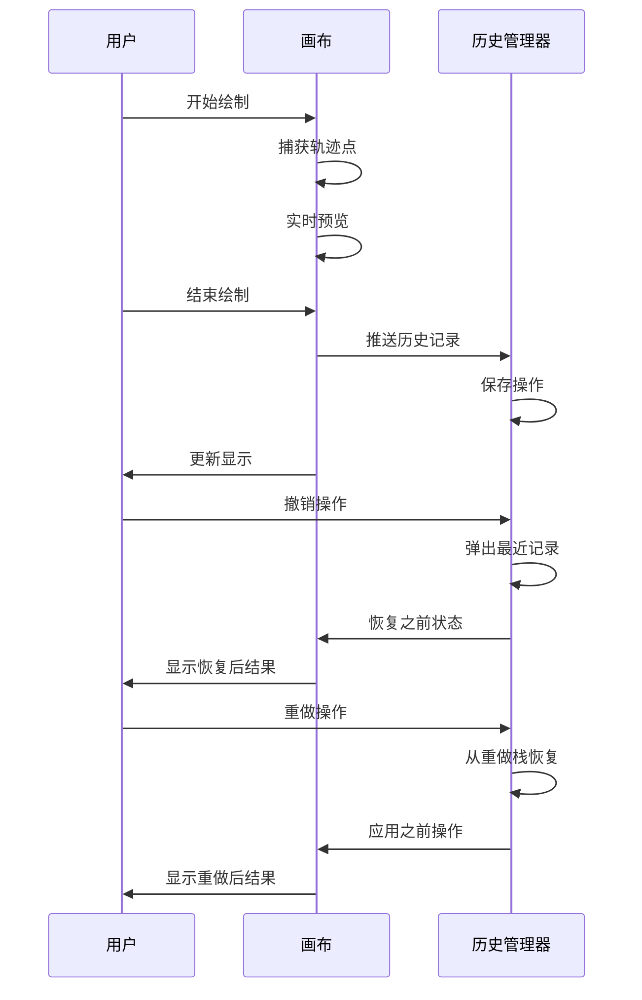
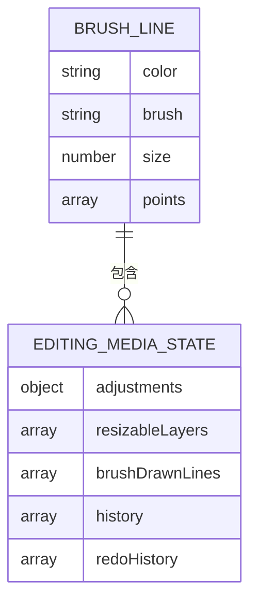
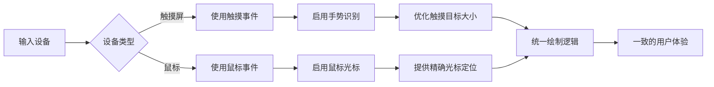

# 绘图工具

<cite>
**本文档中引用的文件**  
- [brushCanvas.tsx](file://src/components/mediaEditor/canvas/brushCanvas.tsx)
- [brushPainter.ts](file://src/components/mediaEditor/canvas/brushPainter.ts)
- [brushTab.tsx](file://src/components/mediaEditor/tabs/brushTab.tsx)
- [context.ts](file://src/components/mediaEditor/context.ts)
- [previewBrushSize.tsx](file://src/components/mediaEditor/canvas/previewBrushSize.tsx)
- [createFinalResult.ts](file://src/components/mediaEditor/finalRender/createFinalResult.ts)
</cite>

## 目录
1. [简介](#简介)
2. [自由绘制功能实现](#自由绘制功能实现)
3. [笔刷属性调节机制](#笔刷属性调节机制)
4. [撤销与重做功能](#撤销与重做功能)
5. [绘图数据存储格式](#绘图数据存储格式)
6. [性能优化策略](#性能优化策略)
7. [多设备适配方案](#多设备适配方案)

## 简介
绘图工具提供了一套完整的自由绘制功能，支持多种笔刷样式、颜色和大小调节。系统实现了高效的撤销/重做历史管理，并针对不同设备类型进行了优化适配，确保在触摸屏和鼠标操作下都能提供流畅的用户体验。

## 自由绘制功能实现

绘图功能的核心实现在 `brushCanvas.tsx` 文件中，通过 HTML5 Canvas API 实现自由手绘轨迹的捕捉和渲染。系统使用 `SwipeHandler` 类来统一处理鼠标和触摸事件，确保跨设备的一致性。

笔刷轨迹的平滑处理采用二次贝塞尔曲线算法，在 `brushPainter.ts` 中的 `drawLinePath` 方法实现。该算法通过将相邻点的中点作为控制点，生成平滑的曲线连接，避免了直线连接带来的锯齿感。

压力感应支持通过动态调整笔刷大小实现，系统根据输入设备的特性自动适配。对于支持压力感应的设备，笔触的粗细会随压力变化而变化，提供更自然的绘画体验。

**图示来源**  
- [brushCanvas.tsx](file://src/components/mediaEditor/canvas/brushCanvas.tsx#L218-L309)
- [brushPainter.ts](file://src/components/mediaEditor/canvas/brushPainter.ts#L97-L126)

**本节来源**  
- [brushCanvas.tsx](file://src/components/mediaEditor/canvas/brushCanvas.tsx#L35-L313)
- [brushPainter.ts](file://src/components/mediaEditor/canvas/brushPainter.ts#L73-L239)

## 笔刷属性调节机制

笔刷大小、透明度和颜色的调节通过直观的用户界面控件实现。`brushTab.tsx` 文件定义了笔刷工具栏的UI结构，包含颜色选择器、大小滑块和笔刷类型按钮。

颜色调节使用 `ColorPicker` 组件，支持从调色板选择或输入十六进制值。系统为不同笔刷类型（钢笔、箭头、画笔、霓虹灯等）保存独立的颜色偏好，通过 `createStoredColor` 函数实现持久化存储。

**图示来源**  
- [brushTab.tsx](file://src/components/mediaEditor/tabs/brushTab.tsx#L1-L124)
- [colorPicker.tsx](file://src/components/mediaEditor/colorPicker.tsx)
- [rangeInput.tsx](file://src/components/mediaEditor/rangeInput.tsx)

笔刷大小调节通过 `RangeInput` 组件实现，范围为2-32像素。当用户调整大小时，系统会实时显示预览圆点，帮助用户准确判断笔刷尺寸。预览功能由 `previewBrushSize.tsx` 组件实现，通过CSS变量动态设置预览元素的尺寸和颜色。

系统支持多种笔刷类型，每种类型有不同的视觉效果：
- **钢笔**：实心线条，颜色纯正
- **箭头**：末端带箭头，适合标注
- **画笔**：半透明效果，模拟真实画笔
- **霓虹灯**：发光效果，使用阴影实现
- **模糊**：模糊涂抹效果
- **橡皮擦**：擦除功能，使用 `destination-out` 混合模式

**本节来源**  
- [brushTab.tsx](file://src/components/mediaEditor/tabs/brushTab.tsx#L14-L123)
- [previewBrushSize.tsx](file://src/components/mediaEditor/canvas/previewBrushSize.tsx#L1-L28)
- [brushPainter.ts](file://src/components/mediaEditor/canvas/brushPainter.ts#L179-L238)

## 撤销与重做功能

撤销和重做功能通过历史管理机制实现，支持多步操作的回溯。系统在 `context.ts` 中定义了历史记录的数据结构，每个历史项包含路径、新值和旧值，支持精确的属性级回滚。

当用户完成一次绘制操作时，系统会自动将该操作推入历史栈。在 `brushCanvas.tsx` 的 `saveLastLine` 函数中，通过 `actions.pushToHistory` 方法记录新增的笔画轨迹。历史记录采用增量更新策略，只保存变化的部分，减少内存占用。

**图示来源**  
- [brushCanvas.tsx](file://src/components/mediaEditor/canvas/brushCanvas.tsx#L224-L239)
- [context.ts](file://src/components/mediaEditor/context.ts#L38-L58)

系统实现了双向历史栈结构，包含主历史栈和重做栈。当执行撤销操作时，当前状态从历史栈弹出并推入重做栈；当执行重做操作时，状态从重做栈弹回历史栈。这种设计支持无限次的撤销和重做操作，直到达到操作边界。

历史记录的序列化和反序列化通过 `structuredClone` 兼容方案实现，使用特殊符号标记数组项删除操作，确保复杂数据结构的准确还原。

**本节来源**  
- [context.ts](file://src/components/mediaEditor/context.ts#L31-L58)
- [brushCanvas.tsx](file://src/components/mediaEditor/canvas/brushCanvas.tsx#L224-L239)

## 绘图数据存储格式

绘图数据采用结构化的JSON格式存储，便于序列化和反序列化。在 `context.ts` 中定义了 `BrushDrawnLine` 接口，每个笔画轨迹包含颜色、笔刷类型、大小和点坐标数组。

**图示来源**  
- [context.ts](file://src/components/mediaEditor/context.ts#L7-L12)
- [context.ts](file://src/components/mediaEditor/context.ts#L31-L41)

完整的绘图状态包含多个组成部分：
- **adjustments**：图像调整参数
- **resizableLayers**：可调整大小的图层
- **brushDrawnLines**：所有绘制的笔画轨迹
- **history**：撤销历史栈
- **redoHistory**：重做历史栈

在最终渲染阶段，系统通过 `createFinalResult.ts` 中的 `getScaledLayersAndLines` 函数将编辑状态转换为实际像素尺寸的绘图数据，确保输出质量。

**本节来源**  
- [context.ts](file://src/components/mediaEditor/context.ts#L7-L41)
- [createFinalResult.ts](file://src/components/mediaEditor/finalRender/createFinalResult.ts#L109-L151)

## 性能优化策略

系统采用多层次的性能优化策略，确保在各种设备上都能流畅运行。主要优化措施包括：

1. **双缓冲渲染**：使用两个Canvas元素实现双缓冲，一个用于实时绘制预览，另一个用于存储已完成的笔画，避免重复绘制所有轨迹。

2. **WebGL加速**：对于图像类型的媒体编辑，系统使用WebGL进行高性能渲染，通过 `initWebGL` 函数初始化渲染上下文，利用GPU加速图像处理。

3. **智能重绘**：只在必要时进行完整重绘，大部分操作通过局部更新实现。在变换模式下，系统仅重新计算变换矩阵而不重绘内容。

4. **内存管理**：及时清理不再使用的WebGL资源，通过 `cleanupWebGl` 函数释放GPU内存，防止内存泄漏。

5. **事件节流**：对高频输入事件进行节流处理，避免过度消耗CPU资源。

这些优化措施确保了即使在绘制复杂图形时，系统也能保持60FPS的流畅体验。

**本节来源**  
- [brushCanvas.tsx](file://src/components/mediaEditor/canvas/brushCanvas.tsx#L73-L198)
- [brushPainter.ts](file://src/components/mediaEditor/canvas/brushPainter.ts#L38-L61)
- [createFinalResult.ts](file://src/components/mediaEditor/finalRender/createFinalResult.ts#L120-L127)

## 多设备适配方案

系统针对不同输入设备进行了专门的适配优化，确保在触摸屏和鼠标操作下都有良好的用户体验。

对于触摸设备，系统通过 `touchstart`、`touchmove` 和 `touchend` 事件监听手势操作，支持多点触控和手势识别。对于鼠标设备，使用标准的 `mousedown`、`mousemove` 和 `mouseup` 事件。

**图示来源**  
- [brushCanvas.tsx](file://src/components/mediaEditor/canvas/brushCanvas.tsx#L261-L273)
- [swipeHandler.ts](file://src/components/swipeHandler.ts)

系统还考虑了不同屏幕尺寸和像素密度的适配：
- 根据 `devicePixelRatio` 调整Canvas的渲染分辨率
- 使用相对单位而非绝对像素值
- 提供适当的触摸目标大小，符合移动端设计规范
- 在高DPI屏幕上保持清晰的线条质量

这些适配策略确保了绘图工具在手机、平板和桌面设备上都能提供一致且优质的用户体验。

**本节来源**  
- [brushCanvas.tsx](file://src/components/mediaEditor/canvas/brushCanvas.tsx#L65-L67)
- [topbarWeave.ts](file://src/components/topbarWeave.ts#L196-L220)