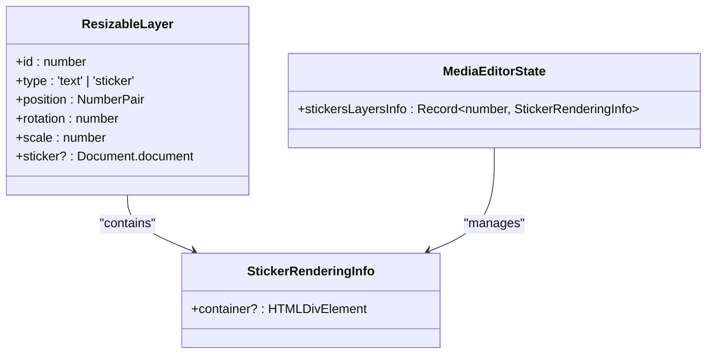
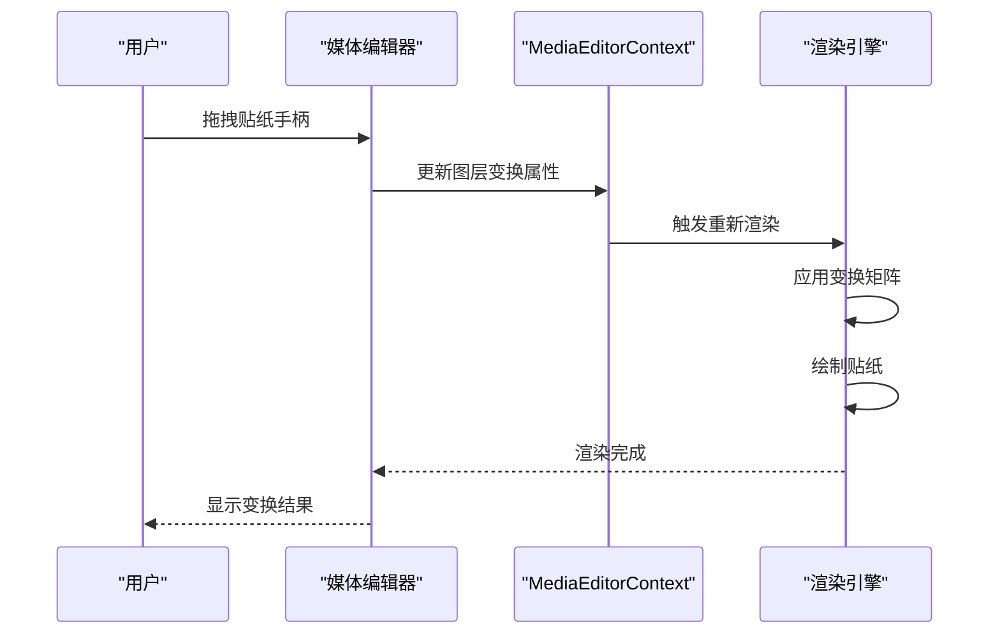
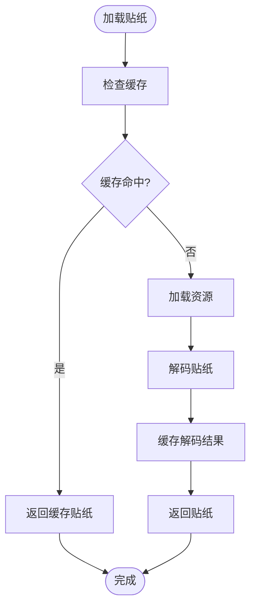
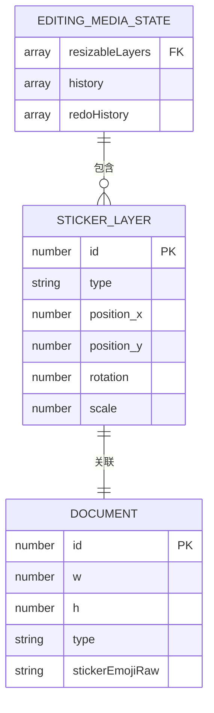

# 贴纸集成

<cite>
**本文档中引用的文件**  
- [stickers.ts](file://src/components/emoticonsDropdown/tabs/stickers.ts)
- [drawStickerLayer.ts](file://src/components/mediaEditor/finalRender/drawStickerLayer.ts)
- [premiumStickersCarousel.ts](file://src/components/premium/premiumStickersCarousel.ts)
- [lottieStickerFrameByFrameRenderer.ts](file://src/components/mediaEditor/finalRender/lottieStickerFrameByFrameRenderer.ts)
- [rlottie.worker.ts](file://src/lib/rlottie/rlottie.worker.ts)
- [localSticker.ts](file://src/components/wrappers/localSticker.ts)
- [sticker.ts](file://src/components/wrappers/sticker.ts)
- [reaction.ts](file://src/components/chat/reaction.ts)
- [appStickersManager.ts](file://src/lib/appManagers/appStickersManager.ts)
- [thumbs.ts](file://src/lib/storages/thumbs.ts)
- [getStickerThumbKey.ts](file://src/lib/storages/utils/thumbs/getStickerThumbKey.ts)
- [stickerViewer.ts](file://src/components/stickerViewer.ts)
- [types.ts](file://src/components/mediaEditor/types.ts)
- [lottieLoader.ts](file://src/lib/rlottie/lottieLoader.ts)
- [context.ts](file://src/components/mediaEditor/context.ts)
- [stickerLayerContent.tsx](file://src/components/mediaEditor/canvas/stickerLayerContent.tsx)
- [stickerType.ts](file://src/config/stickerType.ts)
- [folderAnimatedIcon.tsx](file://src/components/sidebarLeft/foldersSidebarContent/folderAnimatedIcon.tsx)
</cite>

## 目录
1. [贴纸图层管理机制](#贴纸图层管理机制)
2. [贴纸变换功能](#贴纸变换功能)
3. [贴纸库加载策略](#贴纸库加载策略)
4. [贴纸动画处理](#贴纸动画处理)
5. [贴纸元数据存储方案](#贴纸元数据存储方案)

## 贴纸图层管理机制

贴纸图层管理通过 `ResizableLayer` 类型实现，该类型定义了贴纸的位置、旋转、缩放等属性。在媒体编辑器中，贴纸图层信息存储在 `editorState.stickersLayersInfo` 中，每个贴纸图层通过唯一的 ID 进行索引。当添加贴纸时，系统会创建一个包含贴纸内容的容器元素，并将其关联到对应的图层信息中。

贴纸图层的渲染通过 `drawStickerLayer` 函数实现，该函数根据图层的变换属性在画布上绘制贴纸。贴纸的叠加顺序由图层在 `resizableLayers` 数组中的顺序决定，后添加的贴纸会显示在前面。



**Diagram sources**
- [types.ts](file://src/components/mediaEditor/types.ts#L9-L20)
- [context.ts](file://src/components/mediaEditor/context.ts#L75)
- [stickerLayerContent.tsx](file://src/components/mediaEditor/canvas/stickerLayerContent.tsx#L31)

**Section sources**
- [types.ts](file://src/components/mediaEditor/types.ts#L9-L20)
- [context.ts](file://src/components/mediaEditor/context.ts#L75)
- [stickerLayerContent.tsx](file://src/components/mediaEditor/canvas/stickerLayerContent.tsx)

## 贴纸变换功能

贴纸的缩放、旋转和位置调整功能通过操作手柄实现。每个贴纸图层都支持通过 `position`、`rotation` 和 `scale` 属性进行变换。在编辑界面中，用户可以通过拖拽操作手柄来调整贴纸的位置、旋转角度和大小。

变换操作的实现基于 `MediaEditorContextValue` 中的 `mediaState`，该状态对象存储了所有可调整图层的变换信息。当用户进行变换操作时，系统会更新对应图层的状态，并重新渲染画布。



**Diagram sources**
- [context.ts](file://src/components/mediaEditor/context.ts#L175-L266)
- [drawStickerLayer.ts](file://src/components/mediaEditor/finalRender/drawStickerLayer.ts#L7-L32)

**Section sources**
- [context.ts](file://src/components/mediaEditor/context.ts#L175-L266)
- [drawStickerLayer.ts](file://src/components/mediaEditor/finalRender/drawStickerLayer.ts#L7-L32)

## 贴纸库加载策略

贴纸库的加载策略分为本地贴纸库和在线贴纸两种。本地贴纸库通过 `AppStickersManager` 类进行管理，该类负责缓存和索引已安装的贴纸集。在线贴纸则通过网络请求动态加载，并使用 `lottieLoader` 进行资源管理。

系统实现了贴纸资源的缓存机制，通过 `thumbs` 存储管理器缓存已解码的贴纸缩略图。贴纸缩略图的缓存键由文档 ID 和色调索引生成，确保不同色调的贴纸能够独立缓存。



**Diagram sources**
- [appStickersManager.ts](file://src/lib/appManagers/appStickersManager.ts#L62)
- [thumbs.ts](file://src/lib/storages/thumbs.ts#L125-L151)
- [getStickerThumbKey.ts](file://src/lib/storages/utils/thumbs/getStickerThumbKey.ts#L1-L3)

**Section sources**
- [appStickersManager.ts](file://src/lib/appManagers/appStickersManager.ts#L62)
- [thumbs.ts](file://src/lib/storages/thumbs.ts#L125-L151)
- [getStickerThumbKey.ts](file://src/lib/storages/utils/thumbs/getStickerThumbKey.ts#L1-L3)

## 贴纸动画处理

动态贴纸的动画处理通过 `RLottiePlayer` 和 `lottieLoader` 实现。系统使用 Web Worker 在后台线程中解码和渲染 Lottie 动画，确保主线程的流畅性。每个动画实例由唯一的请求 ID 标识，并通过 `QueryableWorker` 进行管理。

贴纸动画的播放控制包括播放、暂停、跳转到指定帧等功能。系统实现了动画的懒加载和按需渲染，只有在贴纸可见时才会激活动画播放，从而优化性能。

```mermaid
classDiagram
class RLottiePlayer {
+reqId : number
+curFrame : number
+play() : void
+pause() : void
+renderFrame(frame, frameNo) : void
}
class LottieLoader {
+loadAnimationWorker(params) : Promise~RLottiePlayer~
+players : {[reqId : number] : RLottiePlayer}
}
class QueryableWorker {
+addEventListener(event, callback) : void
+terminate() : void
}
RLottiePlayer --> LottieLoader : "由...创建"
LottieLoader --> QueryableWorker : "使用"
RLottiePlayer --> QueryableWorker : "通信"
```

**Diagram sources**
- [rlottie.worker.ts](file://src/lib/rlottie/rlottie.worker.ts#L156-L182)
- [lottieLoader.ts](file://src/lib/rlottie/lottieLoader.ts#L63)
- [lottieStickerFrameByFrameRenderer.ts](file://src/components/mediaEditor/finalRender/lottieStickerFrameByFrameRenderer.ts#L9-L36)

**Section sources**
- [rlottie.worker.ts](file://src/lib/rlottie/rlottie.worker.ts#L156-L182)
- [lottieLoader.ts](file://src/lib/rlottie/lottieLoader.ts#L63)
- [lottieStickerFrameByFrameRenderer.ts](file://src/components/mediaEditor/finalRender/lottieStickerFrameByFrameRenderer.ts#L9-L36)

## 贴纸元数据存储方案

贴纸元数据的存储方案包括贴纸的基本信息、变换状态和用户偏好。贴纸的基本信息由 `Document` 对象表示，包含贴纸的 ID、尺寸、类型等属性。贴纸的变换状态存储在 `EditingMediaState` 中，包括位置、旋转、缩放等信息。

用户偏好如最近使用的贴纸和收藏的贴纸，通过 `AppStickersManager` 进行管理。系统使用本地存储来持久化这些偏好，确保用户在不同会话间能够保持一致的体验。



**Diagram sources**
- [types.ts](file://src/components/mediaEditor/types.ts#L9-L20)
- [context.ts](file://src/components/mediaEditor/context.ts#L18-L41)
- [appStickersManager.ts](file://src/lib/appManagers/appStickersManager.ts#L55-L83)

**Section sources**
- [types.ts](file://src/components/mediaEditor/types.ts#L9-L20)
- [context.ts](file://src/components/mediaEditor/context.ts#L18-L41)
- [appStickersManager.ts](file://src/lib/appManagers/appStickersManager.ts#L55-L83)