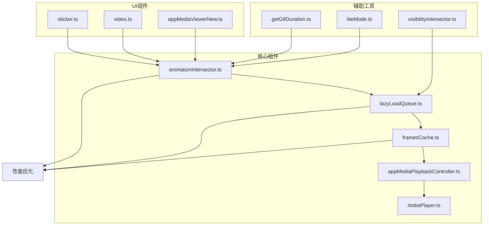
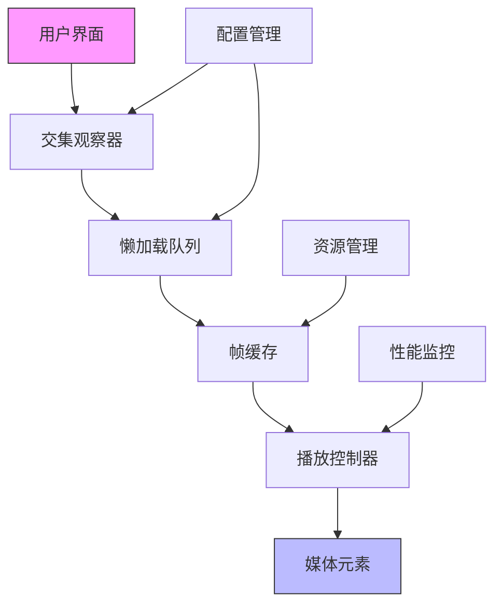
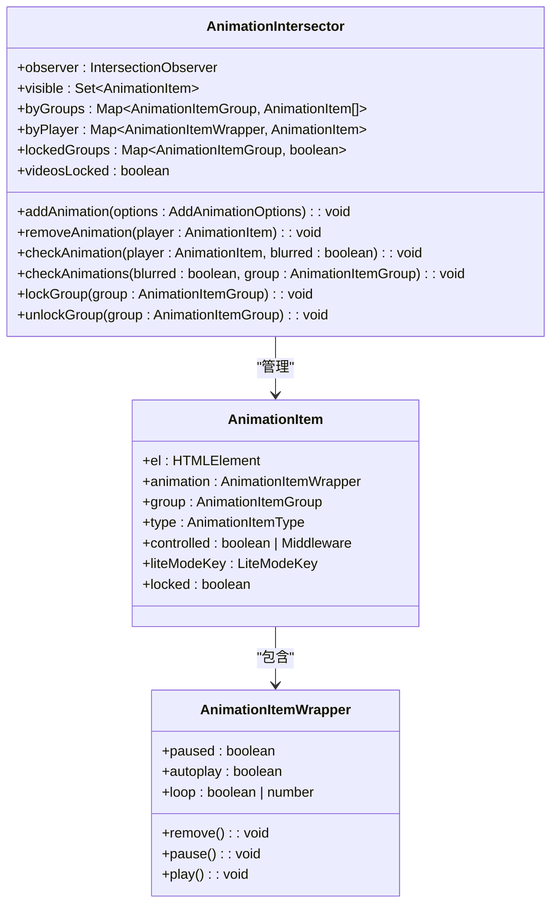
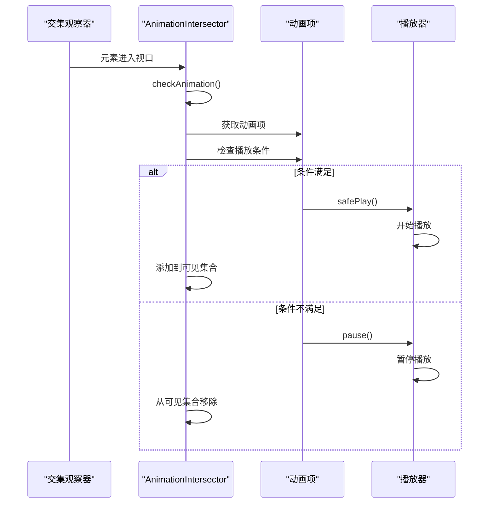
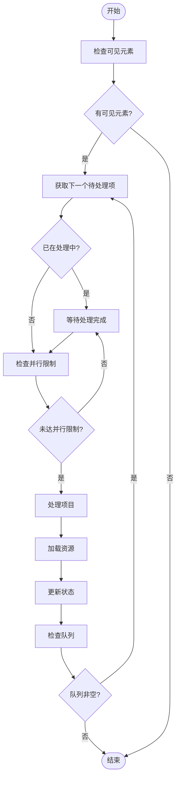
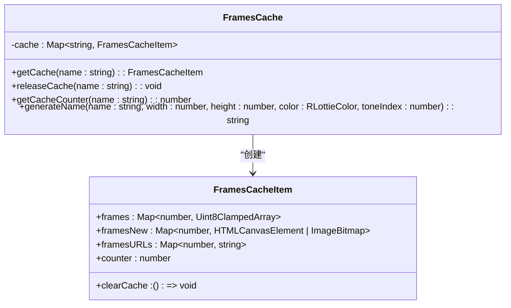
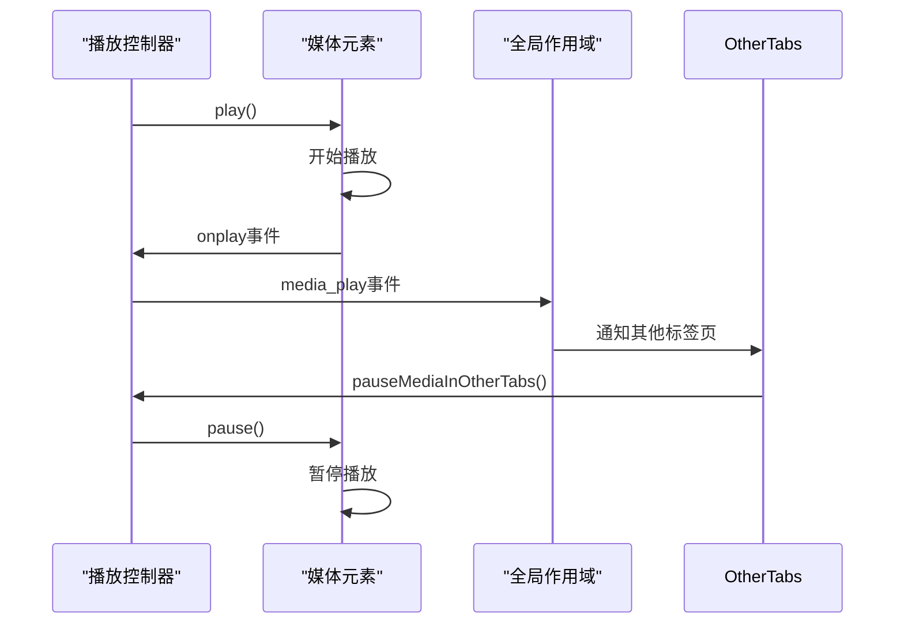
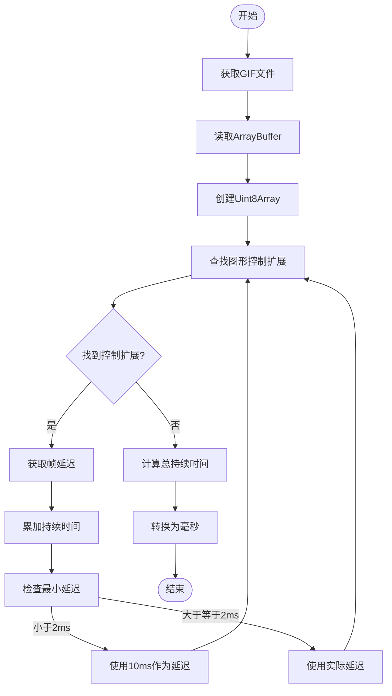
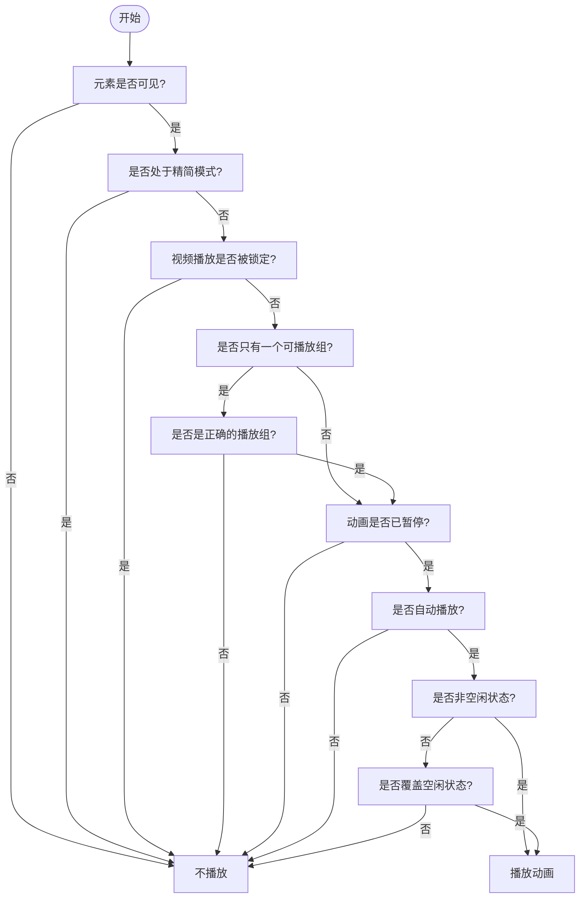
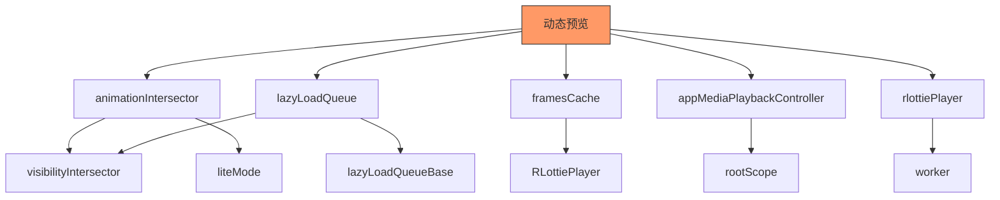

# 动态预览

<cite>
**本文档中引用的文件**   
- [getGifDuration.ts](file://src\helpers\getGifDuration.ts)
- [animationIntersector.ts](file://src\components\animationIntersector.ts)
- [visibilityIntersector.ts](file://src\components\visibilityIntersector.ts)
- [lazyLoadQueueRepeat.ts](file://src\components\lazyLoadQueueRepeat.ts)
- [lazyLoadQueue.ts](file://src\components\lazyLoadQueue.ts)
- [lazyLoadQueueBase.ts](file://src\components\lazyLoadQueueBase.ts)
- [framesCache.ts](file://src\helpers\framesCache.ts)
- [liteMode.ts](file://src\helpers\liteMode.ts)
- [appMediaPlaybackController.ts](file://src\components\appMediaPlaybackController.ts)
- [rlottiePlayer.ts](file://src\lib\rlottie\rlottiePlayer.ts)
- [sticker.ts](file://src\components\wrappers\sticker.ts)
- [video.ts](file://src\components\wrappers\video.ts)
- [appMediaViewerNew.ts](file://src\components\appMediaViewerNew.ts)
- [stories\viewer.tsx](file://src\components\stories\viewer.tsx)
- [stories\store.tsx](file://src\components\stories\store.tsx)
- [gifsMasonry.ts](file://src\components\gifsMasonry.ts)
- [preloadVideo.ts](file://src\helpers\preloadVideo.ts)
- [safePlay.ts](file://src\helpers\dom\safePlay.ts)
- [sidebarLeft\tabs\powerSaving.ts](file://src\components\sidebarLeft\tabs\powerSaving.ts)
- [sidebarLeft\tabs\generalSettings.ts](file://src\components\sidebarLeft\tabs\generalSettings.ts)
</cite>

## 目录
1. [简介](#简介)
2. [项目结构](#项目结构)
3. [核心组件](#核心组件)
4. [架构概述](#架构概述)
5. [详细组件分析](#详细组件分析)
6. [依赖分析](#依赖分析)
7. [性能考虑](#性能考虑)
8. [故障排除指南](#故障排除指南)
9. [结论](#结论)
10. [附录](#附录)（如有必要）

## 简介
本文档全面阐述了动态预览功能的实现机制，包括GIF动画和短视频的自动播放逻辑、播放条件判断、循环控制和性能优化策略。文档详细解释了动态预览的触发逻辑，如用户交互、滚动位置和网络状况的综合判断。同时，描述了预览的资源管理机制，包括内存占用控制和自动销毁策略。提供了配置选项说明，允许用户自定义动态预览行为，并包含实际应用场景示例和性能监控建议。

## 项目结构
动态预览功能主要分布在`src/components`和`src/helpers`目录下，涉及多个核心组件和工具类。主要功能模块包括动画交集观察器、懒加载队列、帧缓存管理、媒体播放控制器等。这些组件协同工作，实现了高效、流畅的动态预览体验。

**图表来源**
- [animationIntersector.ts](file://src\components\animationIntersector.ts)
- [lazyLoadQueue.ts](file://src\components\lazyLoadQueue.ts)
- [framesCache.ts](file://src\helpers\framesCache.ts)
- [appMediaPlaybackController.ts](file://src\components\appMediaPlaybackController.ts)
- [rlottiePlayer.ts](file://src\lib\rlottie\rlottiePlayer.ts)
- [getGifDuration.ts](file://src\helpers\getGifDuration.ts)
- [liteMode.ts](file://src\helpers\liteMode.ts)
- [visibilityIntersector.ts](file://src\components\visibilityIntersector.ts)
- [sticker.ts](file://src\components\wrappers\sticker.ts)
- [video.ts](file://src\components\wrappers\video.ts)
- [appMediaViewerNew.ts](file://src\components\appMediaViewerNew.ts)

**章节来源**
- [src\components](file://src\components)
- [src\helpers](file://src\helpers)
- [src\lib](file://src\lib)

## 核心组件

动态预览功能的核心组件包括`animationIntersector`（动画交集观察器）、`lazyLoadQueue`（懒加载队列）、`framesCache`（帧缓存）和`appMediaPlaybackController`（媒体播放控制器）。这些组件共同实现了动态内容的智能加载、播放控制和资源管理。

**章节来源**
- [animationIntersector.ts](file://src\components\animationIntersector.ts)
- [lazyLoadQueue.ts](file://src\components\lazyLoadQueue.ts)
- [framesCache.ts](file://src\helpers\framesCache.ts)
- [appMediaPlaybackController.ts](file://src\components\appMediaPlaybackController.ts)

## 架构概述

动态预览系统的架构基于观察者模式和懒加载策略，通过多个层次的组件协同工作来实现高效的媒体预览功能。系统主要由交集观察器、懒加载队列、帧缓存管理和播放控制器四个核心部分组成。

**图表来源**
- [animationIntersector.ts](file://src\components\animationIntersector.ts)
- [lazyLoadQueue.ts](file://src\components\lazyLoadQueue.ts)
- [framesCache.ts](file://src\helpers\framesCache.ts)
- [appMediaPlaybackController.ts](file://src\components\appMediaPlaybackController.ts)

## 详细组件分析

### 动画交集观察器分析
`animationIntersector`组件负责监控动画元素的可见性状态，并根据可见性自动控制播放和暂停。它使用Intersection Observer API来检测元素是否进入视口，并根据配置的规则决定是否播放动画。

#### 交集观察器类图

**图表来源**
- [animationIntersector.ts](file://src\components\animationIntersector.ts)

#### 动画播放控制序列图

**图表来源**
- [animationIntersector.ts](file://src\components\animationIntersector.ts)
- [safePlay.ts](file://src\helpers\dom\safePlay.ts)

### 懒加载队列分析
`lazyLoadQueue`组件实现了媒体资源的懒加载机制，通过优先级队列和并行加载控制，优化了资源加载性能。它与交集观察器配合，确保只有可见区域的内容才会被加载和播放。

#### 懒加载队列流程图

**图表来源**
- [lazyLoadQueue.ts](file://src\components\lazyLoadQueue.ts)
- [lazyLoadQueueBase.ts](file://src\components\lazyLoadQueueBase.ts)

### 帧缓存管理分析
`framesCache`组件负责管理动画帧的缓存，通过内存缓存和引用计数机制，实现了高效的帧数据复用和内存管理。它支持多种缓存类型，包括Uint8ClampedArray、HTMLCanvasElement和ImageBitmap。

#### 帧缓存类图

**图表来源**
- [framesCache.ts](file://src\helpers\framesCache.ts)

### 媒体播放控制器分析
`appMediaPlaybackController`组件提供了统一的媒体播放控制接口，管理播放状态、音量控制和跨标签页同步。它处理了播放过程中的各种事件和状态变化，确保播放体验的连贯性。

#### 播放控制序列图

**图表来源**
- [appMediaPlaybackController.ts](file://src\components\appMediaPlaybackController.ts)

### GIF持续时间计算分析
`getGifDuration`组件负责计算GIF动画的总持续时间，通过解析GIF文件的二进制数据，提取每一帧的延迟时间并求和。这对于预览控制和性能优化至关重要。

#### GIF持续时间计算流程图

**图表来源**
- [getGifDuration.ts](file://src\helpers\getGifDuration.ts)

### 动态预览触发逻辑分析
动态预览的触发逻辑基于多种条件的综合判断，包括用户交互、滚动位置、网络状况和系统性能。这些条件共同决定了是否以及何时播放动态内容。

#### 触发条件决策树

**图表来源**
- [animationIntersector.ts](file://src\components\animationIntersector.ts)
- [liteMode.ts](file://src\helpers\liteMode.ts)

## 依赖分析

动态预览功能依赖于多个核心组件和工具类，这些依赖关系确保了功能的完整性和性能优化。

**图表来源**
- [animationIntersector.ts](file://src\components\animationIntersector.ts)
- [lazyLoadQueue.ts](file://src\components\lazyLoadQueue.ts)
- [framesCache.ts](file://src\helpers\framesCache.ts)
- [appMediaPlaybackController.ts](file://src\components\appMediaPlaybackController.ts)
- [rlottiePlayer.ts](file://src\lib\rlottie\rlottiePlayer.ts)
- [visibilityIntersector.ts](file://src\components\visibilityIntersector.ts)
- [liteMode.ts](file://src\helpers\liteMode.ts)
- [lazyLoadQueueBase.ts](file://src\components\lazyLoadQueueBase.ts)

**章节来源**
- [src\components](file://src\components)
- [src\helpers](file://src\helpers)
- [src\lib](file://src\lib)

## 性能考虑

动态预览功能在设计时充分考虑了性能优化，通过多种策略确保在各种设备和网络条件下都能提供流畅的用户体验。

### 性能优化策略
1. **懒加载机制**：只有当元素进入视口时才开始加载和播放，减少不必要的资源消耗。
2. **帧缓存复用**：通过`framesCache`实现帧数据的缓存和复用，避免重复解码和渲染。
3. **并行加载控制**：`lazyLoadQueue`限制同时加载的资源数量，防止系统过载。
4. **精简模式**：提供配置选项，允许用户在性能受限的设备上禁用动画效果。
5. **内存管理**：自动释放不再使用的缓存，防止内存泄漏。

### 性能监控建议
1. **监控帧缓存使用情况**：定期检查`framesCache`的内存占用，确保不会超出限制。
2. **跟踪加载性能**：记录资源加载时间，识别性能瓶颈。
3. **监控播放流畅度**：检测动画播放的帧率，确保流畅性。
4. **用户反馈收集**：收集用户关于性能的反馈，持续优化体验。

**章节来源**
- [animationIntersector.ts](file://src\components\animationIntersector.ts)
- [lazyLoadQueue.ts](file://src\components\lazyLoadQueue.ts)
- [framesCache.ts](file://src\helpers\framesCache.ts)
- [liteMode.ts](file://src\helpers\liteMode.ts)

## 故障排除指南

### 常见问题及解决方案
1. **动画不播放**
   - 检查元素是否在视口内
   - 确认未处于精简模式
   - 检查网络连接状况
   - 验证资源URL是否正确

2. **内存占用过高**
   - 检查`framesCache`的缓存大小
   - 确认缓存释放机制正常工作
   - 考虑降低并行加载数量

3. **播放卡顿**
   - 检查设备性能是否足够
   - 确认未同时播放过多动画
   - 考虑启用精简模式

4. **资源加载失败**
   - 验证网络连接
   - 检查资源URL有效性
   - 确认服务端配置正确

**章节来源**
- [animationIntersector.ts](file://src\components\animationIntersector.ts)
- [lazyLoadQueue.ts](file://src\components\lazyLoadQueue.ts)
- [framesCache.ts](file://src\helpers\framesCache.ts)
- [appMediaPlaybackController.ts](file://src\components\appMediaPlaybackController.ts)

## 结论

动态预览功能通过精心设计的架构和优化策略，实现了高效、流畅的GIF动画和短视频预览体验。系统采用模块化设计，各组件职责明确，协同工作。通过交集观察器、懒加载队列、帧缓存管理和播放控制器的有机结合，确保了在各种条件下的良好性能表现。同时，系统提供了灵活的配置选项，允许用户根据设备性能和网络状况自定义预览行为。未来可以进一步优化缓存策略，增加更精细的性能监控功能，提升用户体验。