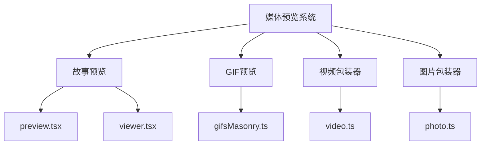
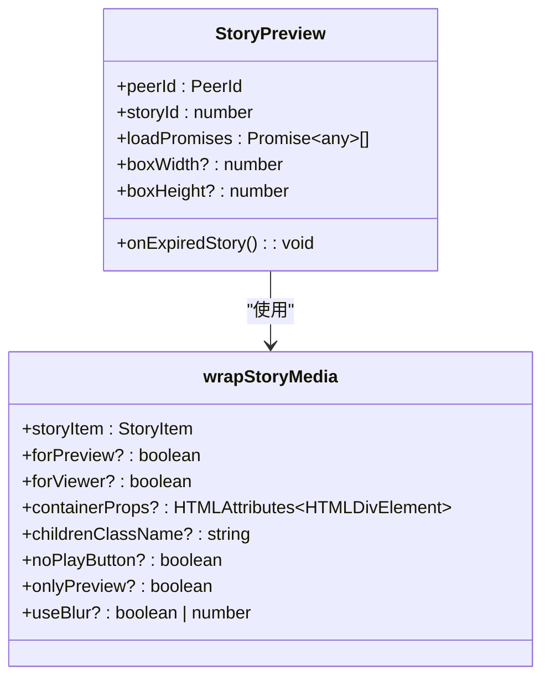
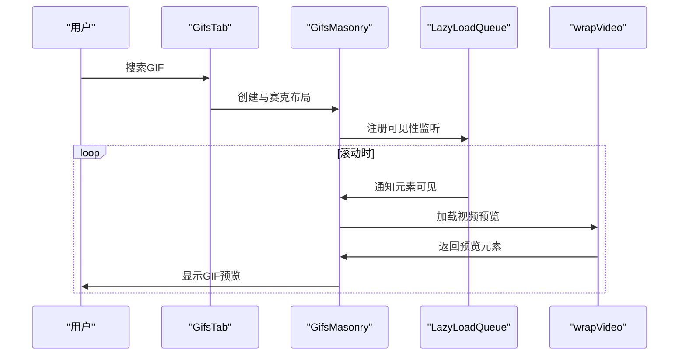
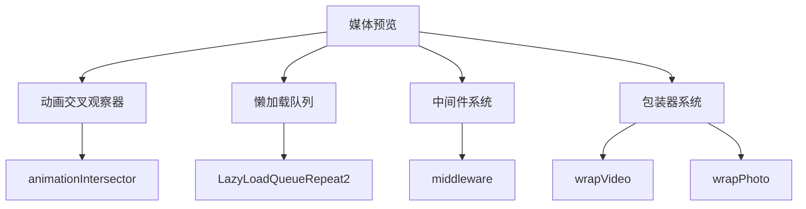

# 媒体预览

<cite>
**本文档引用的文件**  
- [gifsMasonry.ts](file://src/components/gifsMasonry.ts)
- [gifs.ts](file://src/components/emoticonsDropdown/tabs/gifs.ts)
- [preview.tsx](file://src/components/stories/preview.tsx)
- [viewer.tsx](file://src/components/stories/viewer.tsx)
- [animationIntersector.ts](file://src/components/animationIntersector.ts)
- [lazyLoadQueueRepeat2.ts](file://src/components/lazyLoadQueueRepeat2.ts)
- [wrapVideo.ts](file://src/components/wrappers/video.ts)
- [wrapPhoto.ts](file://src/components/wrappers/photo.ts)
</cite>

## 目录
1. [简介](#简介)
2. [项目结构](#项目结构)
3. [核心组件](#核心组件)
4. [架构概述](#架构概述)
5. [详细组件分析](#详细组件分析)
6. [依赖分析](#依赖分析)
7. [性能考虑](#性能考虑)
8. [故障排除指南](#故障排除指南)
9. [结论](#结论)

## 简介
本文档详细介绍了Telegram Web客户端中媒体预览功能的实现。重点分析了图片、视频、音频等媒体消息的预览生成策略，包括低分辨率缩略图和视频封面帧的提取机制。文档还涵盖了预览图的质量控制、动态预览功能、懒加载策略、安全处理以及用户自定义选项等方面。

## 项目结构
媒体预览功能主要分布在`src/components`目录下的多个子模块中。核心功能集中在`stories`、`gifsMasonry`和`wrappers`等组件中，这些组件协同工作以提供完整的媒体预览体验。

**图源**  
- [preview.tsx](file://src/components/stories/preview.tsx)
- [gifsMasonry.ts](file://src/components/gifsMasonry.ts)

## 核心组件
媒体预览系统的核心组件包括故事预览、GIF马赛克布局、视频包装器和图片包装器。这些组件共同实现了媒体内容的高效加载和展示。

**章节来源**  
- [preview.tsx](file://src/components/stories/preview.tsx)
- [gifsMasonry.ts](file://src/components/gifsMasonry.ts)

## 架构概述
媒体预览系统的架构采用分层设计，上层组件负责用户界面展示，下层组件处理媒体加载和缓存。系统通过中间件机制管理组件生命周期，确保资源的高效利用。

**图源**  
- [preview.tsx](file://src/components/stories/preview.tsx)
- [gifsMasonry.ts](file://src/components/gifsMasonry.ts)

## 详细组件分析

### 故事预览组件分析
故事预览组件负责处理Telegram故事的媒体预览，支持图片和视频两种类型的内容。

#### 类图

**图源**  
- [preview.tsx](file://src/components/stories/preview.tsx)

**章节来源**  
- [preview.tsx](file://src/components/stories/preview.tsx)

### GIF预览组件分析
GIF预览组件实现了GIF动画的懒加载和马赛克布局，优化了大量GIF内容的展示性能。

#### 序列图

**图源**  
- [gifs.ts](file://src/components/emoticonsDropdown/tabs/gifs.ts)
- [gifsMasonry.ts](file://src/components/gifsMasonry.ts)

**章节来源**  
- [gifs.ts](file://src/components/emoticonsDropdown/tabs/gifs.ts)
- [gifsMasonry.ts](file://src/components/gifsMasonry.ts)

### 预览生成策略
媒体预览的生成策略基于懒加载和渐进式加载原则，确保页面性能和用户体验的平衡。

#### 流程图

**图源**  
- [gifsMasonry.ts](file://src/components/gifsMasonry.ts)
- [preview.tsx](file://src/components/stories/preview.tsx)

**章节来源**  
- [gifsMasonry.ts](file://src/components/gifsMasonry.ts)
- [preview.tsx](file://src/components/stories/preview.tsx)

## 依赖分析
媒体预览系统依赖于多个核心组件和工具类，这些依赖关系确保了系统的稳定性和可维护性。

**图源**  
- [gifsMasonry.ts](file://src/components/gifsMasonry.ts)
- [preview.tsx](file://src/components/stories/preview.tsx)

**章节来源**  
- [gifsMasonry.ts](file://src/components/gifsMasonry.ts)
- [preview.tsx](file://src/components/stories/preview.tsx)

## 性能考虑
媒体预览系统在设计时充分考虑了性能优化，通过多种策略确保流畅的用户体验。

- **懒加载**: 仅加载视口内的媒体内容
- **缓存机制**: 复用已加载的媒体元素
- **渐进式加载**: 先加载缩略图，再加载完整内容
- **资源管理**: 及时清理不可见元素的资源

## 故障排除指南
当媒体预览功能出现问题时，可以参考以下常见问题的解决方案：

**章节来源**  
- [gifsMasonry.ts](file://src/components/gifsMasonry.ts)
- [preview.tsx](file://src/components/stories/preview.tsx)

## 结论
Telegram Web客户端的媒体预览系统通过精心设计的架构和优化策略，提供了高效、流畅的媒体内容展示体验。系统采用模块化设计，各组件职责明确，便于维护和扩展。通过懒加载、缓存和渐进式加载等技术，系统在保证视觉效果的同时，最大限度地优化了性能表现。